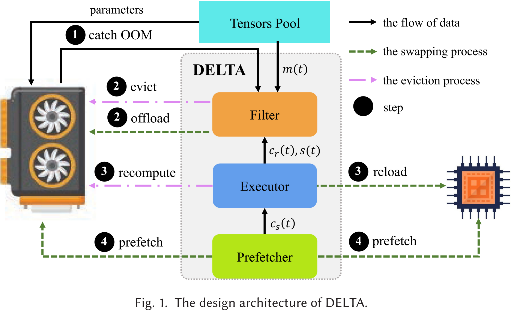
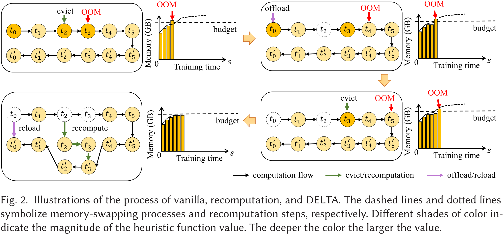
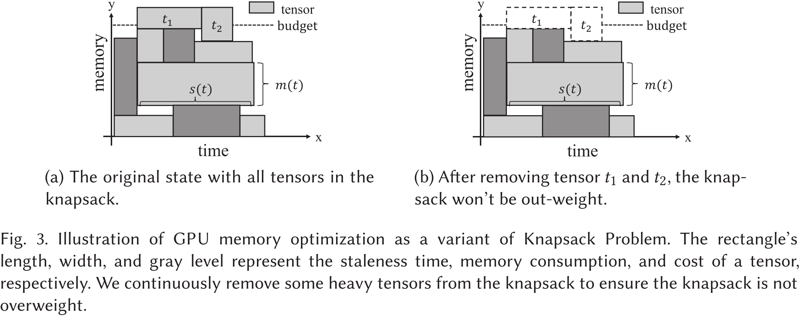
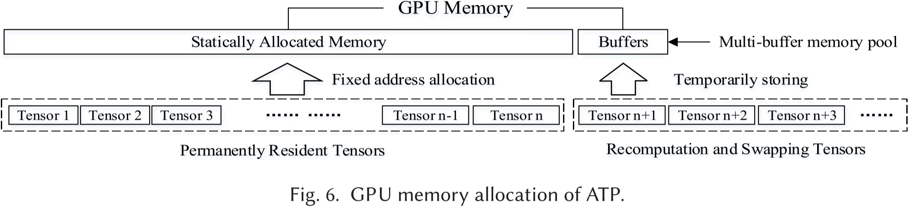

# 内存交换与重计算的混合策略

## 1) 2017_NeurIPS_A会_Training Deeper Models by GPU Memory Optimization on TensorFlow  

> Alibaba 的这个工作虽然只是做了一个 A（内存交换）+ B（重计算）的活，但也算是结合使用这两种 GPU 内存优化技术来减少 DNN 模型训练内存消耗的雏形。为了方便，笔者将该工作简称为 Ali-Hybrid。

动机：深度学习模型的趋势是采用更“深”更“宽”的架构。有限的 GPU 设备内存容量与日益增加的模型复杂度之间的差距使得内存优化成为一个必要的要求。TensorFlow 有其内建的内存分配器，采用“最佳匹配与合并”算法。该分配器的设计目标是通过合并支持内存碎片整理。然而，它的内建内存管理策略没有特别考虑为训练大模型进行内存优化。

总结：Ali-Hybrid 基于数据流图，将优化问题表述为图重写 (graph rewriting) 问题。在内存预算下，通过启发式搜索前向子图来获得候选特征图列表，并交换生命周期较长的特征图。同时，利用重计算技术重新设计了 Seq2Seq 模型的注意力层 (attention layer)。

摘抄：
- CUDA 8.0 启用了带页面迁移引擎的**统一内存**，因此统一内存的大小不再受限于 GPU 内存的大小。然而，我们的测试表明，这可能会带来**严重的性能损失**（最多**十**倍的性能下降）。

图表：

    

图 1：ResNet-50 在单个训练步骤中的内存占用变化曲线。横轴表示分配/释放操作的次数，纵轴对应当前总的内存占用字节数。  

图 1 展示了 ResNet-50 在 ImageNet 数据集上一轮小批量训练迭代的内存占用曲线。随着特征图的积累，曲线的最大值逐渐显现。不再需要的特征图将被去分配，这会导致曲线的下降。

**特征图**。对于深度学习模型，特征图是前向传播过程中生成的**某一层的中间输出**，并且在反向传播过程中**用于计算梯度**。特征图的大小通常由**批量大小**和**模型架构**决定（对于卷积神经网络（CNN），决定因素包括步长大小和输出通道数；对于循环神经网络（RNN），决定因素包括门控数、时间步长和隐藏层大小）。

**权重**。与特征图相比，权重占用的内存比例较小。在本文中，权重被视为 GPU 内存中的**持久驻留内存**，直到整个训练任务完成才能释放。

**临时内存**。某些算法，如基于快速傅里叶变换（FFT）的卷积，需要额外的内存。这些内存是**临时的**，并将**在操作结束时释放**。临时内存的大小可以通过列举 GPU 软件库中的每个算法（如cuDNN）来自动调整，因此**可以忽略不计**。

    

图 3：交换优化的原子操作。从节点 $e$ 到节点 $b$ 删除引用边，并插入红色或蓝色的节点和边。

如图 3 所示，张量 b 可以在传输到 CPU 内存后立即释放。当它被节点 e 重新使用时，可以将其传输回 GPU 内存。

    

图 4：注意力（Attention）操作的优化。$d^*$ 表示梯度。左侧为未进行内存优化的情况，右侧为经过内存优化的情况。

如图 4 所示，在进行内存优化的运算符中，中间结果被去除，并且在梯度运算符中添加了额外的加法操作，以从键（Keys）和查询（Query）重新计算中间结果。请注意，这种优化避免了将中间结果写入内存，从而节省了内存访问，并使得注意力计算更加高效。

## 2) 2018_PPoPP_A会_Superneurons: dynamic GPU memory management for training deep neural networks  

> SuperNeurons 应该是首个将内存交换与重计算结合的开源工作，针对的是非线性神经网络 (nonlinear neural networks)。

动机：主要的深度学习框架，如 Caffe 或 MXNet，已经尝试通过一些静态内存减少技术来缓解 GPU 内存短缺。然而，由于这些技术的静态特性，它们无法很好地调节，以应对非线性网络中新的数据和依赖关系的变化。……在非线性神经网络架构中，有一些关键问题：有限的 GPU 驻留内存和计算依赖关系的高度变化。

总结：SuperNeurons 通过统一张量池 (Unified Tensor Pool，UTP) 异步卸载/预取计算密集型层（卷积层）的前向输出张量。SuperNeurons 通过成本感知重计算 (Cost-Aware Recomputation) 释放计算成本低的层（如池化层）的前向输出张量。SuperNeurons 在内存充足时使用以速度为中心 (speed-centric) 的策略，在内存不充足时使用以内存为中心 (memory-centric) 的策略，从而在确保 DNN 模型可训练的同时使用最少的重计算。

图表：

    

图 8：不同网络中各层类型的执行时间和内存使用比例。请注意，执行时间包括前向传播和反向传播。

图 8a 和图 8b 展示了 POOL、ACT、BN 和 LRN 四者一共占用了超过 50% 的总内存，而它们的计算只占整个工作负载的平均 20%。因此，由于通信和计算之间的重叠不足，将这些层卸载会带来很大的开销。而对于 Dropout、Softmax 和全连接（FC）层进行卸载并没有效果，因为它们只使用了不到 1% 的总内存。因此，我们**只卸载来自卷积（CONV）层的张量**。

## 3) 2019_TACO_A刊_Layup: Layer-adaptive and Multi-type Intermediate-oriented Memory Optimization for GPU-based CNNs  

> Layup 在 Layrub 的基础上加了重计算和内存重用，还是以层为中心的优化。时间有限，笔者只关注内存交换和重计算相关的内容。

动机：单一的内存优化方法（如 CPU-GPU 传输或额外的前向计算）无法应对不同类型层的多样性，这会导致明显的性能下降。由于 CNN 模型通常由不同类型的层（如卷积层、池化层和修正线性单元（ReLU）层）组成，层的类型和规模决定了内存分配模式，并对性能产生关键影响。现有的内存优化研究长期忽视了这一问题。我们的调查显示，层的类型显著影响内存优化的执行时间。

总结：Layup 通过比较 CPU-GPU 传输的成本和额外前向计算的成本，将神经网络中的层分为计算敏感型层和传输敏感型层，并根据层的类型选择不同的内存优化方法，即对计算敏感型层选择内存交换，对传输敏感型层选择重计算，从而减少总的时间开销。

摘抄：
- 优化方法对不同类型层的影响差异很大。因此，一些层更适合额外的前向计算（如 ReLU 和归一化层），而另一些层更适合 CPU-GPU 传输（如卷积层）。

图表：

    

表 1 给出了这些网络中选择的层的统计信息。**卷积层**占总层数的最大比例。**激活层**在所有网络中表现出与卷积层相似的趋势，并且这些层通常伴随**归一化**和**缩放层**。

## 4) 2020_ASPLOS_A会_Capuchin: Tensor-based GPU Memory Management for Deep Learning  

> Capuchin 应该是首个支持动态计算图的工作，因为作者在论文中提到（1）“Capuchin 是首个可在**命令式编程环境**中应用的**计算图无关**的内存优化模块。”（2）“在 TensorFlow 的急切 (eager) 模式下，Capuchin 能够将批处理大小提高 2.71 倍，而**没有其他工作能够在该模式下优化内存**。” 另外，因为 Capuchin 是基于张量访问特征进行决策的，所以同时适用于命令式编程和声明式编程的深度学习框架。

动机：1、先前的工作基于**计算图和不同层的特性**进行逐层 GPU 内存管理。然而，神经网络的一层是由许多低级数学函数组成的高级计算抽象，甚至一个具有十几层的神经网络在其对应的计算图中也可能包含成千上万个节点。因此，这种**粗粒度**的内存管理限制了优化空间。2、此外，这些方法通过**对计算图的静态分析**选择交换和重计算。**静态分析导致了三个问题**：(1) 硬件和输入尺寸的异质性使得预测计算时间变得困难，即使是同类型的层，其计算时间也会有很大差异。因此，基于层类型静态确定内存优化目标将限制内存优化的潜力。(2) 基于粗粒度“定性”信息的决策无法量化特定内存操作的开销，这使得很难对内存优化候选项进行优先排序或在交换和重计算之间做出选择。(3) 深度神经网络（DNN）不断快速发展，例如从卷积神经网络（CNN）和递归神经网络（RNN）到 Transformer 和图神经网络（GNN），甚至是用户定义的操作。对于新类型的DNN，先验知识不可用。此外，基于计算图的内存管理在没有计算图执行前的深度学习框架中效果不佳，例如 Pytorch 和 TensorFlow 的急切 (eager) 模式。因此，这种方法不足够通用，无法应用于所有框架。

总结：Capuchin 利用了张量访问模式的规律性，在第一次迭代中获得一次完整迭代的张量访问信息，进而分析出动态张量访问特征并制定内存管理策略，从而在后续迭代中，根据所制定的策略在张量这一粒度进行内存交换或是重计算，并且根据运行时的反馈对内存管理策略动态调整。Capuchin 在可以隐藏预取开销时优先选择交换候选张量，在其他情况下选择交换或重计算开销较小的张量。同时，Capuchin 还提出了一个衡量重计算价值的指标：每秒内存节省 (Memory Saving Per Second, MSPS)，即 $\text{MSPS} = \frac{\text{Memory Saving}}{\text{Recomputation Time}}$。

摘抄：
- 在训练过程中，GPU 内存主要由三部分消耗：
  - **特征图**，即前向传播中的输出；
  - **梯度图**，即反向传播中的输出；
  - **卷积工作空间**，即卷积算法所需的额外内存空间。
  - 与这些相比，**模型权重**占用的内存非常少，通常保持在 GPU 内存中，持续更新。
  - 在这三部分中，后两者是**临时内存使用**，可以在当前计算完成后立即释放。
  - 特征图在前向和反向传播中都需要。然而，**前向和反向计算之间存在较大的时间间隔**。因此，特征图的内存消耗成为先前工作中的主要优化目标。
- 当前流行的深度学习框架通常基于命令式编程 (imperative programming) 或声明式编程 (declarative programming)。
  - 命令式程序类似于 Python 和 C++ 程序，在执行过程中进行计算。在 TensorFlow 中，这称为急切执行 (Eager Execution)。PyTorch 将其作为默认且唯一的执行模式。
    - 我们认为命令式编程环境的高效内存管理非常重要，因为它**具有广泛的应用和便利性**。
  - 相比之下，声明式程序基于图执行 (Graph Execution)，其中实际计算不会在函数定义时进行。许多框架都支持图执行，包括 TensorFlow、CNTK 和 Caffe。
- **急切模式** (Eager Mode)。命令式编程环境立即评估操作，而无需构建图形。在此模式下，操作立即返回具体值，而不是构建计算图后再执行。显然，**这种方法使得部署和调试新模型变得更加方便**。特别地，急切模式在学术界非常流行，因为它便于快速原型设计新模型。跟随这一趋势，TensorFlow 宣布从版本 2.0 开始，急切模式将成为其默认执行模式。另一方面，**由于解释 Python 代码的开销和缺乏图优化，此模式可能比执行等效的图形慢**。
- **图模式** (Graph Mode)。在此模式下，模型的计算被抽象为计算图，该图指定了由边连接的计算节点之间的数据流，边指示张量流动。计算图在执行开始前构建，实际计算仅在必要时调度，因此它也被称为懒惰编程 (lazy programming)。当程序被转换为内部计算图时，可以应用某些优化（例如修剪 (pruning) 和常量折叠 (constant folding)）。因此，**内存消耗和训练性能可能比急切模式更好**。
- Capuchin 的设计基于两个关键观察。
  - 首先，所有深度学习框架都基于**数据流**执行模型，其中处理过程依赖于张量操作。类似于传统程序中**内存访问的重用性和局部性**分析，深度学习训练中的张量访问也表现出数据重用和某些访问模式。因此，我们认为**动态跟踪细粒度的张量访问**是一项基本且通用的技术，能够有效地进行内存管理优化。
  - 其次，深度学习应用的特性确保了我们方法的有效性。训练过程由数百万次迭代组成，且具有明确的边界，**张量访问在各迭代之间具有规律性和重复性**。这意味着，分析时机和张量访问模式可以轻松揭示内存优化的机会，并提供具体指导，例如，是否以及何时选择驱逐/预取或重计算。此外，**这种内存管理策略可以及时应用于下一次迭代，并从运行时反馈中迭代完善**。

图表：

    

图 3：ResNet-50 张量访问时间轴。

深度学习训练由数百万次迭代组成。为了理解张量访问模式，我们选择了 ResNet-50 中的三个张量，并在 P100 GPU 上对它们在迭代 5、10、15 时的访问时间戳（相对于每次迭代开始的时间）进行了分析，结果如图 3 所示。

在图3中，很明显，对 T1 进行交换比对 T2 和 T3 进行交换更有利，因为 T1 的两次连续访问的时间间隔更大。这个决策更可能减少开销（假设三个张量的大小相同）。

张量访问明显遵循规律模式，即**每次迭代中的出现次数和时间戳大多是固定的**。……相同张量访问在不同迭代中的时间差异小于1毫秒。

尽管结果仅展示了在图模式下运行的 CNN 任务的行为，我们发现其他类型的工作负载，如语音、自然语言处理和**急切 (eager) 模式**，也表现出类似的模式。

    

图 4：评估张量交换与重计算的示例。T3 在其第二次访问时被逐出，T1 是其输入。

通常，对于交换，我们应**增加交换与正常计算之间的重叠**；对于重计算，我们应**选择计算开销较低的操作**进行重计算。实现这些目标的关键是**准确估算计算时间和交换时间**。Capuchin 基于测量**执行中的访问时间**分析来估算开销，如图4所示。

    

Capuchin 由两个模块组成：张量访问追踪器 (Tensor Access Tracker, TAT) 和策略制定者 (Policy Maker, PM)。
- TAT 与深度学习框架中的执行器（Executor）、张量（Tensor）和分配器（Allocator）进行交互，**跟踪张量的访问**并执行与特定张量访问相关的内存管理操作。
- PM 负责根据 TAT 提供的张量访问信息做出内存管理策略决策。

TAT 维护一个**张量访问列表**，其中每个元素包含{张量 ID、访问计数、时间戳}。当一个张量被生成（即首次访问）时，访问计数初始化为 1，并将当前时间存储在时间戳中。每次访问张量时，这三个值都会被记录并插入到张量访问列表中。TAT 设计的目的是双重的。
- 首先，它**支持按需内存交换**，以克服测量执行过程中的内存不足（Out of Memory，OOM）和访问失败（Access Failure）。当这些情况发生时，系统将触发张量驱逐，并拦截空指针上的张量访问。
- 其次，它**跟踪张量访问模式**，以便 PM 能够**基于一个迭代中的完整张量访问序列做出并动态调整内存优化决策**。

## 5) 2022_TC_A刊_HOME: A Holistic GPU Memory Management Framework for Deep Learning  

> HOME 是浙江大学陈平博士的工作，陈平博士的知乎账号在[Pinging](https://www.zhihu.com/people/pinging-92/posts)。HOME 的特色在于用粒子群优化算法寻找内存优化决策的近似最优解。

动机：为了进一步减少内存使用，近期的研究还探讨了联合使用交换和重计算技术的思路。它们的策略是根据**张量特征**和**训练数据流**来交换或重计算每个特征图，以支持反向传播。然而，这些方法导致了次优的性能，并且可以得到改进，因为它们在做出每个张量的交换或重计算决策时，只考虑了**部分**深度神经网络（DNN）模型信息（即**几个层**，而不是整个 DNN 模型的所有层）。

总结：HOME 将张量放置 (tensor placement) 问题（交换、重计算和保留）建模为一个分配 (assignment) 问题。HOME 在第一次训练迭代时收集并分析 DNN 模型和张量的信息。基于收集到的信息和给定的 GPU 内存约束，HOME 使用自定义的粒子群优化 (particle swarm optimization, PSO) 算法，搜索全局最优的张量放置策略，以最小化整个 DNN 训练过程的时间开销。HOME 还提出了一种时间成本模型，用来评估 PSO 算法中每种可能策略下的 DNN 训练时间。

摘抄：
- 由于整数线性规划（ILP）算法的**高算法复杂性**，ILP 适合用于解决小规模问题。DNN 内存管理的指派问题是一个高维问题，因此，当训练大型 DNN 模型时，ILP 难以快速收敛。
- 此外，登山算法（MC）、模拟退火算法（SA）、贝叶斯优化（BO）和强化学习（RL）算法依赖于初始点，并且是串行搜索优化策略，这带来了两个缺点。首先，由于随机初始点，它们容易陷入局部优化。其次，它们不能并行搜索解空间。

图表：

    

图 3 展示了我们的系统架构，该架构由以下四个组件组成。
- Profiler 用于提取所需的网络和执行信息。
- Policy Maker 根据 Profiler 收集的信息和 GPU 内存的资源限制，迭代地决定所有张量的放置策略。
- Policy Evaluator 评估 Policy Maker 给出的策略下的整体 DNN 训练时间。
- 在多次搜索迭代后，最佳张量放置策略被送入 Executor。最后，Executor 根据 DNN 训练过程后续迭代中的最佳策略，执行实际的张量放置操作，即交换、重计算或保留。

Profiler 收集的信息包括特征图的大小、每个内核的执行时间、特征图的依赖关系以及 GPU 与 CPU 之间的数据传输带宽。
  - 每个特征图的大小是根据特征图的维度计算的。
  - 特征图的依赖关系是根据网络结构获得的。
  - 我们在原始 DNN 框架中添加了时间戳来收集每个内核的执行时间。
  - GPU 和 CPU 之间的数据传输带宽通过在真实系统中的性能测试进行评估。

Profiler 分析过程会带来额外的时间开销。然而，它只在第一次迭代中执行。由于整个训练过程可能由数百万次迭代组成，因此这样的时间开销是可以接受的，因为它可以通过整个训练过程来摊销。

## 6) 2022_ICS_B会_MegTaiChi: dynamic tensor-based memory management optimization for DNN training  

> MegTaiChi 是一个 A（动态张量重计算） + B（动态张量交换） + C（动态张量内存分配）的工作，其在深度学习框架 MegEngine（旷视天元）上实现了 DTR，并在 DTR 的基础上加了动态张量交换和张量内存分配。MegTaiChi 有一个说不过去的地方，就是在最后加了一个并不完全适应动态计算图的张量内存分配方案（为每个张量确定精确的内存地址）。

动机：据我们所知，DTR 是目前在 DCG 上实现重计算的最先进工作。DTR 采用启发式方法来指导其在执行过程中的驱逐选择。然而，相关工作仅关注具有低廉再生成本的张量驱逐，而忽视了存储在不同内存空间位置的相同大小张量之间的差异。因此，它们无法充分利用内存减少的机会。

总结：MegTaiChi 设计了适用于动态计算图的自适应张量交换和重计算策略，核心思想与 DTR 相似，但额外考虑了内存碎片和重计算次数的影响。MegTaiChi 在前几次迭代中收集张量访问信息，例如内存请求、数据依赖性等，基于收集到的信息分析动态计算图中一些重复且固定的张量访问模式，使用基于规则的模拟 (rule-based simulation) 生成最优的张量内存分配方案，并重新排列张量的内存位置。

摘抄：

- 当前流行的深度学习框架支持声明式和命令式编程 (declarative and imperative style programming) 风格，分别基于静态计算图（static computational graph, SCG）和动态计算图（dynamic computational graph, DCG）。随着各种模型的发展，相较于 SCG，基于 DCG 的编程模式在**部署和调试新模型时**更为便捷，且**更灵活地支持深度神经网络（DNN）架构的探索**。
- 在主要的深度学习框架中，计算图用于表示训练过程，其中算子或函数被抽象为计算节点，数据依赖关系通过边表示。计算图通常分为两种类型：静态和动态，分别对应声明式和命令式编程风格。
  - 命令式框架如 PyTorch 定义并在执行期间执行 DCG，这称为 define-by-run。当 DCG 中的张量被定义时，其值已经确定。这种编程模式便于部署和调试模型，并且灵活地表示各种 DNN 的训练过程。因此，DCG **在学术界尤为流行**。
  - 声明式框架如 Lazy-TensorFlow 定义 SCG 后再执行，称为 define-and-run。构建 SCG 时，实际的计算并不发生。所有操作都可以在执行前调度。因此，相较于 DCG，在 SCG 上训练更容易实现**更高的性能和更低的内存使用**。
- MegTaiChi 的设计基于两个关键观察。
  - 首先，DCG 上的内存管理似乎难以优化，因为**计算图在执行前是未知的**，而处理过程是基于张量操作的。与传统程序中的内存访问重用性和局部性分析类似，深度学习训练中的张量访问也表现出**数据重用**和**某些访问模式**。因此，我们认为**动态跟踪细粒度的张量访问**为在 DCG 上进行有效的内存管理优化提供了基础。
  - 其次，DNN 结构的特性确保了我们方法的有效性。训练过程由数百万次迭代步骤组成。**在迭代过程中，张量的访问有一些重复且固定的访问模式**，尽管 DCG 是动态构建的，但它们仍然具有一些不可变的特性。这意味着分析张量的访问模式和 DCG 的不可变特性可以轻松揭示内存优化机会，并提供具体的指导，例如如何进行张量分区。

图表：

    

图 1：（a）DTE 应用于一个实例。（b）DTE 导致内存碎片问题。

本文仅考虑DCG。图1(a)展示了DCG上重计算的一个例子。当OP4需要计算张量$\mathbf{f}$时，输入张量$\mathbf{e}$不在内存中（它已被驱逐）。OP3需要先执行以重新生成张量$\mathbf{e}$。但是，此时触发了OOM。必须从历史张量集合中驱逐张量。通过将张量$\mathbf{a}$和$\mathbf{b}$交换到主机，确认OP3生成张量$\mathbf{e}$。执行OP4时，再次发生OOM。因此，必须从内存中剩余的张量中驱逐张量$\mathbf{c}$，才能成功生成张量$\mathbf{f}$。

从图1(a)中可以看出，张量重计算需要在这个过程中动态地频繁释放和分配内存，这将导致严重的内存碎片。如图1(b)所示，当张量$\mathbf{b}$的小内存块在时间$T_5$释放时，张量$\mathbf{e}$的大内存请求无法重用$\mathbf{b}$的内存块。此时，需要进行内存碎片整理，但碎片整理操作需要主机内存的帮助，这会严重影响性能。

    

如图 2 所示，MegTaiChi 是一个虚拟机（VM）模块，用于通过**控制张量访问行为**来优化 DCG 上的内存管理，基本原语操作如 GetValue、Delete、SwapIn、SwapOut、Drop 等。MegTaiChi 能够在**张量粒度**上管理动态内存访问，考虑空间局部性和时间局部性。
- 首先，在**空间局部性**方面，提出了**动态张量分区**方法，通过平衡执行成本和内存成本来确定是否以及如何分区每个张量。
- 其次，在**时间局部性**方面，设计了**动态张量驱逐**方法，通过避免释放高频使用的数据，并平衡张量重计算时间和内存占用，来确定是否以及何时拦截张量的分配、访问和释放。
- 第三，**结合空间局部性和时间局部性**，提出了**近似最优内存分配**方法，通过捕捉和利用 DCG 的重要不可变特性，避免生成内存碎片，从而**为每个张量确定精确的内存地址**，充分利用整个系统的设备内存。

动态张量驱逐（DTE）是一种**自适应** (adaptive) 策略，用于在运行时释放张量。当虚拟机指令被执行时，MegTaiChi 跟踪操作符（OPs）的执行顺序，并记录执行信息，如内存分配和释放的历史、内存访问时间、每个张量的祖先关系和其他元数据。一旦发生内存溢出（OOM），DTE 会决定应释放哪些张量，并选择对选定张量进行交换还是重计算。如图 2 面板 ❷ 所示，在原始 OP4 执行之前：$\mathbf{a} * \mathbf{b} = \mathbf{c}$，当前内存 $>$ 阈值，表示发生了 OOM。随即，生成并将`Auto_evict()`指令插入到虚拟机指令队列中，基于 DTE 释放内存中的一些张量。此外，如果发生内存访问失败，缺失的张量将通过相应的重计算方法在其驱逐时刻重新生成。值得一提的是，DTE 充分利用了交换和重计算两种内存管理方法的优势。

张量内存分配（TMA）是一种**精细化** (fine-grained) 方法，用于为所有张量分配内存地址。**如果 DNN 模型的架构在训练过程中固定，即使 DCG 是动态生成的，它也会保持不变**。在前五个训练迭代中，MegTaiChi 通过跟踪虚拟机指令序列捕捉 DCG 的重要不可变特性，如训练迭代中的中间张量的生命周期。基于 DCG 的不可变特性，TMA 能够建立精细化的内存分配计划，并将在随后的训练周期中继续使用，直到训练结束。如图 2 面板 ❸ 所示，利用内存需求信息，TMA 模拟内存分配过程，并在模拟中调整某些张量的起始地址，从而生成一个拓扑图，指定所有张量在时间和空间维度上的依赖关系。基于拓扑图，TMA 可以利用排序算法生成近似最优的内存分配计划。值得一提的是，TMA 成功地减少了内存峰值，并避免了内存碎片的生成。

    

如前所述，当当前操作符执行时没有足够的空闲内存时，必须选择并逐出一些张量。对于张量逐出，主要技术是张量重计算和交换（如图 5 的面板 ❶ 和 ❷ 所示）。

张量逐出机制：在**每次迭代**中，可以跟踪每个张量 𝑡 的元数据，例如张量的陈旧度（Staleness）𝑠(𝑡)（自上次访问以来的时间）、内存 𝑚(𝑡)（张量大小）、成本 𝑐(𝑡)（从父张量根据计算路径计算 𝑡 所需的时间）、重计算次数 𝑟𝑒𝑡(𝑡)（张量重计算次数）。

在 DTE 设计中，我们倾向于逐出陈旧度最大的张量（**优先逐出最久未使用的张量**，见图 5 的面板❸）、最大的张量（**尽量释放更多内存**）、计算成本最低的张量（**最小化额外的重计算成本**）和最不频繁的张量（**避免频繁重计算张量带来的巨大开销**，见图 5 的面板❹）。

我们用 𝑀 来表示当前存储在设备内存中的所有张量的集合。对于每个张量 𝑡 ∈ 𝑀，假设它的逐出邻居集合为 N(𝑡)（见图 5 的面板❺），这是**需要重新计算以获得张量 𝑡 的逐出张量集合，或者需要 𝑡 保持驻留以供重新计算**。

对于待逐出的候选张量 𝑡，它的**重计算成本** 𝐶𝑟(𝑡) 可以通过下式估算：

$$ C_r(t) = c(t) + \sum_{\tau \in N(t)} c(\tau), $$

而它的**交换成本** 𝐶𝑠(𝑡) 可以通过将张量 𝑡 从设备外存加载到设备内存的时间来量化。假设 𝑚(𝑡) 是张量 𝑡 的大小，𝛾 是设备外存和设备内存之间的带宽，我们有：

$$ C_s(t) = \frac{m(t)}{\gamma}. $$

为了减少反复逐出张量所产生的设备内存碎片，我们**优先选择并释放那些逐出不会产生新内存碎片的张量**。例如，如果有两个张量作为逐出候选，当其中一个张量的左邻和右邻已经从内存中释放时，该候选张量应优先被逐出（见图 5 的面板❻）。

## 7) 2022_TKDE_A刊_TENSILE: A Tensor Granularity Dynamic GPU Memory Scheduling Method Toward Multiple Dynamic Workloads System  

> TENSILE 针对的是多个动态工作负载 (multiple dynamic workloads) 这种特殊场景。TENSILE 论文中提到，“为了方便调度，我们使用静态计算图模型来描述张量计算任务。” 另外，TENSILE 会定期跟踪每个算子的延迟并更新调度计划，在每轮新的计算开始之前，会检查调度计划是否已经更新。所以笔者将其归类为一种动态的针对静态计算图的方法，适用于多个动态工作负载的场景，但不确定 TENSILE 是否适用于动态计算图。

动机：1、尽管已经提出了一些针对动态 GPU 内存管理的广泛方法，但它们难以应用于具有多个动态工作负载的系统。在多个工作负载的环境中，由于多种工作负载的影响，GPU 使用率会不规则波动，这导致操作符的延迟和张量访问模式不断变化，因此**调度计划必须能够不断地更新**。2、以下三个问题仍未解决：**多个动态工作负载** (multiple dynamic workloads)、**冷启动** (cold-starting)、**跨迭代调度** (across-iteration scheduling)。3、按**层粒度**调度 GPU 内存的机制使得它们缺乏兼容性。这是它们无法调度包含复杂结构的最新深度学习模型的根本原因，这些结构位于“层”内部（也称为“块”），例如基于 Transformer 的网络。而且这些方法无法调度“层”内的张量，也无法调度优化器中的临时张量，如 Adam 优化器中的一阶矩向量和二阶矩向量。

总结：TENSILE 针对多个动态工作负载场景下已有工作存在的冷启动和跨迭代调度问题进行优化。针对多个工作负载场景下动态的张量访问模式，TENSILE 持续跟踪张量访问延迟，并及时更新调度计划。针对冷启动问题，TENSILE 使用轻量级神经网络模型来预测当前 GPU 使用率下的算子延迟，避免被动交换带来的额外开销。针对跨迭代调度问题，TENSILE 在优化阶段交换张量，并在后续计算迭代使用之前进行预取。另外，如果预测的 GPU 内存峰值在交换调度后仍然大于 GPU 内存，TENSILE 才会选择重计算未被释放过的具有最大重计算价值 (MSPS) 的张量。

图表：

    

图 4. 系统架构。在作业启动后，执行器（Executor）使用延迟预测器（Latency Predictor）预测算子的延迟，并将信息发送至内存调度器（Memory Scheduler）。内存调度器收集所有作业的信息并生成调度计划。在从全局控制器（Global Controller）接收到计划后，执行器调用交换执行器（Swap Executor）来执行该计划。

由于现有的方法无法在多个动态工作负载之间进行调度，我们开发了一个系统来支持这种场景下的调度。该系统可以**在作业运行前后收集所有作业所需的信息，以支持调度算法**。

这些信息包括
- 作业的计算图、
- 每个操作符的延迟
- 以及其他运行时信息，如 GPU 利用率。

系统将**在启动和运行过程中多次触发调度算法**。当接收到最新的调度计划时，系统将在下一轮迭代中应用该计划。

为了实现上述功能，我们的系统包含四个组件：全局控制器（Global Controller）、内存调度器（Memory Scheduler）、执行器（Executor）和交换执行器（Swap Executor），如图 4 所示。

整个调度过程包括四个步骤：
- 通过全局控制器收集新的作业信息。
- 内存调度器生成初始调度计划，并通过全局控制器将其分发到相应作业的执行器。
- 交换执行器在计算过程中执行调度计划。同时，执行器在运行时执行重新计算事件。
- 执行器收集每个操作符的时间成本，并报告给全局控制器。当当前操作符的延迟与生成之前调度计划时使用的延迟偏差超过预设阈值时，全局控制器将调用内存调度器，根据最新估算的张量访问序列更新调度计划。

## 8) 2022_ICDE_A会_TSPLIT: Fine-grained GPU Memory Management for Efficient DNN Training via Tensor Splitting  

> TSPLIT 是一个 A (张量拆分) + B (卸载) + C (重计算) 的工作。

动机：基于张量的 GPU 内存策略（如交换和重新计算）导致了两个主要的低效问题：（1）训练能力会受到产生**最大中间张量**的操作的限制，这会产生高内存峰值和压力。（2）粗粒度的逐一张量交换/重计算限制了训练效率。为了释放内存以执行因内存压力被阻塞的操作，必须将一个大张量完全从 GPU 中交换出去，这会妨碍 GPU 内存管理器的调度能力，并带来较大的性能开销。随着 DNN 的深度和宽度增加，上述限制问题将变得更加严重。

总结：TSPLIT 针对深度学习训练过程中的大张量 (large tensors) 问题，通过张量拆分 (tensor-split) 在微张量 (micro-tensors) 的细粒度上进行卸载和驱逐操作。TSPLIT 利用了深度学习训练的可预测性和迭代性，在实际执行前对给定模型的训练过程进行分析，利用这些分析数据来估算每个候选策略的执行时间（建立成本模型 (cost model)），并使用贪心搜索算法选择成本更低的策略。

摘抄：
- 分布式系统可以通过使用多个 GPU 来缓解上述问题，但这会**带来较高的通信成本**并**增加系统的复杂性**。与此同时，**单个 GPU 的内存容量仍然无法得到有效利用**。
- 模型压缩技术，如量化或稀疏化，以在训练过程中压缩张量的大小。然而，这种方法通常**会影响模型的最终准确性**，并**需要大量的超参数调优**。
- 通常，对于每个 DNN 模型来说，存在一个**最优的样本大小值或范围**。不幸的是，样本大小的范围受到 GPU 内存的限制。例如，BERT-large 的推荐批量大小为 32，并且**通过更大的批量大小可以进一步提高准确性**。但在 P100 上，最大支持的批量大小只有 9，在 V100 上为 24，远未达到最优值。……最近的对比学习方法也表明，**更大的批量有助于学习更好的表示**。因此，……打破 GPU 内存的边界，从而避免选择最优样本规模和参数规模的限制，这对于**无法访问多个 GPU 的用户**或**希望最小化资源使用的用户**具有更大的吸引力。

图表：

    

图 4. 图 4(a) 展示了执行操作调度及每个操作的内存需求。图 4(b) 展示了训练过程中，在有无内存优化情况下的内存需求和存活张量数量。

    

图 7. 在 $Op_{3}$ 处出现内存瓶颈，对 $s_1$ 采用交换或重计算选项以减少大小为 $\text{size}(t_1)$ 的内存。

## 9) 2022_ICML_A会_POET: Training Neural Networks on Tiny Devices with Integrated Rematerialization and Paging  

> POET 是一个针对边缘端设备的工作，在 Checkmate 基础上加了张量交换，同时额外考虑了能量和延迟约束。而且作者在论文中提到“虽然本文的重点是边缘部署，但即使在云端部署中，能量目标也变得越来越相关。”

动机：先前的研究提出了包括分页到辅助内存和重计算在内的策略，以减少云端训练的内存占用。然而，这些方法导致了总能耗的显著增加。与重计算数据相比，分页方法所涉及的数据传输通常需要更多的能量。另一方面，重新计算会随着内存预算的缩小，导致能耗以$O(n^2)$的速率增加。

总结：POET 可以在给定的边缘设备上对深度学习训练任务进行分析，在内存预算和运行时间约束下通过混合整数线性规划寻找能量最优的联合优化方案，并通过图重写 (rewrites training DAGs) 生成新的静态计算图。

图表：

    

图 1：POET 优化了最先进的机器学习（ML，Machine Learning）模型，使其能在边缘设备上进行训练。该机器学习模型的算子在目标边缘设备上进行分析，以获取细粒度的性能概况。POET 采用集成的重计算和分页策略，以生成能量最优的训练调度方案。

## 10) 2023_TPDS_A刊_STR: Hybrid Tensor Re-Generation to Break Memory Wall for DNN Training  

> STR 也使用了混合整数线性规划。而且正如文中所说，STR 更倾向于卸载而不是重计算张量。

动机：由于张量之间的复杂依赖关系以及基于规则的张量交换选择，贪心策略 (Capuchin) 难以实现最优性。

总结：STR 在模型训练的前几次迭代收集模型每一层的执行时间和内存开销，将内存优化问题形式化为一个混合整数线性规划问题，在内存受限的情况下为模型训练找到最优执行计划。STR 是一种内存交换优先、重计算次之的联合优化技术。STR 尽可能多地使用交换，以充分利用 PCIe 带宽。STR 还提供了基于约束松弛 (constraint relaxation) 和加权图粗化 (weighted graph coarsening) 的近似方法，以加速大规模 DNN 模型的优化。

图表：

    

图 1：我们考虑一个常见的 GPU 服务器，其中 GPU 与 CPU 通过 PCIe 连接。主机检查点 (host checkpoint) 可能会多次交换到 GPU 中。  

如图 1 所示，对于一次训练迭代，一旦张量被交换出去并成为主机检查点，它可以在带宽资源未被耗尽的情况下，随时或多次交换回。我们**希望重计算仅覆盖主机检查点无法及时交换的情况**，从而**实现最小的额外重计算成本**。

    

图 8：STR 的工作流程。实线和虚线分别表示优化步骤和运行时步骤。

我们在图 8 中展示了工作流程。对于一个特定的模型，我们只进行**第一次性能分析**。对于没有性能分析的训练任务，我们假设计算成本随批量大小线性增加，并采用简单的线性回归模型来估算计算成本$C_i$。STR 优化器将**查询性能分析统计信息**并**生成优化解决方案**。优化后，解决方案可以加载到 TensorFlow 运行时。当训练任务配置了某个解决方案时，我们自动将这些矩阵转换为重计算和交换行为，并相应地编辑计算图。

## 11) 2023_MLSys_顶会_μ-TWO: 3× Faster Multi-Model Training with Orchestration and Memory Optimization  

> μ-TWO 针对的是并行多模型训练 (concurrent multi-model training) 的场景，干了个 A (水平融合) + B (内存交换) + C (重计算) 的活。

动机：1、深度学习工作流的各个阶段涉及训练多个模型，这有效地增加了训练的成本。例如，在模型设计阶段，神经网络架构搜索和超参数调优**需要训练多个模型**，以得出一个接近最优的超参数集（例如，学习率、动量和正则化）和架构（例如，层的数量和类型）。类似地，在训练阶段，集成学习训练多个模型以提高准确性。2、虽然水平融合 (Horizontal fusion) 可以提高计算利用率，但简单地融合神经网络容易导致融合后的网络无法适应内存。3、虽然混合策略可以通过重计算重叠一些在交换期间产生的停顿，但这些层的重计算仍然是冗余计算。

总结：μ-TWO 针对并行多模型训练场景，将目标模型数组划分为多个子数组，并在每个子数组内部横向融合，使计算达到饱和。μ-TWO 通过静态数据流分析和轻量级运行时分析收集信息。μ-TWO 使用贪心算法迭代地选择要交换或重计算的张量，直到峰值内存消耗小于指定限制。同时，为了消除交换操作带来的停顿，μ-TWO 将某些模型在反向传播过程中因卸载而产生的停顿，与其他模型的前向传播操作重叠，从而在停顿期间执行有意义的计算，且只有在没有足够有用的计算可以重叠内存传输时才进行重计算。

摘抄：
- 一个关键观察是，特征图在内存中有较长的非活动时间 (inactive time)，我们将其定义为从正向传播中生成特征图到反向传播中使用特征图之间的时间。这是导致有限 GPU 内存利用效率低下的关键问题。我们将这个问题称为**内存过度分配** (memory **over-subscription**)。
- 在正向传播过程中生成的张量并且在反向传播中需要用于计算权重梯度的张量，称为**特征图** (feature maps) 或**中间张量** (intermediate tensors)，而在反向传播过程中生成的用于计算权重梯度的张量，称为**梯度图** (gradient maps)。

图表：

    

µ-two 设计的核心理念是，任何给定模型集的训练性能（延迟）是计算利用率、峰值内存消耗和算子独立性程度之间权衡空间的函数，如图 1 所示。为了实现可扩展的模型训练，我们需要高效地在给定模型集和硬件的基础上进行权衡，而不是采取固定策略。

    

图 2：（a）一个具有五层的简单神经网络的计算图，展示了前向和反向传播过程中生成和需要的各种中间张量。（b）、（c）和（d）分别展示了在未发生显存溢出、采用张量重计算以及采用张量交换策略时计算 $\nabla W_2$ 的过程。

训练发生在多个周期（epoch）中。在每个周期内，神经网络通过称为小批次（mini-batches）的子集处理数据。对于每一轮小批次训练，计算被分为两个阶段：（i）正向传播和（ii）反向传播。
- 正向传播。在正向传播过程中，小批次数据依次通过网络的每一层，以产生一组神经网络输出。如图 2a 所示，为了生成输出张量 $Z_2$，我们只需要输入张量 $Z_1$、权重张量 $W_2$ 以及足够的内存来存储输出张量 $Z_2$。
- 反向传播。在第二阶段，即反向传播中，我们计算权重梯度。**反向传播本质上是链式法则的应用**。与正向传播类似，反向传播也是顺序处理的，但顺序是反向的。如图 2b 所示，为了计算权重梯度 $\nabla W_2$，我们需要 $\nabla Z_2$ 和 $Z_1$。

图 2c 显示了计算 $\nabla W_2$ 时的情况：所需的张量 $Z_1$ 需要重新计算。与交换不同，张量重新计算不会在执行路径中增加任何停顿周期。**虽然张量重新计算使 GPU 始终忙碌，但计算是多余的**。

图 2d 显示了计算 $\nabla W_2$ 时的情况：所需的张量 $Z_1$ 需要从主机内存交换进来。在内存约束严格的情况下，我们可能需要将多个张量卸载到主机内存中。在这种情况下，反向传播可能会因等待所需张量被提取而产生多个**停顿周期**。

    

（a）在训练 BERT（批量大小 32）时，特征图在内存中长时间处于空闲状态。  

（b）在前向传播过程中，峰值内存消耗增加，在反向传播过程中减少（BERT，批量大小 32）。  

（c）当水平融合四个模型时，我们超出了 Nvidia A100 GPU 的内存限制（批量大小：8 和 16）。

    

图 4：$\mu$-two 系统架构：针对 2 组 4 个模型的端到端操作流程。

输入到 µ-TWO 系统的是**一组待训练的模型**。每个模型可以有不同的超参数，如动量、学习率和初始化，但所有模型的架构应保持一致。

1. 模型子数组构造器 (Model sub-array constructor)：第一步是枚举输入模型数组的所有可能的子数组划分。
2. 横向融合器 (Horizontal fuser)：对于输入模型数组的每一个可能划分，子数组内的模型操作会被横向融合。
3. 图形追踪器 (Graph tracer)：对于每个融合的子数组，图形追踪器推导出正向传播和反向传播计算图，其中节点是操作，边描述数据流依赖性。
4. 分析器 (Profiler)：然后，对于每个划分，分析器运行 3 次迭代（经过 1 次预热）以收集性能分析统计数据，从而对这些划分进行比较。
   - 静态分析统计信息，如正向传播和反向传播中对特征图的使用。
   - 运行时统计信息，如每个操作的运行时间，以及每个特征图的交换时间。
   - 内存使用统计信息，如每个节点执行过程中的活跃内存和峰值内存消耗，以及特征图的大小。
5. 调度器 (Scheduler)：收集到的分析信息用于由调度器做出调度和内存优化决策。调度器利用以下组件分析子数组：
    - 交换/重计算计算器（具体见下文）
    - 多路复用器：它将正向传播图中的操作复用，以最大化与反向传播图中交换操作的重叠。
    - 内存模拟器：它通过确保不违反 GPU 内存约束，验证交换/重新计算计算器和多路复用器做出的决策。
6. 图形重写器 (Graph rewriter)：图形重写器处理调度器选定的划分对应的图形对。
7. 调度解释器 (Schedule interpreter)：调度解释器执行调度器做出的决策，并利用图形重写器提供的提示来驱动合并图的执行。

交换/重计算计算器：它根据是否需要交换或重计算特征图做出**贪婪**决策，并计算每种情况的成本。它使用两个度量标准：

1. 正向传播中的最后使用与反向传播中的第一次使用之间的时间（非活动时间）；
2. 张量所占内存与重计算所需时间的比率（重计算比率）。

这些度量标准捕捉了由于交换或重新计算张量带来的**开销的近似值**。

张量按照其非活动时间和重计算比率的降序，并使用**贪心方法**选择用于交换或重新计算的张量。

## 12) 2024_TACO_A刊_DELTA: Memory-Efficient Training via Dynamic Fine-Grained Recomputation and Swapping  

> DELTA 将内存交换机制加入动态张量重计算 DTR，适配 PyTorch 的动态计算图特性，正如作者在论文中提到的“我们的动态方法消除了在模型训练过程中反复分析张量信息的需要，从而**解决了静态方法的局限性**。”。DELTA 在思想上其实和 MegTaiChi 很像。论文里的 DELTA* 是 DELTA 在 arXiv 上的工作。

> DELTA*: [Tang Y, Wang C, Zhang Y, et al. Delta: Dynamically optimizing gpu memory beyond tensor recomputation[J]. arXiv preprint arXiv:2203.15980, 2022.]

> 另外，对于 DTR 和 DELTA，内存碎片化仍然是一个待解决的问题。关于这点，DELTA 的作者在其最新发表的综述《Training large-scale language models with limited GPU memory: a survey》中有相关的表述：“对于细粒度重计算和交换方法而言，内存碎片化是当前的一个关键问题，尤其是在动态方法中。如何**在动态方法中改进内存碎片化问题**仍有待解决。”

动机：重计算和交换是减少单个 GPU 上激活张量内存占用的两种常见方法。然而，重计算方法有一个内存减少的上限，限制了它们的节省内存能力。与重计算方法相比，交换方法在内存减少上没有上限限制，但它会引入严重的延迟，从而导致训练效率低下。Capuchin 关注的是基于张量的重新计算和交换的结合。与粗粒度方法（执行逐层重计算和逐层交换）相比，细粒度方法专注于张量，提供了更多的优化空间。然而，它需要在第一次迭代中剖析张量信息，以确定交换或重新计算的时间，这在不满足初始内存需求时会导致执行失败，这违背了解决 OOM（内存溢出）问题的初衷。因此，尽管文献中有针对 GPU 内存优化的努力，粗粒度方法仍然导致了内存减少效率低下或训练性能下降的问题。

总结：DELTA 将内存-吞吐量联合优化问题形式化为 0/1 背包问题。DELTA 将动态张量重计算 (DTR) 和动态张量交换结合，使用启发式算法选择最优的张量进行驱逐或卸载。DELTA 通过双向预取技术最大化重叠计算与通信，以减少频繁张量交换带来的额外时间开销。

摘抄：
- 使用较小的 mini-batch 或实现局部梯度累积 (local gradient accumulation) 可以在一定程度上缓解 OOM 问题，但它们可能导致精度下降或限制数据并行性的可扩展性。在极端情况下，即使使用 mini-batch 大小为 1 进行训练，也可能导致 OOM。例如，GPT-3 拥有大约 175B 个参数，当使用 mini-batch 大小为 1 进行训练时，生成的激活张量大约为 700 GB。这一内存需求远超当前单个 GPU 的内存容量。

图表：

    

图 1 展示了 DELTA 的设计架构以及张量在各组件之间的流动。**整个过程是动态的，无需对深度神经网络（DNN）进行分析或获取模型的静态计算图**。我们在 DELTA 中引入了三个组件，即 Filter、Executor 和 Prefetcher，用于 DNN 训练。

- Filter：首先，我们将内存管理问题形式化为**背包问题**（Knapsack Problem），以降低解决内存-吞吐量联合优化问题的复杂度。在此基础上，我们提出了一种新的**启发式函数**来管理 GPU 上的张量，以节省 GPU 内存。该建模推导出的启发式算法将被集成到 Filter 中，用于在发生 OOM（Out of Memory，内存溢出）时决定应当从 GPU 上逐出的（Evict）或卸载的（Offload）张量。  
- Executor：Executor 的主要功能是在 DNN 训练过程中执行前向传播和反向传播。Executor 采用细粒度调度，其中被执行的对象是**张量**，而非网络层。与 Filter 协同工作时，如果某个正在处理的张量已被逐出或卸载，则 Executor 将在 GPU 上重新计算（Recompute）该张量，或从 CPU 重新加载（Reload）该张量。此外，必要的动态统计信息会被收集并传输至 Filter，以支持其启发式函数计算。
- Prefetcher：尽管交换（swapping）可能会引入显著的延迟，但我们可以通过在张量的前驱张量重计算时提前将其预取（Prefetch）至 GPU 来缓解这一问题，这种方式也被称为重叠（overlapping）。与先前的工作不同，Prefetcher 采用**双向预取机制**（bidirectional prefetching mechanism），不仅会执行从 CPU 到 GPU 的预取（Prefetch from CPU to GPU）以重叠重新加载带来的延迟，还会执行从 GPU 到 CPU 的预取（Prefetch from GPU to CPU）以重叠卸载带来的延迟。  

我们使用**分数背包问题**（Fractional Knapsack Problem, Fractional KP）的贪心方法（greedy approach），通过**不断选择单位权重价值最高的优先项**将其从背包中移除。由于每个张量有两种移除操作的选择，我们分别计算这两种操作的单位价值，并**选择单位价值最小的操作类型应用于该张量**。

    

图 2 展示了 vanilla（基础方法）、重计算和 DELTA 过程的示意图。虚线和点线分别表示内存交换过程和重计算步骤。不同深浅的颜色表示启发式函数值的大小，颜色越深，值越大。

我们在图 2 中提供了一个示例，以说明 DELTA 如何解决 OOM 问题。在该示例中，$t_0, t_1, t_2, t_3, t_4, t_5$ 代表前向张量（forward tensors），随后对应的 $t'_0, t'_1, t'_2, t'_3, t'_4, t'_5$ 代表反向张量（backward tensors）。  

首先，由于内存受限，训练过程遇到 OOM 问题，导致无法顺利完成。此时，只有 $t_0, t_1, t_2$ 被保留在 GPU 上。当计算 $t_3$ 时，训练过程失败，因为 $t_4$ 和 $t_5$ 无法适配 GPU 内存，更不用说后续的反向传播过程。  

然后，为了减少内存占用，在计算 $t_3$ 之前，启发式值最大的 $t_2$ 被选择逐出（evict）。然而，在计算 $t_4$ 时，OOM 仍然存在，因此 $t_0$ 被卸载（offload）。如果 $t_0$ 被逐出（evict），那么在反向传播过程中就无法通过重计算恢复到 GPU 上。为了继续训练，当 $t_5$ 发生 OOM 时，$t_3$ 需要像 $t_2$ 一样被逐出，以满足内存预算要求。  

在反向传播过程中，$t_2$ 和 $t_3$ 通过重计算重新加载到 GPU 上。由于 $t_3$ 依赖于 $t_2$，我们需要先重计算 $t_2$。此外，$t_0$ 需要重新加载到 GPU 以计算梯度并更新参数。

    

图 3 展示了 GPU 内存优化作为背包问题（Knapsack Problem）的一种变体。矩形的长度、宽度和灰度级分别表示张量的陈旧时间（staleness time）、内存消耗（memory consumption）和成本（cost）。我们不断从背包中移除一些占用较多资源的张量，以确保背包不会超重。  

对于张量集合 $T$ 中的每个张量 $t$，它具有内存消耗 $m(t)$，**重计算成本** $c_r(t)$（即如果该张量及其祖先张量被逐出，则重新计算这些张量所需的时间成本），**交换成本** $c_s(t)$（即卸载和重新加载该张量的总时间成本），以及从 $u_0(t)$ 在 GPU 上开始的**陈旧时间** $s(t)$。优化目标是最小化由重计算和交换引起的总额外成本 $C$。约束条件是 GPU 在任何时刻的张量总内存消耗不得超过内存预算 $B$。  

我们通过 GPU 内存使用情况的示意图来说明为什么内存-吞吐量联合优化问题可以转化为背包问题。由于内存资源由两个正交维度组成，即内存空间和时间，因此可以使用二维笛卡尔平面（2D Cartesian plane）来表示内存使用情况。如图 3 所示，x 轴表示 GPU 时间，y 轴表示 GPU 内存容量。由于每个内存单元在每个时间单元内最多只能被一个张量占据，因此每个张量的内存使用可以表示为 2D 平面上的一个不重叠的矩形。此外，每个矩形可视为一个不可分割的物品 $t$，其重量为 $m(t) \times s(t)$，价值为 $\min(c_r(t), c_s(t))$。整个受限平面可以表示为容量为 $B \times S$ 的背包。优化目标是寻找一种物品放置方案，使得平面上保留的物品总价值 $C$ 最大化。换句话说，目标是**寻找一种张量放置方案，使得被逐出或卸载的张量产生的总额外成本 $C$ 最小化**。  

以图 3 为例，最初假设所有张量都存储在背包中，如图 3(a) 所示。但这超出了背包的容量，即超过了内存预算。因此，如果移除 $t_1$ 和 $t_2$，则不会超出背包的承载能力。因此，我们**尝试从 GPU 内存中移除一些张量，以确保在内存预算约束下完成整个训练过程，并使时间延迟最小化**。

> 笔者对这篇论文进行了翻译，具体内容见：

## 13) 2024_TACO_A刊_ATP: Achieving Throughput Peak for DNN Training via Smart GPU Memory Management  

> ATP 是基于 SuperNeurons 开发的，是个 A (内存交换) + B (重计算) + C (内存分配) 的活。在这之前，作者还发了一篇论文《pommDNN: Performance optimal GPU memory management for deep neural network training》。不同的是，ATP 关注最大吞吐量，以接近最大可实现性能。pommDNN 也关注最大吞吐量，但只包括内存交换技术。

动机：**突破 GPU 内存限制的主要目标是提升性能**，单纯关注重计算和张量交换的选择并不足以显著提高性能。训练性能可以通过吞吐量来表达，吞吐量定义为单位时间内处理的样本数量。影响吞吐量的因素包括计算时间、批量大小以及用于重计算和交换的内存大小。研究这些因素与**吞吐量**之间的关系至关重要，因为它能够帮助我们揭示最大可实现的性能，并发展能够实现这一潜力的训练方法。

总结：ATP 根据 DNN 模型信息和 PCIe 带宽，利用吞吐量模型寻找理论吞吐量峰值，并确定对应的批量大小以及需要重计算和交换的最小内存大小。ATP 为了提高训练效率，首先确定需要重计算的张量，然后再从剩余张量中确定需要交换的张量。ATP 选择重计算效率 (MSPS) 更高且不会导致需要过多连续重计算的张量，并使用遗传算法 (genetic algorithm)搜索训练时间最短、总的交换大小最小的张量交换方案，从而使实际训练吞吐量接近理论峰值。为了减少重计算和内存交换导致的内存碎片化，ATP 提出了一种多缓冲内存池，用来分配需要重计算和内存交换的张量。

摘抄：
- 现有的研究通常将**张量管理方案的搜索**作为主要问题，主要包括重计算和交换张量的选择。这些方法侧重于训练过程中**计算与通信的重叠**，以及**重计算的时间成本**。它们通过专家知识[vDNN] (expert knowledge)、贪婪策略[TENSILE] (greedy strategies)、启发式算法[HOME;SwapAdvisor] (heuristic algorithms) 等方法来搜索最优的张量管理方案。
- 重计算和交换之间有两个关键区别：
  - 重计算仅适用于在前向传播过程中生成的张量，而不是所有张量；
  - 交换时间可以与计算时间重叠，而重计算不可避免地会延长反向传播时间。
- 在 DNN 训练中，**增加批量大小在一定程度上能够实现更高的吞吐量**。吞吐量提高的一个重要原因是随着**批量大小增大，计算强度的增加**。计算强度定义为每比特内存访问所执行的浮点运算次数。增加计算强度意味着同样的内存访问可以容纳更多的计算，这有助于减少内存访问时间的比例，并使计算和内存访问时间在处理器中更好地重叠。
- 尽管随着批量大小增大，理论计算强度增加，但**由于 GPU 计算资源和内存的限制，实际训练吞吐量不会继续增加**。虽然重计算和交换可以突破内存限制，但它们可能会带来额外的时间开销。以交换为例，尽管该操作与计算并行运行，但如果必要的数据传输无法在计算时间内完成，模型的迭代时间将被延长（模型的迭代时间由**计算时间和交换时间中的最大值**决定）。
- 随着批量大小继续增加到某个点后，吞吐量开始持续下降。这一趋势由模型大小和计算性能的变化决定。由于模型大小线性增长，一旦超过内存限制，交换时间也会线性增加。然而，性能改进的速度变缓，因为**计算强度增加的趋势正在减弱，且 GPU 的计算资源是有限的**。
- 虽然 CNN 训练在特征图方面需要大量内存，但**在 RNN 和 Transformer 中，特征图仅占总内存需求的一小部分**。

图表：

    

ATP 的整体框架如图 5 所示，包含两个阶段和五个组成部分。
- 第一阶段包括**信息收集器** (information collector) 和**吞吐量模型** (throughput model)。根据 DNN 模型信息和 PCIe 带宽，它**寻找到理论吞吐量的峰值**，确定相应的批量大小$b$，并确定训练超出 GPU 内存限制所需的最小重计算内存大小$M_R$和交换内存大小$M_S$。**理论吞吐量**表示在给定批量大小下，在 GPU 上训练模型时的吞吐量上限。任何交换和重计算策略只能使实际训练吞吐量接近该上限，而无法超过它。
- 在第二阶段，基于第一阶段获得的$b$、$M_R$和$M_S$，搜索特定的重计算和交换张量，以**使实际吞吐量尽可能接近理论吞吐量**。我们假设，**如果第一阶段确定的理论吞吐量达到了最大值，那么实际吞吐量很可能也会达到最大值**。具体来说，搜索结果应在满足重计算和交换的实际内存大小不小于$M_R$和$M_S$的前提下，最小化每次训练迭代的时间。最后，第二阶段将重计算张量集合$R$和交换张量集合$S$提供给训练控制器 (training controller)。该控制器结合 CUDA 流控制机制和 GPU 内存池，负责执行 DNN 模型的训练。

如图 5 右侧所示。在训练过程中，**计算可以覆盖交换过程，而重计算必然会增加计算时间**。因此，ATP首先确定$R$集，然后从剩余的张量中确定$S$。
- 我们从序列$G$中选择最适合重计算的张量，并将其添加到$R$中，**直到实际的总重计算大小不小于$M_R$**。
- 交换张量的搜索被视为一个优化问题，目标是最短的训练时间，约束条件是**交换的实际总大小不小于$M_S$**，并使用遗传算法求解。ATP 通过 Time Evaluator 估算遗传算法生成的每个交换解决方案的训练时间，而无需在 GPU 上实际训练，从而大大提高了搜索速度。

    

多缓冲内存池 (multi-buffer memory pool) 的设计目标是**将任何潜在的碎片化限制在 GPU 内存的一个小范围内，同时避免引入额外的碎片整理时间**。

ATP 采用了图 6 所示的内存分配方案。考虑到**碎片化仅在交换和重计算张量时发生**，内存池中仅划出非常小的一部分内存来临时存储这些张量，而大部分内存则分配给其他张量。

一个缓冲区可能生成的碎片大小取决于它所持有张量的大小。……为满足大多数模型的常规要求，只需要少量缓冲区（每个缓冲区的大小大约为较大张量的大小）。考虑到一个模型通常包含数百到数千个张量，因此碎片化的总大小将远小于模型的内存需求。因此，ATP **不需要在训练过程中动态合并这些少量的碎片**。