# 内存交换与重计算的混合策略

## 1) 2017_NeurIPS_A会_Training Deeper Models by GPU Memory Optimization on TensorFlow  

> 该文献 Alibaba

动机：

总结：

摘抄：

图表：

    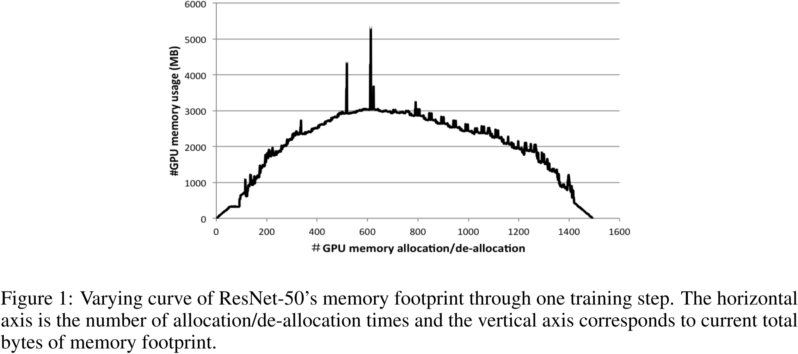

图 1：ResNet-50 在单个训练步骤中的内存占用变化曲线。横轴表示分配/释放操作的次数，纵轴对应当前总的内存占用字节数。  

    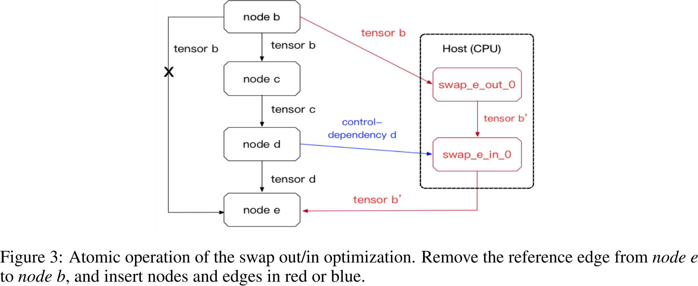

图 3：交换优化的原子操作。从节点 $e$ 到节点 $b$ 删除引用边，并插入红色或蓝色的节点和边。  

    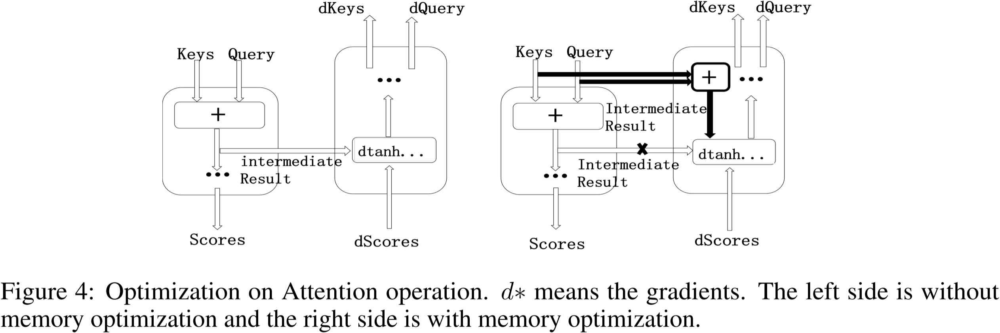

图 4：注意力（Attention）操作的优化。$d^*$ 表示梯度。左侧为未进行内存优化的情况，右侧为经过内存优化的情况。

## 2) 2018_PPoPP_A会_Superneurons: dynamic GPU memory management for training deep neural networks  

> SuperNeurons

动机：

总结：

摘抄：

图表：

    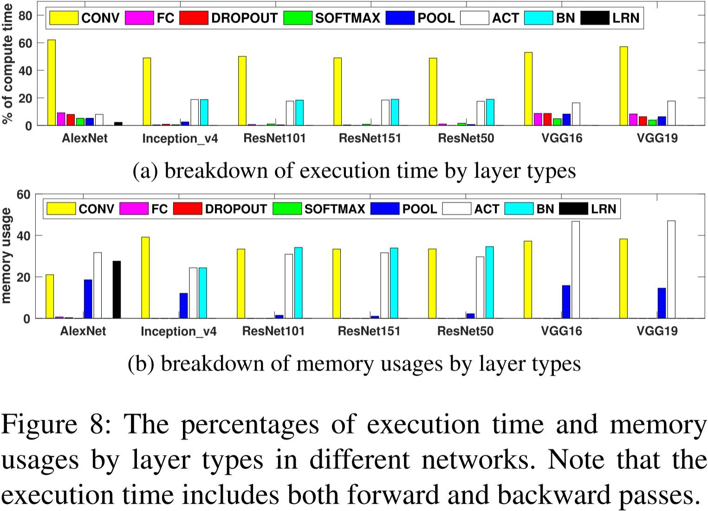

图 8：不同网络中各层类型的执行时间和内存使用比例。请注意，执行时间包括前向传播和反向传播。

## 3) 2019_TACO_A刊_Layup: Layer-adaptive and Multi-type Intermediate-oriented Memory Optimization for GPU-based CNNs  

> Layup

动机：

总结：

摘抄：

图表：

    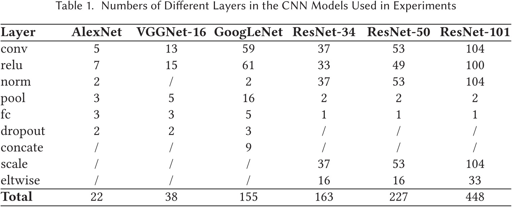

## 4) 2020_ASPLOS_A会_Capuchin: Tensor-based GPU Memory Management for Deep Learning  

> Capuchin

动机：

总结：

摘抄：

图表：

    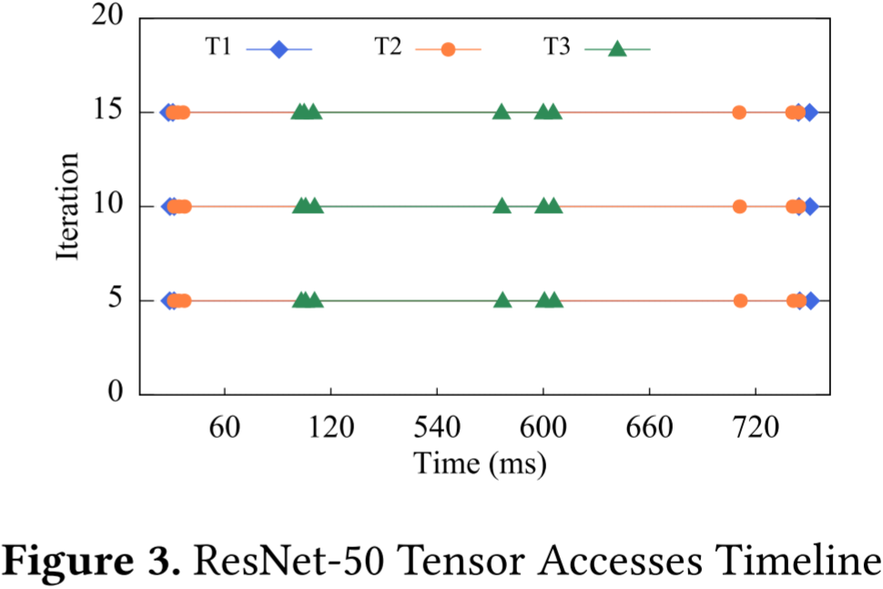

图 3：ResNet-50 张量访问时间轴。  

    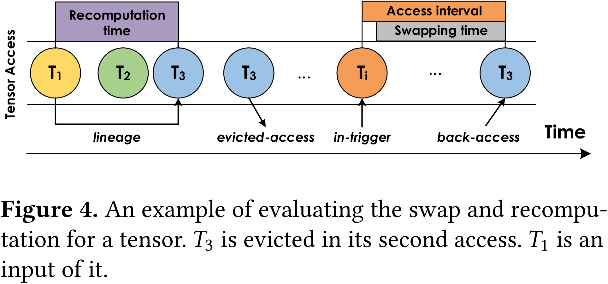

图 4：评估张量交换与重计算的示例。T3 在其第二次访问时被逐出，T1 是其输入。

    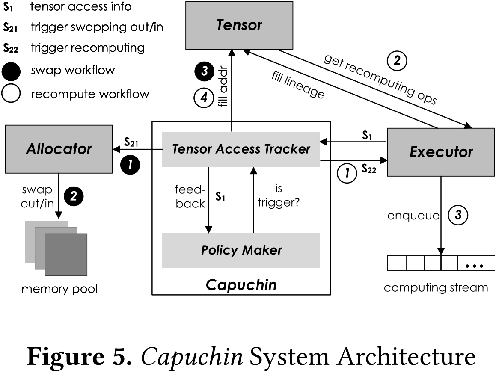

    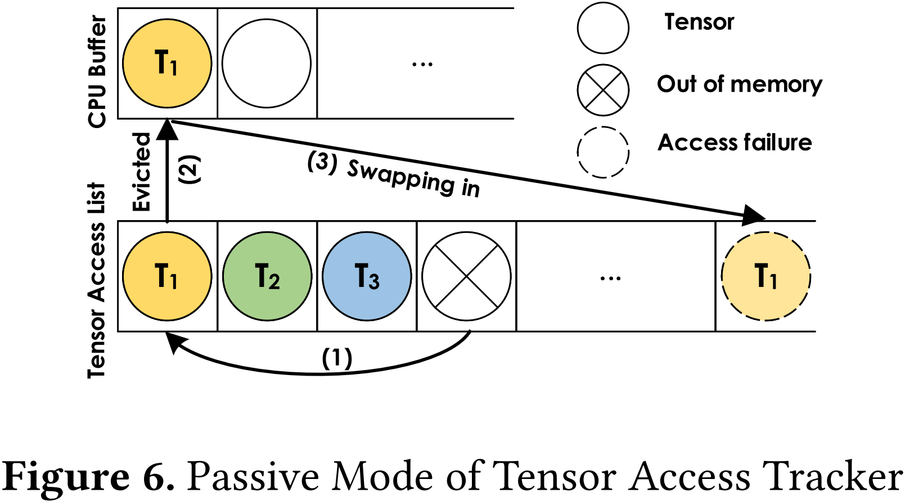

图 6：张量访问跟踪器的被动模式。

## 5) 2022_TC_A刊_HOME: A Holistic GPU Memory Management Framework for Deep Learning  

> HOME

动机：

总结：

摘抄：

图表：

    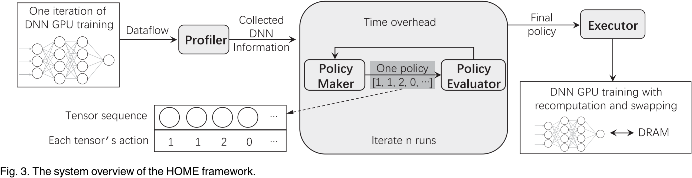

## 6) 2022_ICS_B会_MegTaiChi: dynamic tensor-based memory management optimization for DNN training  

> MegTaiChi

动机：

总结：

摘抄：

图表：

    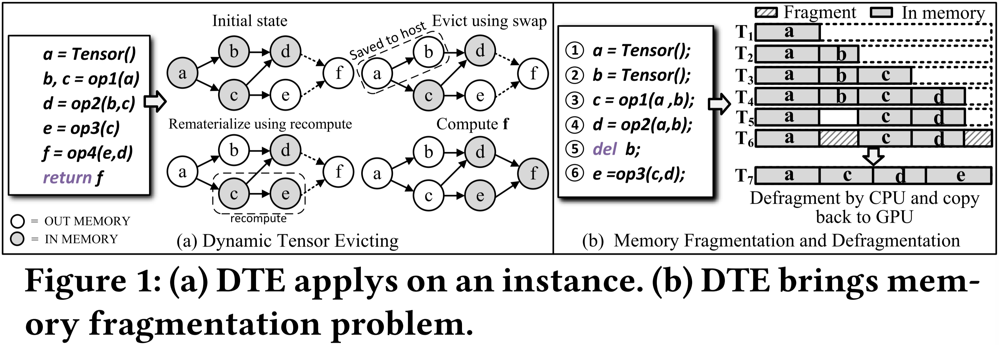

图 1：（a）DTE 应用于一个实例。（b）DTE 导致内存碎片问题。

    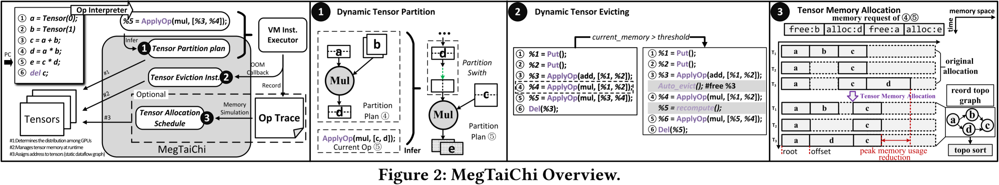

    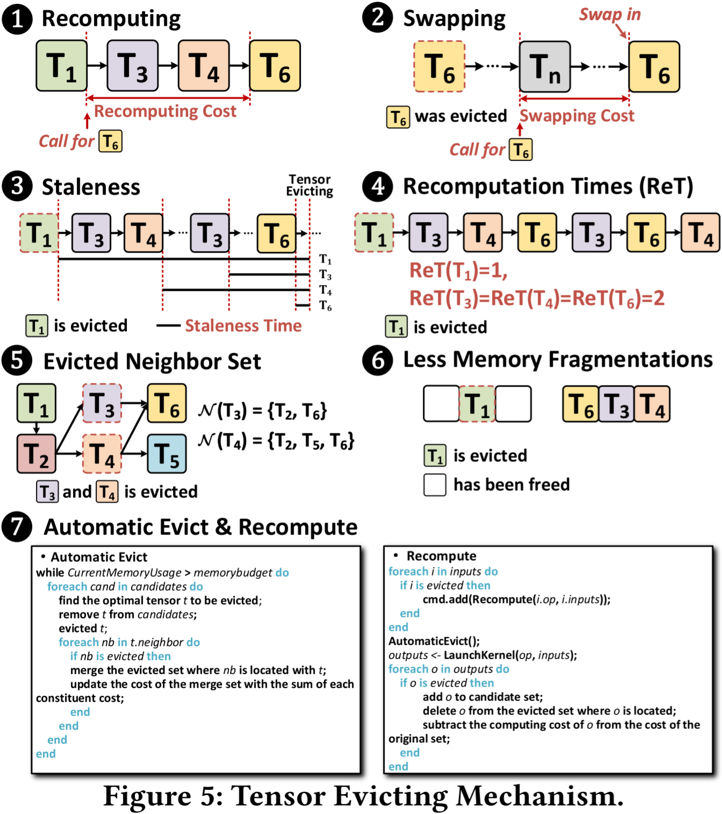

## 7) 2022_TKDE_A刊_TENSILE: A Tensor Granularity Dynamic GPU Memory Scheduling Method Toward Multiple Dynamic Workloads System  

> TENSILE

动机：

总结：

摘抄：

图表：

    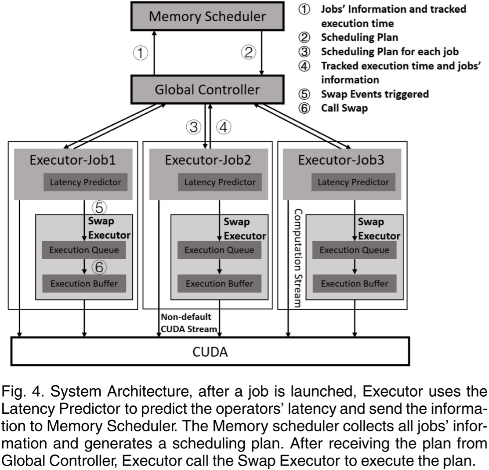

图 4. 系统架构。在作业启动后，执行器（Executor）使用延迟预测器（Latency Predictor）预测算子的延迟，并将信息发送至内存调度器（Memory Scheduler）。内存调度器收集所有作业的信息并生成调度计划。在从全局控制器（Global Controller）接收到计划后，执行器调用交换执行器（Swap Executor）来执行该计划。

## 8) 2022_ICDE_A会_TSPLIT: Fine-grained GPU Memory Management for Efficient DNN Training via Tensor Splitting  

> TSPLIT

动机：

总结：

摘抄：

图表：

    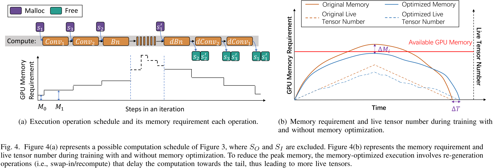

图 4. 图 4(a) 展示了图 3 的一种可能的计算调度方案，其中不包括 $S_O$ 和 $S_I$。图 4(b) 展示了在有无内存优化情况下的训练过程中，内存需求和存活张量的数量。为了降低峰值内存，经过内存优化的执行方案引入了重新生成操作（即交换加载/重计算），推迟计算至执行序列的后段，从而导致更多存活张量。

(a) 执行操作调度及每个操作的内存需求。

(b) 训练过程中，在有无内存优化情况下的内存需求和存活张量数量。

    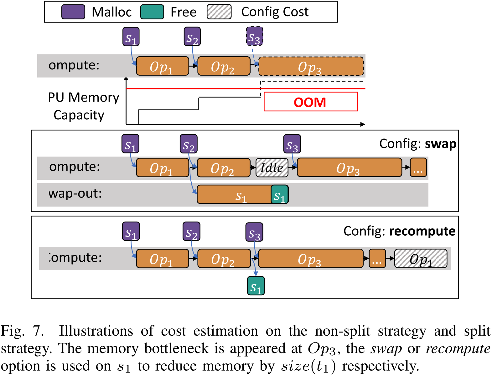

图 7. 非拆分策略和拆分策略的代价估计示意图。在 $Op_{3}$ 处出现内存瓶颈，对 $s_1$ 采用交换或重计算选项以减少大小为 $\text{size}(t_1)$ 的内存。

    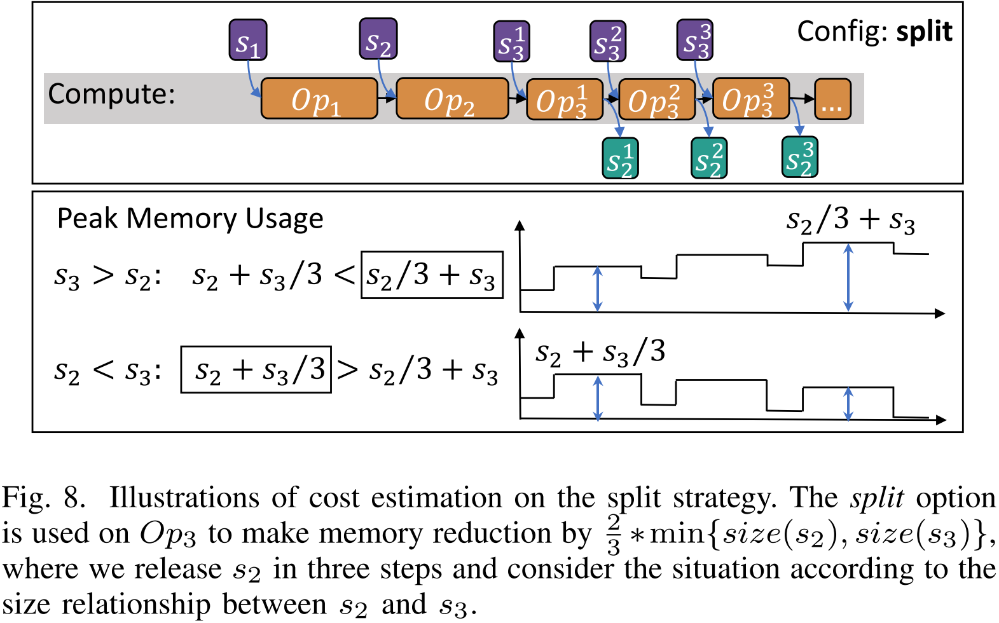

图 8. 拆分策略的代价估计示意图。在 $Op_3$ 处采用拆分选项，使内存减少 $\frac{2}{3} \times \min\{\text{size}(s_2), \text{size}(s_3)\}$，其中我们将 $s_2$ 分三步释放，并根据 $s_2$ 和 $s_3$ 之间的大小关系进行决策。

## 9) 2022_ICML_A会_POET: Training Neural Networks on Tiny Devices with Integrated Rematerialization and Paging  

> POET

动机：

总结：

摘抄：

图表：

    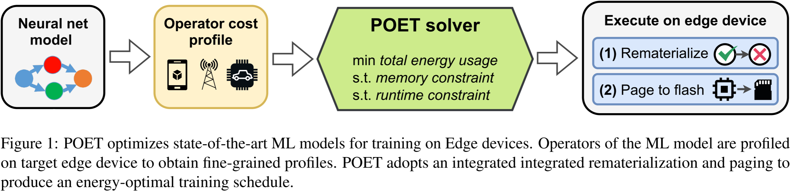

图 1：POET 优化了最先进的机器学习（ML，Machine Learning）模型，使其能在边缘设备上进行训练。该机器学习模型的算子在目标边缘设备上进行分析，以获取细粒度的性能概况。POET 采用集成的重计算和分页策略，以生成能量最优的训练调度方案。

## 10) 2023_TPDS_A刊_STR: Hybrid Tensor Re-Generation to Break Memory Wall for DNN Training  

> STR

动机：

总结：

摘抄：

图表：

    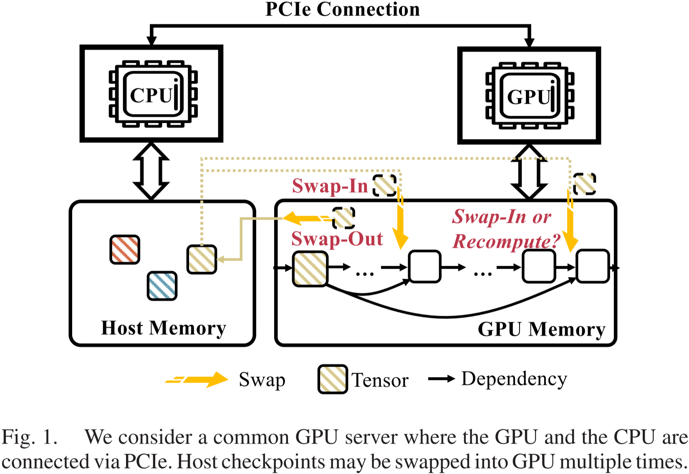

图 1：我们考虑一个常见的 GPU 服务器，其中 GPU 与 CPU 通过 PCIe 连接。主机检查点 (host checkpoint) 可能会多次交换到 GPU 中。  

    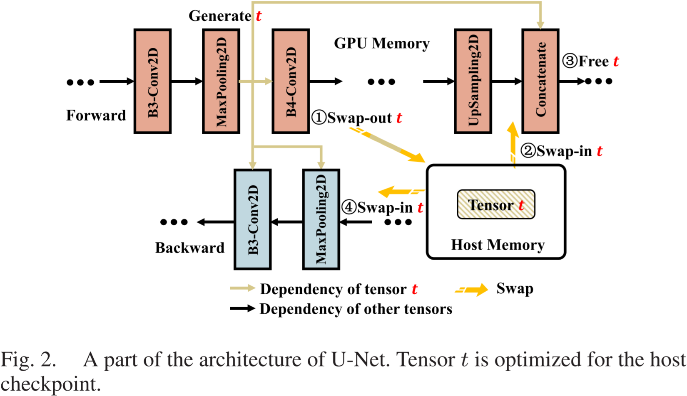

图 2：U-Net 体系结构的一部分。张量 $t$ 经过优化以适应主机检查点。  

    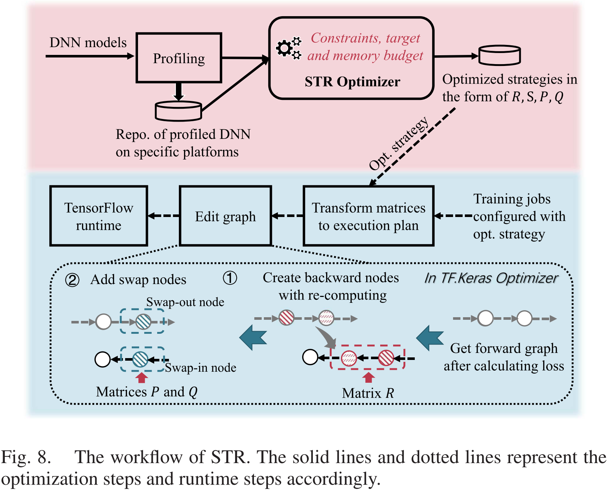

图 8：STR 的工作流程。实线和虚线分别表示优化步骤和运行时步骤。

## 11) 2023_MLSys_顶会_μ-TWO: 3× Faster Multi-Model Training with Orchestration and Memory Optimization  

> μ-TWO

动机：

总结：

摘抄：

图表：

    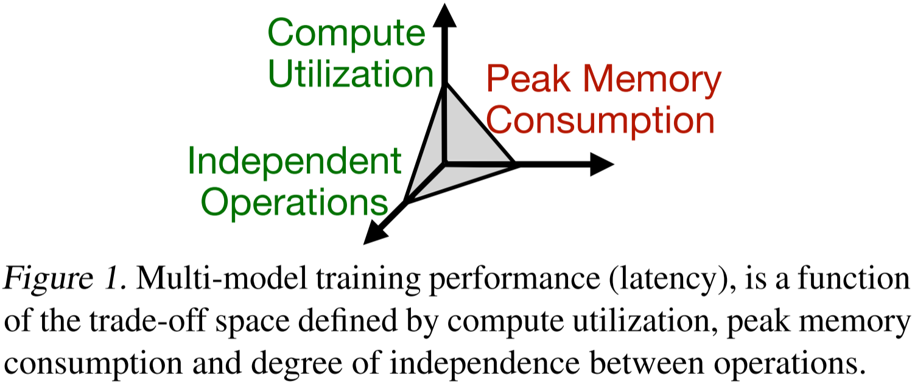

图 1：多模型训练的性能（延迟）取决于计算利用率、峰值内存消耗以及算子之间独立性的权衡空间。  

    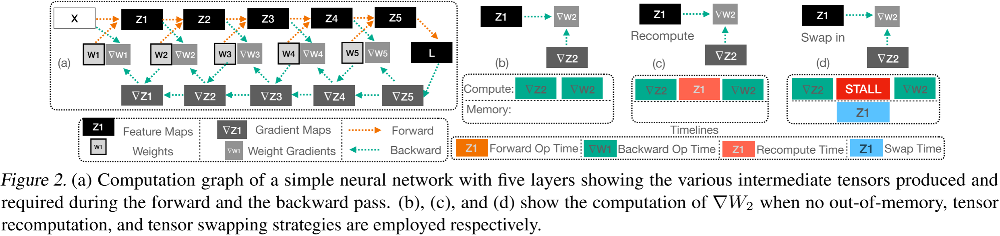

图 2：（a）一个具有五层的简单神经网络的计算图，展示了前向和反向传播过程中生成和需要的各种中间张量。（b）、（c）和（d）分别展示了在未发生显存溢出、采用张量重计算以及采用张量交换策略时计算 $\nabla W_2$ 的过程。    

    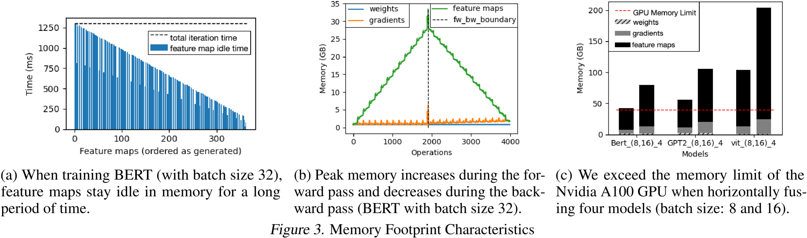

（a）在训练 BERT（批量大小 32）时，特征图在内存中长时间处于空闲状态。  

（b）在前向传播过程中，峰值内存消耗增加，在反向传播过程中减少（BERT，批量大小 32）。  

（c）当水平融合四个模型时，我们超出了 Nvidia A100 GPU 的内存限制（批量大小：8 和 16）。

    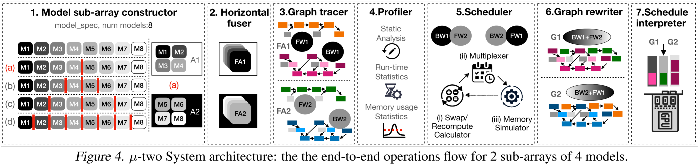

图 4：$\mu$-two 系统架构：针对 2 组 4 个模型的端到端操作流程。

## 12) 2024_TACO_A刊_DELTA: Memory-Efficient Training via Dynamic Fine-Grained Recomputation and Swapping  

> DELTA 将内存交换机制加入动态张量重计算 DTR，适配 PyTorch 的动态计算图特性。

动机：

总结：

> 笔者对这篇论文进行了翻译，具体内容见：

    

## 13) 2024_TACO_A刊_ATP: Achieving Throughput Peak for DNN Training via Smart GPU Memory Management  

> ATP

动机：

总结：

摘抄：

图表：

    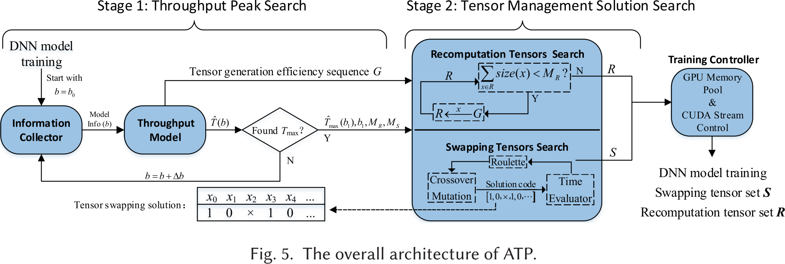

> 这个工作是在 SuperNeurons 上改的，作者之前还发了一个工作：Chen W, Dong X, Chen X, et al. pommDNN: Performance optimal GPU memory management for deep neural network training[J]. Future Generation Computer Systems, 2024, 152: 160-169.

## 14) 2024_ASPLOS_A会_MAGIS: Memory Optimization via Coordinated Graph Transformation and Scheduling for DNN  

> MAGIS

动机：

总结：

摘抄：

图表：

    

## 15) 2025_SIGMOD_A会_MEMO: Fine-grained Tensor Management For Ultra-long Context LLM Training  

> MEMO

动机：

总结：

摘抄：

图表：

    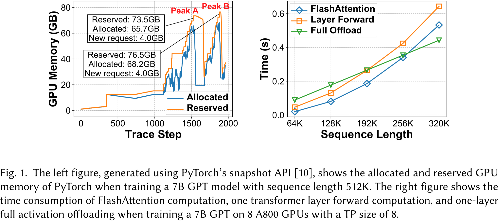

图 1 左侧的图像由 PyTorch 的快照 API 生成，展示了在训练 7B GPT 模型（序列长度为 512K）时，PyTorch 的已分配和已保留 GPU 内存。右侧的图像展示了在 8 块 A800 GPU 上，以张量并行（TP）大小为 8 训练 7B GPT 时，FlashAttention 计算、单个 Transformer 层前向计算以及单层完整激活卸载的时间消耗。  

    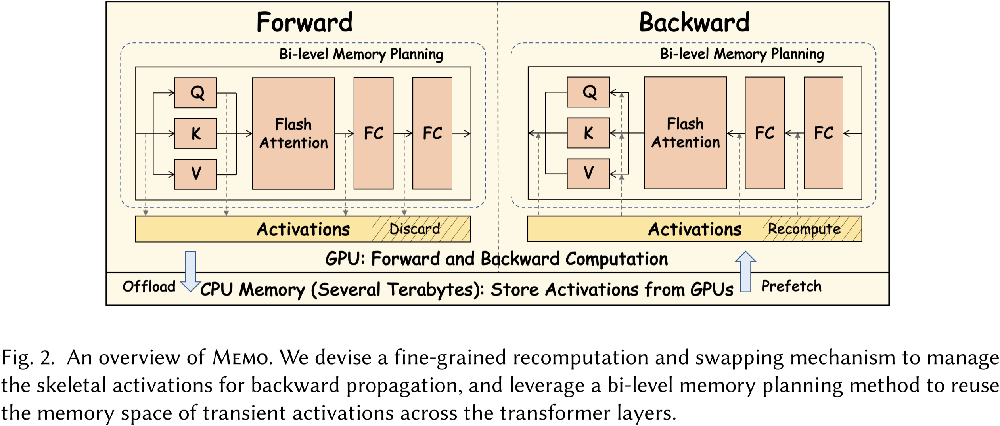

图 2 展示了 Memo 的整体概览。我们设计了一种细粒度的重计算与交换机制，以管理反向传播过程中的骨干激活，并采用双层内存规划方法，在 Transformer 层之间复用瞬态激活的内存空间。

    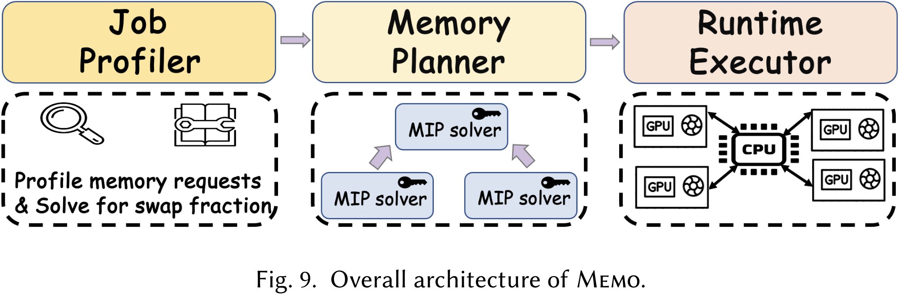

## 16) 2025_ICDE_A会_LoHan: Low-Cost High-Performance Framework to Fine-Tune 100B Model on a Consumer GPU

> LoHan

动机：

总结：

摘抄：

图表：

    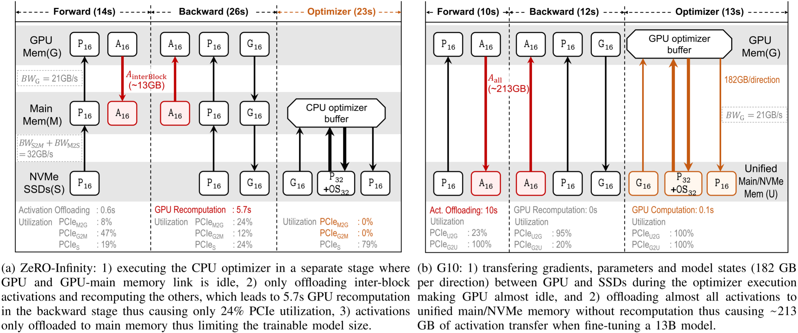

图 1：基于卸载（offloading）的系统对比。在我们的评估服务器上（配备 12 块 SSD），对 13B 模型进行微调（batch size 为 32）时测得带宽和开销数据。  

(a) ZeRO-Infinity：1）在单独的阶段执行 CPU 优化器，此时 GPU 与 GPU 主内存的连接处于空闲状态；2）仅卸载跨块激活（inter-block activations），对其他部分进行重计算，导致反向阶段 GPU 需额外进行 5.7 s 的重计算，从而 PCIe 利用率仅为 24%；3）仅将激活卸载至主内存，限制了可训练模型的规模。  

(b) G10：1）在优化器执行过程中，在 GPU 与 SSD 之间传输梯度、参数和模型状态（每个方向 182 GB），使 GPU 处于近乎空闲状态；2）几乎将所有激活卸载到统一的主内存/NVMe 内存，而不进行重计算，因此在微调 13B 模型时会导致约 213 GB 的激活传输。 

    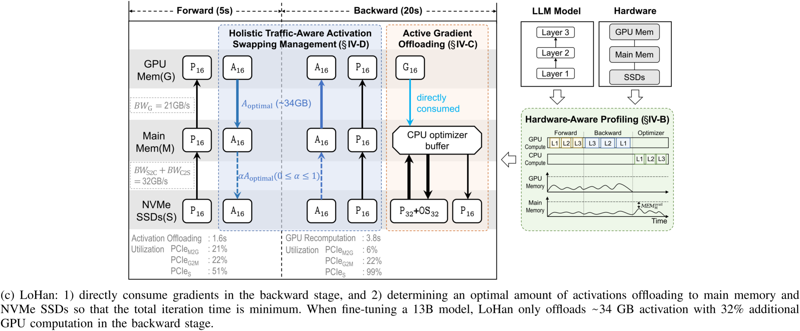

(c) LoHan：1）在反向阶段直接消费梯度；2）确定最优的激活卸载量，分别存入主内存和 NVMe SSD，使总迭代时间最小化。在微调 13B 模型时，LoHan 仅卸载约 34 GB 的激活，并在反向阶段增加 32% 的 GPU 计算量。