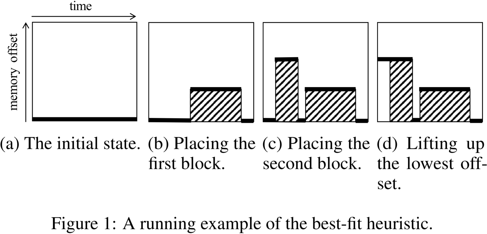

# 内存分配策略相关论文的阅读笔记

> 说明：
> 1. 内存分配策略 (memory allocation strategies) 又可分为静态内存分配 (static memory allocation, SMA) 和动态内存分配 (dynamic memory allocation, DMA)；
> 2. 笔者不评价论文质量，每篇论文都有自己的侧重，笔者只记录与自己研究方向相关的内容；
> 3. 英文论文使用 DeepSeek 进行了翻译，如有翻译不准确的地方还请读者直接阅读英文原文。

## 1) 2018_arXiv:1804.10001_v1_Profile-guided memory optimization for deep neural networks

> 因为该工作是在深度学习框架 Chainer 上实现的，为了方便，笔者将其称为 Chainer-Opt。Chainer-Opt 启发了后续很多工作，包括 ROAM、HMO 等。Chainer-Opt 对训练和推理都有效。

动机：尽管扩展神经网络似乎是提高准确性的关键，但这伴随着高昂的内存成本，因为在训练和推理的传播过程中，需要存储权重参数和中间结果（如激活值、特征图等）。这带来了几个不理想的后果。首先，在训练深度神经网络（DNN）时，我们只能使用较小的 mini-batch 以避免内存耗尽的风险，因此**收敛速度会变慢**。其次，使用如此庞大的 DNN 进行推理可能需要在部署环境中**使用大量计算设备**。第三，更严重的是，**神经网络的设计灵活性受到限制**，以便 DNN 能够适应底层设备的内存容量。在 GPU 和边缘设备上，这种高内存消耗问题尤为严重，因为与 CPU 相比，它们的内存容量更小，且扩展性有限。

总结：Chainer-Opt 在一次迭代中分析内存使用情况，并利用该分析结果来确定内存分配方案，从而在后续迭代中最小化峰值内存使用。Chainer-Opt 使用混合整数规划 (mixed integer programming, MIP) 求解小规模动态存储分配问题的最优解。Chainer-Opt 将动态存储分配问题视为二维矩形装箱问题 (two-dimensional rectangle packing problems) 的特例，使用基于 Best-fit 的启发式算法来寻找大规模动态存储分配问题的近似最优解。

摘抄：  
- 由于深度神经网络（DNN）消耗大量内存，内存管理的需求逐渐显现。许多深度学习框架（如 Theano、TensorFlow 和 Chainer）采用基于**内存池**和**垃圾回收**的动态 GPU 内存分配方式。**内存池是由未使用的内存块组成的集合**。
  - 在接收到 GPU 内存请求时，这些框架会从内存池中找到一个合适大小的内存块，
  - 或者如果池中没有合适的块，则从物理内存中分配，并用引用计数对其进行管理。
  - 当垃圾回收机制回收该内存块时，该块会返回到内存池。
- 通常，内存分配可以被视为一个**二维条带装箱问题（two dimensional strip packing problem, 2SP）**。该问题要求**在固定宽度的容器内放置一组矩形物品，同时最小化容器的高度**。一个内存块可以对应一个矩形物品，其分配时间对应宽度，内存大小对应高度。

图表：

    

在本文中，我们研究一个特殊情况，即**所有内存块的分配时间都是固定的输入**。该问题也被称为**动态存储分配问题（Dynamic Storage Allocation，DSA）**，是一个典型的 NP 难问题。

我们的目标是**在矩形区域内放置所有内存块，使得顶部的内存块尽可能低**。该启发式算法重复执行两个操作，直到所有内存块都被放置完毕：
1. 选择一个偏移量 (offset)，
2. 搜索一个可以放置在该偏移量 (offset) 处且不会与已放置的内存块发生冲突的内存块。

我们通过图 1 所示的示例说明该启发式算法的工作方式。
- 在图 1 中，x 轴和 y 轴分别表示时间和内存偏移量。
- 在算法的初始阶段（图 1a），由于尚未放置任何内存块，因此我们选择偏移量为零。
- 当搜索可放置的内存块时，我们总是在可以放置的**候选块**中**选择生存期最长的**一个。在图 1 的示例中，我们选择了生存期最长的内存块并将其放置（图 1b）。
- 放置后，会产生**三个候选内存偏移量**（图 1 中的粗线，我们称之为偏移线 (offset lines)）。当存在多个**偏移量**时，我们总是**选择最小的**一个（如果存在**多个相同的最小偏移量**，则**选择最左侧的**一个）。
- 接下来，我们为所选的偏移量搜索一个内存块并进行放置（图 1c）。
- 如果没有可放置的内存块，我们会通过**与相邻的最低偏移线合并**来“抬升”该偏移线（如图 1d 所示，如果相邻偏移线的偏移量相同，则合并所有相邻的线），然后再次选择偏移量并搜索内存块。

该启发式算法的计算时间复杂度在**内存块数量的平方**范围内。

## 2) 2023_NeurIPS_A会_Coop: Memory is not a Commodity  

> Coop 是 Oneflow 在工程实践中针对 DTR 带来的碎片化问题开展的优化，适用于动态计算图，实现了张量分配和张量重计算的协同优化。

动机：现有的张量重计算技术忽略了深度学习框架中的内存系统，并隐含地假设不同地址上的空闲内存块是等价的，但这一假设只有在所有被驱逐的张量是连续的情况下才成立。在这一错误假设下，非连续的张量会被驱逐，驱逐无法形成连续内存的张量会导致内存碎片化。这导致严重的内存碎片化，并增加了潜在重计算的成本。

总结：DTR 会驱逐无法形成连续内存的张量，导致严重的内存碎片化。为了解决该问题，Coop 提出了一种滑动窗口 (sliding window) 算法，确保驱逐的张量在地址上都是连续的。具体地说，Coop 将所有张量按内存地址排序并存储在列表中来跟踪它们的状态，使用两个指针表示滑动窗口的起点和终点，通过在列表中移动窗口，并不断比较窗口内张量的启发式成本总和，找到一组连续的张量，使其总内存大于所需内存且驱逐成本最低，窗口内的张量将被驱逐。另外，为了优化张量内存布局，从而进一步降低重计算成本，Coop 还提出了低成本张量划分 (cheap tensor partitioning) 和可重计算就地操作 (recomputable in-place)。具体地说，Coop 将驱逐成本相近的张量聚类到相同的位置，从而增加了驱逐一组连续低成本张量的可能性。此外，Coop 观察到 in-place 主要发生在不可驱逐的模型参数更新过程中。为了防止这些张量将整个内存池划分成不连续的内存块，Coop 先将参数张量分配到内存池的两端，并在更新时重用其内存，从而最大程度地降低了内存碎片化的发生率。

摘抄：

- 内存分配器（Memory allocator）是深度学习（DL）系统中的重要组成部分。所有已知的 DL 系统（如 PyTorch、TensorFlow 和 MXNet）都配备了专属的内存分配器，以实现**细粒度内存管理（fine-grained memory management）**并**避免与操作系统（OS）通信的开销**。相比于先进的 CPU 内存分配器（如 mimalloc 和 jemalloc），DL 框架中的内存分配器设计更为简单。  
- 通常，在 DL 框架中，当**张量被销毁**时，其内存不会归还给 OS，而是被插入到分配器的空闲列表中，并与相邻地址的内存块合并。当用户请求大小为 $S$ 的张量内存时，分配器会尝试将该张量放置在大小大于或等于 $S$ 的空闲块的**最左侧**。如果所有空闲块的大小都小于 $S$，则分配器会向 OS 申请新的内存，即使所有空闲块的总大小可能大于 $S$。这些未被利用的空闲块称为**内存碎片（memory fragments）**。
- 在每次迭代中，**由顺序操作生成的张量**往往会从内存池的最左侧开始被连续分配。
- 此外，内存分配器可以利用**硬件的页表（page table）**，将非连续的内存块在**虚拟内存（virtual memory）**的视角下重新组合成连续的内存块。研究表明，这种方法能够减少 CPU 端的内存碎片。（但是 NVIDIA GPU 的驱动程序不开源）。
- **内存碎片**指的是由于尺寸较小且零散分布，无法用于张量分配的内存块。这一问题影响所有深度神经网络（DNN）训练，但在张量重计算过程中尤为严重，因为重计算会导致更频繁的内存重组。  
- 现有张量重计算方法无法解决该问题的根本原因在于，它们并不强调生成**连续的空闲内存块**。此外，它们的启发式方法往往会使问题更加严重。大多数重计算方法为了减少递归重计算，会**惩罚驱逐由顺序操作生成的张量**。例如，在 DTR 的启发式方法中，张量的预估开销是基于其邻域计算的（即依赖于当前张量或依赖其重计算的张量）。**惩罚顺序张量的驱逐**通常会导致生成非连续的空闲内存块，因为顺序张量往往是连续存储的。

图表：

    

图 1：DTR 与 Coop 的对比。DTR 忽略了底层内存系统，导致冗余的逐出操作。相比之下，Coop 共同优化了张量重计算和张量分配，以找到最优的张量进行逐出。

张量按其成本密度（计算成本除以内存大小）进行分类。“低成本”张量和“高成本”张量分别表示成本密度低和高的张量。不可逐出的张量（包括网络参数和缓冲区）无法被逐出。

(a) 传统张量分配器给出的典型内存布局，其中所有张量混合存储。

(b) Coop 采用滑动窗口算法，在给定的内存布局下找到最优的张量集合。

(c) Coop 通过可重计算的就地（in-place）操作优化内存布局，确保不可逐出的张量在更新后仍保持原位。这一优化降低了滑动窗口内张量的成本，相较于 (b) 更加高效。

(d) 通过低成本张量划分，“低成本”张量和“高成本”张量分别分配到内存池的两侧。进一步优化内存布局，降低逐出成本。  

    

图 2：Coop 中低成本张量划分的示意图。

我们观察到，神经网络中的大多数算子可以按照计算复杂度简单地归类为两类：超线性（super-linear）（如矩阵乘法 matmul 和卷积 conv）以及线性/次线性（linear/sub-linear）（如逐元素操作 element-wise ops）。**在大多数情况下，超线性操作的成本密度比其他算子高一个数量级**。

(a) 典型卷积神经网络的层结构，卷积层后接激活层。

图 2(a) 展示了一个典型的卷积神经网络示例，其中每个卷积层后都跟随一个激活函数。在此，我们未包含批量归一化（Batch Normalization），因为其计算成本密度与激活层相似，且并非所有神经网络都必须包含该操作。

(b) DTR 下的张量逐出，张量按顺序分配。

假设张量 $x_0, ..., x_4$ 在训练开始时生成，因此按顺序存储在内存中。如果内存已满且需要额外的 100 MB 来存储 $x_5$，根据 DTR 的策略，两个由激活层生成的张量（$x_0$ 和 $x_2$，每个 50 MB）将被优先驱逐（$x_0$ 是内存中最旧且成本最低的张量，其驱逐会增加 $x_1$ 的启发式成本）。然而，由于释放的内存块不连续，仍需额外驱逐其他张量（例如 $x_1$），这会**引入无效驱逐**并**导致内存碎片化**（如图 2(b)）。

(c) Coop 采用低成本张量划分进行张量逐出，张量从内存池的两侧进行分配。

我们通过从内存池的最左端和最右端分配张量来实现低成本张量分区（如图 2(c)），该方法是可行的，因为用户在训练前已指定内存预算。我们使用**成本密度（计算成本除以内存大小）**来衡量张量的驱逐成本大小。在模型的前向传播过程中，**具有相同数量级成本密度的张量被分配到内存池的同一端**。

## 3) 2023_ICML_A会_MODeL: Memory Optimizations for Deep Learning  

> MODeL 使用整数线性规划来解决算子排序和张量内存布局的问题。

动机：深度学习框架面临的内存碎片化问题 + 深度学习框架未针对张量的生命周期进行优化。

总结：MODeL 通过分析深度神经网络的数据流图，寻找算子之间的拓扑排序。MODeL 将最小化深度神经网络训练所需峰值内存的问题建模为一个整数线性规划 (integer linear program, ILP)，以共同优化张量的生命周期 (lifetime) 和内存位置 (memory location)，从而最小化深度神经网络训练需要分配的内存峰值，并减少内存碎片。

摘抄：

- 当前流行的深度学习框架（如 PyTorch 和 TensorFlow）并未充分利用有限的内存资源。类似于传统的动态内存分配器（如 tcmalloc 和 jemalloc），这些框架在运行时维护一个**空闲内存块池**。当接收到内存请求时，它们会在内存池中查找足够大的空闲块，若无法满足请求，则直接从物理内存中分配新块。当空闲内存块的大小与实际分配请求不匹配时，就会导致**内存碎片化**，而这种情况经常发生。  
- 此外，深度神经网络框架未对**张量的生命周期**进行优化。PyTorch 按照**程序中定义的顺序**执行操作，而 TensorFlow 维护一个**就绪队列**，并采用先进先出的方式执行运算。因此，**张量可能会被提前分配或延迟释放**，从而浪费宝贵的内存。  
- PyTorch 和 TensorFlow 等机器学习框架允许部分算子将其生成的数据存储在输入张量之一中，从而避免额外分配输出张量。这种方法称为 **就地更新（inplace-update）**，可以节省内存。然而，**用户需要手动修改神经网络**以利用这一特性，并且如果使用不当，可能会导致计算错误。  

图表：

    

图 3：节点执行顺序会影响峰值内存占用。边上标注了对应张量的大小，两种可行的节点执行顺序分别标注了每个步骤内存中驻留的张量集合。在 v3 先于 v2 运行的情况下，内存使用效率显著提高。  

**峰值驻留集合（peak resident set）** 是整个神经网络执行过程中规模最大的驻留集合。算子执行顺序会影响张量的生命周期，因此也影响内存的峰值占用。图 3 展示了一个简单示例，说明如何通过调整算子执行顺序显著改善内存使用情况。在所有可能的节点执行顺序中，**优先执行能够释放大量数据且自身生成少量输出数据的节点**通常更具内存效率。然而，已有研究表明，在通用 **有向无环图（DAG, Directed Acyclic Graph）** 上寻找最优调度是一个 **NP 完全（NP-complete）** 问题，无法通过简单的贪心策略解决。

    

图 4：内存碎片化可能大幅增加存储张量所需的内存。贪心分配器（上图）不会在张量 A 和 B 之间留下任何空隙，因此当张量 A 释放后，无法利用其腾出的空间存储张量 C。而 MODeL（下图）在张量 A 和 B 之间预留了空隙，使得张量 A 释放后的内存可被重用，从而在更少的内存中容纳所有张量。

类似于 malloc 风格的内存分配器，典型的深度学习框架采用**在线（online）**方式进行张量分配，因此同样会面临内存碎片化问题。事实上，**空闲内存通常被分割成小块，并被已分配的张量所隔开，导致大量可用内存因碎片化而无法有效利用**，因为**这些零散的小块不足以容纳一个完整的张量**。图 4 说明了这一现象，并展示了如何通过**预先规划每个张量的存储位置**来大幅减少内存峰值占用。

## 4) 2023_arXiv:2310.19295_v1_ROAM: memory-efficient large DNN training via optimized operator ordering and memory layout  

> ROAM 和 MODeL 优化的都是算子排序 (operator ordering) 和内存布局 (memory layout)，而且最终都把问题形式化为整数线性规划问题。

动机：尽管卸载、重计算和压缩等**高层技术**可以缓解内存压力，但它们也会引入额外的开销。然而，一个具备合理**算子执行顺序**和**张量内存布局**的内存高效执行计划可以显著提升模型的内存效率，并减少高层技术带来的开销。

总结：ROAM 在计算图层面进行优化。为了降低理论峰值内存，ROAM 将算子执行顺序的优化转换为张量生命周期的优化，并引入多个约束条件，以确保优化后的张量生命周期与有效的算子执行顺序相对应，优化目标是最小化理论峰值内存。为了提高内存布局效率，ROAM 最关键的约束是确保生命周期重叠的张量不能占据重叠的地址空间，优化目标是最小化所需内存空间的大小。ROAM 使用整数线性规划求得上述两个问题的近似最优解，并通过一种子图树拆分算法将整体大任务转换为多个小任务，以提高求解过程的执行效率，解决大型复杂图中的优化挑战。

摘抄：
- 当前的深度学习编译器和框架依赖于**基本的拓扑排序算法**，这些算法并未考虑峰值内存使用情况。然而，这些执行顺序通常并不具备内存高效性。
  - Pytorch 按照**程序中定义的顺序**执行算子。
  - Tensorflow 维护一个**就绪算子队列**，并根据进入队列的时间执行它们。
- 已有研究证明，**有向无环图（DAG）的最优调度问题**以及内存布局优化问题（也称为**动态存储分配问题，Dynamic Storage Allocation, DSA）**分别是典型的 **NP 完全（NP-Complete）**问题和 **NP 难（NP-Hard）**问题。因此，在多项式时间内找到最优解是具有挑战性的。

图表：

    

图 2：运算符执行顺序在理论上会影响峰值内存占用。第一种执行顺序（A、B、C、D）会导致两个大张量同时保留在内存中，导致峰值内存达到 120MB。而第二种执行顺序（A、C、B、D）优先执行 C，从而使大张量得以及早释放，有效地将峰值内存降低至 90MB。

    

图 3：张量的内存布局同样会影响实际的峰值内存。左侧的布局在创建张量时决定了它们的地址，尽管存在足够的可用空间，但在创建大小为 20MB 的张量时仍然发生 OOM（内存溢出）。相比之下，右侧的布局充分考虑了**张量的生命周期和大小**，使得张量（16MB 和 20MB）之间的内存得以复用，从而降低峰值内存占用。  

此外，内存布局的低效性会对实际的内存需求产生显著影响。**张量的不合理内存布局会导致较低的内存复用效率，在内存中相邻的两个张量之间产生数据碎片**，如图 3 所示。

现有的深度学习框架通常在运行时从内存池中搜索足够大的空闲内存块，或者选择直接从物理内存中分配所需的内存。它们在决定张量的内存偏移时仅考虑其生成时间。然而，**内存复用还与张量的大小和生命周期密切相关**。因此，这种**运行时分配方法难以通过内存复用充分降低内存需求**。**由于不同张量的生命周期和大小存在差异，在动态分配过程中经常会出现内存碎片化问题，这可能导致因缺乏连续内存而分配失败**。

    

图 5：长生命周期的激活首先迫使底部的激活张量排列，以消除长期的内存碎片化 (a)，从而使得子内存空间可以像 (b) 那样合并。 

临时缓冲区和激活被分配到不同的内存布局中，可能会导致长期碎片化，如图 5a 所示。

为了解决这一问题，我们施加了约束，**强制激活在较低偏移量处连续放置**，从而防止激活与临时缓冲区之间的交错。

如图 5b 所示，涉及**将生命周期较短的内存布局放置在另一个布局之上**。这种方法**利用长期存在的激活的累积大小作为基础偏移量**，有效地减轻了长期碎片化问题。

    

图 7：(a) 说明立即执行权重更新操作可能会增加内存压力。(b) 说明延迟执行权重更新操作可以降低峰值内存占用。

一旦生成梯度，相应的权重更新操作就可以安排执行。因此，权重更新操作的调度表现出强大的灵活性。**权重更新操作的调度时间步可以显著影响峰值内存**。考虑两种极端情况，一是梯度生成后立即调度权重更新，二是所有权重更新操作都在完成反向传播过程后再调度。

如图 7 所示，
- 在内存消耗较大时，例如大多数激活张量都被保留在内存中，**尽早执行权重更新可能会产生许多大的临时缓冲区，导致更大的内存压力**。
- 然而，选择将所有权重更新操作延迟执行并不是一个理想的方案，因为**每个梯度必须被保留相当长的时间**。
- 因此，将权重更新操作**分配到合适的独立段并进行调度**是非常重要的。

## 5) 2024_ASPLOS_A会_GMLake: Efficient and Transparent GPU Memory Defragmentation for Large-scale DNN Training with Virtual Memory Stitching  

> GMLake 用到了 CUDA VMM API，是虚拟内存拼接机制的首个工作，出现的时间与 PyTorch 的 Expandable Segments 相似，但都晚于 TensorFlow 的。GMLake 提供了多个版本的 PyTorch 实现，同时也是质量很高的一篇论文。

> 关于 CUDA VMM API 和 PyTorch 的 Expandable Segments，感兴趣的读者可以阅读：[PyTorch 源码学习：GPU 内存管理之初步探索 expandable_segments](https://blog.csdn.net/weixin_43254181/article/details/145891552?spm=1001.2014.3001.5501)

动机：尽管优化方法（重计算、卸载、分布式训练和低秩适配）能够有效减少训练或微调大规模 DNN 模型的内存占用，但它们可能会导致较低的内存利用率。其原因在于，这些方法会引入大量规律性和动态性的内存分配请求，从而导致 GPU 内存碎片率最高可达 30%。

总结：GMLake 针对内存优化技术导致的严重内存碎片化问题，利用 CUDA 提供的虚拟内存管理接口，提出了一种虚拟内存拼接机制，通过虚拟内存地址映射组合非连续的物理内存块，从而缓解了内存碎片问题。

> 笔者对这篇论文进行了翻译，具体内容见：[【翻译】GMLake_ASPLOS 2024](https://blog.csdn.net/weixin_43254181/article/details/146442219)

## 6) 2024_ISMM_内存领域_A Heuristic for Periodic Memory Allocation with Little Fragmentation to Train Neural Networks  

> 考虑到该文献使用模拟退火 (Simulated Annealing, SA) 算法解决动态存储分配 (Dynamic Storage Allocation, DSA) 问题，所以笔者将其简称为 DSA-SA。另外，作者在论文中也解释了该工作的局限性：“总体而言，尽管我们的方法是离线的，其适用性受到一定限制，但在**需要针对特定工作负载进行高度优化的场景**下，我们的方法能够实现接近满负载的资源利用率，并且一旦完成分配规划，就不会产生任何运行时开销，因此我们认为其性能最佳。” DSA-SA 的开销主要体现在第一次迭代。

动机：DSA 问题是 NP-hard 的，因此通过精确算法的优化成本过高。已有大量关于多项式时间近似算法的研究。然而，这些算法主要关注理论界限，其实际实现通常采用诸如首次适应（first-fit）或最佳适应（best-fit）与合并（coalescing）等启发式方法。……我们的工作主要是受到重计算引起的内存碎片化问题的推动。

总结：DSA-SA 利用了神经网络训练过程中内存分配的周期性，在第一次迭代期间获取内存的分配模式。DSA-SA 将离线 DSA 问题表述为寻找一个最优的分配之间的拓扑排序，并通过基于模拟退火的启发式算法来解决这个 NP-hard 问题，从而可以确定一个碎片化程度最小的分配计划。

摘抄：

- PyTorch 的 CUDA 缓存分配器使用一组块来管理保留的 GPU 内存。这组块类似于 dlmalloc 中的块，后者最初用于 glibc。……此实现具有低延迟，并且通常对典型的神经网络应用表现良好，因为**训练或推理过程中有许多相同大小的分配**，并且**大多数分配可以通过保留的空块处理**，而无需调用`cudaMalloc`。此外，由于**训练和/或推理需要重复计算**，缓存策略表现尤为出色，直到资源耗尽，此时缓存将通过使用`cudaFree`释放一些未拆分的块来销毁。
- 现有的缓存分配器中的碎片减少技术：PyTorch 的 CUDA 缓存分配器提供了几种选项来配置算法，以防止 OOM 错误。
  - 如前所述，未使用的拆分块会导致 CUDA 缓存分配器中的碎片。为了防止将大块拆分为小分配，PyTorch 为小型（最多1MB）和大型分配使用两个块池。**拆分大块通常是有益的，因为它可以重复使用保留的区域，但也可能导致严重的碎片化**。为了防止这种情况，可以配置缓存分配器**在使用阈值时不拆分大块**。当这些大块不再需要时，可以随时使用`cudaFree`释放它们；然而，同步的`cudaFree`可能会降低执行吞吐量。
  - 此外，缓存分配器可以配置为**将每个分配的大小四舍五入到最接近的 2 的幂**，以防止灾难性的碎片化。然而，在大多数工作负载中，这种配置可能会导致更多碎片。
- PyTorch 采用了专门的 CUDA 缓存分配器，以减少`cudaMalloc`和`cudaFree`之类的阻塞函数调用的频率。该缓存分配器优化了内存分配和释放操作，显著提升了 PyTorch 框架中 GPU 操作的整体性能。PyTorch 分配器使用了一种**高效的在线 DSA 算法**。

图表：

    

图 2：高强度的重计算破坏了整体计算的单峰内存占用模式，并生成复杂的分配模式。 

我们在图 2 中绘制了内存消耗和计算顺序，即每个算子的运行进度。没有重计算时，内存消耗模式是单峰的（前向传递时增加，反向传递时减少），并且大多数分配器算法在峰值内存消耗时几乎没有碎片化。

然而，**启用重计算时，内存的分配和释放在计算过程中交替进行，导致复杂的模式**。此外，鉴于重计算的固有特性，PyTorch 缓存分配器可能会因大量小的内存分配和大内存分配之间的间隔而遭受严重的碎片化。

这种**碎片化不仅浪费了 GPU 资源，还减慢了训练过程**。这是因为 **PyTorch 的 CUDA 缓存分配器在需要释放缓存块以腾出空间时，使用了阻塞的 cudaMalloc 和 cudaFree 操作**。

    

图 4：PyTorch 缓存分配器（左）导致的碎片化，以及 GMLake 进行的碎片整理技术（中）和离线规划（右）。每个加粗的框表示该内存段上存在某些阻塞的 CUDA API 调用。 

GMLake 通过**将物理内存块拼接成连续的虚拟范围**在线运行，离线规划的适用性有限，因为它需要对分配模式做出假设，但它能够在没有运行时开销的情况下实现最大化的资源利用。