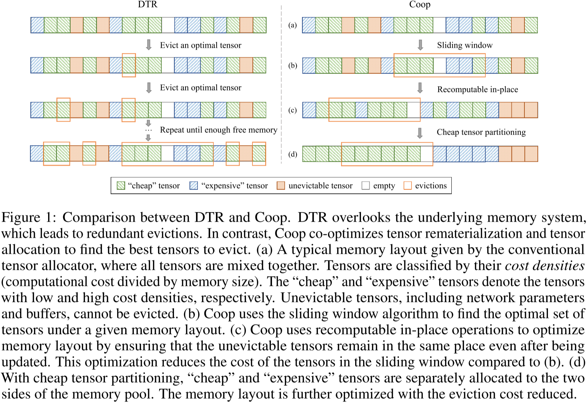
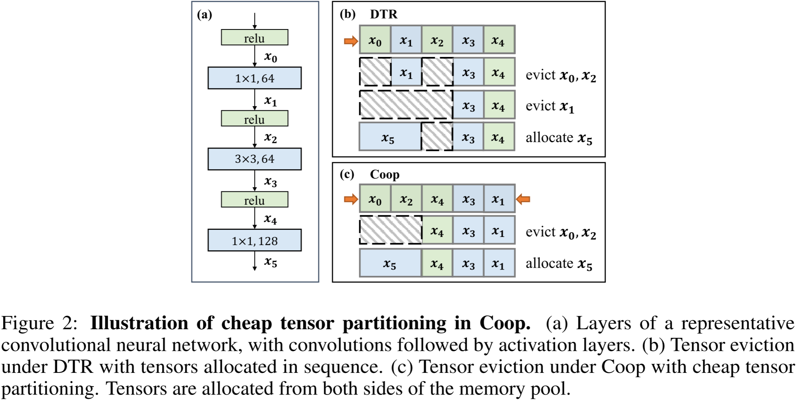
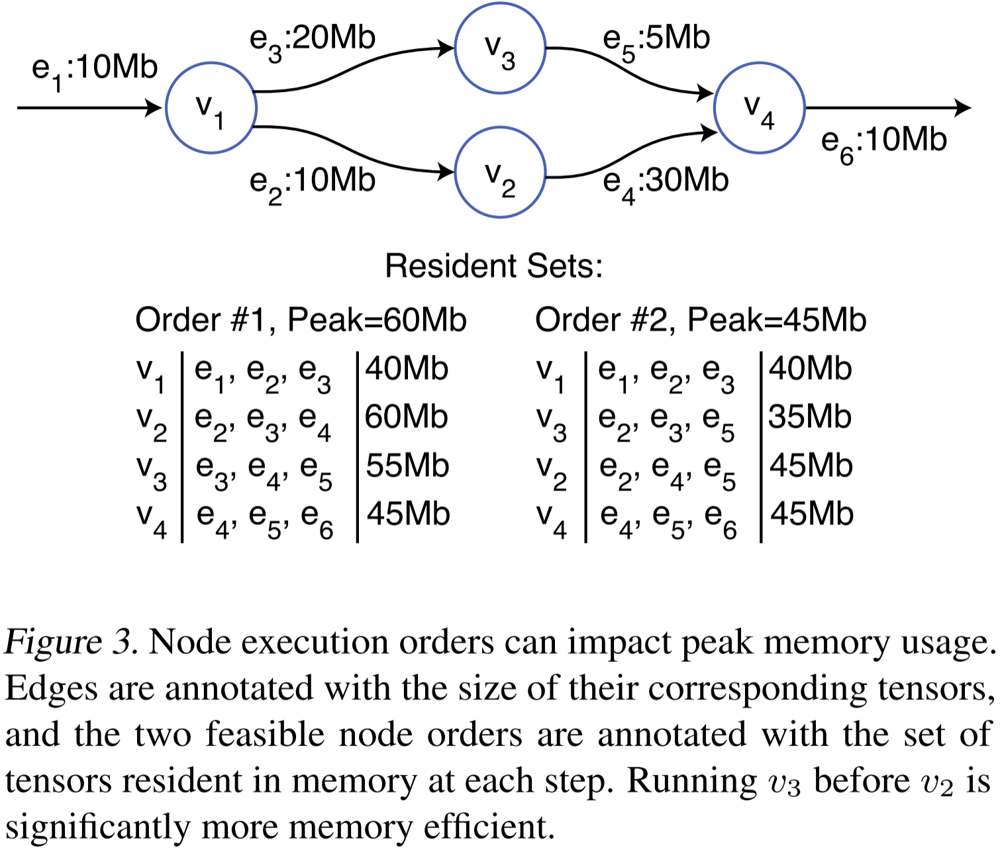
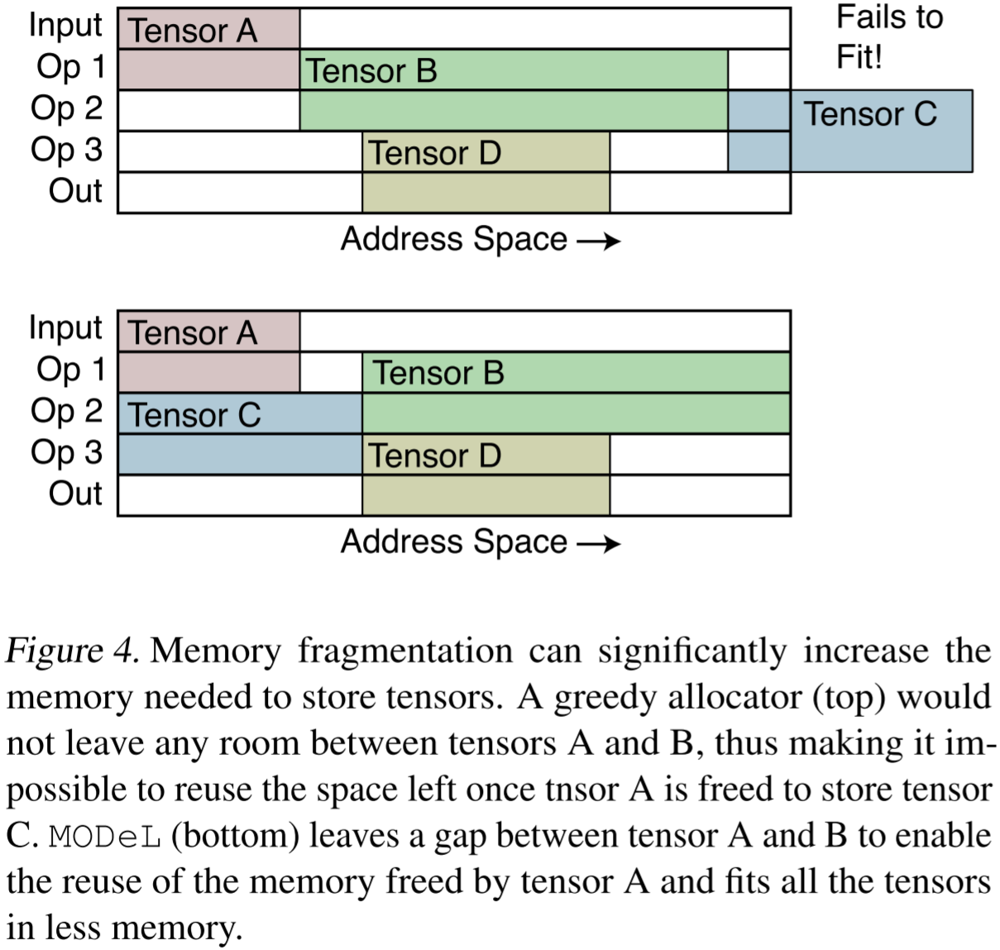
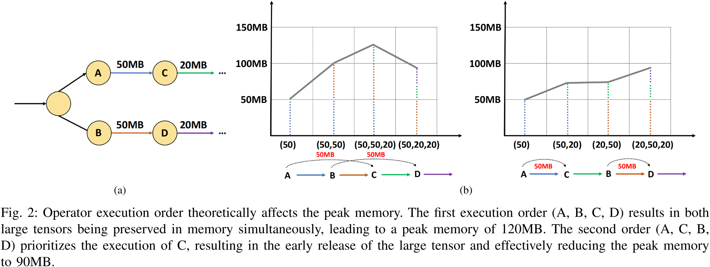
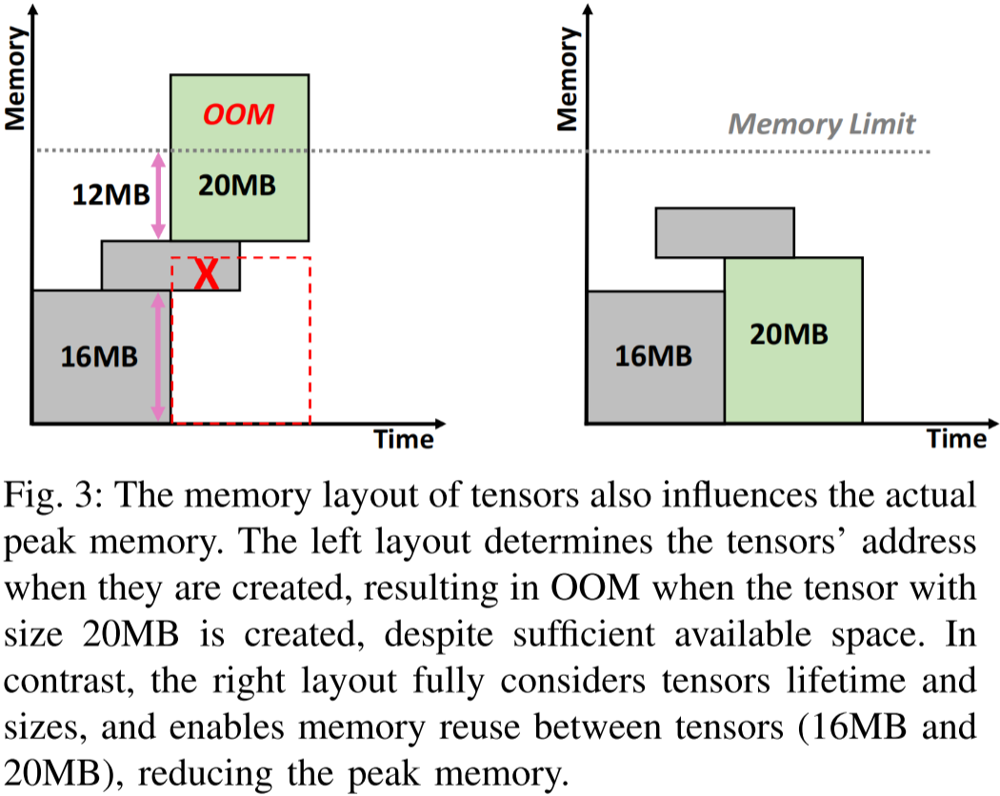
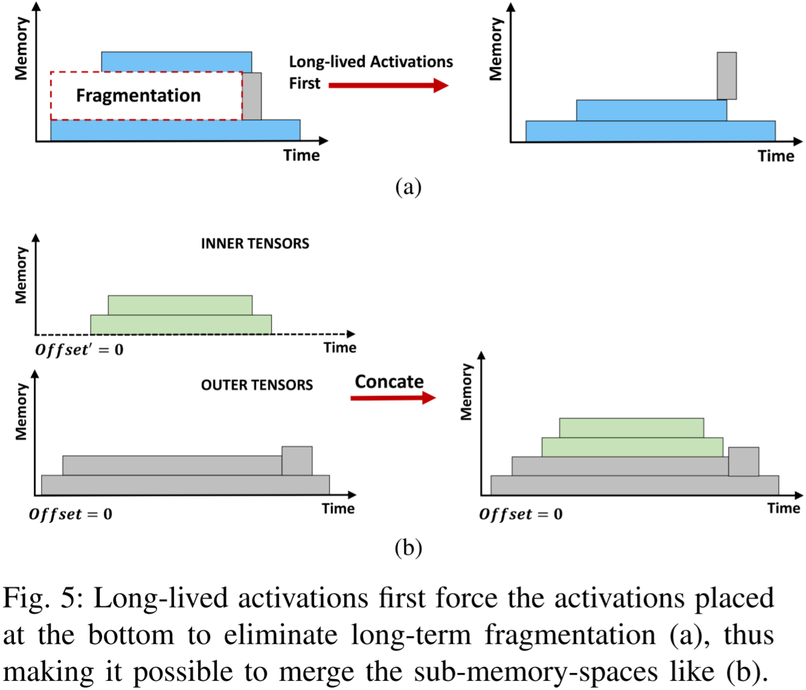
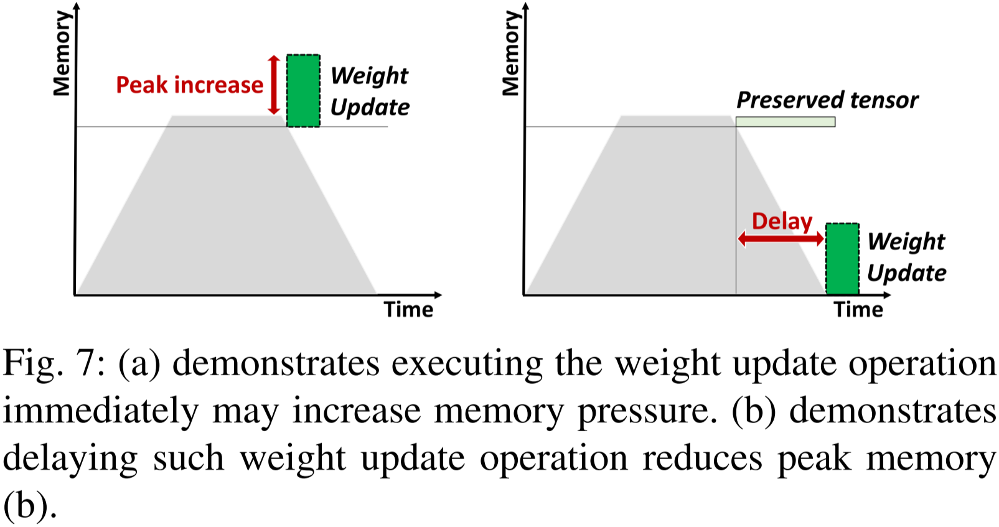

# 内存分配策略相关论文的阅读笔记

> 说明：
> 1. 内存分配策略 (memory allocation strategies) 又可分为静态内存分配 (static memory allocation, SMA) 和动态内存分配 (dynamic memory allocation, DMA)；
> 2. 笔者不评价论文质量，每篇论文都有自己的侧重，笔者只记录与自己研究方向相关的内容；
> 3. 英文论文使用 DeepSeek 进行了翻译，如有翻译不准确的地方还请读者直接阅读英文原文。

## 1) 2018_arXiv:1804.10001_v1_Profile-guided memory optimization for deep neural networks

> 该文献

动机：

总结：

摘抄：

图表：

    

## 2) 2023_NeurIPS_A会_Coop: Memory is not a Commodity  

> Coop

动机：

总结：

摘抄：

图表：

    

图 1：DTR 与 Coop 的对比。DTR 忽略了底层内存系统，导致冗余的逐出操作。相比之下，Coop 共同优化了张量重计算和张量分配，以找到最优的张量进行逐出。(a) 传统张量分配器给出的典型内存布局，其中所有张量混合存储。张量按其成本密度（计算成本除以内存大小）进行分类。“低成本”张量和“高成本”张量分别表示成本密度低和高的张量。不可逐出的张量（包括网络参数和缓冲区）无法被逐出。(b) Coop 采用滑动窗口算法，在给定的内存布局下找到最优的张量集合。(c) Coop 通过可重计算的就地（in-place）操作优化内存布局，确保不可逐出的张量在更新后仍保持原位。这一优化降低了滑动窗口内张量的成本，相较于 (b) 更加高效。(d) 通过低成本张量划分，“低成本”张量和“高成本”张量分别分配到内存池的两侧。进一步优化内存布局，降低逐出成本。  

    

图 2：Coop 中低成本张量划分的示意图。(a) 典型卷积神经网络的层结构，卷积层后接激活层。(b) DTR 下的张量逐出，张量按顺序分配。(c) Coop 采用低成本张量划分进行张量逐出，张量从内存池的两侧进行分配。

## 3) 2023_ICML_A会_MODeL: Memory Optimizations for Deep Learning  

> MODeL

动机：

总结：

摘抄：

图表：

    

图 3：节点执行顺序会影响峰值内存占用。边上标注了对应张量的大小，两种可行的节点执行顺序分别标注了每个步骤内存中驻留的张量集合。在 v3 先于 v2 运行的情况下，内存使用效率显著提高。  

    

图 4：内存碎片化可能大幅增加存储张量所需的内存。贪心分配器（上图）不会在张量 A 和 B 之间留下任何空隙，因此当张量 A 释放后，无法利用其腾出的空间存储张量 C。而 MODeL（下图）在张量 A 和 B 之间预留了空隙，使得张量 A 释放后的内存可被重用，从而在更少的内存中容纳所有张量。

## 4) 2023_arXiv:2310.19295_v1_ROAM: memory-efficient large DNN training via optimized operator ordering and memory layout  

> ROAM

动机：

总结：

摘抄：

图表：

    

图 2：运算符执行顺序在理论上会影响峰值内存占用。第一种执行顺序（A、B、C、D）会导致两个大张量同时保留在内存中，导致峰值内存达到 120MB。而第二种执行顺序（A、C、B、D）优先执行 C，从而使大张量得以及早释放，有效地将峰值内存降低至 90MB。  

    

图 3：张量的内存布局同样会影响实际的峰值内存。左侧的布局在创建张量时决定了它们的地址，尽管存在足够的可用空间，但在创建大小为 20MB 的张量时仍然发生 OOM（内存溢出）。相比之下，右侧的布局充分考虑了张量的生命周期和大小，使得张量（16MB 和 20MB）之间的内存得以复用，从而降低峰值内存占用。  

    

图 5：长生命周期的激活首先迫使底部的激活张量排列，以消除长期的内存碎片化 (a)，从而使得子内存空间可以像 (b) 那样合并。  

    

图 7：(a) 说明立即执行权重更新操作可能会增加内存压力。(b) 说明延迟执行权重更新操作可以降低峰值内存占用。

## 5) 2024_ASPLOS_A会_GMLake: Efficient and Transparent GPU Memory Defragmentation for Large-scale DNN Training with Virtual Memory Stitching  

> GMLake 用到了 CUDA VMM API，是虚拟内存拼接机制的首个工作，出现的时间与 PyTorch 的 Expandable Segments 相似，但都晚于 TensorFlow 的。GMLake 提供了多个版本的 PyTorch 实现，同时也是质量很高的一篇论文。

> 关于 CUDA VMM API 和 PyTorch 的 Expandable Segments，感兴趣的读者可以阅读：[PyTorch 源码学习：GPU 内存管理之初步探索 expandable_segments](https://blog.csdn.net/weixin_43254181/article/details/145891552?spm=1001.2014.3001.5501)

动机：

总结：

> 笔者对这篇论文进行了翻译，具体内容见：

## 6) 2024_ISMM_内存领域_A Heuristic for Periodic Memory Allocation with Little Fragmentation to Train Neural Networks  

> 该文献

动机：

总结：

摘抄：

图表：

    

图 1：高强度的重计算会增加内存碎片化。每个条形表示分配算法使用的地址范围大小，虚线表示峰值负载大小。对于每个条形，地址范围大小与峰值负载大小之间的差距表示碎片化程度。  

    

图 2：高强度的重计算破坏了整体计算的单峰内存占用模式，并生成复杂的分配模式。 

    

图 4：PyTorch 缓存分配器（左）导致的碎片化，以及 GMLake 进行的碎片整理技术（中）和离线规划（右）。每个加粗的框表示该内存段上存在某些阻塞的 CUDA API 调用。 

    

图 5：分配方案由一组分配操作（矩形）排列决定。矩形根据顺序被放置在尽可能低的位置。  

    

图 6：在固定的拓扑排序下，地址范围大小对应于由上述方式创建的有向无环图（DAG）的最长路径长度。