# 重计算相关论文的阅读笔记

> 说明：
> 1. 重计算，又被称为激活重计算 (activation recomputation) 或梯度检查点 (gradient checkpointing) 或再物化 (rematerialization)；
> 2. 笔者不评价论文质量，每篇论文都有自己的侧重，笔者只记录与自己研究方向相关的内容；
> 3. 英文论文使用 DeepSeek 进行了翻译，如有翻译不准确的地方还请读者直接阅读英文原文。

## 1) 2016_arXiv:1604.06174_v2_Training Deep Nets with Sublinear Memory Cost  

> 陈天奇大佬的工作，算是重计算领域最早的工作，笔者把这个工作简称为 Sublinear。

**动机**（为什么要做这个工作？）：由于许多最先进的模型已经达到了 GPU 内存的上限，我们的算法**使得更深层和更复杂的模型得以探索，并有助于推动深度学习研究的创新**。我们专注于减少训练期间存储**中间结果（特征图）** intermediate results (feature maps) 和**梯度** (gradients)的内存成本。

**总结**（贡献、创新点、亮点）：Sublinear 提出了一种通过计算换取内存的方法。该方法基于一个关键发现：反向传播中的梯度计算依赖于前向传播过程中产生的中间结果。Sublinear 建议在训练过程中丢弃部分中间结果，当反向传播需要时，通过从最近保存的结果运行前向计算来重新计算丢弃的中间结果。Sublinear 仅需 $O(\sqrt{n})$ 内存即可训练 $n$ 层深度神经网络，代价是约两倍的前向计算开销。为了减少计算开销，Sublinear 还提到可以丢弃低成本算子（如批量归一化、激活函数和池化操作）的结果，并保留计算密集型算子（如卷积）的结果。

**摘抄**（精彩的表述和结论）：
- 这些新模型的一个共同趋势是使用**更深的架构**来捕捉大量训练数据中的复杂模式。由于存储**特征图 (feature maps)** 及其**梯度 (gradients)** 的成本**随网络深度线性增长**，我们**探索更深层模型的能力受到设备（通常是 GPU）内存的限制**。
- 减少内存消耗不仅使我们能够**训练更大的模型**，还允许**更大的批量大小**，从而**提高设备利用率**以及**批量操作（如批量归一化）的稳定性**。
- 在**自动微分 (automatic differentiation)** 文献中（Griewank A, Walther A. Algorithm 799: revolve: an implementation of checkpointing for the reverse or adjoint mode of computational differentiation[J]. ACM Transactions on Mathematical Software (TOMS), 2000, 26(1): 19-45.），丢弃**中间结果 (intermediate results)** 的想法也被称为**梯度检查点 (gradient checkpointing)** 技术。
- **Theano** 是一个开创性的框架，**将计算图引入深度学习**。
  - Theano 和 Tensorflow 使用**基于引用计数的回收**和**运行时垃圾回收**来管理训练期间的内存，
  - 而 MXNet 在实际计算之前使用**静态内存分配策略**。
- 还有其他训练大模型的方法，例如 CPU/GPU 内存交换和使用模型并行训练。这些是正交 (orthogonal) 的方法，**可以与我们的算法结合使用**，以用更少的资源训练更大的模型。此外，我们的算法**不需要额外的 PCI-E 通信，可以为模型/数据并行训练节省带宽**。

**图表**（架构图、画法值得学习的）：

    

图 1：**一个两层全连接神经网络训练过程的计算图**和可能的内存分配计划。**每个节点代表一个算子，每条边代表算子之间的依赖关系**。

一旦给定网络配置（前向图），我们就可以构建相应的反向路径以进行梯度计算。反向路径可以通过以**逆拓扑顺序**遍历配置并应用反向操作来构建，就像在正常的反向传播算法中一样。图 1 中的反向路径明确表示了梯度计算步骤，因此训练中的梯度计算步骤简化为在整个计算图（包括梯度计算路径）上进行一次前向传播。

图 1 展示了一个示例两层神经网络的可能分配计划。可以使用两种类型的内存优化：  
- **原地操作** (Inplace operation)：直接将输出值存储到输入值的内存中。  
- **内存共享** (Memory sharing)：不再需要的中间结果所使用的内存可以被回收并在另一个节点中使用。

    

图 3：内存优化梯度图生成示例。

## 2) 2016_NeurIPS_A会_Memory-Efficient Backpropagation Through Time

> 这个工作是针对 RNNs 的。

动机：减少在训练**循环神经网络**（RNNs）时通过时间反向传播（BackPropagation Through Time, BPTT）算法的内存消耗。

总结：该文献提出了一种动态规划算法，用于减少循环神经网络（RNNs）训练过程中基于时间反向传播（BPTT）的内存消耗。该算法在固定内存预算约束下，通过权衡中间结果的内存占用与重计算成本，寻找计算成本最小化的最优执行方案。

摘抄：
- 递归网络的隐藏状态 (hidden state) 是 RNN 核心输出的一部分，它作为输入传递给下一个 RNN 核心。除了初始隐藏状态外，一旦网络被展开，每个时间步都会存在一个单独的隐藏状态。

## 3) 2019_NeurIPS_A会_Efficient Rematerialization for Deep Networks  

> 作者在实验部分把该工作简称为 TWRemat。用到了图论中的树分解。

动机：虽然不断增长的模型复杂性是对内存需求严重的根本原因，但**实际执行计算的调度**也在决定峰值内存需求方面起着关键作用。

总结：TWRemat 利用计算图的结构特性——树宽 (treewidth)，使用分治算法 (divide-and-conquer) 对计算图实施树分解(tree decomposition)，在内存开销与计算时间之间进行权衡，构建高效的重计算调度策略以最小化峰值内存占用。

摘抄：

- 将训练这些模型的计算步骤视为一个**有向无环图**，其中**节点**代表**算子**，**有向边**代表**数据依赖关系**。（在 TensorFlow 术语中，这是一个**数据流图**。）每个节点从其输入边消耗一组输入，执行一些计算，并在其输出边上输出该计算的结果；假设该计算的输入和输出都保存在内存中。**计算节点的顺序，即调度，将决定峰值内存使用量**。

## 4) 2019_NeurIPS_A会_A Graph Theoretic Framework of Recomputation Algorithms for Memory-Efficient Backpropagation

> 这也是个用图论来建模重计算问题的工作，提到了两种动态规划策略。

动机：Sublinear、BPTT 并未完全普遍地研究具有复杂结构的神经网络，其应用要么局限于特定的网络家族，要么局限于可以应用其特定启发式方法的一组网络。在本文中，我们将提出一种新颖且高效的重计算方法，该方法理论上可以应用于所有类型的神经网络。

总结：该文献通过图论建模，将在固定内存预算约束下最小化计算开销的通用重计算问题形式化，并提出一种用于快速获得接近最优策略的近似动态规划 (Approximate DP) 算法。

## 5) 2020_MLSys_顶会_Checkmate: Breaking the Memory Wall with Optimal Tensor Rematerialization  

> 该工作是第一个用混合整数线性规划来寻找重计算策略最优解的，理论上能得到最优解。

动机：Sublinear 等先前的工作假设网络是线性图，无法普遍应用于非线性 DNN 结构（如残差连接），并且假设图中所有节点的重计算成本相同。先前的工作还假设梯度永远不能重计算。这些假设限制了方法的效率和通用性。我们的工作对神经网络图的假设较少。我们探索了一个允许以下特征的解决方案空间：(a) 每个节点具有多个输入和输出的**任意图**；(b) 跨层的**可变内存成本**；(c) 每层的**可变计算成本**。

总结：Checkmate 将张量重计算形式化为一个约束优化问题，使用混合整数线性规划（MILP）求解器在合理的时间内计算出最优的重计算方案，在保证不超过设备内存限制的同时，最小化计算或执行时间。Checkmate 支持任意计算图，并允许模型各层的内存成本和计算成本可变。

摘抄：
- **高带宽设备内存的有限可用性**形成了内存墙，阻碍了对新颖架构的探索。在各种应用中，最先进模型的作者都**将内存视为深度神经网络（DNN）设计的限制因素**。
- TensorFlow 和 PyTorch 等框架在前向传播期间**存储所有激活张量**。梯度从损失节点反向传播，每个激活张量在其梯度计算完成后被释放。

图表：

    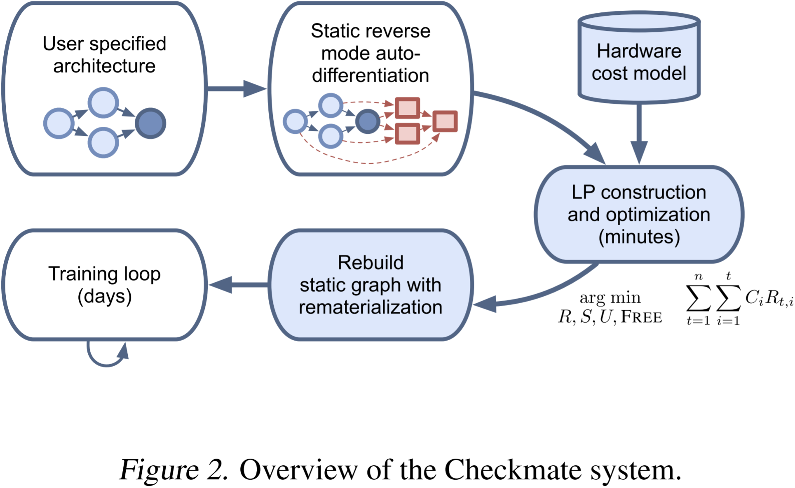

我们提取前向和反向计算图，然后使用 Gurobi 数学编程库将优化问题构建并求解为整数线性规划。最后，Checkmate 将解决方案转换为执行计划，并构建一个新的静态训练图。这些组件共同构成了 Checkmate 系统，如图 2 所示。

    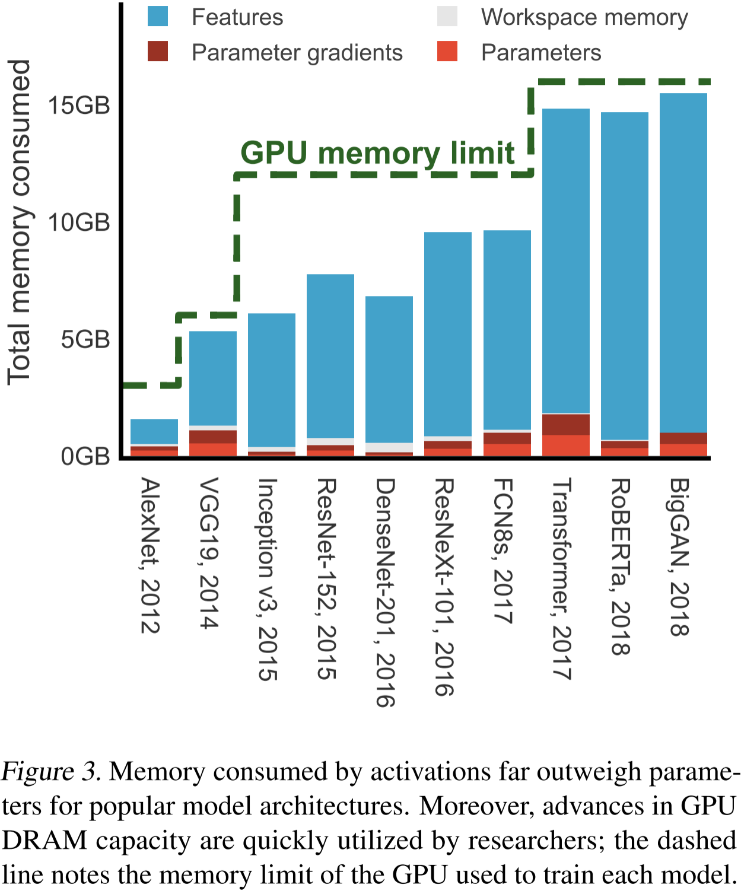

图 3. 在流行的模型架构中，**激活张量**占用的内存远远超过参数。此外，GPU DRAM 容量的提升很快被研究人员充分利用；虚线表示用于训练每个模型的 GPU 内存限制。

训练期间的内存消耗包括：
- 中间特征 (intermediate features) 或激活张量 (activations)，其**大小取决于输入维度**；
- 参数及其梯度，其**大小取决于权重维度**。

## 6) 2020_ISCA_A会_Echo: Compiler-based GPU Memory Footprint Reduction for LSTM RNN Training  

> 这个工作应该是比较早在编译器层实现重计算的，

动机：虽然特征图重计算的想法之前已被考虑，但现有解决方案未能显著减少内存占用，因为它们未能解决（1）准确估计内存占用减少和（2）非保守估计运行时间开销两个关键挑战。为了使每次特征图重计算高效，必须仔细估计其对（1）总内存占用和（2）总执行时间的影响。

总结：Echo 发现了先前工作中存在的两个关键挑战，通过计算图划分准确估计重计算的内存收益，通过数据流分析估计重计算的运行时开销。Echo 是一种基于编译器的优化方案，可以自动且透明地运行，而无需对训练源代码进行任何修改。

摘抄：

- 减少 GPU 内存占用有两个主要好处。
  - 首先是通过使用更大的训练批量来**提高训练性能（吞吐量）**，
  - 其次是允许在相同的 GPU 资源下**训练更宽和更深的模型**。
    - 尽管像 ResNet 这样的模型可能并不总是能够从减少内存占用中获得性能提升，但它们仍然**可以通过在相同的 GPU 内存预算下变得更宽和更深而间接受益**。
    - 随着深度学习模型变得越来越大，**近年来出现了即使在批量大小为 1 时也无法适应单个 GPU 的模型**。如果应用了高效的内存占用减少技术，这些模型可以变得实用。
- 我们观察到：
  - 注意力层和 RNN 层的特征图消耗了大部分 GPU 内存（特征图是在前向传播期间保存的数据条目，用于在反向传播期间计算梯度），
  - 运行时间在不同层之间分布不均（全连接层主导了运行时间，而其他层相对轻量）。

图表：

    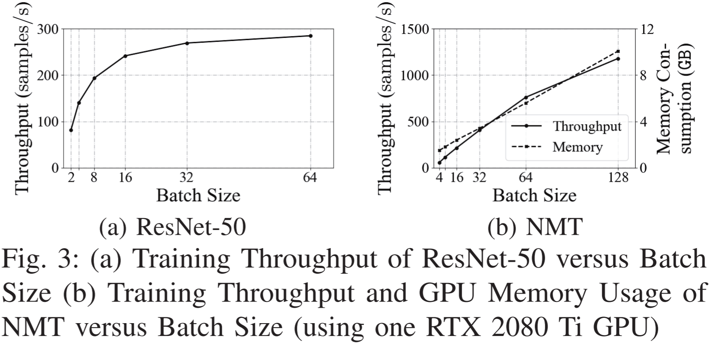

图 3. (a) ResNet-50 的训练吞吐量与批量大小的关系；(b) NMT 的训练吞吐量和 GPU 内存使用与批量大小的关系（使用一块 RTX 2080 Ti GPU）

我们比较了 ResNet-50（用于图像分类的基于 CNN 的模型）和 NMT（基于 LSTM RNN 的模型）在训练批量大小方面的训练吞吐量。

图 3a 显示了 ResNet-50 的训练吞吐量（以样本/秒为单位）与批量大小之间的相关性。我们注意到，**随着批量大小的增加，训练吞吐量趋于饱和**。我们之前关于 DNN 训练基准测试的工作表明，原因是 **GPU 计算单元几乎已被完全利用**（从批量大小为 32 开始），因此**进一步增加批量大小对训练吞吐量的好处很小**。

然而，LSTM RNN 的情况不同。图 3b 显示了 NMT 的类似图表。我们观察到，训练吞吐量随着批量大小线性增加，但当模型在现代 11 GB RTX 2080 Ti GPU 上达到 GPU 内存容量墙时，这种增加在批量大小为 128 时停止，无法进一步增加。通过比较，我们得出结论，在基于 LSTM RNN 的模型中，**性能受 GPU 内存容量的限制**，因此这证明了为什么**减少内存占用的技术可以进一步提高此类模型的训练吞吐量**。

    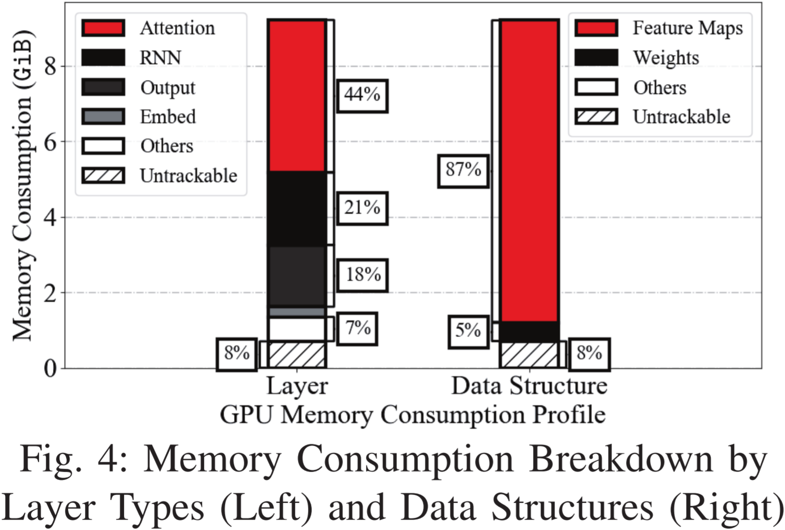

图 4：按层类型（左）和数据结构（右）分类的内存消耗细目

我们以两种正交方式对内存消耗进行分类：（1）按层类型（例如 RNN），以及（2）按数据结构。主要数据结构包括：特征图、权重和工作空间：

（1）特征图：每一层都需要为其输入和输出变量分配内存。如果这些变量中的任何一个需要在反向传播期间**计算梯度**，则它们会作为特征图持久存储在内存中，而那些不需要的变量可以释放回存储池。

（2）权重：像全连接层这样的层具有随着训练进展而优化的参数 W,B。我们使用术语“权重”作为通用术语，包括 W,B 以及它们各自的梯度和优化器状态，这些状态用于**更新权重**。

（3）工作空间是**层用于计算结果的暂存区**。当一层完成其前向或反向传播时，其工作空间（如果之前已请求）可以被释放。

## 7) 2021_ICLR_顶会_Memory Optimization for Deep Networks  

> 这个工作做个一个 A + B 的事，寻找内存高效的算子实现的同时也在寻找最佳的重计算执行计划。

动机：在训练过程中，降低深度网络内存占用的方法主要可分为两大类：基于算子级的实现优化和基于全局计算图级的优化。目前的算子级优化技术带来了内存优化，但它们并非适用于所有情况，不同的实现方式在不同架构上表现最佳。在 Checkmate 中，算子实现方式的变化会导致计算图的改变，因此无法直接进行优化。MONET 的创新之处在于能够结合这两种方法，并在给定网络下找到局部和全局优化技术的最佳组合。

总结：MONET 将内存高效的算子实现优化与计算图层面的重计算调度优化相结合，将该联合优化问题表示为 0-1 整数规划，根据内存预算使用求解器高效求解最小化计算成本的目标函数，在局部和全局范围内优化前向与反向传播实现。

图表：

    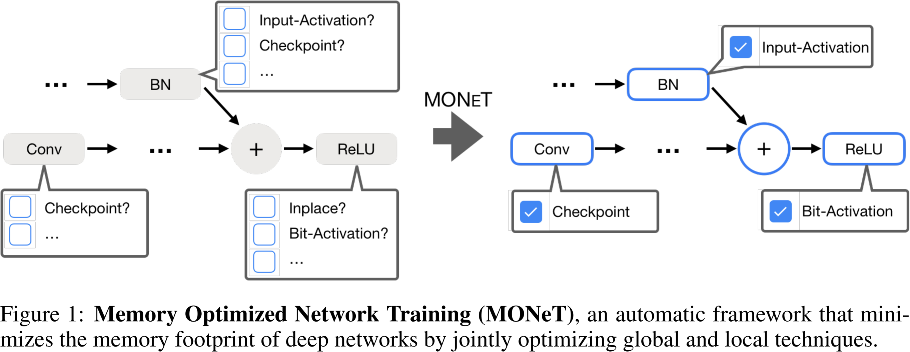

图 1：MONET，一种自动化框架，通过联合优化全局与局部技术来最小化深度网络的内存占用。

## 8) 2021_ICLR_顶会_Dynamic Tensor Rematerialization  

> DTR 是动态张量重计算的首个工作，适配 PyTorch 的动态计算图特性，是非常有影响力的工作。

动机：现有的深度学习检查点 (checkpointing) 技术在离线 (offline) 阶段静态 (statically) 规划需要重计算的激活值，这需要一个初始的模型分析阶段，并假设计算图是静态的。

总结：DTR 是一种支持动态计算图的在线重计算方法。DTR 无需提前对模型结构进行分析，其在模型训练过程中收集张量和算子的信息，在内存不足时基于启发式算法选择并驱逐最不可能很快被需要、节省内存最多、重计算开销最小的张量，并在需要时进行重计算。

> 这篇论文非常重要，笔者对原文进行了翻译，具体内容见：

## 9) 2021_CVPR_A会_Optimal Gradient Checkpoint Search for Arbitrary Computation Graphs  

> 这篇论文有一些不错的表述，但笔者觉得论文里对其核心方法的总结并不好，abstract 和 introduction 里写得太简单抽象，方法一章又有复杂的图论相关的算法，这样不方便读者掌握论文的核心思想。

动机：现有的梯度检查点（GCP，Gradient CheckPointing）方法依赖于手动指定梯度检查点（GCs，Gradient Checkpoints）或基于启发式方法在线性计算图（LCG，Linear Computation Graphs）上搜索 GC，因此无法适用于任意计算图（ACG，Arbitrary Computation Graphs）。本文提出了关于 GC 选择的理论和最优算法，首次使其适用于 ACG，并实现了最大的内存节省。

总结：该文献提出了一种面向任意计算图的最优梯度检查点搜索算法。

摘抄：
- 与需要物理升级 GPU 的解决方案不同，GCP 训练通过计算换取超出现有 GPU 硬件限制的更多内存。GCP 在前向传播过程中仅存储部分中间张量，称为 GCs。然后在反向传播过程中，通过额外的局部前向计算来补充缺失的张量。总训练内存开销等于 (1) 梯度检查点的内存开销与 (2) 局部前向计算的最大内存开销之和。为了实现最大的内存节省，需要使用最优算法选择 GC。
- 现有的解决内存问题的方法：
  - **提升单个 GPU 性能**。最新的 GPU 通过提供更大的内存容量来缓解内存限制，但代价是价格和功耗呈指数级增长。
  - 一些研究通过优化 DNN 的计算图并执行**存活性分析**来减少内存使用。DNN 的计算图描述了**不同层**之间张量的依赖关系，而存活性分析通过**回收垃圾**来管理内存。这些思想来源于**编译器优化**，并已被广泛应用于深度学习框架，如 Theano、MXNet、TensorFlow 和 CNTK。
  - **多 GPU 并行化**，这需要昂贵的计算集群，并引入了大量 I/O 开销，同时无法降低深度神经网络的总内存开销。
    - 为了缓解单个 GPU 处理器的内存压力，许多研究人员利用了成熟的**分布式计算技术**。这些技术将内存压力分散到多个 GPU 或服务器集群上，理论上可以扩展至无限数量的 GPU，但**并未真正降低 DNN 的总内存开销**。
  - **梯度检查点**，该方法通过计算换取内存，无需任何硬件升级即可降低总内存开销。需要注意的是，近年来价格相对较低的 GPU（如 RTX 2080 Ti、RTX 3080）虽然内存有限（约 11 GB），但**在 GPU 核心数和每秒浮点运算数（FLOPS）方面有显著提升**。因此，**计算换取内存成为一种极具吸引力的方案**，使得在有限 GPU 内存下训练超大规模 DNN 成为可能。
    - 主流深度学习框架（如 Pytorch 和 TensorFlow）提供了相关功能，允许用户在计算图中手动定义 GC 并进行梯度检查点训练。然而，**这些方法依赖用户手动指定 GC，其性能高度依赖于所选择的 GC**。
  - 另一些方法则通过在 CPU 和 GPU 之间高效交换数据来优化内存使用，但这些技术通常会带来额外的 I/O 时间开销，并且**仍无法真正减少总内存开销**。
- GCP 训练包括预处理和训练两个步骤。
  - 在**预处理步骤**中，运行 **GC 搜索算法**以选择 GC。
  - 在训练步骤中，首次前向传播仅存储 GC 处的张量，而在反向传播过程中，通过局部前向计算来恢复缺失的张量和梯度。
  - 与其他 GC 搜索算法类似，我们的算法专注于在预处理阶段求解最优 GC，因此**仅在训练前执行一次**。

## 10) 2022_NeurIPS_A会_Tempo: Accelerating Transformer-Based Model Training through Memory Footprint Reduction  

> 这个工作比较机械，直接重新实现了 Transformer 模型的三个算子，核心思想还是重计算，算是算子层的定制优化了。
 
动机：常规的 Checkpointing（检查点）方法通常作用范围较广，难以针对特定层进行优化，也无法利用某些推导变体来降低开销。此外，其开销可能较高（最高可达 30%）。因此，针对 Transformer 神经网络的激活内存优化仍需进一步深入研究。

总结：Tempo 是专为 Transformer 模型进行设计的重计算方法，提供了 In-place GELU、In-place LayerNorm 和 Sub-Layer Dropout Recomputation 三种可直接替换的算子实现。

摘抄：
- 训练此类模型的代价极高，不仅在时间和资金成本上巨大，还会带来较高的**碳排放**。例如，BERT-LARGE 的预训练需要 16 个 Cloud TPU（共 64 颗 TPU 芯片）运行 4 天，成本约为 $10,000。而更近期的基于 Transformer 的模型 GPT-3，其训练成本更是高达 $12 百万。因此，即使是对 Transformer 模型的**端到端训练时间**进行微小的优化，也具有重要意义。
- 基于 Transformer 的模型存在的一个核心问题是受限于硬件加速器的内存容量。例如，在现代 GPU 仅 12GB 内存的情况下，即便是批量大小为 1，在训练 BERT 时若序列长度为 512，则仍无法容纳整个模型。
- 减少模型的内存占用有多方面的好处。
  - 首先，它允许使用**更大的模型**，而更大的模型往往能在下游任务中表现更佳。
  - 其次，减少内存占用可以**支持更大的批量大小**，从而更高效地利用 GPU 硬件，**提高整体吞吐量**。
- 虽然模型参数会影响内存占用，但训练过程中主要的内存消耗来自**激活特征图**。此外，大部分激活内存消耗都集中在 BERT 的 Transformer **编码器层**中。

图表：

    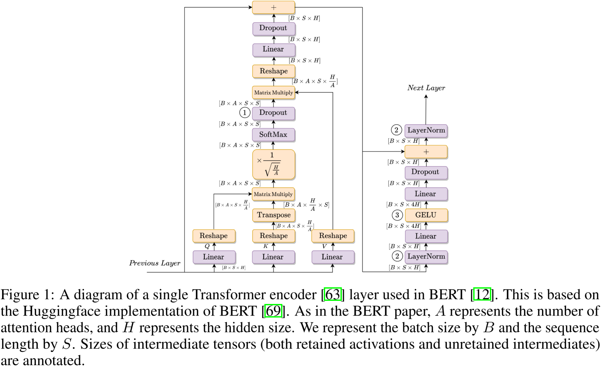

图 1：BERT 模型中单个 Transformer 编码器层的示意图。该图基于 Huggingface 的 BERT 实现。与 BERT 论文一致，$A$ 表示注意力头数，$H$ 表示隐藏层大小。此外，我们用 $B$ 表示批量大小，$S$ 表示序列长度。中间张量（包括保留的激活值和未保留的中间结果）的大小已标注。

在本研究的背景下，我们关注模型的一些关键组成部分，并分析它们在这些超参数影响下的激活内存占用情况，如图 1 所示。

    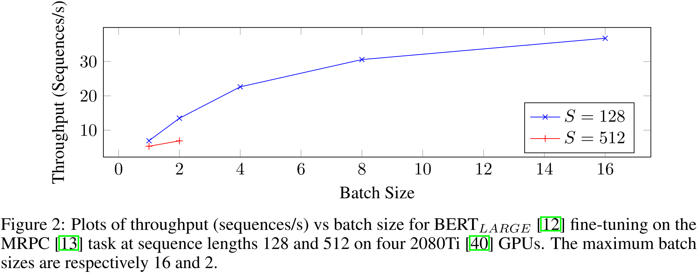

图 2：BERT-LARGE 在 MRPC 任务上的吞吐量（序列数/秒）与批量大小的关系。在四张 2080Ti GPU 上进行微调，序列长度分别为 128 和 512。最大批量大小分别为 16 和 2。

从图中可以看出，当序列长度为 128 时，批量大小稳步提升。对于序列长度为 512 的情况，这一趋势在达到 GPU 内存容量上限时突然终止，表明减少内存占用具有明显的优化空间。

## 11) 2022_MobiSys_B会_Melon: breaking the memory wall for resource-efficient on-device machine learning  

> Melon 是专门为移动设备设计的，但本质上还是一种静态离线的方法。

动机：我们的定量实验表明，云端技术难以适用于移动设备。交换技术引入了严重的同步开销，因为移动 SoC 缺乏类似服务器 GPU（如 PCIe）那样的高速 I/O 连接。在训练时进行数据压缩会显著降低模型的准确性，尤其是在联邦学习环境下。

Melon 重计算策略的动机：为了将生命周期感知内存池与重计算技术结合，Melon 面临着“先有鸡还是先有蛋”的困境。内存池需要以所有张量的生命周期作为输入，以生成张量分配方案及所需的总内存池大小。然而，重计算则是以内存池大小作为输入来进行决策，这可能会影响内存池的策略。若分别优化二者，并简单地将其中一个策略叠加在另一个之上，将导致次优性能。

总结：Melon 专门为移动设备内存优化设计。Melon 利用 DNN 训练迭代重复 (repeats iteratively) 的特性，运行一次迭代获取运行时信息，通过这些运行时信息在内存预算下生成执行计划，即张量在内存池中的布局和需要重计算的算子。具体地说，针对模型训练过程中严重的内存碎片化问题，Melon 提出了基于生命周期感知 (lifetime-aware) 的内存池，在模型训练过程中结合静态内存访问模式 (static memory access patterns) 的信息，采用贪心算法 (greedy algorithm)，将生命周期较长的张量放置在较低的内存地址，以优化整体内存布局。同时，Melon 将上述生命周期感知内存池与重计算技术结合，提出了基于内存校准 (memory-calibrated) 的渐进式 (progressive ) 重计算，在制定重计算策略时同时考虑内存池的信息，并优先释放尺寸较大、释放生命周期（从丢弃到重计算之间的时间跨度）较长且重计算时间较短的张量。

摘抄：
- 移动设备通常支持**多应用执行环境**，其中分配给每个应用或服务的硬件资源可能是**高度动态的**。
- 设备端训练框架通常会维护一个大型内存池，以管理模型权重和中间激活。然而，由于**不同的内存分配策略**和**多样的内存访问模式**，内存池的空间变得不连续，被切割成许多小块。
- 训练过程中生成的成千上万个张量的生命周期各不相同。……我们发现张量的生命周期（存活时间）对布局的优化效果有着巨大的影响。直观来看，**张量在内存池中存活的时间越长，它对其他张量的“干扰”就越大，因为它会在时间戳限定下将内存池分割成两个不相交的区域**。事实上，这种生命周期的差异性在 DNN 训练中普遍存在，并可分为两类：
  - **激活张量** 具有较长的生命周期，即在前向传播时生成，在反向传播时释放。类似于栈（stack）数据结构，它遵循“**先生成，后释放**”（FPLR，First Produce Last Release）原则，即越早生成的激活张量释放得越晚。
  - **其他临时张量** 的生命周期远短于激活张量，通常仅跨越少数甚至一个算子。
- 改进内存布局 (memory layout) 的机会在于训练过程中以 batch 级别执行的稳定内存操作。基于分析得到的内存操作信息，可以设计一个最优的布局，**以最小的内存大小完成计算**。
- **近似求解 2DSP 类问题的最优解**：解决上述内存优化问题类似于二维装箱问题（2DSP，2D Strip Packing Problem），这是一个经典的 NP-困难（NP-Hard）问题。该问题的输入包含数千个张量，使得穷尽搜索最优解变得不可行。
- $\frac{\text{TensorSize} \times \text{FreedLifetime}}{\text{RecomputationTime}}$ 用于评估重计算各张量的收益。

图表：

    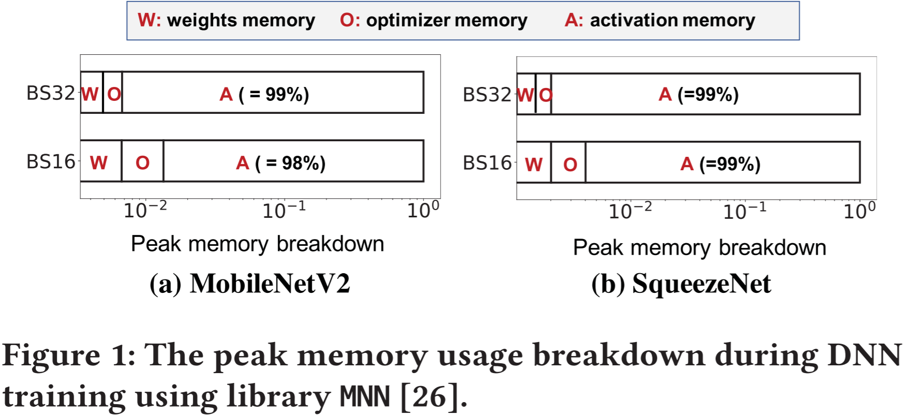

我们对 DNN 训练过程中内存使用的峰值进行了分类分析，采用的是当前最先进的设备端训练库 MNN。分析结果如图 1 所示。我们将内存使用分为三类：**权重内存**（存储参数）、**激活内存**（存储中间输出）和**优化器内存**（存储梯度）。结果显示，**激活内存通常占据整体内存消耗的主导地位，并且与批量大小呈线性增长**。这一发现启示我们，在设备端学习过程中优化这一部分内存是至关重要的。

    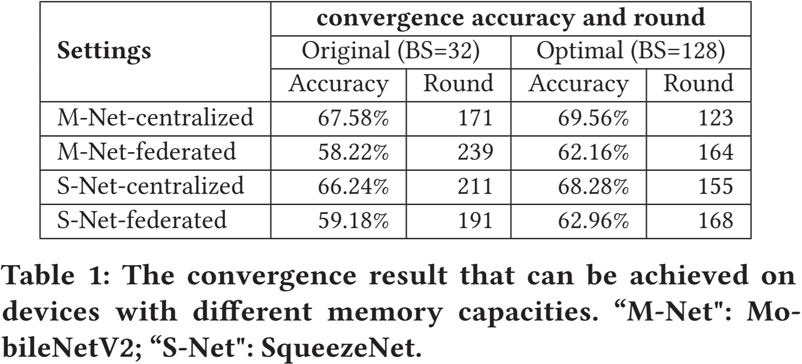

表 1. 在具有不同内存容量的设备上可达到的收敛结果。“M-Net”指 MobileNetV2，“S-Net”指 SqueezeNet。

机器学习社区已经达成共识，即**较大的批量大小有助于稳定收敛方向**。我们的实验验证了这一观点，表明较大的批量大小对于确保**较高的准确性**和**较快的收敛速度**是必要的。例如，在联邦学习环境下，使用批量大小为 128 训练 MobileNetV2 时，收敛轮数为 164，比批量大小为 32 时快 45.73%。此外，测试准确率提高了 3.94%。类似的趋势也出现在集中式训练环境中，较大的批量大小可以提高 2% 的准确率，或缩短 39.02% 的收敛时间。

    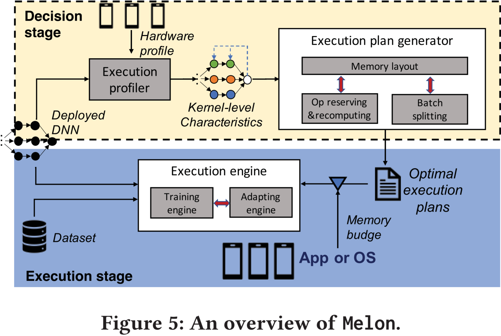

如图 5 所示，Melon 采用两阶段设计：(1) **决策阶段**，Melon 生成在不同内存预算下实现最佳性能的执行计划；(2) **执行阶段**，Melon 根据执行计划进行 DNN 训练。这种两阶段设计基于 DNN 训练过程中**张量访问模式的规律性**，这一方法已在现有研究中得到应用。值得注意的是，两个阶段均在设备端运行，且**决策阶段会在执行阶段之前自动触发**。

    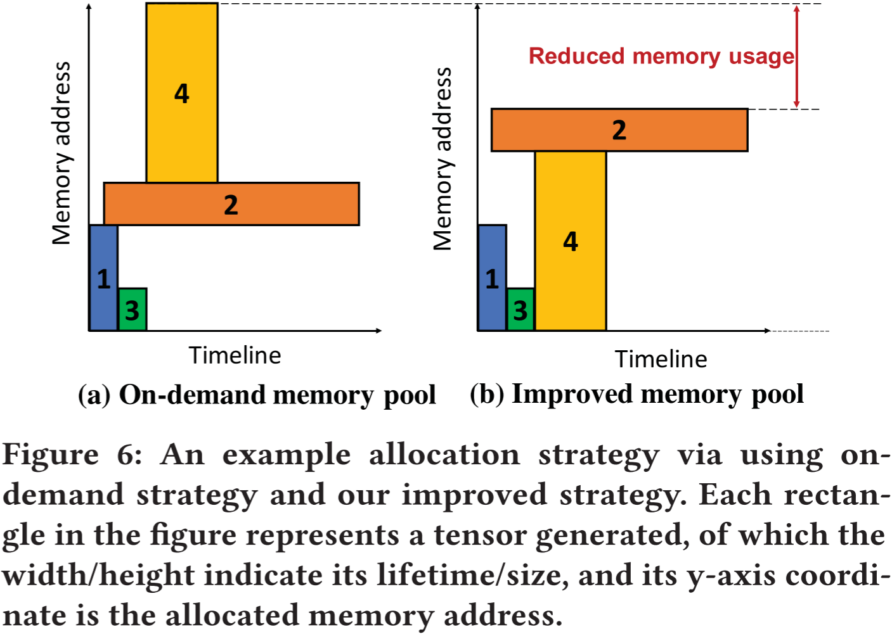

图 6. 使用按需策略与改进策略的分配示例。图中每个矩形表示一个生成的张量，其宽度/高度分别表示其生命周期/大小，y 轴坐标表示其分配的内存地址。

图 6 展示了如何通过更好的布局来节省内存的示例。在按需策略（见图 6(a)）中，张量 $T_2$ 被分配到紧邻 $T_1$ 的地址。当 $T_1$ 释放后，$T_4$ 无法放入 $T_2$ 之下的空闲内存空间，因此必须放置在 $T_2$ 之上的地址。因此，总的内存占用量是 $T_1$、$T_2$ 和 $T_4$ 之和。在优化的分配策略（见图 6(b)）中，内存占用量可以减少至 $T_2$ 和 $T_4$ 之和。

借助对每个张量的分析信息，Melon 将内存池和张量抽象为二维坐标轴和矩形，如图 6 所示。内存地址可以表示为**相对于内存池底部的偏移量**。在执行阶段，Melon 通过 malloc 函数**一次性申请所有内存空间**。在为各个张量分配内存时，Melon 仅需按照执行计划，在内存池中**为每个张量指定相应的地址**。

## 12) 2022_TACO_A刊_XEngine: Optimal Tensor Rematerialization for Neural Networks in Heterogeneous Environments  

> XEngine 这个工作很有意思，笔者最开始把它归类到重计算，是因为它实验对比的是 Checkmate，但在阅读论文时发现它是 CPU-GPU 异构环境下的工作，应该把他归类到内存交换，但 XEngine 的思想很新奇，是让 CPU 参与到重计算的过程，这时 CPU 就不止有扩大 GPU 内存的作用了。所以，笔者最后还是决定把 XEngine 归类为重计算领域的工作了。

动机：Checkmate 的重计算方法仅考虑了 GPU 设备上的计算。当 CPU 和 GPU 具有可比的性能时，将 CPU 作为第二个计算设备（不仅用于张量卸载）可能是有益的。**由于在低内存环境下计算性能通常也受到限制，因此充分利用资源至关重要**。在本工作中，我们考虑所有可用设备，并结合张量重计算、分布式计算和张量交换的思想，以获得最佳性能。即使不进行重计算，手动为不同设备分配算子仍然很困难——依赖结构可能变得相当复杂，特别是在反向传播过程中。**简单地将算子调度到计算性能最高的设备往往会因较高的复制成本而导致次优的调度方案**。

总结：XEngine 将设备间的任务分配与张量的重计算相结合，通过增加额外的约束（每个设备的计算能力、内存限制，不同设备间的内存复制成本），将 Checkmate 的混合整数线性规划 (MILP) 扩展到 CPU-GPU 等异构系统的多设备计算，利用混合整数二次规划（MIQP）寻找异构系统上的最优重计算调度方案。

方案：我们首先在所有设备上运行网络算子，以获取所有相关信息，随后获取所有张量在设备间的复制成本。基于这一简单的成本模型，我们构建 MIQP 并求解。求解结果被转换为详细的计划，包括算子的计算、输出张量的保存或释放。由于我们在训练前测量了所有算子和网络的复制成本，因此无法适应在线变化（如在训练过程中添加或移除资源）。所有信息必须在编译时已知。我们**仅支持静态计算图**，而不考虑动态计算图架构。

摘抄：
- 对于静态计算图，离线 (offline) 方法已足够，而在线 (online) 方法只会引入额外的开销。而对于**动态计算图**应用，由于**计算图会随输入数据的变化而在迭代过程中改变**，因此**在线方法**是严格必要的，因为**运行时间无法在离线阶段预先获取**。

图表：

    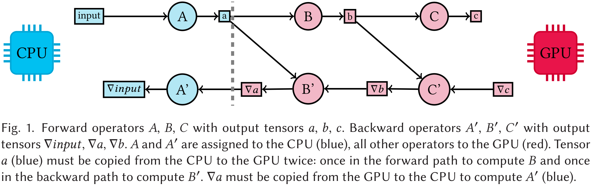

图 1。前向算子 A、B、C 及其输出张量 $a$、$b$、$c$。后向算子 A'、B'、C' 及其输出张量 $\nabla \text{input}$、$\nabla a$、$\nabla b$。算子 A 和 A' 被分配到 CPU（蓝色），所有其他算子被分配到 GPU（红色）。张量 $a$（蓝色）必须从 CPU 复制到 GPU 两次：一次用于前向计算 B，另一次用于后向计算 B'。张量 $\nabla a$ 必须从 GPU 复制到 CPU 以计算 A'（蓝色）。

图 1 展示了任务分配的情况：一个简单的示例网络，其中包含三个前向算子和三个后向算子（圆圈），被分配到 CPU 和 GPU 上。被调度到 CPU 上的算子标记为蓝色，而在 GPU 上计算的算子标记为红色。它们对应的输出张量分别用蓝色（位于 CPU 上）或红色（位于 GPU 上）的矩形表示。第一个前向算子 A 被调度到 CPU 设备，而网络前向算子 B 和 C 被调度到 GPU。它们对应的后向算子 B' 和 C' 也被调度到 GPU，而 A' 则再次放置在 CPU 设备上。**设备边界处的切换会导致张量在设备之间复制**：张量 $a$ 和 $\nabla a$ 需要在此过程中进行复制。

    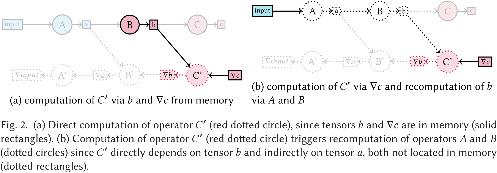

图 2 (a) 直接计算算子 C'（红色虚线圆圈），因为张量 $b$ 和 $\nabla c$ 在内存中（实线矩形）。(b) 计算算子 C'（红色虚线圆圈）会触发算子 A 和 B 的重计算（虚线圆圈），因为 C 直接依赖于张量 $b$，并且间接依赖于张量 $a$，而这两个张量均不在内存中（虚线矩形）。

图 2 展示了重计算机制：任何不在内存中的依赖张量必须被重新生成。如果张量位于另一台设备上，则可以通过在相同设备上计算来重计算该张量，或者直接复制该张量。图中，存储在内存中的算子和张量以实线表示，而虚线表示该算子或张量不在内存中。在该示例中，图示时刻为在 GPU 上计算算子 C'（红色虚线标记）以生成输出张量 $\nabla b$（红色虚线标记）。

图 2(a) 展示了无重计算的情况：算子 C' 的所有直接依赖项（张量 $\nabla c$ 和 $b$）均在内存中（实线圆圈）。因此，无需进行重计算。由于张量 $b$ 已经位于 GPU 上，因此无需从 CPU 复制，可直接用于计算 C'。

图 2(b) 展示了张量 $b$ 不在内存中的情况（虚线圆圈）。它可能在前向算子 C 计算完成后被释放。由于 C' 直接依赖于 $b$，必须在计算 C' 之前重新计算算子 B。而 B 依赖于张量 $a$，该张量同样不在内存中，因此也必须被重新生成。张量 $b$ 可以从输入张量（蓝色）开始重计算，该输入张量存储在 CPU 内存中。在计算 C' 之前，必须在 CPU 或 GPU 上重新计算算子 A 和 B，同时**需要考虑计算成本和潜在设备切换所带来的复制成本**。

## 13) 2023_IPDPS_B会_Exploiting Input Tensor Dynamics in Activation Checkpointing for Efficient Training on GPU  

> 最初，笔者还是觉得该工作 Mimose 属于一种离线方案，或者是一种半在线的运行时方案，因为 Mimose 的思路和 Melon 有些像。Melon 是提前进行决策并在运行时执行保存在本地的计划，Melon 明显是一种离线方案。但 Mimose 论文的实验部分有句话：“数据收集器在训练周期的前几次迭代中重新计算所有模块，以获取逐层的内存使用情况。在后续迭代中，Mimose 通过估计模型预测内存使用情况，从而避免冗余的重新计算。” 所以，Mimose 的方案倒是也可以算作一种在线方案，只是前几次迭代在收集数据，整个训练过程还是完整连续的。

动机：尽管已有多种张量检查点（checkpointing）技术被提出，以在受限的 GPU 内存预算下实现训练，但由于数据集的多样性及后续数据增强，训练过程中会出现激活张量尺寸的动态变化，这将导致模型训练过程中 GPU 内存占用的变化。然而，现有的检查点规划器难以利用这一输入动态特性来提高训练性能，同时又避免 GPU 内存超额分配。为了充分利用输入动态性，检查点规划应在运行时根据输入动态调整，并将其实时应用于训练过程中，以进一步提高训练性能。

总结：Mimose 利用模型训练前几次迭代获取的信息，在训练过程中构建了一个轻量级但准确的内存预测模型，并根据当前输入张量的预测内存使用情况动态生成/调整重计算规划。Mimose 完全在线运行，不依赖于模型的预分析或预先进行的内存规划，并能够利用全局的模型信息进行高效规划。

摘抄：
- 根据**是否需要先验的模型结构信息**，GPU 内存规划器可以进一步分为静态规划器（如 Checkmate）和动态规划器（如 DTR）。
  - 静态规划器通常采用**保守策略**，以最大输入张量为基准来避免 GPU 内存超额分配。……当输入尺寸较小且 GPU 内存充足时，静态规划器因采用针对最大输入尺寸的保守决策，导致**大量冗余计算**，从而降低训练性能。
  - 然而，动态规划器则在 GPU 内存耗尽时，基于**贪心策略**优先检查点化计算开销最低的激活张量。……动态规划器由于**缺乏关于模型结构及训练过程的全局信息**，可能**无法生成最优的检查点规划**，从而导致训练性能较低。
- 交换技术可能因 PCIe 带宽受限而产生较高的数据复制开销。特别是对于变化的输入张量，**很难通过重叠操作动态调整交换决策，以隐藏数据传输的延迟**。

图表：

    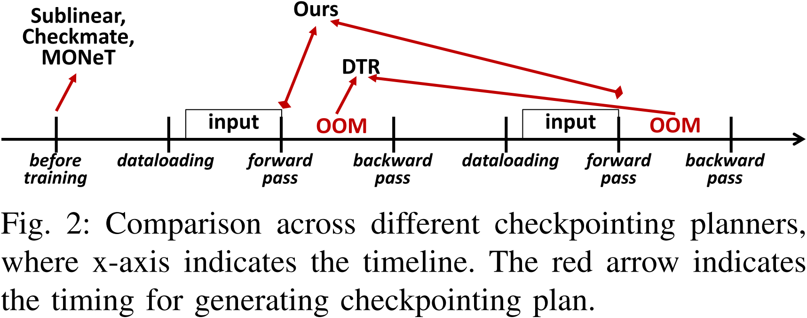

图 2：不同检查点规划器的对比，其中 x 轴表示时间线，红色箭头表示生成检查点规划的时间点。

图 2 显示了现有检查点规划器之间的主要区别，其中红色箭头表示生成检查点规划的时间点。与现有检查点规划器不同，我们的方法（即 Mimose）在每次前向传播开始时生成检查点规划，从而更好地利用输入张量的动态性。

- 静态检查点规划器在**训练前**收集模型信息并生成检查点规划。
- 而动态规划器（例如 DTR）可以通过**实时生成**检查点规划来处理输入的动态变化。其激活丢弃决策由 OOM（内存溢出）异常**按需触发**，这相比于静态规划器增加了**检查点延迟**。此外，动态规划器通常**缺乏对模型训练的全局信息**，导致较大的开销。

    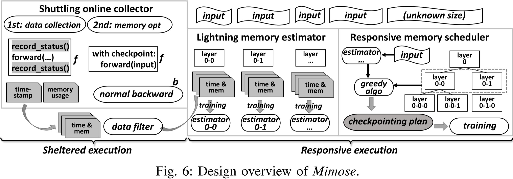

具体而言，Mimose 主要由轻量级在线数据收集器、高效内存估计器和自适应内存调度器组成，如图 6 所示。
- 轻量级在线数据收集器负责收集给定深度学习（DL）模型（如编码器、注意力模块）中各层的**内存使用情况**和**前向计算时间**。它能够在不预先分析模型的情况下进行**在线数据收集**，即使在 GPU 内存不足的情况下也能运行。  
- 高效内存估计器基于收集到的数据**构建内存预测模型**，并针对每种未知输入张量大小**估算各层的内存使用情况**。  
- 自适应内存调度器负责在估算的内存消耗和计算时间的基础上，探索**近似最优的检查点规划**，并以可忽略的开销调度激活张量。

## 14) 2023_ICML_A会_Moccasin: Efficient Tensor Rematerialization for Neural Networks  

> Moccasin 对 Checkmate 进行了改进，但遗憾的是没在深度学习框架上实现。

动机：Checkmate 将重计算问题建模为混合整数线性规划，然而，这种建模方式在扩展到大规模计算图时存在局限性，因为它需要 $O(n^2)$ 个布尔变量（其中 $n$ 为计算图中的节点数）。虽然部分研究采用线性松弛和四舍五入的方法进行近似，但我们发现这些近似解可能远非最优，从而限制了该方法的适用性。

总结：MOCCASIN 使用计算图每个节点输出张量的起始和结束事件索引来指定其保留区间 (retention intervals)，并设置超参数来限制每个节点的最大保留区间数量，从而有效控制计算复杂度。MOCCASIN 利用约束编程 (CP, Constraint Programming) 求解特定内存预算下最小化计算图执行时间的问题。与 Checkmate 需要 $O(n^2)$ 个布尔变量相比，MOCCASIN 仅需 $O(n)$ 个整数变量。

## 15) 2023_MLSys_顶会_Transcending Runtime-Memory Tradeoffs in Checkpointing by being Fusion Aware  

> 这个工作将算子融合与重计算做了个结合。

动机：现有的建模方式忽略了现代深度学习系统和硬件中的一个关键组成部分——算子融合 (operator fusion)。算子融合（或称内核融合，kernel fusion）是许多先进 DNN 执行框架（如 PyTorch 和 TVM）中的关键优化技术。它将多个 GPU 内核合并为单个 GPU 内核，从而消除内存带宽成本。在算子融合的情况下，额外的计算并不一定会导致运行时间变长。事实上，在许多情况下，当结合算子融合时，重计算甚至可能提升运行速度。

总结：该文献考虑了算子融合情况下的重计算策略，提出了一种最小割 (min-cut) 算法。

## 16) 2025_JPDC_B刊_GPU memory usage optimization for backward propagation in deep network training  

> 该工作用动态规划解决检查点 (checkpoint) 选择问题。

动机：Optimal ACG 使用与 Sublinear 内存成本方法相同的目标函数来求解最优检查点子集，但该目标函数无法准确描述 PyTorch 等先进深度学习平台的内存行为，因此该算法无法找到真正的最优检查点子集。

总结：该文献通过追踪 PyTorch 报告的内存使用情况并结合模型训练理论分析提出了一个更精确的目标函数，设计了一种时间复杂度为 $O(n)$ 的动态规划算法来求解最优检查点子集，以解决动态检查点选择 (dynamic checkpoint selection) 问题。