# 内存交换相关论文的阅读笔记

> 说明：
> 1. 内存交换 (memory swapping)，又被称为卸载 (offload) 或分页 (memory paging)；
> 2. 笔者不评价论文质量，每篇论文都有自己的侧重，笔者只记录与自己研究方向相关的内容；
> 3. 英文论文使用 DeepSeek 进行了翻译，如有翻译不准确的地方还请读者直接阅读英文原文。

## 1) 2016_MICRO_A会_vDNN: Virtualized deep neural networks for scalable, memory-efficient neural network design  

> vDNN 是内存交换领域最早的工作，而且发表的时间比 Sublinear（重计算领域最早的工作）还要早。

**动机**（为什么要做这个工作？）：

三个关键观察：
1. 基于随机梯度下降（SGD）训练的 DNN 由多个**层**组成；
2. 这些神经网络的训练涉及一系列按**层**顺序执行的计算，该顺序在整个训练过程中是**静态固定的**，并且会重复执行数百万到数十亿次；
3. 尽管 GPU 在任意时间内只能处理单个层的计算（由于 SGD 训练的层级计算特性），但流行的 ML 框架采用的是**全网络范围的内存分配策略**，因为 DNN 训练需要将所有层的中间特征图备份到 GPU 内存中以进行梯度更新。换句话说，现有的内存管理方案会**过度分配内存**，以满足整个网络所有层的使用需求，尽管 GPU 仅在**层级计算需求**中使用了其中的一部分。我们观察到，这种内存低效利用的问题在更深的网络中变得更加严重，导致 53% 至 79% 的已分配内存在任何时刻都未被使用。

**总结**（贡献、创新点、亮点）：vDNN 最早提出在 DNN 训练中用 CPU 内存来扩展 GPU 内存，将仍需被重用但暂时不需要的中间特征图 (intermediate feature maps) 卸载到 CPU 内存，并在实际使用之前预取回 GPU 内存。vDNN 主要针对特征提取层 (feature extraction layers) 的特征图进行优化，因为在卷积神经网络 (convolutional neural networks) 中这些中间数据结构占据了主要的 GPU 内存消耗。vDNN 通过线性搜索算法确定预取的最佳候选层，并通过 DNN 计算延迟隐藏卸载和预取延迟。

**摘抄**（精彩的表述和结论）：

- 为了绕过内存容量瓶颈，ML 从业者通常需要采用**次优的 DNN 结构**（例如减少层数、减小批量大小、**使用计算性能较低但内存效率更高的卷积算法**），或者将 DNN 并行化到多个 GPU 上。
- 深度神经网络（DNNs）由多种类型的层组合构成，这些层大致可分为卷积层（CONV）、激活层（ACTV）、池化层（POOL）和全连接层（FC）。一个神经网络由这些层的多个实例**按序排列**而成。特别是在计算机视觉任务中，DNNs 通常由以下两个模块组成：
  - **特征提取层**，用于检测输入图像中的可区分特征。特征提取层通常由 CONV / ACTV / POOL 层构成，并位于 DNN 的前部。
  - **分类层**，用于分析提取的特征并将图像分类到给定的类别中。分类层由 FC 层构成，并位于 DNN 计算序列的末端。
- 深度学习的总体趋势是设计具有**大量特征提取层**的网络，以训练出深层次的特征层次结构，从而实现鲁棒的图像分类。
- **特征提取层**主要由 CONV 层和 ACTV（激活）层组成，并间隔出现用于缩小特征图尺寸的 POOL（池化）层。然而，在深度神经网络中，超过 70% 至 80% 的（前向/反向）计算时间花费在 **CONV 层**上。
- 确定应卸载其特征图的最佳层是一个多维优化问题 (multi-dimensional optimization problem)，必须考虑以下因素：
  1. GPU 内存容量；
  2. 所使用的卷积算法及各层的整体内存占用情况；
  3. 整个网络的性能。
- 

**图表**（架构图、画法值得学习的）：

    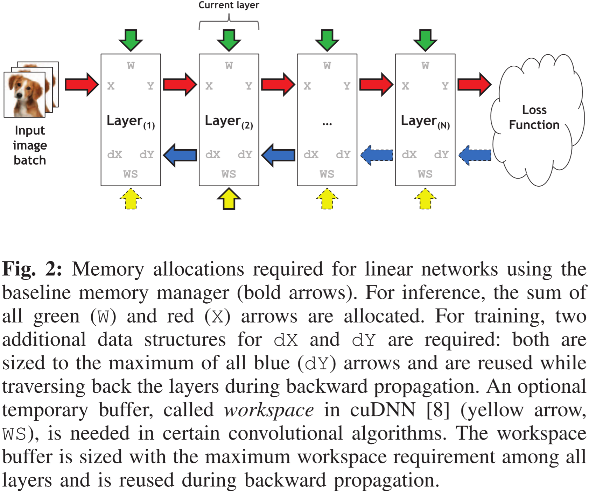

图 2：使用基线内存管理器时线性网络的内存分配情况（粗箭头）。在推理阶段，所有绿色（$W$）和红色（$X$）箭头表示的内存总量被分配。在训练阶段，额外需要两个数据结构 $dX$ 和 $dY$，它们的大小取决于所有蓝色（$dY$）箭头的最大值，并在反向传播过程中进行重用。此外，在某些卷积算法中，还需要一个可选的临时缓冲区，即 cuDNN 中称为**工作空间（workspace）**的缓冲区（黄色箭头 $WS$），其大小由所有层的最大工作空间需求决定，并在反向传播过程中进行重用。

在前向传播过程中，每一层都会对其输入特征图 $X$ 进行数学运算，并将结果存储为输出特征图 $Y$。对于线性前馈 DNN，第 $(n-1)$ 层的输出 $Y$ 直接作为第 $n$ 层的输入 $X$。因此，前向传播的计算流程是一个**串行过程**，只有当前一层 $(n-1)$ 计算完成并将其输出 $Y$ 传递给第 $n$ 层的输入 $X$ 后，第 $n$ 层才能开始计算。

在前向传播结束时，使用**损失函数**来计算推理误差的大小。具体而言，损失函数相对于最后一层 $N$ 的输出的梯度表示为 $\frac{\partial Loss}{\partial Y_{(N)}}$。该数值被传递给最后一层 $N$ 作为其输入梯度映射 $dY$，并基于链式法则计算输出梯度映射 $dX$：$\frac{\partial Loss}{\partial X_{(N)}}=\frac{\partial Loss}{\partial Y_{(N)}}\cdot\frac{\partial Y_{(N)}}{\partial X_{(N)}}$

由于输出 $dX$（$\frac{\partial Loss}{\partial X_{(N)}}$）是输入 $dY$（$\frac{\partial Loss}{\partial Y_{(N)}}$）与 $\frac{\partial Y_{(N)}}{\partial X_{(N)}}$ 的乘积，因此计算层 $N$ 的 $dX$ 通常需要存储该层的**输入/输出梯度映射**（$dY$ 和 $dX$），以及**输入/输出特征映射**（$X$ 和 $Y$）。对于线性网络，计算出的层 $N$ 的 $dX$ 会直接传递给前一层 $N-1$，作为层 $N-1$ 的 $dY$，用于计算层 $N-1$ 的 $dX$。

同样的链式法则也用于计算权重梯度，以更新网络模型。当反向传播到达第一层时，利用**权重梯度**调整权重，以降低下一次分类任务的预测误差。

    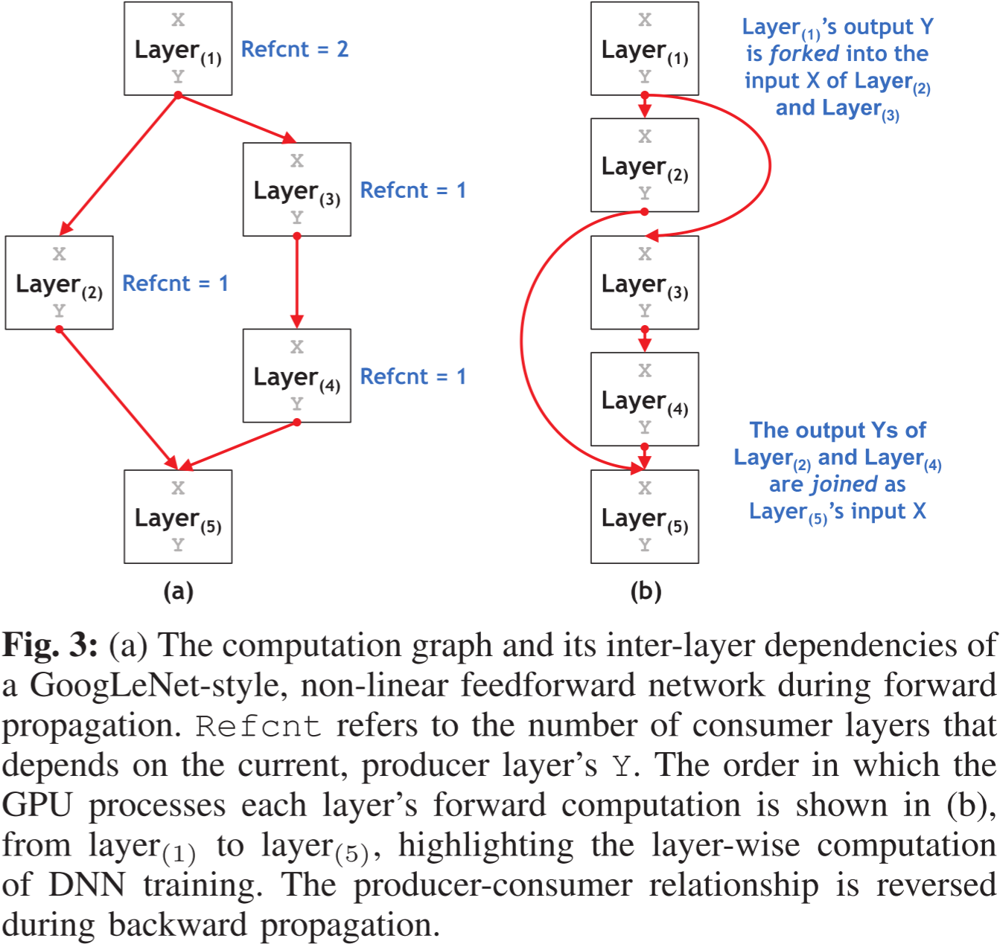

图 3：（a）在前向传播期间，类似 GoogLeNet 的非线性前馈网络的计算图及其层间依赖关系。Refcnt 表示依赖当前生产层 $Y$ 的消费者层的数量。（b）GPU 处理各层前向计算的顺序，从第 $1$ 层到第 $5$ 层，突出显示了 DNN 训练的**逐层计算**过程。在反向传播过程中，生产者-消费者关系将被反转。

非线性网络拓扑可能包含一对多（分叉）和多对一（合并）的层间依赖关系，但前向传播仍然涉及一系列逐层计算，如图 3 所示。需要注意的是，由于**层间数据依赖性**，GPU 在任何时刻只能处理**单个层的计算**。因此，每层的最小内存分配量由**该层的输入-输出关系及其数学函数决定**。

    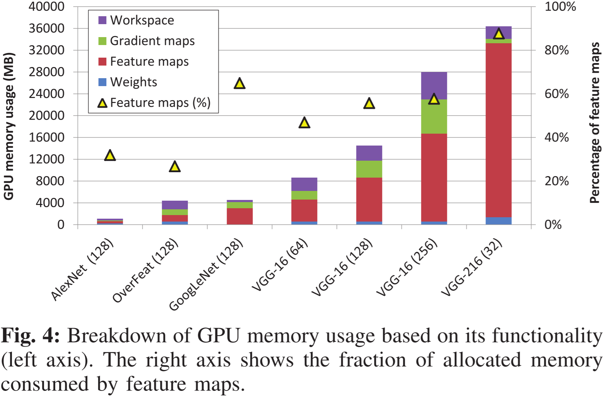

图 4：基于功能划分的 GPU 显存使用情况（左轴）。右轴显示特征映射所占的显存比例。

图 4 说明了**随着网络深度的增加，特征映射的重要性逐步提升**。由于更深的网络需要记录更多的 $X$，分配给特征映射的显存占比随着层数的增加而单调增长。

尽管此前的研究（如网络剪枝、量化、降低精度、网络压缩）可以减少 DNN 的内存需求，但它们仍存在一定局限性。首先，如图 4 所示，**在当前最先进的 DNN 中，权重仅占据内存使用的一小部分**。因此，虽然优化权重的内存使用有助于提升内存带宽利用率和能效，但对内存容量的节省有限。其次，降低计算精度可能会导致分类精度下降，除非针对特定网络和任务进行精细调整。

> 对于 CNN 类模型，模型权重占用内存的比重还比较小，作者也在文中提到 “vDNN 的思想也可以应用于权重和分类层，但相较而言，节省的显存较少。”，占用内存更多的是中间特征映射，但对于后面发展迅速的 Transformer 模型，中间特征映射占用内存的比重就没有那么大了。

    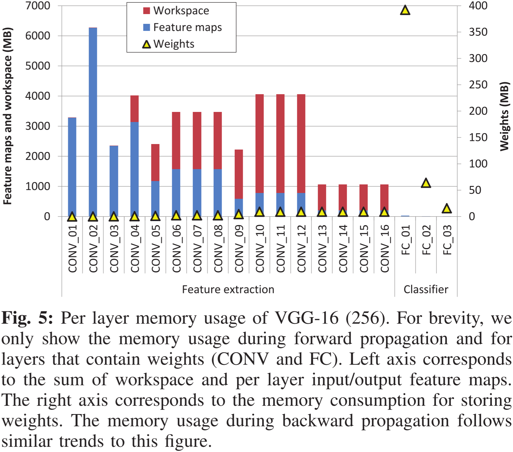

图 5：VGG-16（256）的每层显存使用情况。为了简洁起见，仅展示了前向传播期间的显存使用情况，并仅包括包含权重的层（卷积层 CONV 和全连接层 FC）。左轴对应于工作空间和每层输入/输出特征映射的总和，右轴对应于存储权重的显存消耗。反向传播期间的显存使用趋势与该图类似。

首先，**中间特征映射**和**工作空间**（左轴）的显存占用量比每层的**权重**（右轴）高出一个数量级。

其次，大部分中间数据结构集中在**特征提取层**，而在后续的分类层中占比较小。

第三，尽管权重的大小相较于这些中间数据较小，但由于全连接结构，其主要集中在**分类层**。

最后，每层的显存使用量远小于基准策略所需的 28 GB 显存，表明通过精细化的**逐层显存管理策略**可以实现显著的内存节省。

    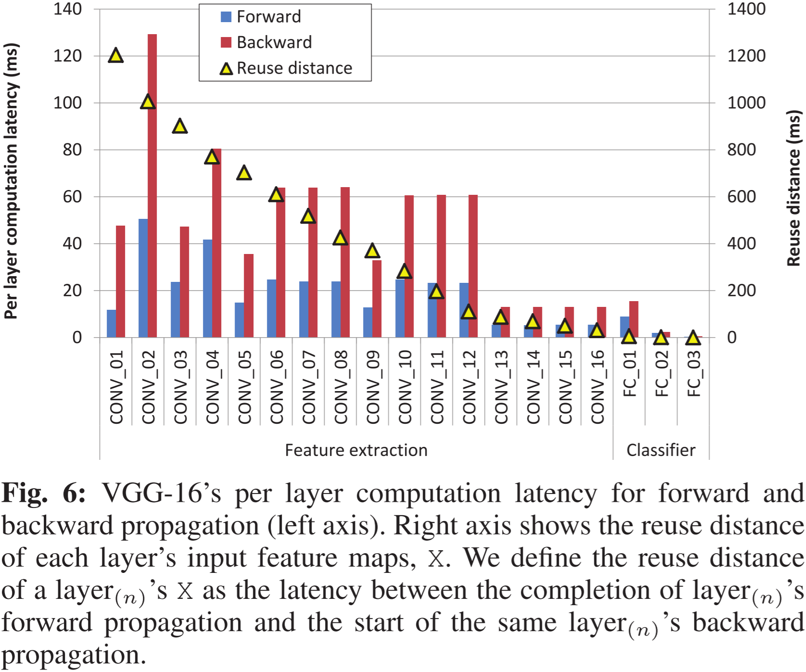

图 6：VGG-16 各层在前向和反向传播过程中的计算延迟（左轴）。右轴显示了每层输入特征映射 $X$ 的重用距离。我们将某一层 $n$ 的 $X$ 的**重用距离**定义为**该层前向传播完成到该层反向传播开始之间的延迟**。

    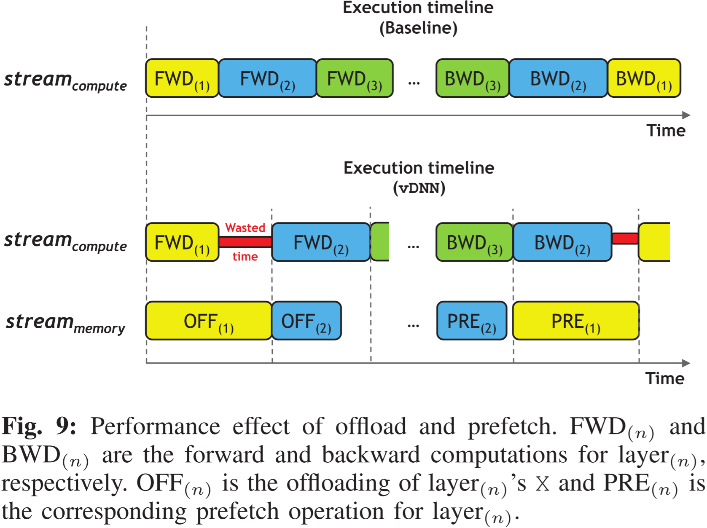

图 9：卸载与预取的性能影响。FWD(n) 和 BWD(n) 分别表示第 n 层的前向和反向计算。OFF(n) 表示第 n 层的 X **卸载**操作，而 PRE(n) 表示第 n 层的相应**预取**操作。

在 baseline 中，一旦第 1 层计算完成，就可以立即启动第 2 层的前向计算。

然而，在 vDNN 中，第 2 层的执行被阻塞，因为计算流（stream compute）必须等待存储流（stream memory）的卸载操作完成，进而阻塞了第 2 层的计算。然而，第 3 层的计算不会受到影响，因为第 2 层的卸载延迟完全隐藏在该层前向传播计算的延迟之中。

存储流（stream memory）按照与前向传播卸载操作相反的顺序启动预取操作。

## 2) 2018_HiPC_C会_OC-DNN: Exploiting Advanced Unified Memory Capabilities in CUDA 9 and Volta GPUs for Out-of-Core DNN Training  

> OC-DNN 应该是第一个用到 CUDA UM 接口技术的内存交换工作，启发了 DeepUM 和 G10 等工作。

动机：计算统一设备架构（Compute Unified Device Architecture, CUDA）是 NVIDIA GPU 的默认编程模型。统一内存 (Unified Memory (UM)) 最初在 CUDA 6 中引入，但当时尚不支持内存过量订阅 (over-subscription)。CUDA 8 进一步引入了无限制的 GPU 可访问内存（受限于 CPU 内存）、GPU 页面错误 (page faults)、页面迁移引擎 (page migration engine)、预取机制 (prefetching capability) 以避免页面错误，以及向 CUDA 驱动提供提示 (hints) 的能力，这些特性在 CUDA 9 中得到了进一步改进。NVIDIA 在 Pascal 架构中引入了包括精细粒度页面错误支持和通过 UM 接口实现的内存过量订阅在内的多项高级硬件特性。Volta GPU 进一步增强了对 UM 的支持，并通过 NVLINK 2.0 提供了更优的性能。目前尚无针对 CUDA 8/9 统一内存原语 (Unified Memory primitives) 的全面性能研究。

总结：OC-DNN 使用 CUDA 统一内存提供的新特性，如异步预取 (asynchronous prefetching)、托管页面迁移 (managed page-migration)、GPU 端缺页中断处理 (exploitation of GPU-based page faults) 以及 cudaMemAdvise 接口等，来支持超大规模深度神经网络在异构系统上的高效训练。

摘抄：

- 当数据无法容纳于可用的 GPU 内存时，这种情况被称为“外存”（Out-of-Core）。
- 相反，我们将能够适应 GPU 内存的模型和批量大小称为“可训练”（trainable）。

图表：

    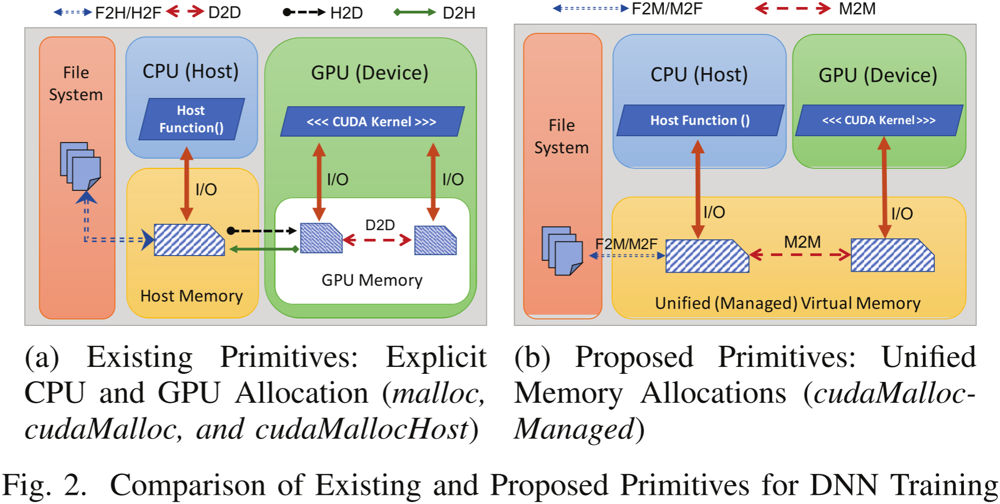

图 2. 现有 DNN 训练算子与提出的算子对比。(a) 现有基本操作：显式 CPU 和 GPU 分配（malloc、cudaMalloc 和 cudaMallocHost）。(b) 提出的新基本操作：统一内存分配（cudaMallocManaged）。

我们将 DNN 训练涉及的基本操作分类为 1) 文件访问操作 和 2) CUDA 操作。
- 我们进一步将文件访问操作划分为两个基本操作：
  - 文件系统到主机（CPU）内存（F2H）操作 
  - 主机内存到文件系统（H2F）操作。
- 同样，我们将 CUDA 操作划分如下：
  - 主机到设备（H2D）拷贝，将训练样本从 CPU 内存传输到 GPU 内存 
  - 设备到设备（D2D）拷贝，在 GPU 内存中不同 DNN 层之间传输数据 
  - CUDA 计算核（Kernels），对层数据执行计算并传递到下一层 
  - 设备到主机（D2H）内存拷贝，将训练后的 DNN 从 GPU 内存回写到 CPU 内存，以便持久化存储。

图 2a 展示了这些 CUDA 级基本操作在 DNN 训练中的应用。然而，这些基本操作不足以支持外存训练，因为它们是基于所有数据均驻留在 GPU 内存中的假设（即显式的设备分配）。

我们提出了三种新的基本操作，以支持基于托管内存 (Managed Memory) 的外存 DNN 训练——F2M、M2F 和 M2M：
- 1) 文件系统到托管内存（F2M）操作，以替代 F2H + H2D 操作 
- 2) 在托管缓冲区上的 M2M 传输，以替代 D2D 传输 
- 3) 托管内存到文件系统（M2F）操作，以替代 D2H + H2F 操作。

图 2b 展示了这些新操作的概览，并说明它们与图 2a 所示的 F2H、H2D、D2D、D2H 和 H2F 操作的不同之处。此外，图 2b 还强调了新提出的基本操作如何使 CUDA 计算核能够直接访问托管缓冲区 (managed buffers)，而无需显式通信，因为数据迁移由 CUDA 驱动透明地处理。

## 3) 2018_TPDS_A刊_moDNN: Memory Optimal Deep Neural Network Training on Graphics Processing Units  

> moDNN 做了个 A (内存交换) + B (子批量大小选择) + C (卷积算子选择) 的活。

动机：1、vDNN 的方法较为粗暴（简单地卸载所有层或所有卷积层的输出）。2、批量划分在减少内存使用方面非常高效，但现有支持批量划分的 DNN 框架通常将划分的设置交由用户决定，无法保证最佳的划分方案。

总结：moDNN 提出了一种联合优化方案，在给定的内存预算下，通过启发式方法，实现数据卸载与预取、子批量大小选择以及卷积算法选择。具体地说，moDNN 首先基于给定的 DNN 构建数据流图，通过性能分析结果，在精度、性能和降低内存需求的权衡中确定最优的子批量大小，在计算速度和内存代价的权衡中选择卷积算法，并通过优化算法生成执行时间最短的数据卸载与预取的静态调度方案。

摘抄：

- 许多研究表明，增加神经网络（NN）的规模可以显著提高 NN 结果的准确性。

## 4) 2018_TACO_A刊_Layer-Centric Memory Reuse and Data Migration for Extreme-Scale Deep Learning on Many-Core Architectures  

> Layrub 做了个 A (内存交换) + B (内存复用) 的活。

动机：由于宽深度神经网络（DNN）的各层通常是高密度的，占用大量内存，因此内存释放的问题仍然存在。在现有方案中，几乎 50% 的分配内存被浪费，从未被重复使用或回收。

总结：Layrub 是一种以层为中心 (layer-centric) 的方法，利用不同层之间计算和内存访问的特征，针对宽度网络，提出了一种层内 (intra-layer) 内存复用策略，将激活数据的内存空间作为其梯度数据的内存空间。针对深度网络，提出了一种层间 (inter-layer) 内存复用与数据迁移策略，能够在不同层的顺序操作之间复用内存空间，并在 CPU 和 GPU 内存之间迁移相关数据。

摘抄：

- 深度和宽度被几乎所有研究人员公认为构建 DNN 的两种最重要且最有效的因素。
  - 由 VGGNet 提出，并被 ResNet 继承，增加深度意味着堆叠更多功能层，这可以**减少超参数选择的复杂性**，并**提高模型的鲁棒性**。
  - 与深度相比，宽度是构建网络的另一种正交因素，它通过累积不同大小卷积所产生的特征图来**增强模型能力**。该方法由 GoogLeNet 提出，并在 WRN 和 ResNeXt 中得到发展。
  - 有研究表明，随着深度和宽度的稳步增长，DNN 模型的**准确率**可以显著提高。

## 5) 2019_ICCD_B会_AccUDNN: A GPU Memory Efficient Accelerator for Training Ultra-Deep Neural Networks  

> AccUDNN 也是个 A + B 的工作，而且和 moDNN 有点像，都同时考虑了批量大小选择和内存交换策略。

动机：在实际应用中，除了可训练性，我们还需要进一步考虑训练效率。

总结：AccUDNN 通过收集到的静态和动态信息构建性能模型（GPU 计算模型、GPU 内存使用模型和 PCIe 通信模型），接着将最优小批量大小选择建模为整数线性规划问题，并通过线性搜索算法确定效率最优的小批量大小，之后在性能约束下确定具体的换入/换出策略。

摘抄：

- 静态信息。对于给定的 DNN，在用户指定的小批量大小下，通过**对数据流图进行静态遍历**来获取相关信息。  
- 动态信息。我们使用一种无额外开销的分析阶段来收集动态信息。具体而言，在前五个训练周期（epoch）中，我们依次将小批量大小设置为最大可训练小批量大小的 $1/8$、$1/4$、$1/2$、$2/3$ 和 $1$，并采用一种朴素的换入/换出策略，而不考虑计算停滞问题。
  - 动态信息的收集是通过 nvprof 分析工具进行的。

图表：

    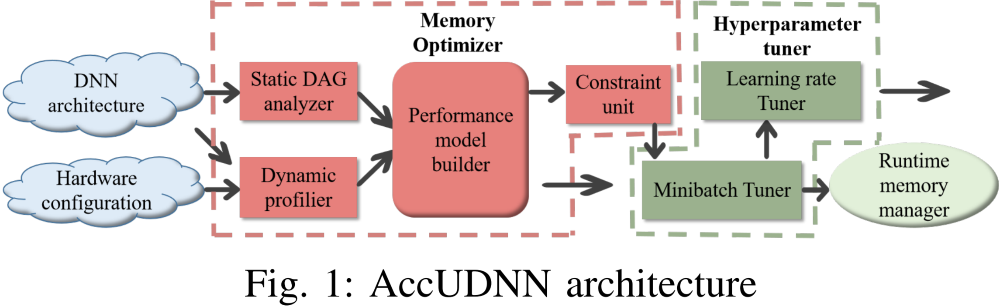

本节通过核心组件的流程概述了 AccUDNN 加速器，如图 1 所示。

- 针对给定的 DNN 和硬件配置，信息收集器首先收集建立性能模型所需的静态和动态属性。
- 通过数据拟合，性能模型构建器追踪换入/换出策略的基本运行时行为，包括 GPU 计算性能、GPU 内存使用情况和 PCIe 通信性能。
- 随后，约束单元描述了这三个子模型之间的约束关系，并提取出在我们的动态换入/换出策略下不会引发性能下降的约束条件。
- 通过将该约束与性能模型结合，超参数调节器将应用动态换入/换出策略后的训练过程转化为一个优化问题，并最终确定最佳效率的小批量大小，同时学习率也会自适应调整。一旦确定了最优小批量大小，满足性能约束的具体换入/换出策略（即换出哪些内容以及何时换出）也就随之明确。
- 最终，该具体策略被提交至运行时内存管理器进行部署和执行。

## 6) 2019_ISMM_内存领域_Automatic GPU memory management for large neural models in TensorFlow  

> LMS 是 TensorFlow 中的一个重要模块，称为大模型支持 (Large Model Support, LMS)。同时，作者还提到，LMS 是受到了阿里 17 年的《Training Deeper Models by GPU Memory Optimization on TensorFlow》的启发。

动机：尽管已经提出了许多方法，但仍然缺乏指导大规模神经模型内存消耗管理的基础理论。其结果是，将现有方法应用于不同的深度学习框架并将它们结合起来并非易事。（在文中没找到很具体的动机，可以说 LMS 这个工作算是用图重写技术对内存交换的一次尝试吧）

总结：LMS 使用分类拓扑排序 (categorized topological ordering) 来形式化深度学习框架中的计算图执行过程，利用该排序中的操作距离 (operation distances) 分析模型的内存消耗，并将训练设备上的内存优化问题转化为分类拓扑排序中减少操作距离的问题。LMS 是一种基于规则的计算图重写 (graph-rewriting) 方法，可以推导出需要添加到计算图中的内存换入和换出操作，同时还能帮助自动调优计算图重写参数，从而实现最佳性能。

摘抄：
- 计算图是深度学习中的核心概念。在 TensorFlow 中，用户定义的神经网络在内部由**由算子组成的计算图**表示。计算图中的操作随后被分配到 CPU、GPU 等设备上执行。
- 在深度学习中，计算图用于表示神经网络的计算，其中**算子**被表示为**顶点**，**数据**被表示为**边**。
- 计算图中的每个顶点都是一个算子，该算子的输入是入边上的数据，输出是出边上的数据。数据通常是**张量**，即多维数组。
- 计算图中的每条边是一个由张量和指示边类型的值组成的元组。边分为两种类型：“数据边”和“控制边”。“**数据边**”包含由操作生成的实际数据或张量，而“**控制边**”不包含数据，仅指示两个操作之间的执行顺序。

图表：

    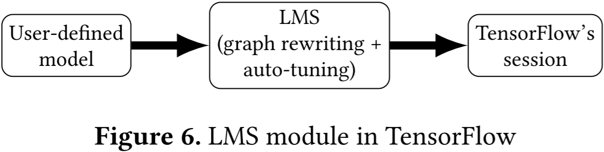

图 6 展示了 LMS 在 TensorFlow 中的位置。LMS 接收计算图，并根据提出的变换规则自动修改计算图。修改后的计算图随后由 TensorFlow 会话正常执行。LMS 具有自动调优功能，可自动搜索计算图重写参数。

## 7) 2019_IPDPS_B会_Dynamic Memory Management for GPU-Based Training of Deep Neural Networks  

> vDNN++ 是个 A (内存交换) + B (内存分配) 的工作，而且从名称缩写也能看出来，vDNN++ 是 vDNN 的增强版，对 vDNN 进行了改进。

动机：1、vDNN 在每一层的计算结束时会同步计算与数据的卸载/预取操作，也就是说，只有当计算和传输都完成后，才能继续下一层的计算。这可能会导致 GPU 需要等待卸载操作完成后才能开始下一层的计算。2、vDNN 所采用的内存卸载/预取技术会导致内存碎片化，并使峰值内存需求高于 GPU 中各层的峰值总内存占用。

总结：vDNN++ 分析发现 vDNN 的瓶颈包括计算启动延迟和 GPU 内存碎片化。针对计算启动延迟，vDNN++ 改进了异步数据传输，提出可以在不发生停滞的情况下启动层的计算，使计算无需等待卸载/预取完成。针对内存碎片化，vDNN++ 提出了一种考虑内存卸载策略的启发式方法，对于所有未被选定卸载至 CPU 的层，遵循默认的 Best-Fit 算法；对于被选定卸载至 CPU 的层（临时数据），将其分配到当前可用的最高地址处。

摘抄：

- 一种解决 GPU 内存容量瓶颈的方法是利用神经网络在训练过程中采用的**逐层计算**方式。由于 GPU 内核数量有限，在任意时刻，GPU 只能处理一层的计算。因此，在任意时刻，仅需要为**单层的参数、输入和输出**分配计算所需的空间。

图表：

    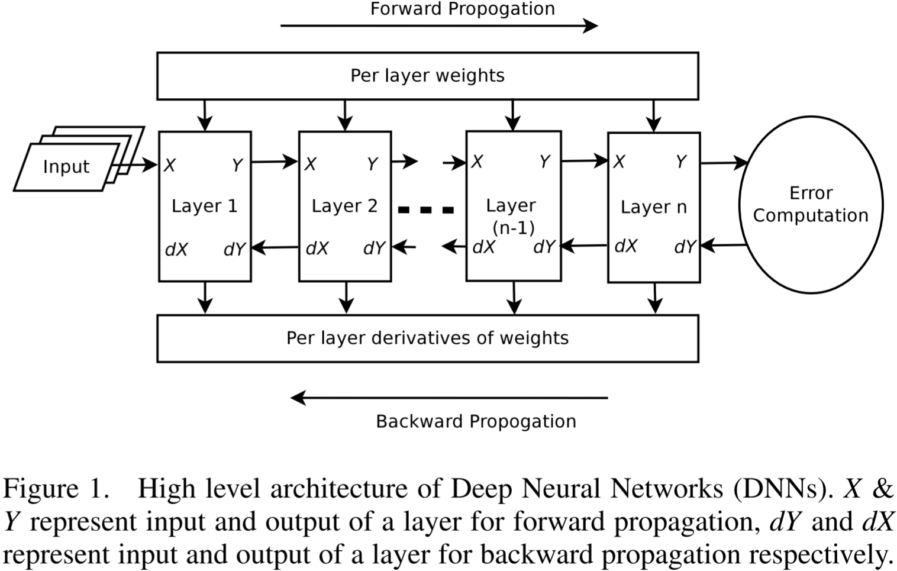

图 1. 深度神经网络的高级架构。$X$ 和 $Y$ 分别表示前向传播中某层的输入和输出，$dY$ 和 $dX$ 分别表示反向传播中某层的输入和输出。  

图 1 展示了一个由多个层组成的神经网络。训练神经网络的过程涉及学习每一层的参数 $W$（用于计算某个函数），以使每个输入对应的最终输出尽可能接近期望值。在训练过程中，每次迭代都会将一批输入数据馈送到第一层。在每一层执行前向传播（forward propagation），其中输入 $X$ 通过该层的参数 $W$ 计算得到输出 $Y$。每一层的输出作为下一层的输入，最终层的输出与期望值进行比较，以计算误差（衡量两者接近程度的指标）。误差的梯度用于更新参数，从而提高预测精度。误差关于输出的梯度被计算出来，并一直向第一层传播。在每一层执行反向传播（backward propagation），其中输入的梯度 $dX$ 和该层参数的梯度 $dW$ 通过其输入 $X$、前向传播的输出 $Y$、当前层的参数 $W$ 以及误差关于其输出的梯度 $dY$ 计算得到。误差的导数逐层传播，每一层计算得到的输入梯度 $dX$ 作为上一层的输出梯度 $dY$。上述过程会进行多次迭代，直到误差被最小化。

    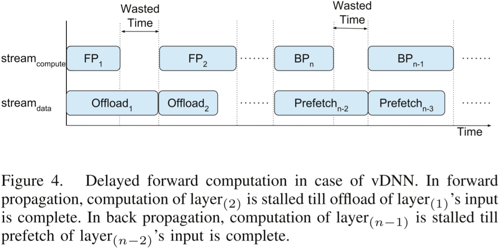

图 4. vDNN 方案下的延迟前向计算。在前向传播中，层 $(2)$ 的计算会被暂停，直到层 $(1)$ 的输入卸载完成。在反向传播中，层 $(n-1)$ 的计算会被暂停，直到层 $(n-2)$ 的输入预取完成。  

    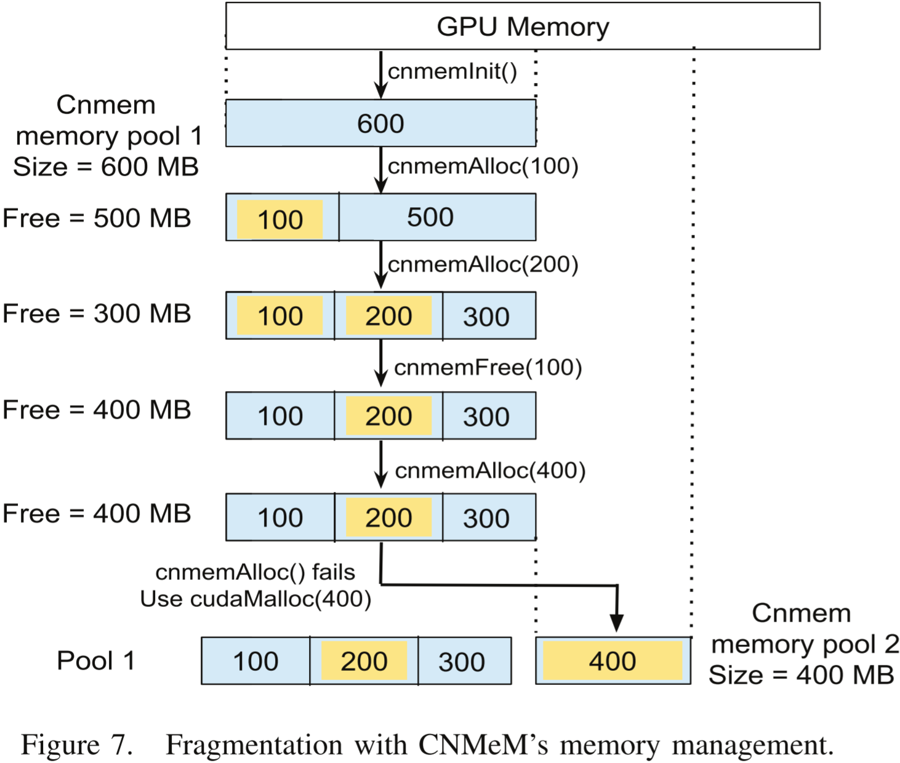

图 7. CNMeM 内存管理下的内存碎片化情况。  

vDNN 使用 CNMeM 库进行内存管理。CNMeM 通过从 GPU 预留一大块内存，然后通过 CNMeM API 将其分配给 CUDA 应用程序来运行。由于在单次训练迭代中存在大量交错的分配和释放操作（由内存卸载和预取引起），会导致内存碎片化。例如，图 7 显示了一个案例——CNMeM 最初从 GPU 获取了一个大小为 600 MB 的内存池，并随后处理一系列的分配和释放请求。当有一个 400 MB 的分配请求时，虽然总的空闲内存池大小为 400 MB，但由于碎片化，该请求仍无法满足。此时，CNMeM 从 GPU 申请了一个新的 400 MB 内存池，并用其满足该请求。

CNMeM 的另一个问题在于，如果内存池耗尽，它会使用 cudaMalloc() 申请一个大小等于所需内存的新内存池，而这个新内存池不会与旧的内存池合并，从而导致**不同内存池之间进一步碎片化**。因此，无法通过从较小的内存池开始，并允许 CNMeM 通过 cudaMalloc() 逐步增长来减少 GPU 总内存消耗。以图 7 所示的例子为例，如果两个内存池能够合并，那么只需要额外 100 MB 的内存池即可满足需求。

> vDNN++ 这里提到的减少内存碎片的想法和 PyTorch 的 CUDACachingAllocator 很像了。

    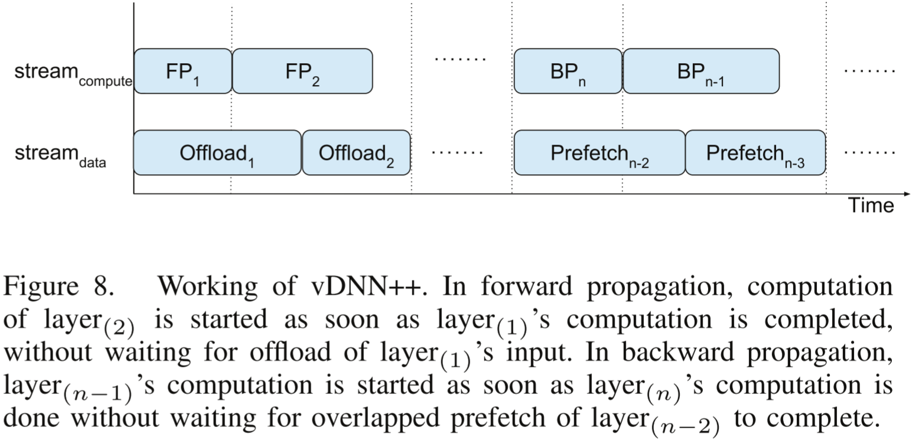

图 8. vDNN++ 的工作原理。在前向传播中，层 $(2)$ 的计算会在层 $(1)$ 的计算完成后立即启动，而无需等待层 $(1)$ 输入的卸载完成。在反向传播中，层 $(n-1)$ 的计算会在层 $(n)$ 的计算完成后立即启动，而无需等待层 $(n-2)$ 的预取操作完成。

## 8) 2019_arXiv:1903.06631_v1_Efficient Memory Management for GPU-based Deep Learning Systems  

> 一个 A (内存池分配) + B (内存交换) 的工作，而且作者在论文中明确说该工作无需依赖计算图语义或特定 DNN 的知识。

动机：常规的缓冲与分页策略在较粗的内存粒度上运行，对于变量大小变化较大的深度学习任务而言，并不能实现最佳的内存节约效果。现有的交换方法则需要大量人工干预。

总结：该文献利用深度学习训练的迭代特性，推导出所有变量的生命周期以及读/写顺序。其中，SmartPool 借助变量的生命周期，使用加权区间着色 (Weighted Interval Color, WIC) 方法解决离线动态存储分配问题，将生命周期不重叠的变量分配至相同的内存空间，以实现内存共享。AutoSwap 借助变量的读/写顺序，首先通过两个标准（过滤掉小于某个阈值的微小变量、仅考虑交换生命周期跨越峰值时刻的变量）获取用于交换的候选变量，接着使用贝叶斯优化 (Bayesian Optimization) 评估候选变量进行交换的优先级（变量的大小、变量从换出完成到换入开始的时间跨度、时间跨度在训练迭代中的位置）。

摘抄：

- 内存块的分配和释放问题已被广泛研究，并称为动态存储分配（Dynamic Storage Allocation, DSA）。DSA 是一个 NP 完全问题。根据分配语义，该问题可分为：
- 在线 DSA（online DSA），即当对象到达时必须立即分配，而**无法预知未来对象的信息**；
- 离线 DSA（offline DSA），即在分配第一个对象前就**已知所有变量的生命周期和大小**。显然，离线 DSA 提供了更多的语义信息，通常能实现更好的性能。深度学习的迭代特性使我们能够**在一次迭代中收集所有变量的生命周期和大小**，因此内存占用优化问题属于离线 DSA 问题。

图表：

    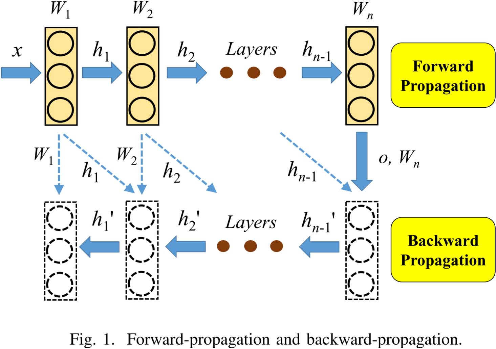

许多机器学习算法（如 DNN）具有迭代特性。用于训练 DNN 的随机梯度下降（SGD）算法通常需要成千上万次迭代（甚至更多）才能**收敛**。在每次迭代中，神经网络经历前向传播和反向传播，如图 1 所示。在此过程中，会创建、读取、更新和删除数万个不同大小的**变量**。在前向传播期间，网络计算**特征图**，即 $h_1, h_2, \dots, h_{n-1}$，在前向传播结束时计算损失，并在反向传播过程中计算梯度以更新权重。前向传播过程中计算的特征图通常会保留在 GPU 内存中，直到用于计算权重梯度。因此，前向传播期间内存占用逐渐增加，在前向传播结束时达到峰值，而在反向传播期间逐渐减少。

    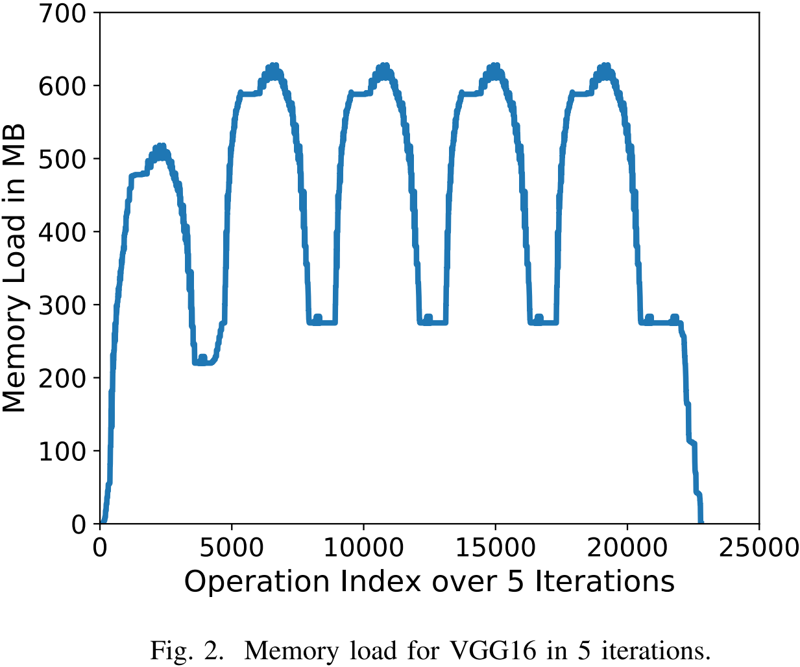

图 2 显示了 VGG 网络在 5 次迭代训练过程中的内存负载情况，其中每个操作索引对应一次 malloc / free / read / write 操作。我们观察到，除了随机神经网络外，对于大多数 DNN，变量的生命周期、大小以及读/写顺序在中间迭代（从第二次到倒数第二次）期间都保持相对稳定。这一**迭代特性**使我们能够在训练的初始迭代中收集变量的生命周期和读/写语义，并在后续迭代中优化内存管理。

    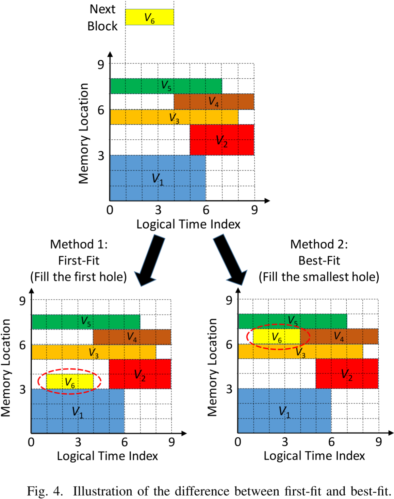

变量适配内存池的方法有两种：首次适配 (first-fit) 和 最佳适配 (best-fit)。图 4 说明了首次适配和最佳适配的区别。
- 在图中，当一个变量需要在内存池中分配时，首次适配方法会将其分配到**第一个足够容纳它的空闲区域**，
- 而最佳适配方法会将其分配到**能够容纳它的最小空闲区域**。

## 9) 2020_ASPLOS_A会_AutoTM: Automatic Tensor Movement in Heterogeneous Memory Systems using Integer Linear Programming

> AutoTM 的方法并不新，也是用整数线性规划来寻找最优解，但用上了一种新的存储设备。

动机：Intel® Optane™ DC 持久性内存模块（Persistent Memory Modules，PMM）现已上市，其单位容量价格最多比 DRAM 低 2.1 倍。这些设备位于主内存总线上，允许应用程序通过加载和存储指令直接访问，并可用作工作内存。Intel® Optane™ DC PMM 作为 NVDIMM（非易失性双列直插式内存模块）提供，是一项颠覆性技术，其读取带宽明显高于传统 SSD，而单位比特成本低于传统 DRAM。在本研究中，我们展示了如何利用这一新型存储技术，**在不显著影响性能的前提下**，将 DRAM 需求量降至最低。

总结：AutoTM 使用 Intel Optane PMM 扩展 DNN 模型的训练内存，并利用 DNN 训练计算图的静态特性，构建了一个基于整数线性规划 (Integer Linear Programming，ILP) 的数学模型，并通过剖析计算内核执行时间得到的数据，在给定的 DRAM 容量限制下，通过优化中间张量的迁移策略与存放位置来最小化计算图的全局执行时间。

摘抄：

- 主流深度学习框架（如 TensorFlow 和 nGraph）将 DNN 表示为计算图，其中计算图的每个顶点或节点代表一个**计算内核**。常见的计算内核包括卷积（CONV）、池化（POOL）、矩阵乘法以及循环单元（如 LSTM 或 GRU）。每个计算内核具有其特定的特征，例如输入数量、输出数量、计算时间和计算复杂度。计算图中计算内核之间的有向边表示**数据或控制依赖关系**。表示数据依赖的边与一个张量关联，该张量是**具有已知大小的连续内存区域**。
- 我们关注的场景是描述训练迭代的计算图是**静态的**，即计算图不包含依赖于数据的控制行为，且**所有中间数据的大小在编译时是静态已知的**。

> “计算图不包含依赖于数据的控制行为” 这句话没太理解。

图表：

    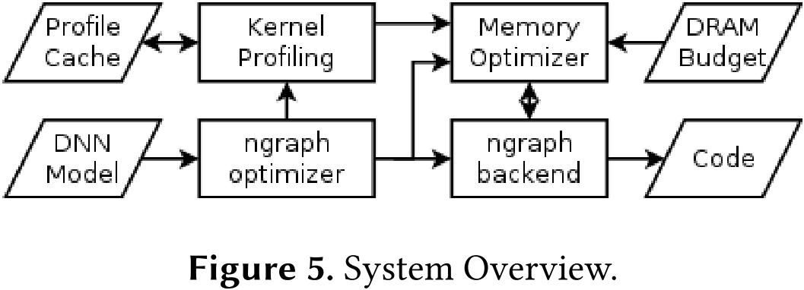

图 5 展示了所提出框架的概述。

- DNN 模型首先输入 nGraph，nGraph 根据所选的后端（如 CPU、GPU 等）优化网络的有向无环图（DAG）。作为编译过程的一部分，我们的系统会检查 nGraph DAG 数据结构，以提取以下信息：（1）计算图中节点的顺序和类型；（2）每个节点生成和消耗的张量；（3）nGraph 选择的特定计算内核。
- 随后，我们针对计算图中的每个计算内核进行剖析，通过在不同的存储池（即 DRAM 或 PMM）间变换输入和输出，记录各配置下的内核执行时间。由于此步骤可能耗时较长，而 DNN 通常包含多个相同的计算内核，我们维护了一个已剖析内核的软件缓存。这样，针对特定 DNN 的剖析仅需执行一次。
- 剖析信息和 DAG 数据随后被输入到内存优化器，与 DRAM 容量约束一起用于修改 nGraph 数据结构，进而确定张量的存储位置及数据迁移策略。
- 该系统的用户仅需提供一个 nGraph 函数，该函数由“Node”（节点）和“Tensor”（张量）数据结构组成，用于描述计算图的计算和数据流。这些函数可通过 nGraph 前端之一创建，或直接使用 C++ 编写。剖析、优化及代码生成均作为 nGraph 编译过程的一部分，且对用户透明。

## 10) 2020_ASPLOS_A会_SwapAdvisor: Pushing Deep Learning Beyond the GPU Memory Limit via Smart Swapping  

> SwapAdvisor 是首个使用进化算法（文中使用了遗传算法）来解决内存交换问题的工作。

动机：现有方法依赖于基于不同类别内存使用模式的人工启发式策略。例如，以往的研究仅交换激活张量至 CPU，而不涉及参数交换。由于缺少参数交换，现有方法无法支持参数无法容纳于 GPU 内存的大型 DNN。此外，基于人工启发式的设计无法充分优化性能，因为现代 DNN 的数据流图过于复杂，人为分析难以覆盖所有优化空间。

总结：SwapAdvisor 基于给定的 DNN 数据流图，并充分考虑了算子的调度方式和内存的分配策略，使用自定义的遗传算法 (Genetic Algorithm, GA) 搜索可能的内存分配和算子调度方案，并最终生成最优的内存交换计划，从而在执行前精确规划交换的对象及时机，实现计算与通信的最大化重叠（通过交换掉未来最长时间内不需要的张量，并尽早预取先前交换出的张量）。

摘抄：
- 深度神经网络（DNN）计算中的交换（swapping）与传统交换（即 CPU 内存与磁盘之间的交换）不同，主要区别在于 **DNN 计算结构通常在执行前已知**，例如以**数据流图**的形式存在。这种先验知识提供了极大的优化空间，使得计算与通信可以尽可能地重叠，以提升交换性能。
- 现代 DNN 已发展至包含数百层，通常以复杂的**非线性拓扑结构**组合在一起。编程框架（如 TensorFlow 和 MXNet）使用**数据流图**来表示 DNN 计算。
- DNN 的内存消耗可分为以下三类：
  1. **模型参数**：在 DNN 训练过程中，参数会在每次迭代结束时更新，并用于下一次迭代。**参数张量**的大小与 DNN 模型的“深度”（即层数）和“宽度”（即单层大小）成正比。**在大型模型中，参数占据了主要的内存使用量**。
  2. **中间结果**：包括激活 (activation)、梯度 (gradient) 和误差信号 (error) 张量，其中梯度和误差信号仅在训练过程中存在，而在推理过程中不会出现。
  3. **临时空间**：某些算子的实现（如卷积）需要临时存储空间，最多可达 1 GB。临时空间占总内存使用量的比例较小。
- 重计算利用了**激活张量**可以被重新计算的特性。尽管重计算可以用于**深层模型**和大规模输入数据，但**对于更宽的模型（即具有较大参数张量的模型），重计算无法提供有效支持**，因为**参数张量**占据了大量内存，且无法通过重计算减少内存占用。

图表：

    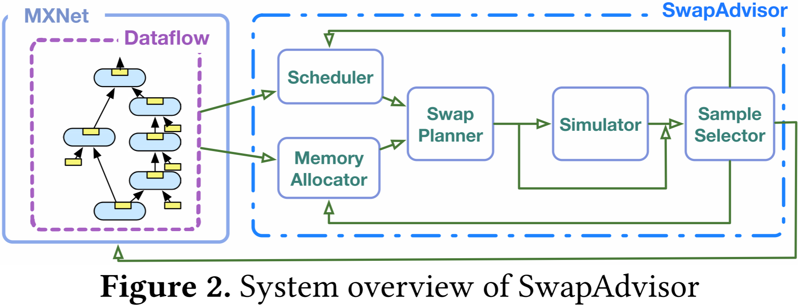

图 2 展示了 SwapAdvisor 的架构。

- 在给定数据流图的情况下，SwapAdvisor 根据数据流图选择任意一个有效的初始调度方案与内存分配方案，并将其传递至交换规划器，以决定需要交换的张量及其交换时机。
- 交换规划器的输出是一个增强型数据流图，该图额外包含换入和换出算子以及额外的控制流边 (control flow edges)。这些额外的控制流边确保最终执行顺序符合给定的调度方案，并严格遵循交换规划器所决定的交换时机。
- 在优化过程中，增强型数据流图会传递至 SwapAdvisor 的数据流模拟器，以估算整体执行时间。SwapAdvisor 基于遗传算法的搜索框架评估多种内存分配/调度组合的性能，并为交换规划器提供新的分配/调度候选方案。一旦交换计划经过充分优化，最终的增强型数据流图将交由框架进行实际执行。

## 11) 2020_HPDC_B会_Efficient GPU Memory Management for Nonlinear DNNs  

> Dymem 是一个 A (内存交换) + B (内存分配) 的工作，而且重点关注非线性网络的内存优化。

动机：1) 受到 DNN 训练遵循**逐层计算**的启发，vDNN 和 SuperNeurons 提出了跨 GPU 和 CPU 内存对深度神经网络的内存使用进行虚拟化的方法。考虑到 GPU 在任意时刻只能处理一个层，因此无需为整个神经网络在 GPU 上的内存分配进行过度配置。vDNN 和 SuperNeurons 通过利用 DNN 的**层间依赖关系**和**重用模式**，在 CPU 和 GPU 之间释放或移动数据结构，特别是中间特征图。然而，这些技术并未针对非线性网络中的依赖关系和内存变化进行优化。2) 目前的研究尚未提出有效的方法来解决**非线性网络的内存碎片化问题**（vDNN++ 提出了近似的内存池方法来减少 GPU 内存碎片化，但其应用范围仅限于线性神经网络。）。不同于线性网络具有固定的执行模式，从而导致的内存浪费较小，非线性网络表现出**多样的依赖关系**和**动态的引用模式**。结果是，这些具有不同数据大小、变化驻留时间和动态引用次数的复杂非线性块，与具有简单依赖关系的层交错在一起。我们证明了默认的内存管理会导致更高的碎片化，因为**释放的内存区域无法合并成更大的块，从而产生了空闲但不可用的空间**。

总结：Dymem 关注非线性 DNN 训练。Dymem 通过深度优先搜索 (DFS) 算法对计算图中非线性节点的依赖关系和执行顺序进行分析，并根据分析结果通过贪心算法异步卸载/预取不同类型层的输入张量，从而提高 DNN 训练的吞吐量。Dymem 提出了一种移动性分组张量 (GTBM, Group Tensors By Mobility) 的策略，根据张量的数据大小和计算图依赖关系定义张量的移动性，并按照移动性将具有相同依赖关系或相似生命周期的张量分组分配在统一内存池的同一区域，从而减少训练过程中的 GPU 内存碎片化。

摘抄：
- 在 GPU 上训练深度 DNN 时，由于内存有限，训练迭代过程中需要频繁缓存和释放张量。为避免使用原生 CUDA API（`cudaMalloc` 和 `cudaFree`）带来的非平凡分配/释放开销，**GPU 内存池**始终被用作一种有效的内存优化技术。它会**预分配**一块连续的内存作为共享内存池，并**接管操作系统的内存管理**。
- 在操作系统中，**内部碎片化**定义为：尽管总内存充足，但由于缺乏足够大的连续内存块，导致无法满足分配请求。
- 卷积（CONV）、激活（ACT）、批归一化（BN）和池化（POOL）层的内存使用占比超过 90%。然而，卸载 Dropout、Softmax 和全连接（FC）层并无太大收益，因为它们的总内存占用不足 1%。**这些层虽然占用较少的内存，但驻留时间较长，直至无更多依赖**。因此，我们需要谨慎管理这些张量的分配，否则可能会加剧碎片化问题。
- **动态神经网络**，如 RNN 和 LSTM，这类网络的**数据样本具有可变形状**，且**计算图拓扑依赖于输入或参数值**。

图表：

    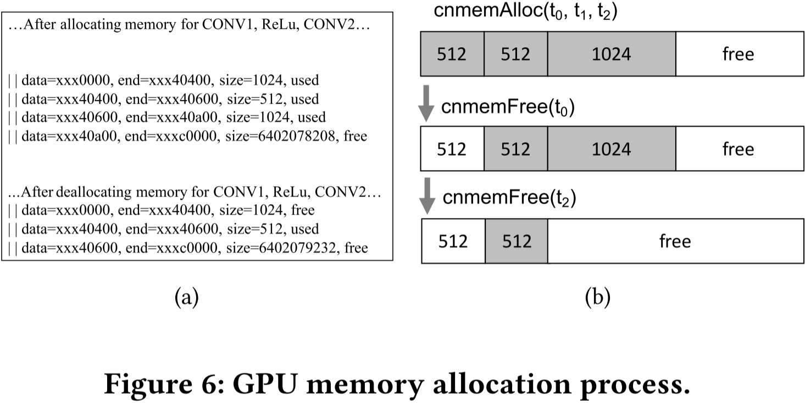

在 CNMeM 进行内存分配时（如图 6），我们在 GPU 上分配了 512MB、512MB 和 1024MB 的张量，然后释放了 `t_0` 和 `t_2`。从日志信息（图 6(a)）可以看出，合并操作可以将相邻的可用区域合并成更大的页。但由于 `t_0` 释放的区域与其他可用区域在地址上不连续，因此无法合并，如图 6(b) 所示。

    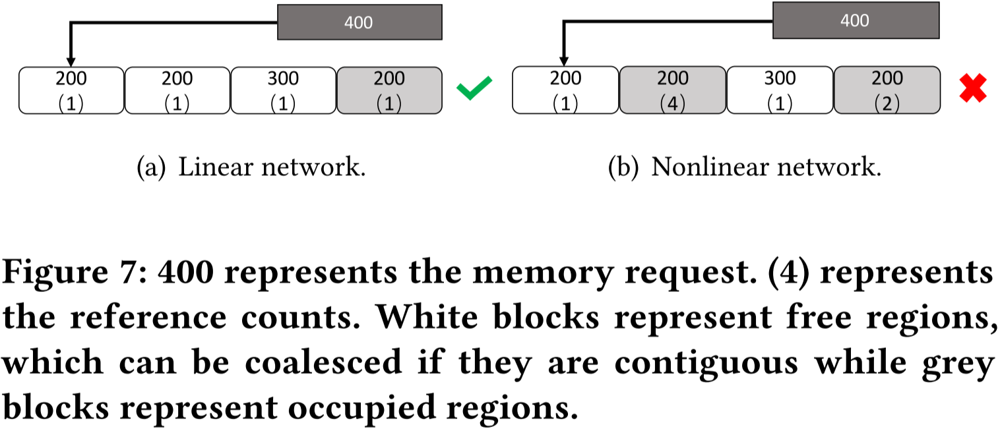

图 7：400 表示内存请求，4 表示引用计数。白色块表示空闲区域，如果它们是连续的，则可以合并；灰色块表示已占用区域。

    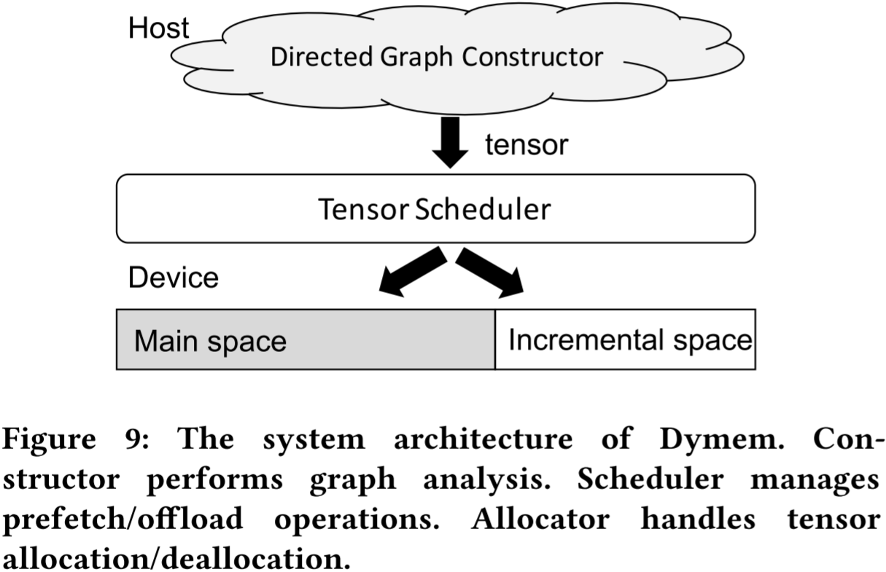

图 9：Dymem 的系统架构。构造器执行计算图分析，调度器管理预取/卸载操作，分配器处理张量的分配和释放。

    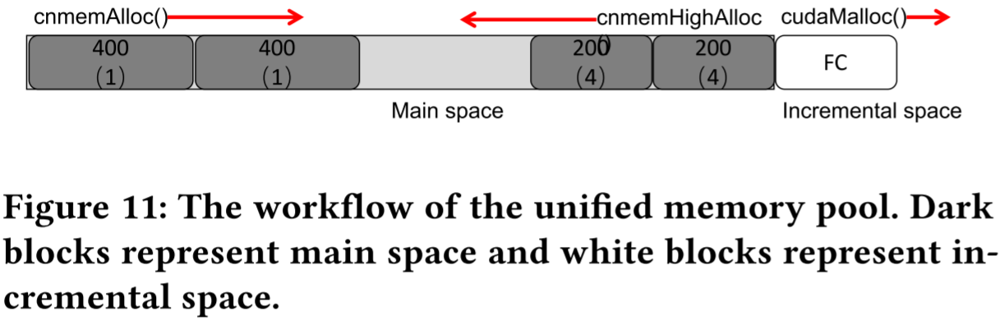

  

图 11：统一内存池的工作流程。深色块表示主空间，白色块表示增量空间。

内存管理器是一个主机端接口，作为 GPU 的后端。内存空间被划分为主空间和增量空间。

## 12) 2021_FAST_A会_FlashNeuron: SSD-Enabled Large-Batch Training of Very Deep Neural Networks  

> FlashNeuron 是第一个把 NVMe SSD 加入内存交换的工作。

动机：一种克服 GPU 内存容量瓶颈的常见方法是将数据缓存在主机 CPU 内存中。例如，vDNN 和 SuperNeurons 选择性地将激活张量卸载到 CPU 内存。然而，这些基于内存缓存的方法会**与 CPU 进程竞争内存带宽和容量**，从而付出较高的机会成本。例如，在 DNN 训练的每次迭代中在 CPU 上执行数据增强是一种常见做法，以防止训练数据集的过拟合。典型的数据增强流水线包括图像加载、解码以及一系列几何变换，这些操作需要占用大量的内存带宽。

总结：FlashNeuron 是首个使用 NVMe SSD 来扩展 GPU 内存的工作。FlashNeuron 使用引用计数机制跟踪张量的生命周期，首先通过一次完全卸载迭代收集张量相关的信息，之后通过两个阶段（线性 (linear) 张量选择和基于压缩感知 (compression-aware) 的张量选择）选择要卸载的张量，在 GPU 内存限制下使总的数据传输时间小于前向传播总的执行时间。FlashNeuron 使用了点对点直接存储访问 (Peer-to-Peer Direct Storage Access, P2P-DSA) 技术，在 GPU 和 SSD 之间直接进行张量数据传输，从而最大程度减少对 CPU 的干扰。同时，为了避免内存交换导致严重的内存碎片化，FlashNeuron 将未卸载的张量分配在内存地址空间的最低端，将已卸载的张量分配在内存地址空间的最高端。

摘抄：
- 随着对**更高准确度**的不断追求，DNN 变得**越来越宽和越来越深**，以增加网络规模。这是因为，即使仅 1% 的准确率损失（或提升），对于服务数十亿用户的 AI 应用来说，也可能影响到数百万用户的体验。（批注：作者这种提法也挺有新意的）
- GPU 内存容量壁垒往往成为 DNN 规模和吞吐量的限制因素。具体而言，如此大的内存容量需求迫使 GPU 设备只能在较小的 batch size 下运行，而**较小的 batch size 往往会对吞吐量产生不利影响**。虽然使用多 GPU 可以在一定程度上绕过内存容量壁垒，但……，**使用多个 GPU 通常会导致次优的成本效率**（即 吞吐量/系统成本），因为**每个 GPU 由于受限的 batch size 并未真正发挥其全部计算能力**。

图表：

    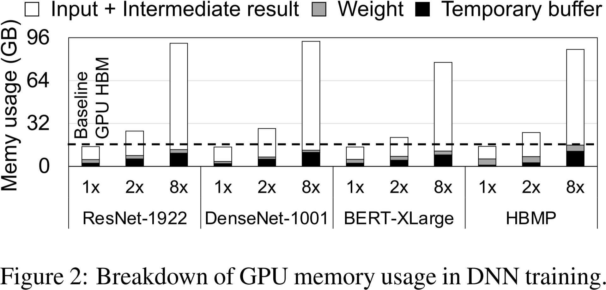

图 2 展示了不同 batch size 下 DNN 模型所需的内存容量。具体而言，该图显示了每个模型成功进行训练所需的最小内存容量。其中，1× 表示该模型在 16GB 内存的最新 GPU（如 Tesla V100）上可运行的最大 batch size，而 2× 和 8× 分别表示该模型以 2 倍和 8 倍 batch size 运行时的内存需求。该图还显示，大部分内存容量被每层的**输入数据**和**中间计算结果**占据，而权重或临时缓冲区（如用于卷积操作的临时工作空间）等其他内存对象仅占这些模型总内存消耗的一小部分。

    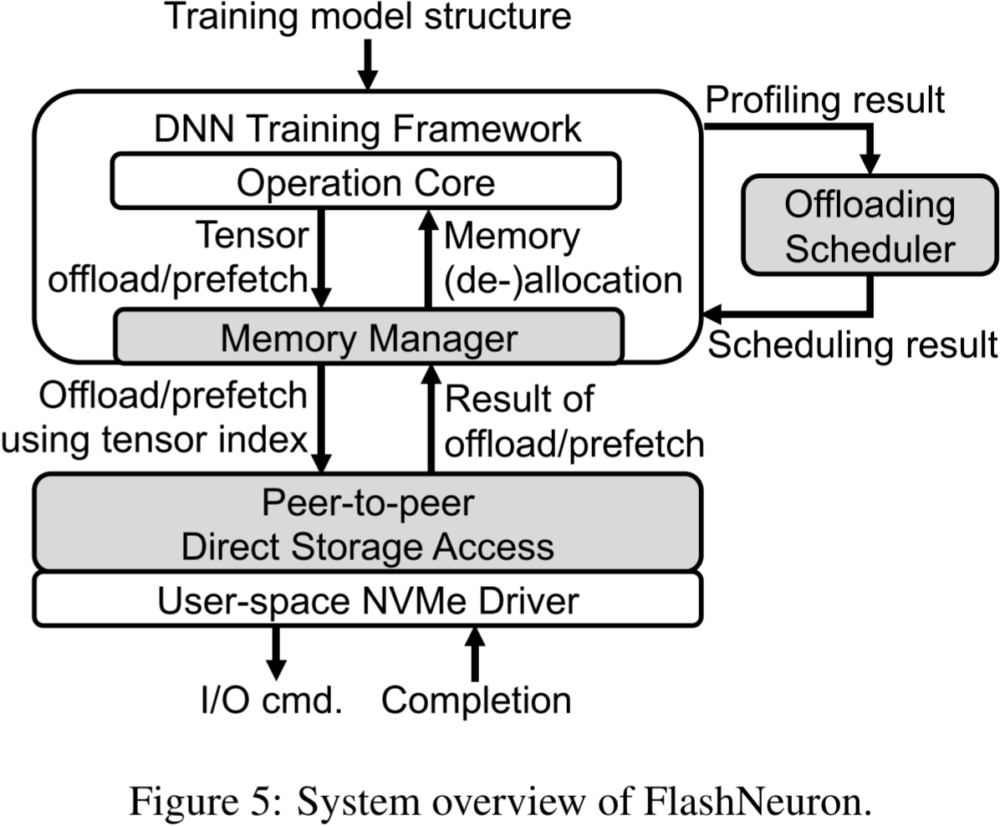

图 5 展示了 FlashNeuron 的系统概览。FlashNeuron 由三个核心组件组成：卸载调度器、内存管理器和点对点直接存储访问。具体而言，**卸载调度器**识别需要卸载的一组张量（即多维矩阵），并在考虑张量大小、传输时间以及前向/反向传播运行时等多种因素的基础上生成卸载计划。一旦确定计划，**内存管理器**便使用**点对点直接存储访问**在 GPU 内存与 SSD 之间协调数据传输，以最小化卸载带来的性能开销。

## 13) 2022_TPDS_A刊_Accelerating Tensor Swapping in GPUs With Self-Tuning Compression  

> CSwap+ 是第一个把 GPU 张量压缩与内存交换结合的工作。在 CSwap+ 之前还有 CSwap，两者的区别是 CSwap 仅对稀疏张量进行无损压缩，CSwap+ 还可以对密集张量进行有损压缩。

动机：当数据交换的延迟超过 DNN 计算的延迟时，它可能成为瓶颈。GPU 上的张量压缩可以减少数据交换时间。然而，当前的压缩方案存在三个主要问题。首先，它们需要硬件改动，因此无法移植到主流 GPU。其次，这些方案通常使用静态压缩方法对所有张量进行压缩，因此它们并不最优。第三，当前方案仅关注稀疏张量，无法适应密集张量。

总结：CSwap+ 将张量压缩与张量交换相结合，直接使用 GPU 对稀疏张量进行无损压缩，对密集张量进行有损压缩。CSwap+ 在确定是否对交换的张量进行（解）压缩时，综合考虑了（解）压缩具有的成本效益，仅在能够降低张量交换成本时才执行（解）压缩。对于稀疏张量，CSwap+ 根据 DNN 任务的张量特性，选择最优的无损压缩算法，以在压缩比和压缩时间之间取得最佳平衡。对于密集张量，CSwap+ 通过滑降 (sliding-down) 的方式设置有损压缩算法的压缩参数，使得压缩几乎不会造成训练精度损失。

摘抄：

- 由于 DNN 模型的权重存在**过参数化**问题，许多权重量化和剪枝的方法已经被提出。然而，这些方法**通常用于模型推理阶段**，并不适用于 DNN 训练任务，因为**特征图的内存占用远大于权重矩阵**。例如，在批量大小为 256 时，VGG16 训练过程中使用的特征图大小是其权重矩阵大小的 50 倍。

图表：

    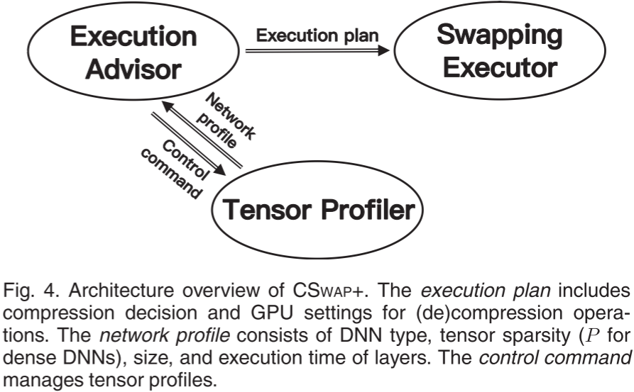

图 4：CSWAP+ 的架构概览。执行计划包括压缩决策和用于（解）压缩操作的 GPU 设置。网络配置文件包含 DNN 类型、张量稀疏度（P 代表稠密 DNN）、大小以及各层的执行时间。控制指令用于管理张量配置文件。

CSwap+ 由张量分析器、执行建议器和交换执行器三个组件组成，如图 4 所示。

- 张量分析器在新的 DNN 训练任务首次提交时执行。DNN 训练过程通常包含多个迭代。在**第一轮迭代**时，它扫描 DNN 结构以判断张量是否稀疏（即是否使用 ReLU 激活或其他激活函数），并收集不同类型张量的相关信息。
  - 对于**稀疏**张量，张量分析器收集的信息包括张量大小、张量稀疏性、不使用压缩时各 DNN 层的执行时间，以及 PCIe 链路的有效数据传输带宽。
  - 对于**密集**张量，张量分析器收集的信息与上述内容相同，但不包括张量稀疏性。
  - 此外，为了确定最终有损压缩的合适参数，它记录了不同压缩参数下的压缩比率。
- 执行建议器负责获取 DNN 分析信息，以决定**使用何种压缩算法**以及**是否对张量进行交换时的压缩**。
- 最后，交换执行器**选择合适的张量**，在从 GPU 交换到 CPU 之前利用多个 GPU 线程并行执行压缩，并在从 CPU 交换回 GPU 后执行解压缩。

## 14) 2022_TACO_A刊_An Application-oblivious Memory Scheduling System for DNN Accelerators  

> AppObMem 与之前的工作不同，而是根据运行时信息，在内存块层面去做交换决策。

动机：当前最先进的内存占用优化方案，如内存共享、重计算和基于内存交换的方法，通常**与 DNN 任务的应用特性紧密相关**。从方案设计的角度来看，这些方法通常以 DNN 任务的**层结构**或**计算图**作为输入。在其成本模型中，需要**枚举给定 DNN 的层结构或计算图中的运算符**，以确定内存调度方案。然而，DNN 发展速度惊人，每年都会提出许多新的层结构和运算符，例如 FeatherWave 提出的双门控循环单元（GRU）层，以及 AdderNet 引入的基于加法运算的卷积运算符。这些**与应用高度耦合**的方案对于**具有复杂层结构或计算图的新型 DNN** 并不友好，从而导致其**通用性较弱**。由于新 DNN 引入的**新层结构**或**非传统运算符**，这些方案通常需要重新实现或调整以适应新的需求。

总结：AppObMem 利用了 DNN 任务内存访问模式的迭代性 (regular)、规律性 (iterative) 和极值化 (extremal) 特性，无需感知 DNN 的层结构或计算图等高级信息。AppObMem 在前几轮迭代的运行时系统的内存分配器中插桩 (instrumenting)，将迭代内存访问模式的检测看作最长公共子串 (longest common substring) 问题，并通过动态规划 (dynamic programming) 算法求解，以跟踪每个设备内存块的内存行为。AppObMem 通过分析 DNN 任务先前迭代的内存访问行为自动构建经验成本模型 (empirical cost model)，以决定在适当的时间交换哪些内存块进出设备内存。

摘抄：
- 现代 DNN 任务的执行环境通常是**异构**的，其中主机 CPU 负责**任务调度**和**部分运算**（如数据预处理或后处理），而设备加速器则负责**加速计算密集型任务**（如矩阵乘法和卷积运算）。
- DNN 任务的运行环境通常是一个**异构系统**，由主机 CPU 和设备加速器组成。设备加速器通常通过**高性能总线**连接到主机 CPU，例如 GPU 的 PCIe 和 NVLink。主机 CPU 通常负责**控制任务**，例如启动内核和线程调度。设备加速器负责 DNN 相关任务的计算，例如矩阵乘法、卷积、池化和激活操作。
- **机器学习（ML）从业者的主要精力应集中于算法和模型架构设计，而非 DNN 的系统实现**。DNN 加速器的有限内存容量已成为 DNN 研究领域探索更深、更宽 DNN 以提高精度的障碍。
- 现代 DNN 通常由大量层组成，这些层按照复杂的**线性或非线性拓扑结构**组合在一起。例如，AlexNet 具有 24 层，并按照线性方式组织；ResNet50 具有 228 层，由 50 个残差块组成。这些块以非线性拓扑结构组合，其中包含多个分叉（单对多）和合并（多对一）的层结构。
- 在 DNN 任务的推理和训练过程中，DNN 通常被表示为**计算图**，其中**节点**代表基本操作 (operations)（即**算子** (operators)，例如卷积、池化、激活），而**边**表示这些操作所消耗或生成的**数据**。从**设备内存块**的存储内容来看，DNN 任务的内存消耗主要分为以下三类：
  - **输入数据**：在推理和训练过程中，输入验证样本通常以批处理方式进行处理。在设备加速器执行前，这些批量样本需要驻留在设备内存中。**输入数据的内存消耗通常与批量大小成正比**。  
  - **参数**：在前向推理阶段，参数（也称为权重）通常是只读的，其值决定了验证样本对输出的影响。在训练阶段，包括前向传播和反向传播两个过程。具体而言，在反向传播阶段，反向传播算法用于传播误差，并计算损失函数的梯度，以调整参数以提高精度。在训练阶段，参数在每次迭代结束时更新，并由下一次迭代使用。**参数的内存消耗通常与 DNN 的层数（深度）和层大小（宽度）成正比**。  
  - **中间结果**：DNN 任务通常会生成三种类型的中间结果：特征图、梯度图和工作空间。
    - **特征图**是**前向或反向传播过程中产生的中间结果**，并由后续层消耗。在前向传播过程中，输入特征图被馈送到当前层，该层按照 DNN 结构向前传播数据。每个隐藏层接受输入数据，按照激活函数进行处理，并将输出传递给下一层。在前向传播结束时，网络计算损失，并在反向传播期间计算梯度以更新权重。前向传播过程中生成的特征图通常驻留在设备内存中，直到其用于计算梯度。整体内存使用量在前向传播过程中逐渐增加。
    - **梯度图**是在**反向传播过程中生成的中间结果**，并由依赖层消耗。
    - **工作空间**是层内存储空间，用于**加速层计算**。例如，卷积算法的工作空间需要额外但临时的设备内存，以实现更好的性能。  
    - 我们观察到，对于大多数 DNN，参数仅占总内存占用的一小部分。在训练过程中，**中间结果是内存占用的主要贡献者**。
- 一种解决 DNN 任务设备内存压力而不影响计算精度的可行方法，是在 DNN 计算过程中在主机和设备内存之间交换数据。多项技术发展趋势表明，内存交换方法具有吸引力。
  - 首先，主机 CPU 的内存通常比设备内存**大得多**且**成本更低**。
  - 此外，随着 PCIe 5.0 的推出以及加速器厂商提供的高速互连总线（例如 Nvidia GPU 的 NVLink），主机 CPU 与设备加速器之间的**通信带宽已经足够高效**。
- 我们使用 CUDA SDK 示例中的 bandwidthTest 工具测量了 GPU 设备和 CPU 主机之间的**数据拷贝带宽**。

图表：

    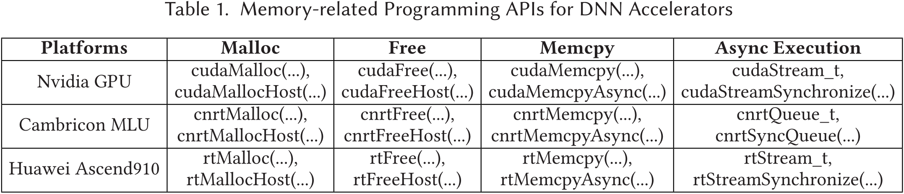

与设备内存块相关的内存访问行为可归为四种类型：
- 设备内存的分配（malloc）、
- 当前内存块的释放（free）、
- 对某些内存块的读取或写入。

在设备加速器执行之前，输入数据需要驻留在设备内存中。设备加速器的厂商通常提供一个 SDK，其中包含高级编程 API，用于**管理设备内存和执行顺序**，并**在主机 CPU 和设备加速器之间交换数据**。例如，如表 1 所示，CUDA 程序员可以使用 `cudaMalloc`/`cudaFree` 在 GPU 上分配和释放设备内存块，并使用 `cudaMemcpy` 在 CPU 和 GPU 之间交换数据。此外，厂商还提供了异步 API 以重叠 I/O 和计算，例如 `cudaStream_t`。  

    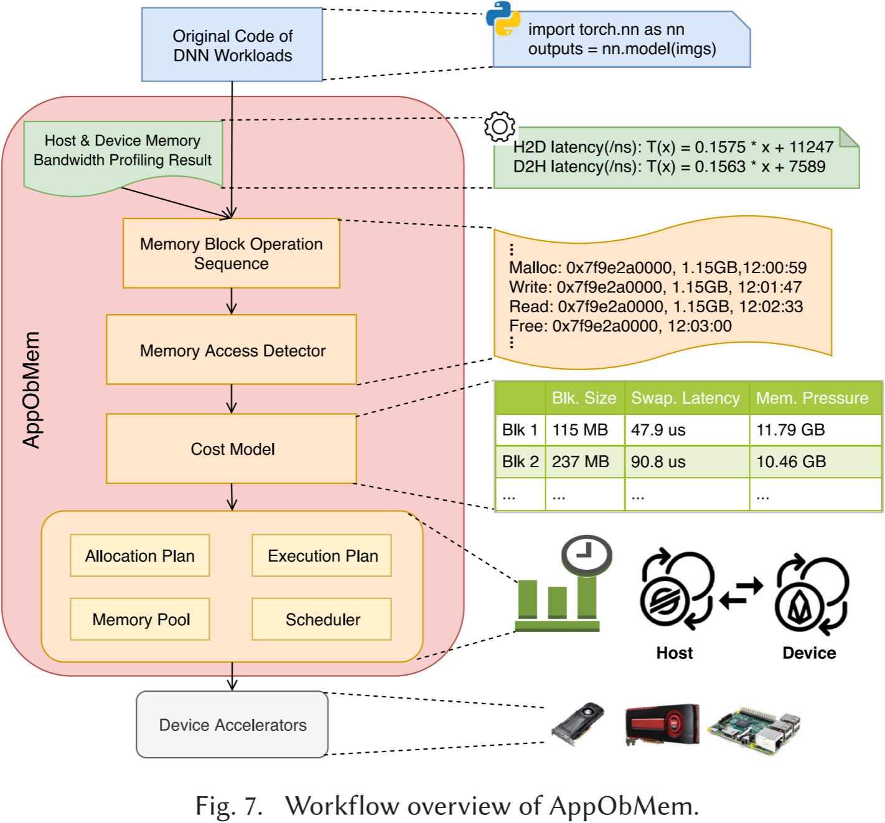

图 7 展示了 AppObMem 的工作流程。如图所示，AppObMem 对最终用户完全透明。它以主机内存和设备内存之间的带宽信息作为输入，然后通过对运行时系统的内存分配器进行自动插桩，跟踪 DNN 任务的内存行为序列（包括分配、写入、读取和释放），从而精确识别每个设备内存块的状态。考虑到 DNN 任务具有明显的迭代特性，AppObMem 仅对前几轮迭代进行插桩，以降低运行时开销。在检测到 DNN 任务的迭代内存访问模式后，AppObMem 构建了一个经验成本模型，以自动决定哪些内存块应被换出或换入。根据该成本模型的运行结果，AppObMem 生成内存分配计划和执行计划，并将其部署到 DNN 任务的后续迭代中进行调度。

插桩采集的元信息包括访问操作（可以是 malloc、free、write 或 read）、设备内存地址、内存块大小和对应的时间戳。

    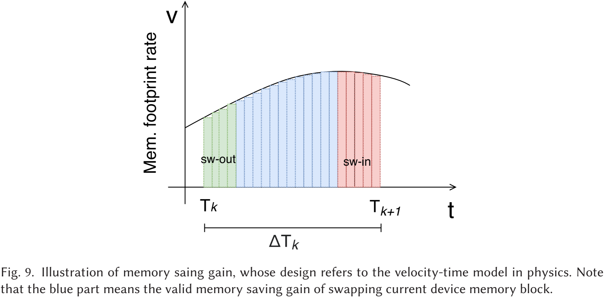

图 9：内存节省增益的示意图，其设计参考了物理学中的速度-时间模型。蓝色部分表示当前设备内存块交换所带来的有效内存节省增益。

## 15) 2022_SC_A会_STRONGHOLD: Fast and Affordable Billion-Scale Deep Learning Model Training  

> STRONGHOLD 是针对以 Transformer 为基础的 LLM 的工作，改进的是 ZeRO-Offload，卸载的是模型状态 (model states)。虽然 STRONGHOLD 自称是一个动态卸载方案，但 1）其仍需要在模型加载阶段从计算图中提取 DNN 层及其执行顺序，对于每个 DNN 层，STRONGHOLD 还会计算参数张量、相关梯度以及优化器状态所需的存储大小；2）在模型训练的前 5 次迭代（即预热阶段）中，STRONGHOLD 运行时会分析 GPU 计算时间以及每一层模型状态的数据传输时间。即使作者在论文中强调 “预热阶段的计算同样贡献于最终的训练结果，因此不会浪费计算周期。” 所以，笔者最初还是认为 STRONGHOLD 属于一种离线的方案，不是完全在线（不需要提前获取完整的信息）的一种方案。但论文中又提到 STRONGHOLD 会在“后续训练迭代中动态调整的工作窗口大小”，根据这句话，作者还是决定把它归类为一种动态、在线的方案。

> STRONGHOLD 中提到的**工作窗口** (working window) 概念最早出现在 vDNN：vDNN 采用基于滑动窗口 (sliding-window) 的逐层内存管理策略，其中运行时内存管理器从其内存池中保守地分配内存，仅供当前 GPU 处理的层即时使用。对于当前层不再需要的中间数据结构，vDNN 目标是释放其占用的内存，以减少整体内存使用量。

动机：1、大多数利用 CPU 内存的技术是为卷积神经网络（CNN）设计的，在 CNN 训练过程中，内存消耗主要由动态生成的激活（activation）占主导，而不是优化器（例如随机梯度下降，SGD）状态。然而，这些技术并不适用于最新的基于注意力机制的语言模型（例如基于 Transformer 的深度神经网络，DNN），这些模型已成为构建最先进 DNN 的事实标准。在这些模型中，**模型参数**和**优化器**（例如自适应矩估计，Adam）**状态**，而非激活内存，成为内存瓶颈。2、尽管 ZeRO-Offload (static 静态卸载框架) 和 ZeRO-Infinity 等技术可以扩展可训练模型的规模，但其代价是吞吐量显著降低，效率不佳。……现有卸载方案的低训练效率使得它们在训练大规模模型时变得不切实际，因为训练时间过长。3、STRONGHOLD 是对 ZeRO-Offload 的改进，不同的是，STRONGHOLD 并不会将所有模型参数存储在 GPU 中。

总结：STRONGHOLD 利用了 GPU、CPU 和 NVMe SSD 的多级存储。STRONGHOLD 提出了一种工作窗口机制，仅在 GPU 内存保留需要的最小数量层的模型状态。STRONGHOLD 利用预热阶段初始几次迭代运行时收集的分析信息，对 GPU 计算与数据传输进行建模，并使用解析模型 (analytical model) 来计算合适的工作窗口大小，以确保异步 CPU-GPU 数据传输能够与 GPU 计算重叠，从而隐藏数据传输延迟。STRONGHOLD 还会在后续训练迭代中动态调整工作窗口大小。

摘抄：

- 深度神经网络（DNN）的规模正在呈**指数级增长**。例如，在短短 3 年内，模型规模从 2018 年 ELMo 或 BERT 的约 1 亿个模型权重增长到 2020 年 GPT-3 的 1750 亿，再到 2021 年 MT-NLG 的 5300 亿。而同期，每代 GPU 的内存容量仅增长不到 3 倍。例如，最新的高端 NVIDIA A100 GPU 具有 80 GB 内存，相比上一代 32 GB 的 V100 仅提升了 2.5 倍。
- 由于**较大模型通常比较小模型具有更强的学习能力**，未来的 DNN 仍会集成更多参数并消耗更多 GPU 内存。这将进一步加剧 DNN 训练的内存需求与可用 GPU 内存之间的差距，**使得许多数据科学家和学术界难以进入大模型训练领域**。
- 大规模 DNN 训练可以通过多 GPU 计算资源的聚合实现，并利用并行和分布式计算。例如，数据并行、模型并行和流水线并行策略可以通过在计算设备之间分布**模型参数、梯度和优化器状态**来提高训练效率。然而，这些分布式训练方案都需要足够的计算资源，这会带来**显著的基础设施和运营成本**。例如，当前高效训练一个 100 亿参数的模型需要一套配备 16 块 NVIDIA V100 GPU 的计算系统，硬件成本超过 10 万美元。虽然这一成本对大型科技公司而言或许可以接受，但**对于小型企业和学术机构来说，却是沉重的财务负担**。
- 大规模 DNN 训练通常结合并行化技术。如果模型可以适应设备内存进行训练，**数据并行**通常用于在多个设备间分配训练样本，以提高训练吞吐量。当模型无法适应设备内存时，可以利用**模型并行**和**流水线并行**技术，将模型的层或参数划分到多个设备，以最大化内存利用率。尽管这三种并行策略可以协同工作，但**模型并行和流水线并行通常需要额外的代码重构**，以将 DNN 划分为模型组件和流水线组件。
- ZeRO-Offload 是最早尝试利用 CPU 内存训练大规模 Transformer 模型的方法之一。ZeRO-Offload 将**优化器状态**从 GPU 移动到 CPU 内存，同时保持整个模型参数存储在 GPU 内存中。……然而，由于 ZeRO-Offload **需要在 GPU 内存中存储完整的模型参数**，可训练模型的大小受限于 GPU 和 CPU 内存可用容量中较小的部分。ZeRO-Infinity 采用了一种动态策略来利用二级存储（例如 NVMe），并在异构内存层次结构中划分**模型参数**和**优化器状态**。
- DNN 训练期间的内存消耗主要来自模型状态和残差状态。**模型状态**包括模型**参数**、**梯度**和**优化器状态**（例如 Adam 优化器存储用于参数更新的动量和方差）。**残差状态**包括**激活**（即为反向传播阶段计算梯度而保存的**中间张量**）和**其他临时缓冲区**。**在大规模 DNN 训练中，模型状态占据了主要内存消耗**。例如，在使用低精度（即 16 位精度）时，模型状态可以占据高达 87.5% 的 GPU 内存。

图表：

    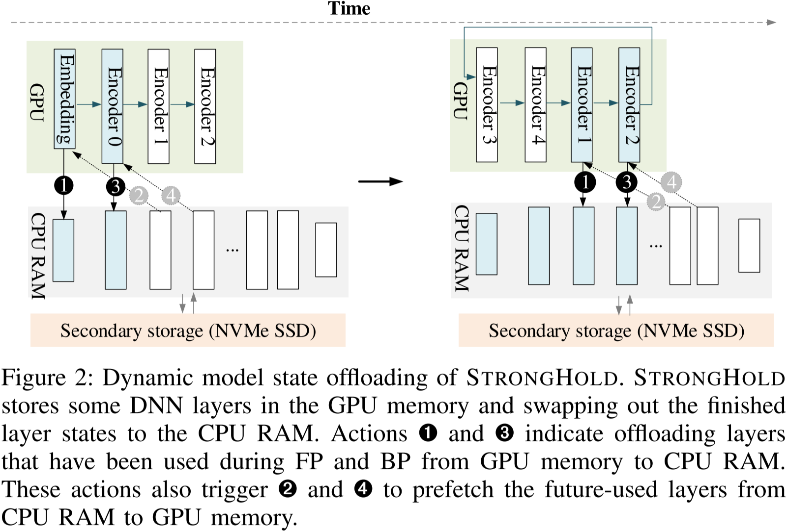

图 2：STRONGHOLD 的动态模型状态卸载。STRONGHOLD 在 GPU 内存中存储部分深度神经网络（DNN）层，并将已完成的层状态交换至 CPU 内存。操作 ➊ 和 ➌ 表示将前向传播（FP）和反向传播（BP）过程中使用过的层从 GPU 内存卸载至 CPU 内存。这些操作还会触发 ➋ 和 ➍，将即将使用的层从 CPU 内存预取到 GPU 内存。 

图 2 直观展示了 Stronghold 动态卸载方案的整体概览。该方案的核心思想是将选定 DNN 层的模型状态（参数、梯度和优化器状态）存储在 GPU 内存中。具体实现方式是管理 GPU 内部的一个工作窗口，使得层状态能够在 GPU 和 CPU 内存之间动态迁移。Stronghold 运行时将已计算的层状态（图 2 中蓝色阴影框）从 GPU 内存交换到 CPU RAM（并可能进一步交换到二级存储 NVMe SSD）。随后，它自适应地预取 FP 或 BP 计算管线中后续层的参数至工作窗口。

    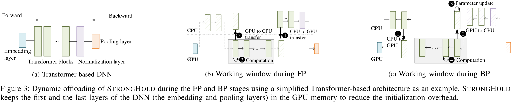

图 3：STRONGHOLD 在 FP 和 BP 阶段的动态卸载示意图，以一个简化的基于 Transformer 的架构为例。STRONGHOLD 在 GPU 内存中保留 DNN 的第一层和最后一层（嵌入层和池化层），以减少初始化开销。

从概念上讲，该机制类似于在 FP 或 BP 方向上对 DNN 模型应用**滑动窗口** (sliding window)。

## 16) 2023_ASPLOS_A会_DeepUM: Tensor Migration and Prefetching in Unified Memory  

> DeepUM 是继 OC-DNN 后又一有影响力的使用 CUDA 统一内存技术实现内存交换的工作，中间隔了 5 年，说明底层厂商（这里指 NVIDIA）提供的技术（这里指 CUDA UM）并不一定能在短期内被上层用户（包括 PyTorch 和 TensorFlow 这些主流深度学习框架）完全接受和应用（虽然在 OC-DNN 后也有不少基于 CUDA UM 实现的工作）。

动机：CUDA 统一内存 (Unified Memory, UM) 提供了一个在 CPU 和 GPU 之间共享的单一地址空间。它利用 GPU 的页错误 (page fault) 机制进行 GPU 内存超量订阅 (oversubscription)，实现按需在处理器之间迁移页面。UM 采用虚拟内存机制，每次 GPU 进行内存请求时都需要进行地址转换，这可能会严重影响性能。此外，处理页错误需要在 CPU 和 GPU 之间进行昂贵的 I/O 操作，以完成页面迁移。尽管存在上述缺点，在某些情况下，使用 UM 仍然比使用纯 GPU 内存更优。首先，当 CUDA 内核所需的总内存超过 GPU 内存容量时，纯 GPU 内存可能会导致 CUDA 内核无法运行。而在 UM 下，即使所需页面不在 GPU 内存中，CUDA 内核仍可执行，因为页错误机制会按需迁移所需的页面。因此，**UM 可以处理纯 GPU 内存无法承载的大规模 DNN**。其次，使用纯 GPU 内存可能会受到内存碎片化的影响。在训练 DNN 时，GPU 内存的分配与释放非常频繁。尽管主流深度学习框架（如 TensorFlow 或 PyTorch）会维护 GPU 内存池，以减少内存分配/释放时间并降低内存碎片化，但仍然会出现内存碎片问题。由于 UM 是一种虚拟内存，其所有内存对象都以 4KB 页面为单位进行管理，因此 **UM 受内存碎片化影响较小，更有可能顺利运行大规模 DNN 模型**。

总结：DeepUM 基于 CUDA UM 技术实现 GPU 内存超额订阅。DeepUM 使用一种改进的相关性预取 (correlation prefetching) 技术实现 GPU 页面预取操作。DeepUM 通过两个相关性表 (correlation tables) 记录 DNN 训练过程中内核执行历史及其页面访问模式，之后基于相关性表中的信息，预测即将执行的内核，并预取相应的页面。同时，为了最小化 GPU 页错误处理时间，DeepUM 一方面结合相关性预取进行页面预驱逐，另一方面在 GPU 内存中失效那些 PyTorch 预计不会再使用的页面，以减少不必要的内存传输。

摘抄：
- 由于普通用户难以获取如此昂贵的大规模高端 GPU，因此大规模深度神经网络（DNN）的研究和训练主要由大型科技公司主导。幸运的是，先使用大规模 GPU 系统从零开始训练大规模 DNN（**预训练**），然后在相对较小的系统上针对特定任务进行**微调**，可以取得良好的性能。因此，**获取一个预训练模型并在小型系统上进行微调已成为常见做法**。然而，问题在于当前最先进的 DNN 模型规模过大，**即使是微调这些模型，在小型系统上运行也十分困难，尤其是单 GPU 系统**。例如，最先进的语言模型之一 GPT-3 具有 1750 亿个参数。这些参数在 FP16 格式下存储时大约需要 326 GB 的内存空间。如此大的内存需求，即便是 NVIDIA 最新的数据中心 GPU——H100 80GB 也无法满足。
- 以往的内存交换方法可分为两类。
  - 一类使用 **CUDA 统一内存**及其**页面预取**（page prefetching）机制，
  - 另一类则使用**纯 GPU 内存**（即非 UM），并通过换入/换出方式管理内存对象。
- **通用图形处理单元计算**（GPGPU）使程序员能够在更短的时间内处理大量计算任务。这是因为数百到数千个 GPU 线程可以同时执行计算。**为了高效地管理 GPU 并将计算任务卸载到 GPU**，已经提出了多种编程模型，包括 CUDA、oneAPI、openACC 和 OpenCL。在本文中，我们专注于**由 NVIDIA 开发的 GPU 并行编程模型 CUDA**。
- 由于 **GPU 线程无法直接访问主存**，除非程序员将主存映射到 GPU 内存空间，因此程序员必须手动在 GPU 全局内存和 CPU 主存之间移动数据。此外，**对映射到 GPU 内存空间的主存的访问会导致 PCIe 传输，从而影响性能**。为此，NVIDIA 提出了**统一内存（UM）**。
  - CUDA 统一内存（Unified Memory, UM）是 CUDA 编程模型的一个组成部分。它**提供了一个单一的内存地址空间，使得同一系统中的 CPU 和 GPU 都可以访问**。从 Pascal 架构开始，NVIDIA GPU 便配备了**页迁移**引擎。这使得 GPU 可以利用**页错误**机制构建虚拟内存系统。当 GPU 访问的页面未驻留在 GPU 内存中时，GPU 会触发页错误中断信号，NVIDIA 设备驱动程序会将该页面从系统中的其他位置迁移到 GPU 内存。UM 允许 GPU 进行**内存超量使用**（oversubscription），而无需程序员进行干预。换句话说，**即使 CUDA 程序需要的内存空间大于 GPU 内存容量，也可以无缝运行**。因此，UM 极大地减轻了程序员的负担。
  - 尽管 UM 具有诸多优势，但其缺点在于 **GPU 处理页错误的开销较高**。GPU 中的每个流式多处理器（SM）都配备了转换后备缓冲（TLB）。当 GPU 发生页错误时，TLB 会被锁定，并且在所有页错误被处理完成之前，无法执行新的地址转换。此外，**页错误会导致 CPU 和 GPU 之间进行高开销的 I/O 操作，包括页面迁移和页面驱逐**。因此，强烈建议使用 CUDA **预取** API（如 `cudaMemPrefetchAsync()`）或 CUDA **用户提示** API（如 `cudaMemAdvise()`）来减少页错误的发生。
- DeepSpeed 是一个高度优化且广泛应用于多 GPU 训练的深度学习框架。它通过 Hook PyTorch API 记录 DNN 操作序列，并提供 GPU 内存交换机制，使 GPU 可以与 CPU 主存或 NVMe SSD 进行数据交换。然而，DeepSpeed 主要管理**模型参数**、**梯度**和**优化器状态**的卸载，而**不处理激活值**（activations）。因此，程序员必须手动通过激活检查点（activation checkpointing）管理激活值和临时缓冲区。这意味着**当激活值占用的内存超过 GPU 内存容量时，程序员需要修改代码以使用激活检查点技术**。

图表：

    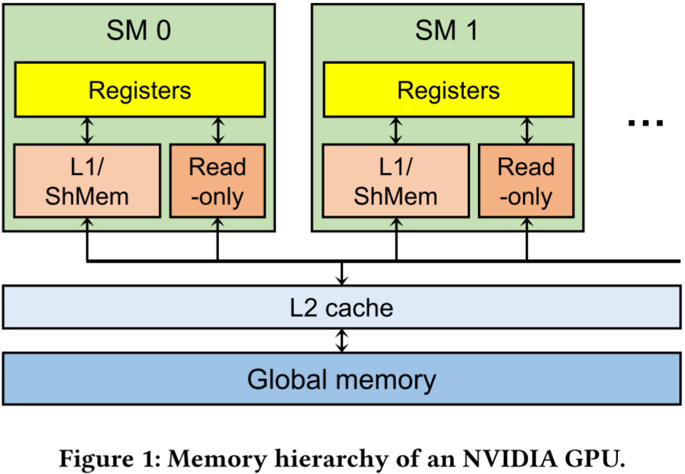

图 1 展示了 NVIDIA GPU 最新微架构的内存层次结构。GPU 由数十个流式多处理器（SM）组成。每个 SM 具有不同类型的存储单元，例如寄存器、L1 缓存、共享内存（本地存储器）和常量内存（只读内存）。其中，寄存器是线程私有的，而其他存储单元在 SM 内部共享。在 SM 之外，所有 SM 共享 L2 缓存。全局内存是片外 DRAM，通常容量为几 GB 到几十 GB。通常，离 CUDA 核心（SM）越近的存储单元，其访问延迟越低，但容量也越小。尽管 GPU 提供了几十 GB 的全局内存，但在深度神经网络（DNN）工作负载中，全局内存仍然严重不足。

    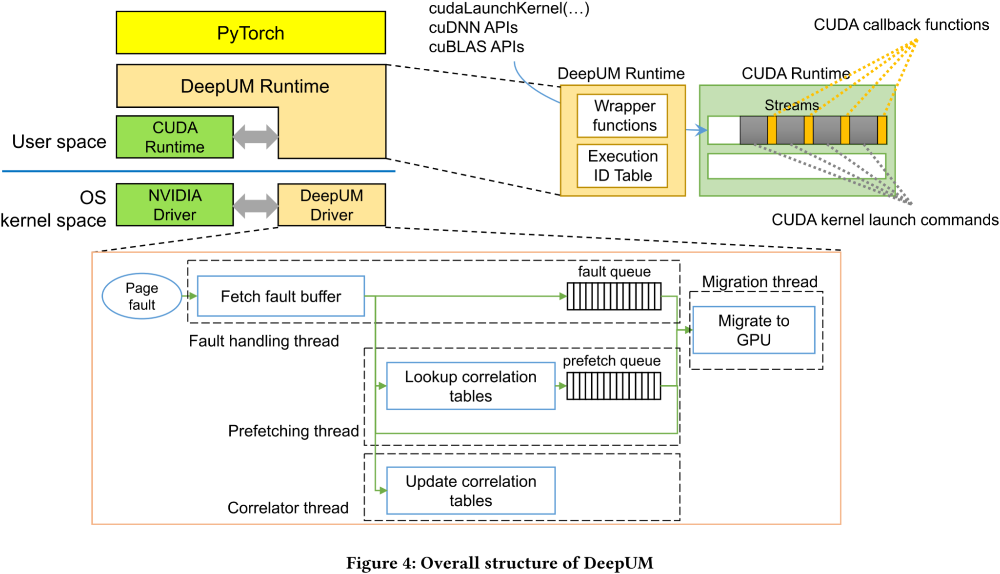

图 4 展示了 DeepUM 的整体结构。DeepUM 由 DeepUM 运行时和 DeepUM 驱动程序组成。其中，驱动程序是一个 Linux 内核模块。DeepUM 主要针对 PyTorch 这一流行的深度学习框架，并且 PyTorch 运行在 DeepUM 运行时之上。

## 17) 2023_MICRO_A会_G10: Enabling An Efficient Unified GPU Memory and Storage Architecture with Smart Tensor Migrations  

> G10 也是基于 CUDA 统一内存技术实现内存交换的工作，但 G10 同时使用了 GPU、CPU 和 SSD 内存。

动机：理想情况下，我们希望通过低成本的闪存透明地扩展 GPU 内存，同时实现与具有无限板载DRAM的GPU相似的性能。……如果我们能够智能地将不活跃的张量从快速 GPU 内存迁移到较慢的内存（即主机内存和闪存），不仅可以提高宝贵的 GPU 内存利用率，还能隐藏较慢内存的数据访问开销。

总结：G10 将 CPU 内存、GPU 内存和 SSD 集成到一个统一的内存空间中，以扩展 GPU 内存容量，同时实现透明的数据迁移。G10 利用编译器生成的执行图来获取深度学习任务中每个张量的语义知识，并使用动态算法迭代地找到最佳的张量逐出和预取执行方案。G10 尽可能地逐出长时间不活跃的大张量，从而充分利用 SSD 和 CPU 内存的可用带宽。G10 根据逐出张量的最新安全预取时间，提前预取逐出的非活跃张量。

摘抄：
- 与 GPU 内存相比，主机通常配备了更大但带宽有限的内存，因此成为扩展 GPU 内存的自然选择。虽然开发者可以手动在主机和 GPU 之间交换数据，但现代 GPU 通过**统一虚拟内存**（Unified Virtual Memory, UVM）使这一过程变得透明。UVM 使主机和 GPU 之间的虚拟内存空间统一且一致，因此应用数据可以分配到该空间并通过共享虚拟地址在主机和 GPU 上访问。借助 GPU 硬件和运行时的协作，UVM 透明地维护数据一致性，并在**页面粒度**上实现主机和 GPU 之间的按需数据迁移。
  - 在访问 GPU 内存中不存在的 UVM 页面时，会触发 GPU 页面错误，请求从主机进行数据迁移。
  - 当 GPU 内存已满时，最久未使用的页面将从 GPU 内存逐出到主机内存。
- GPU 内存消耗在 DNN 训练过程中变化，并且受到张量交换决策的动态影响。因此，**静态的张量交换策略不足以找到全局优化的交换方案**。

图表：

    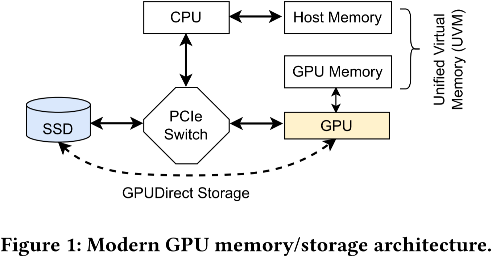

我们在图 1 中展示了现代 GPU 内存和存储的系统架构。GPU 和像 SSD 这样的存储设备通过外围组件互联扩展（PCIe）与主机连接。虽然 GPU 拥有其板载内存，但内存容量受限于 DRAM 扩展墙和**有限的内存封装空间**。因此，它们的内存无法容纳大规模深度学习工作负载的整个工作集。为了解决这个问题，GPU 在内存/存储设备管理上与 CPU 计算遵循相同的方式，**将存储设备作为交换磁盘**。如果 GPU 请求的页面不在其内存中，则会发生页面错误，GPU 会通知主机处理该页面错误，从存储设备加载页面并将其移入 GPU 内存，这会造成显著的数据迁移开销。

    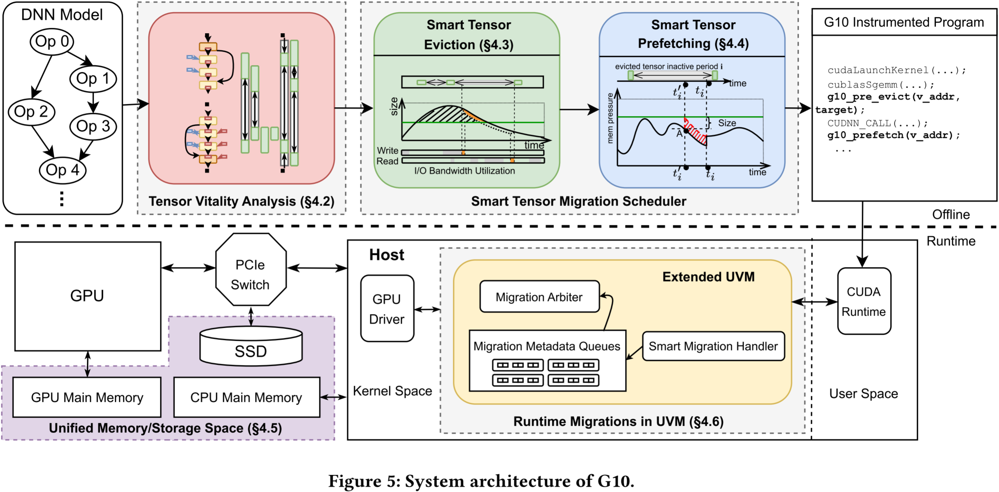

我们在图 5 中展示了 G10 架构。它有三个主要组件：
1. 张量活力分析器，用于提取深度学习模型中张量的语义知识；
2. 张量迁移调度器，用于提前规划张量迁移；
3. 统一内存系统，用于简化 GPU 内存管理并实现透明的张量迁移。

张量活力分析器与像 PyTorch 这样的深度学习框架协同工作，跟踪 DNN 模型中的所有张量。它利用编译器生成的**执行图**来学习每个张量的**大小**、**生命周期**以及它与其他张量的**依赖关系**。因此，**分析过程几乎不产生开销，发生在编译阶段**。

基于提取的张量语义知识，G10 的张量迁移调度器将**在执行模型训练过程之前**提前规划张量迁移。

为了便于张量迁移，G10 通过扩展 GPU 的统一虚拟内存（Unified Virtual Memory, UVM）将 GPU 内存、CPU 内存和 SSD 集成到一个统一的内存空间中。

    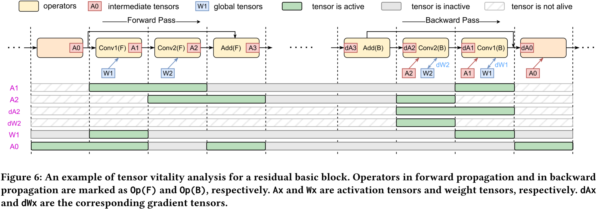

图 6：残差基本块的张量活性分析示例。前向传播中的算子标记为 Op(F)，反向传播中的算子标记为 Op(B)。$A_x$ 和 $W_x$ 分别表示激活张量和权重张量，$dA_x$ 和 $dW_x$ 为对应的梯度张量。  

我们首先根据张量在 DNN 训练迭代中的**生命周期**（即一次前向传播和反向传播）对张量进行分类。如图 6 所示，
- **全局**张量，如模型权重（例如 W1），在多个训练迭代中使用。它将在 DNN 程序开始时分配到统一的内存空间。
- **中间**张量，如激活和梯度（例如 A1 和 dA2），在一次迭代中使用。我们定义张量第一次使用时为“诞生”，最后一次使用时为“死亡”。中间张量在死亡后可以被释放以释放 GPU 内存。

## 18) 2024_HPCA_A会_Enabling Large Dynamic Neural Network Training with Learning-based Memory Management  

> DyNN-Offload 是针对动态神经网络 (Dynamic neural network, DyNN) 的内存交换工作，并属于采用机器学习算法解决系统调度和资源分配的领域。

动机：有效使用异构内存（CPU 和 GPU 内存）需要最小化 CPU 和 GPU 之间的通信量或隐藏通信。为实现这一目标，现有的研究依赖于基于分析的优化 (Profiling-Guided Optimization, PGO) 方法，通过少量训练迭代记录张量访问顺序，并在剩余迭代中规划 CPU 和 GPU 之间的张量预取。PGO 的一个基本假设是：神经网络 (NN) 模型必须是静态的，即使用静态计算图，其中张量维度以及数据和控制流是静态固定的，并且数据流图中没有复杂的数据结构（如图和树）。因此，分析少数训练迭代就足以决定未来操作符的张量预取。然而，以上假设在动态神经网络 (Dynamic neural network, DyNNs) 中并不成立，因为 DyNNs 本身的动态性。根据输入，DyNN 会选择性地激活模型组件，导致不规则的内存访问，破坏了在训练迭代中收集的分析结果。因此，CPU 和 GPU 之间的通信在关键路径上暴露，导致训练吞吐量损失。

总结：DyNN-Offload 针对动态神经网络具有的动态性设计内存交换方案。DyNN-Offload 使用先导模型（一个轻量级神经网络）来提高动态神经网络训练过程中张量访问的可预测性，并指导张量的迁移/预取决策，以隐藏 CPU 和 GPU 之间的通信开销。

摘抄：
大模型的训练根本上受限于 GPU 内存容量。分布式并行训练技术，如流水线并行[40]，[41] 和张量模型并行[65]，通过将模型状态拆分到多个 GPU 上，突破了单个 GPU 内存的限制，使得原本无法适配单个 GPU 内存的大规模模型得以训练。然而，这些技术需要足够的 GPU 来提供大量的聚合 GPU 内存，以存储训练所需的模型状态；这些 GPU 可能非常昂贵，超出了许多小型公司和组织的承受能力[56]，[58]。
张量迁移和重计算具有吸引力，因为它们不会有失去训练收敛性的风险，不会改变神经网络模型，并且成本效益高（即不需要额外的 GPU）。
张量重计算有其基本的局限性：（1）重计算可能是递归的：如果一个被释放张量的父操作符的参数也被释放，那么这些参数必须首先重计算。递归深度没有理论上的界限，可能导致训练吞吐量的大幅损失。（2）某些张量（例如常量张量和权重）无法重计算，从而导致内存节省的上限较为严格（与使用张量预取技术相比）。

图表：

    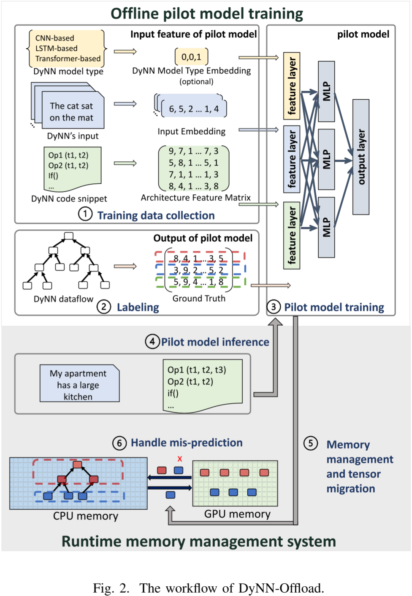

图 2 显示了 DyNN-Offload 的整体架构，主要包括三个组件。
1. **先导模型**。DyNN-Offload 的核心是一个**轻量级神经网络**（先导模型）。先导模型的输入特征是 DyNN 的输入样本和通过**静态分析** DyNN 模型脚本收集的 DyNN 架构信息。先导模型的输出指示 DyNN 中操作符的执行顺序，按照执行块的粒度进行划分。一个执行块包括一组操作符。先导模型指示 DyNN 的计算图如何划分为执行块，从而在每个执行块的开始触发下一执行块的张量迁移，以隐藏迁移成本。
2. **运行时系统**。DyNN-Offload 基于双缓冲管理 GPU 内存，用于张量迁移和 DyNN 训练。根据先导模型，在每个执行块开始时，张量可以从 CPU 内存预取到 GPU 内存。DyNN-Offload 通过按需获取张量和记录输入样本来处理先导模型的误预测，从而提高先导模型的准确性，并避免未来输入的误预测。
3. **先导模型的训练系统**。为了生成训练样本以训练先导模型，DyNN-Offload 将多个 DyNN 输入样本送入不同类型的 DyNN 模型，并记录 DyNN 执行的跟踪信息以进行张量分析。然后，针对每个 DyNN 输入样本，DyNN-Offload 将解析出的数据流图划分为执行块，以最大化张量迁移和训练计算之间的重叠。那些执行块的信息与 DyNN 的输入样本和架构一同成为先导模型的训练样本。

## 19) 2024_TPDS_A刊_DeepTM: Efficient Tensor Management in Heterogeneous Memory for DNN Training  

> DeepTM 使用 Intel OptaneTM 持久内存 (Persistent Memory, PM) 来扩展 GPU 内存，并在制定交换策略时用到了深度强化学习 (Deep Reinforcement Learning, DRL)。

动机：1、Intel OptaneTM 持久内存（PM）结合了高容量和成本效益，但与传统的 DRAM 相比，其带宽较低且 I/O 延迟较高。通常，PM 被集成到异构内存系统中，作为 DRAM 的扩展。在这种配置下，PM 扩展了内存容量，为内存密集型任务提供了部分缓解。因此，异构内存系统已成为解决 DNN（深度神经网络）训练中挑战的宝贵方案。2、在异构内存中，对更高效的张量交换策略的需求日益增加。现有的启发式算法通常侧重于分析单个张量的特征，但难以适应不同 DNN 模型的多样化需求。为了适应各种条件和特性，算法的复杂性会显著增加。此外，张量管理的全局最优解已知是 NP 难问题，实际的近似方法通常依赖于数学工具。此外，在训练过程中，实时监控 DNN 模型和异构内存系统对于防止内存溢出（OOM）错误至关重要。

总结：DeepTM 设计了一种页面级张量聚合方法，将具有相似访问模式的微张量分组到同一页面，从而提高频繁访问张量的缓存命中率。DeepTM 将访问频率相近的大张量分配到连续的页面，有效优化了张量迁移过程中的内存带宽利用率。DeepTM 对 DNN 模型的静态计算图和张量访问模式进行分析，利用四个关键张量特性来量化张量热度，并通过深度强化学习算法进行全局性能优化。

摘抄：
- SwapAdvisor 和 Capuchin 主要依赖于**静态特性分析**，无法适应深度学习场景中各个内核的不同需求。
- 实时适应性：**离线解决方案难以及时适应环境变化**。
- DNN 训练由于其**大量的参数**、**复杂的层次结构**和在多个训练迭代过程中使用的**大量中间数据**，具有很高的内存需求。在训练复杂网络时，需要大量内存来存储**中间结果**、**梯度**和**模型参数**，导致内存紧张。
- DNN 训练过程中的内存访问模式可以通过**计算图**进行分析，计算图可分为两种类型：**静态计算图**（Static Computational Graph, SCG）和**动态计算图**（Dynamic Computational Graph, DCG）。SCG 在训练开始之前通过解析 DNN 应用程序的源代码生成，并在整个训练过程中保持不变，这使得**离线优化和调度**成为可能。
- 现有的基于**整数线性规划**（Integer Linear Programming, ILP）的方法进行张量管理时，可能会遇到**内存溢出**（Out of Memory, OOM）错误。这些错误可能发生在训练过程中张量大小差异显著时，导致 Gurobi 计算出现不准确。

图表：

    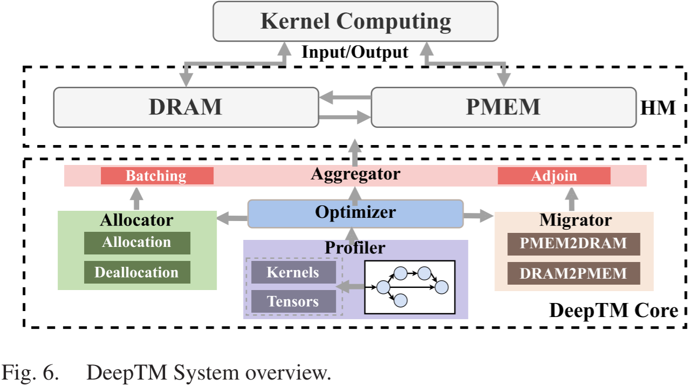

图 6 提供了 DeepTM 框架的概述，该框架由三个主要组件组成：DeepTM Core、异构内存系统 (Heterogeneous Memory System) 和内核计算 (Kernel Computing)。

在 DeepTM Core 中，我们开发了五个关键子模块：Profiler（分析器）、Optimizer（优化器）、Allocator（分配器）、Migrator（迁移器）和 Aggregator（聚合器），它们共同管理异构内存系统。
- 在 Profiler 中，分析相应的静态计算图以获取所有内核和张量的信息，包括执行顺序和依赖关系。
- 之后，Optimizer 根据 Profiler 提供的信息，制定张量管理问题并提供优化解决方案。
- Allocator 处理在异构内存中分配和回收中间张量的操作。
- Migrator 在异构内存系统中执行张量迁移，启动内存读取和内存写入过程，完成 DRAM 与 PM 之间的张量移动。
- 最后，Aggregator 负责按页面级别组织张量，以便进行分配和迁移。

    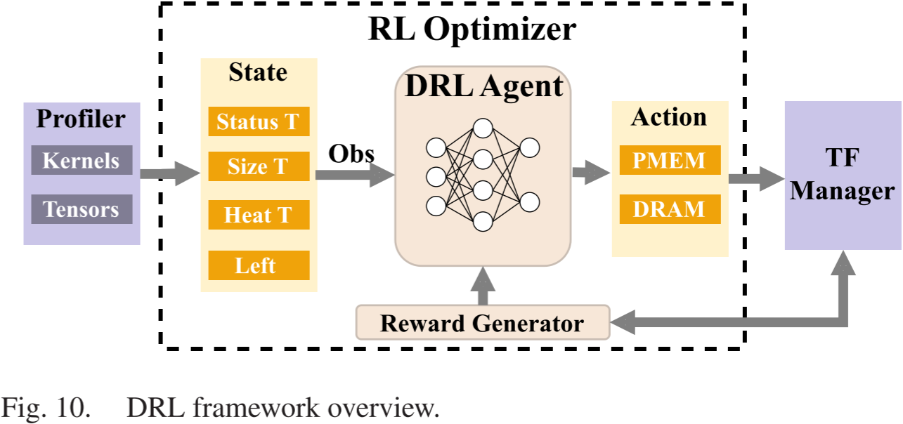

图 10 显示了 DRL 优化器的整体框架。DRL 代理从 TensorFlow（TF）内核获取关键数据，包括静态计算图中的张量和内核。在连续的决策过程中，DRL 代理在周期中运行。在每个时间步骤中，代理从环境中获取当前状态，并从动作空间中选择一个动作。DRL 优化器使用神经网络来逼近 Q 函数，该函数用于将状态映射到所有可能动作的预期奖励。该网络架构包括一个展平层，后跟三个全连接层，旨在最小化预测的 Q 值与根据贝尔曼方程推导出的目标 Q 值之间的差异。通过这种方法，DRL 代理逐渐优化其策略，优先选择最大化累积奖励的动作，从而优化训练过程中的效果。随后，奖励生成器根据执行的动作评估其有效性。

    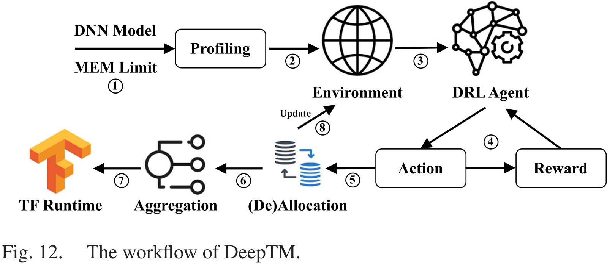

DeepTM 的工作流程如图 12 所示。DNN 模型训练任务和 DRAM 限制信息被提供给 Profiler 进行分析和处理
1. 利用 Profiler 得到的信息，DeepTM 构建 DRL 环境并初始化系统状态。
2. DRL 代理根据当前状态采取张量放置的行动。
3. 根据代理的行动，奖励生成器生成奖励。
4. Allocator 和 Migrator 根据代理的选择执行分配、回收或迁移操作。
5. 对于内存中的张量分配和迁移，执行聚合操作。
6. TensorFlow 继续执行训练任务。
7. 如果还有待处理的内核和张量，DeepTM 会更新环境和状态并继续。
8. 当所有内核执行完成后，回合结束，代理收到回合奖励。