# MLSys_GPU_Memory_Opt 相关综述的阅读笔记

> 说明：
> 1. 笔者不评价论文质量，每篇论文都有自己的侧重，笔者只记录与自己研究方向相关的内容；
> 2. 英文论文使用 DeepSeek 进行了翻译，如有翻译不准确的地方还请读者直接阅读英文原文。

# AI 内存墙问题

## 1) 2024_IEEE Micro_SCI三区_AI and Memory Wall

> 这篇论文最初是一篇博客，作者较早提出了 AI 内存墙这一概念，是显存优化领域背景与挑战方面引用量较高的一篇论文。

摘抄：
- 受 neural scaling law 的驱动，从业者们一直在以前所未有的规模扩展训练最新模型所需的数据量、模型规模和计算能力。
- 大型语言模型（LLM）的规模在同一时间段内每两年以 410 倍的速度增长，超过了单个芯片上可用的内存容量。人们可能会希望，通过将训练/服务扩展到多个加速器上，利用分布式内存并行性来避免单个硬件有限的内存容量和带宽。然而，将工作分布到多个进程中也面临着内存墙问题：神经网络（NN）加速器之间数据传输的**通信瓶颈**，这甚至比芯片内部的数据传输更慢且效率更低。
- 这也可以使从业者在单个芯片的内存上训练大型模型，而不必使用分布式训练，后者通常**难以设置**（在大型超大规模公司之外），并且对于非专业开发人员来说**难以调试**。

> "neural scaling law" 引用自：Hoffmann J, Borgeaud S, Mensch A, et al. Training compute-optimal large language models[C]//Proceedings of the 36th International Conference on Neural Information Processing Systems. 2022: 30016-30030.

图表：

    

图2. (a) 多年来 SOTA 模型参数数量的演变，以及 AI 加速器内存容量的变化（绿点）。大型 Transformer 模型的参数数量每两年以 410 倍的速度呈**指数增长**，而单个 GPU 内存每两年仅以 2 倍的速度增长。

    

图4. 训练不同神经网络模型所需的内存容量。这里，计算机视觉（CV）模型使用的优化器是 SGD 加动量（SGD+Momentum），自然语言处理（NLP）模型使用的优化器是 ADAM。基于可用的 GPU 内存容量，发现/设计新模型存在一个有趣的趋势。**每当 GPU 内存容量增加时，数据科学家们就会设计出更新的模型**。因此，**打破所谓的 GPU 内存墙可能会进一步推动新的创新**。

> 图4原版来自 Jain P, Jain A, Nrusimha A, et al. Checkmate: Breaking the memory wall with optimal tensor rematerialization[J]. Proceedings of Machine Learning and Systems, 2020, 2: 497-511.

# CNN 和 Transformer 模型

## 1) 2020_AIR_SCI二区_A survey of the recent architectures of deep convolutional neural networks

> 这篇综述是关于 CNN 的，作为笔者学位论文相关内容的参考。

摘抄：

- 深度卷积神经网络（CNN）是一种特殊类型的神经网络，它在与**计算机视觉**和**图像处理**相关的多项竞赛中展现了卓越的性能。CNN 的一些激动人心的应用领域包括**图像分类与分割**、**目标检测**、**视频处理**、**自然语言处理**以及**语音识别**。深度 CNN 的强大学习能力主要归功于其使用多个特征提取阶段，能够自动从数据中学习表示。
- 典型的 CNN 架构通常由交替的卷积层和池化层组成，最后是一个或多个全连接层。在某些情况下，全连接层会被全局平均池化层替代。除了不同的映射函数外，还引入了诸如批量归一化和 Dropout 等不同的调节单元，以优化 CNN 的性能。
  - 卷积层 Convolutional layer
  - 池化层 Pooling layer
  - 激活函数 Activation function
  - 批量归一化 Batch normalization
  - Dropout
  - 全连接层 Fully connected layer

图表：

    

图 3 展示了深度 CNN 的进化历史，从 ConvNet 到当前架构的演变过程。

深度 CNN 架构的进化历史在图 3 中以图示形式呈现。CNN 架构的改进可以分为以下五个不同的阶段：  

- CNN 的起源：20 世纪 80 年代末至 1999 年  
- CNN 的停滞期：2000 年初  
- CNN 的复兴：2006 年至 2011 年  
- CNN 的崛起：2012 年至 2014 年  
- CNN 架构创新和应用的快速增长：2015 年至今

    

图 4 展示了深度 CNN 架构的分类，分为七种不同的类别。

## 2) 2021_arXiv:2106.04554_v2_A Survey of Transformers

> 这篇综述是关于 Transformer 的，作为笔者学位论文相关内容的参考。

摘抄： 

- 原始的 Transformer 是一个序列到序列模型，由**编码器**和**解码器**组成，每个部分由 $L$ 个相同的块堆叠而成。每个编码器块主要由**多头自注意力模块**和**位置前馈网络**（FFN）组成。为了构建更深的模型，每个模块周围采用了**残差连接**，随后是**层归一化模块**。与编码器块相比，解码器块在多头自注意力模块和位置前馈网络之间额外插入了**交叉注意力模块**。此外，解码器中的自注意力模块被调整为防止每个位置关注后续位置。   

图表：

    

最近的研究表明，在大规模语料库上**预训练**的 Transformer 模型可以学习到对下游任务有益的通用语言表示。……预训练后，可以直接在下游数据集上**微调**模型，而无需从头开始训练。为了说明 Transformer 在预训练中的典型使用方式，我们列举了一些预训练的 Transformer 模型并将其分类如下：  
- **仅编码器**：
   - 仅使用编码器，并将编码器的输出作为输入序列的表示，通常用于分类或序列标注问题。
   - 一些工作使用 Transformer 编码器作为其骨干架构。**BERT** 是一个典型的预训练模型，通常用于自然语言理解任务。
- **仅解码器**：
  - 仅使用解码器，同时移除编码器-解码器交叉注意力模块，通常用于序列生成（例如语言建模）。
  - 一些研究专注于在语言建模上预训练 Transformer 解码器。例如，生成式预训练 Transformer（**GPT**）系列（包括 GPT、GPT-2 和 GPT-3）致力于扩展预训练的 Transformer 解码器，并展示了大规模预训练模型可以通过任务和示例作为提示实现令人印象深刻的少样本性能。  
- **编码器-解码器**：
  - 使用完整的 Transformer 架构，通常用于序列到序列建模（例如神经机器翻译）。
  - 也有一些预训练模型 (BART、T5) 采用 Transformer 编码器-解码器作为整体架构。使用编码器-解码器架构的好处是模型具备执行自然语言理解和生成的能力。

Transformer 最初是为**机器翻译**设计的，但由于其灵活的架构，已广泛应用于 NLP 以外的领域，包括 CV 和音频处理。  
- **自然语言处理**：Transformer 及其变体在 NLP 任务中得到了广泛探索和应用，例如机器翻译、语言建模和命名实体识别。  
- **计算机视觉**：Transformer 也被用于各种视觉任务，例如图像分类、目标检测、图像生成和视频处理。  
- **音频应用**：Transformer 可以扩展到音频相关应用，例如语音识别、语音合成、语音增强和音乐生成。  
- **多模态应用**：由于其灵活的架构，Transformer 也被应用于各种多模态场景，例如视觉问答、视觉常识推理、字幕生成、语音到文本翻译和文本到图像生成。

# Scaling Laws 理论

## 1) 2020_arXiv:2001.08361_v1_Scaling Laws for Neural Language Models

> 这篇综述提出了 Scaling Laws 理论，作为笔者学位论文相关内容的参考。

摘抄：

- **性能主要取决于规模，而对模型结构的依赖较弱**：模型性能最强烈地取决于规模，规模由三个因素组成：模型参数数量 $N$（不包括嵌入层）、数据集大小 $D$ 以及训练使用的计算量 $C$。在合理的范围内，性能对其他架构超参数（如深度与宽度）的依赖非常弱。  
- 我们的结果强烈表明，**更大的模型将继续表现更好**，并且其样本效率也将比之前认为的更高。**大模型可能比大数据更为重要**。

## 2) 2022_NeurIPS_A会_Training Compute-Optimal Large Language Models

> 这篇综述丰富了 Scaling Laws 理论，提出了与上篇综述不同的观点，作为笔者学位论文相关内容的参考。

作者在文中对综述 1) 的讨论：

Kaplan 等人展示了自回归语言模型（LM）的参数数量与其性能（以评估困惑度衡量）之间存在幂律关系。其中一个显著的结论是，大型模型不应训练到最低可能的损失以达到计算最优；他们认为，在计算预算增加的情况下，模型规模的增长速度应快于训练集的规模。因此，**该领域一直在训练越来越大的模型**，同时将训练集规模保持在约 3000 亿个 token，以期获得性能提升。虽然我们发现模型规模和训练集规模之间确实存在权衡，但我们估计大型模型应训练的 token 数量应远多于之前的建议。具体而言，在计算预算增加 10 倍的情况下，我们发现模型规模和训练 token 数量应按相同比例扩展。

摘抄：

- 近年来，各种大型语言模型被提出。……训练越来越大的模型的趋势显而易见——迄今为止，**语言模型规模的增加**是推动许多语言建模任务最新技术水平提升的主要原因。然而，大型语言模型面临若干挑战，包括其巨大的计算需求（训练和推理成本随模型规模增加）以及获取更多高质量训练数据的需求。事实上，在这项工作中，我们发现**更大规模的高质量数据集**将在语言模型的进一步扩展中发挥关键作用。  
- 尽管最近有许多工作使得训练越来越大的模型成为可能，但我们的分析表明，**需要更加关注数据集的扩展**。推测而言，我们预计只有当数据是**高质量**时，扩展到越来越大的数据集才是有益的。这要求**以高质量为重点，负责任地收集更大的数据集**。

# 深度学习框架

## 1) 2023_电子元器件与信息技术_普刊_国内外深度学习框架分析与研究

> 有助于了解深度学习框架的发展。

摘抄：
- 深度学习框架被称作**第四次技术革命的操作系统**，不仅支撑着深度学习技术研发，还对相关的智能化领域的芯片设计有至关重要的影响。智能行业广泛认为深度学习框架和AI芯片是第四次技术革命中**最重要的两项“基础设施”**。
- 随着 TensorFlow 在全球范围内用户数量的剧增，其框架自身的缺点也逐渐暴露出来。
  - 首先，对于初学者搭建模型是十分困难的。研究人员需要认真考虑模型的架构，正确地计算好输入和输出的数据的维度和数量才能着手搭建；
  - 其次，框架过于复杂的系统设计和频繁变动的接口设计也极大地降低了用户体验；
  - 最后，框架是基于**静态图**处理编译，用户需要先定义图形，再进行计算，**虽然效率较高，但调试难度增大**。

- 国内外主流深度学习框架的发展：
  - 2002年，Torch，瑞士戴尔莫尔感知人工智能研究所，第一个机器学习库。
  - 2007年，Theano，加拿大蒙特利尔大学 MILA 小组，第一个深度学习框架。
  - 2013年9月，Caffe，加州大学伯克利分校在读博士贾扬清，12月正式开源。
  - 2015年11月，TensorFlow，Google，正式开源，一款真正由工业界推出的深度学习框架。
  - 2016年1月，MXNet，李沐、陈天奇等学生，测试版正式开源。
  - 2016年1月，CNTK，微软黄学东博士团队，正式开源。
  - 2016年8月，飞桨（PaddlePaddle），百度，国内首个开源深度学习框架。
  - 2016年11月，Caffe2，Facebook 贾扬清，2017年4月正式开源，工业级深度学习框架。
  - 2017年2月，TensorFlow 1.0，Google。
  - 2018年12月，PyTorch 1.0，Facebook 在 NeurIPS 大会上正式发布，专注于模型的研究和设计。
  - 2019年9月，TensorFlow 2.0，Google，默认采用动态图处理方式。
  - 2020年3月，MindSpore，华为，正式开源。
  - 2020年3月，天元（MegEngine），旷世科技，正式开源。
  - 2020年7月，Oneflow，一流科技，正式开源。
  - 2020年4月，计图（Jittor），清华大学计算机系胡事民教授团队，正式开源。
  - 2021年3月，飞桨2.0，百度，全面支持动态图编译，编程方式默认为动态图。

## 2) 2023_调研世界_普刊_深度学习框架发展综述

> 有助于了解深度学习框架的发展。

摘抄：
- 随着深度学习理论与应用的快速发展，对于编程框架和平台的需求也日渐增强。在没有框架的情况下，开发者和使用者需要编写大量代码来完成复杂的计算操作，具有很高的学习成本和门槛。而框架通过**将底层算法进行模块化封装**极大提高了代码编写的效率并降低了使用门槛，推动了深度学习模型的发展和应用部署。深度学习框架已经成为了**深度学习领域的“操作系统”**。随着我国经济进入高质量发展阶段，深度学习框架作为**人工智能的基础设施**，也成为了新基建的核心之一。
- TensorFlow 在工业界占有主流地位。……**其静态图的特性使模型的运行部署效率更高**，更受工业应用欢迎。……虽然 TensorFlow 框架是当前使用最广泛的深度学习框架，但也存在许多问题：……。第四，调试困难。由于 TensorFlow 采用了**先定义再运行的静态图模式**，故在调试上存在一定困难。为了解决这一缺点，TensorFlow 后续又推出了 **Eager 模式**，无需先构造计算图，可以直接对结果进行评估。
- PyTorch 框架具有许多优点：第一，PyTorch 使用了**动态图框架**。动态图框架中**计算图在运行过程中构建**，因此动态图框架**更易调试，具有更高的灵活性**。……PyTorch 也存在一些不足，例如，动态图模式虽然更易调试，但**在运行效率上低于静态图**。

图表：

    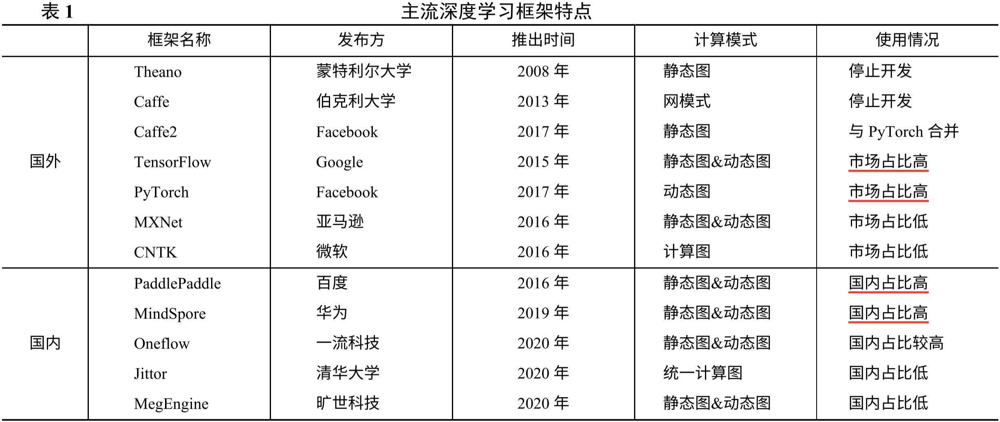

# MLSys 训练优化

## 1) 2020_大数据_T2刊_深度学习中的内存管理问题研究综述

> 这篇综述算是比较早对 GPU 内存优化进行总结的，分析了大规模深度学习发展面临的内存管理挑战，介绍了 DNN 的结构及训练过程，关注了内存交换、重计算、内存复用和模型压缩技术。虽然部分内容较老，但文中的很多表述还是值得引用和学习的。

摘抄：

- 近年来，深度学习已经在多个领域取得了巨大的成功。深度神经网络向着**更深更广**的方向发展，训练和部署深度神经网络模型都将面对巨大的内存压力。加速设备有限的内存空间已经成为限制神经网络模型快速发展的重要因素，如何在深度学习中实现高效的内存管理成为深度学习发展的**关键问题**。
- **深度和宽度**是构建深度神经网络最重要和有效的两个因素。神经网络的深度越深、功能层越多，越能有效地降低超参数选择的复杂性，提高模型的鲁棒性。与深度相比，宽度是构建网络的另一个重要因素，它通过不同大小的卷积积累了更多的特征图。
- 深度学习应用是一种**计算密集型和内存密集型**的任务。……各种专用加速设备为深度神经网络的发展提供了强大的算力支撑。设计更深层次的深度神经网络可以达到更高的精度，但是这也给各种加速设备带来了极大的挑战。……这一限制阻碍了深度学习研究者去探索更先进的模型架构。
- 神经网络需要经过训练才能用于推理或分类任务。训练通过执行**正向传播算法和反向传播算法**，学习和更新神经网络各层的权值。……正向传播的计算是一个**序列化**的过程，……
- 机器学习框架极大地简化了神经网络的实现过程，成为帮助研究者开展研究的利器。但是这些机器学习框架在内存管理方面受到**严重的限制**。
  1. 现有的机器学习框架在训练 DNN 时，DNN 所有层所需的内存空间必须能够被放在加速设备的内存中。……内存分配策略没有考虑到 DNN **分层训练**的特点，这对内存资源造成了极大的浪费。
  2. 神经网络的输入通常**成批地训练数据**，这有助于网络模型更好地收敛到最优解，但也将显著增加内存占用。
- 随着 DNN 的网络结构向着更深、更广的方向发展，训练 DNN 时所需的内存空间越来越大，**单个加速设备的内存已经不能满足训练的需求**。……模型并行可以显著地缓解单个加速设备的内存压力。然而，由于多 GPU 之间需要**频繁地通信**来更新模型参数，导致它的性能较差。因此，需要通过内存管理解决现有内存分配策略带来的内存浪费问题，使得深度学习系统能够充分利用加速设备的算力和有限的内存资源，**保证大规模神经网络在单个加速设备中能够快速训练**。
- 在训练过程中，加速设备的内存主要被 3 个部分消耗：存储正向传播中产生的**特征映射**、存储反向传播中的**梯度映射**以及卷积算法需要的**额外内存空间**。……在这 3 个部分中，后两个部分是临时内存，可以在当前计算完成后立即释放。正向传播和反向传播的计算都需要**特征映射**，只有在反向传播计算完成后，对应层的特征映射占用的内存空间才能够被释放。……特征映射在正向传播和反向传播中参与的两次计算之间存在**很大的时间间隔**，这也为内存管理带来很多可能。
- **降低单个设备训练神经网络时的内存消耗**：
  1. **内存交换**技术是指在加速设备内存和主存之间交换数据，通过在不使用变量时将其从加速设备的内存交换到主存的方式来降低加速设备的内存消耗，并在下一次访问变量之前将其交换回加速设备内存。加速设备的内存容量相对于主存来说要小很多。……内存交换能够交换几乎所有的设备内存数据，因此其**能够大幅度地降低设备内存的占用率**。在理想情况下，数据在主存和设备内存之间的通信可以隐藏在计算之下，从而最小化数据传输开销。……通过对神经网络训练过程中一些**特征**的观察，许多工作（vDNN、moDNN、Layrub、SuperNeurons、Capuchin）采用内存交换的方式进行训练时的内存管理，使得有限的 GPU 内存能够充分发挥作用，满足更深、更广的神经网络模型的训练需要。但是**如何降低内存交换产生的性能损失**还激励着研究者们不断探索新的内存交换策略，最终实现**在保证训练性能的同时大幅降低设备内存占用**的目的。
  2. **重计算**技术的思想是将特征映射这样的中间结果在正向传播过程中及时地释放，在反向传播的计算需要用到特征映射时，再通过重新计算的方式生成，进而参与到当前计算中。这是一种**利用计算来换 取内存空间**的思想。……任何重计算方法（Sublinear、SuperNeurons、Capuchin、Checkmate）的有效性都取决于其定义的规则：缓存哪些变量以及如何重计算其他变量。目前的研究者围绕这一问题不断提出新的方法，以期望**用最小的性能开销换取最大的内存空间**。
  3. **内存复用**是指在生命周期不重叠的变量之间共享同一块内存。（Sublinear、Layrub、SuperNeurons）
  4. 在深度学习的训练阶段，通过**压缩**算法对变量进行压缩，能够有效降低变量占据的内存空间，减少加速设备内存的占用。……模型剪枝、参数量化等方法会造成模型训练精度的损失，**在保持较高精度的同时减小模型占用的内存空间**一直以来都是研究的热点。
- 深度神经网络正朝着更深、更广的方向发展，训练和部署这些深度神经网络需要更大的内存空间，这对深度学习系统中的内存管理提出了**新的挑战**。如何在深度学习系统中进行高效的内存管理，从而满足更深、更广层次的神经网络模型的训练需求，是当前深度学习系统研究的**重要问题**。
- 大多数工作通过**观察、分析 DNN 模型训练过程中的一些特征**，从数据流图、层以及张量等不同的维度，应用上述的一种或多种技术方案，充分发挥各技术的优势，实现有效的内存管理。
- 内存交换技术中**交换单元的大小**对系统的性能有较大的影响，先前的解决方案以**页面**为内存交换的基本单位，但是性能较差，现在最好的解决方案是以**张量**为内存交换的基本单位，在虚拟内存中能够以一个更合适的粒度对内存进行管理，从而实现更好的性能。但是以张量为粒度的方案并不一定是最优的，后续的研究也需要探索更多可能的方案。此外，**内存管理策略**也十分重要，内存管理策略决定了优化内存占用的效果。目前的研究都朝着这个方向努力，但是还没有很好的内存管理策略能够**实现内存占用和计算性能的完美平衡**。

## 2) 2023_中国科学:信息科学_T1刊_并行智能训练技术:挑战与发展

> 这篇论文是 NUDT PDL 发的，作者关注的是分布式训练中的优化技术。我们重点学习内存交换和重计算相关的内容。

摘抄：

- **海量数据的获得**以及**智能算力的提升**推动人工智能迎来第三次发展浪潮。
- 伴随人工智能技术的快速发展, **智能模型参数**和**训练数据**的规模呈爆炸式增长。
- 人工智能飞速发展离不开**大模型、大数据、大算力**的 “暴力美学”。
- 智能模型训练过程主要包括神经网络的前向和反向计算，其中涉及**大量高维矩阵运算**，通用 CPU 难以应对这类计算密集型任务，而 GPU，FPGA 等加速芯片**并行计算**的特性使其被广泛用于深度学习模型训练任务。因此，目前并行智能训练系统通常是**异构**的，包含了 CPU 和专用硬件加速芯片。这种异构计算系统由 CPU 访问主存或 I/O 设备读取数据，将数据传输给硬件加速器进行模型训练。
- 随着异构加速设备的性能持续增长，智能模型训练的**通信频率**不断提高，同时智能模型参数量的增加也直接加大了参数通信的数据规模。上述两方面的因素导致了**参数通信开销**在系统中占比增加，参数通信开销成为了制约大规模并行智能训练效率提升的性能瓶颈。……智能模型训练中密集的参数通信严重影响了并行智能训练系统的**吞吐率和可扩展性**。
- 按照数据划分和模型划分两个计算任务划分维度，并行智能训练包括**数据并行**和**模型并行**两种基础并行训练模式，以及混合多种并行模式的**混合并行**模式。根据智能模型特点，模型并行又演化出**流水线并行**、**张量并行**、**专家并行**等多种计算模式。
- **内存溢出**（out of memory, OOM）是大型模型训练中经常出现的错误。智能训练系统中设备高速内存的总量，成为制约智能训练系统对大型模型支撑能力的主要因素。
- 在多计算设备参与的**多进程并行智能训练**中，内存优化技术有了新的空间。在数据并行训练中，**零冗余优化器**（ZeRO）内存优化技术将模型的**优化器状态**、**梯度**和**参数**划分至各个工作设备上，从而消除冗余的存储开销。ZeRO-Offload 在 ZeRO 的基础上，将在 GPU 上保存的**优化器状态**和**梯度**的切分卸载至内存，并且**在整个训练阶段将优化器状态维持在内存中**。ZeRO-Infinity 则进一步将 NVMe 存储加入到数据并行训练系统之中，使**模型参数**可扩展到更大规模。
- 人工智能技术发展对于国家经济和国防建设都具有重要意义。并行智能训练技术和框架软件，**向下**依托高性能智能训练硬件系统，**向上**支撑人工智能算法开发和运行，是人工智能技术持续发展的关键，是智能训练软件生态建设的核心。随着人工智能算法的快速演进，作为**底层系统支撑技术**，并行智能训练将面临更多严峻挑战，具有重要的研究价值和广泛的应用前景。

图表：

    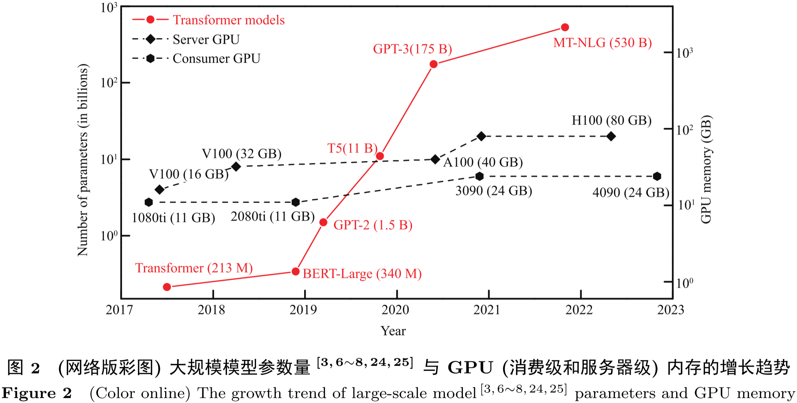

基于 Transformer 的预训练模型参数量已超过**十亿 (billion)** 数量级，而且模型规模的增长速度非常快，如图2所示，近年发布的预训练模型参数量增长了超过 **1000 倍**。

如图2所示，与大规模模型的参数量增长速度相比，常用智能计算加速器的内存容量增长较为缓慢。因此，如何**在保证训练效率的同时高效地利用内存空间**，成为大规模智能模型训练的一大挑战。

    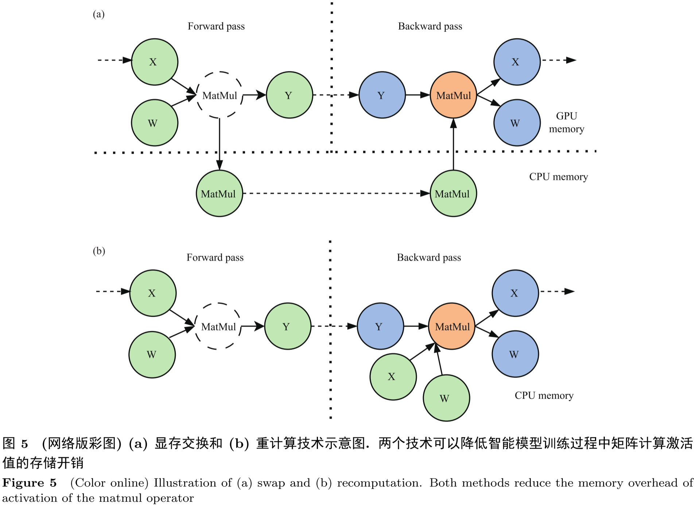

**显存交换**（swap）是一种利用 CPU 内存来保存中间计算结果以节省 GPU 内存空间的方法，如图5(a)所示，其主要思想是在前向传播中将计算得到的激活值从 GPU 内存**卸载**到 CPU 内存中，在反向传播的时候再将所需要的激活值**加载**到 GPU 内存中。得益于 GPU 计算任务与传输任务的**可并行性**，swap 方法有不会占用 GPU 额外的计算资源的优点，但受限于 PCIe 链路的带宽，卸载与加载的**时间开销**往往较大。（vDNN、moDNN、SwapAdvisor）

**重计算**（recomputation）是一种**以时间换空间**的优化方法，如图5(b)所示，其主要思想是利用前向传播计算的中间结果（即模型激活值）在反向传播时才会被使用这一特点，在前向过程中将部分激活值直接丢弃，在反向传播需要时再重新进行前向传播的计算以获得所需的激活值。重计算的优点是能够立刻释放大量内存，但是其缺点同样也很突出，因为其在进行反向传播时需要再进行一次前向计算，这将产生**额外的计算开销**。（Sublinear、Checkmate、DTR）

    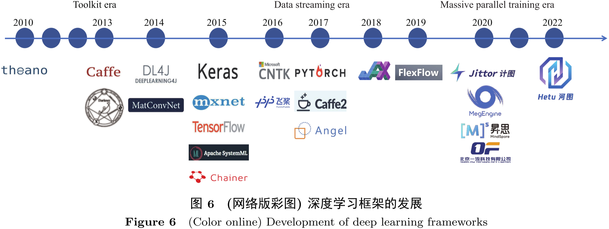

**深度学习框架**为智能计算模型的构建、训练、评估等开发流程提供了基础的编程接口和运行环境。图6展示了深度学习框架随着深度学习的发展从**工具包时代**到**数据流时代**再到**大规模并行训练时代**的发展历程。

智能训练框架为智能模型的开发提供**编程接口**和**运行环境**，对于深度学习发展具有重要的推动作用。然而，随着训练数据和模型参数规模的增长，智能训练需要的计算设备规模越来越大，并行智能训练方式也越来越复杂，传统的 TensorFlow、PyTorch 等**基础深度学习框架**已经不能满足大规模智能模型的开发和训练需求。因此，数据并行训练框架和混合并行训练框架先后被提出，通过对并行智能训练方法进行**封装**，**抽象**出简单易用的用户接口，降低并行智能训练的编程难度，进一步推动深度学习技术的发展。

## 3) 2023_软件学报_T1刊_面向深度学习训练的内存交换机制综述

> 这篇论文专注于分析内存交换，文中的理论分析部分很不错，而且从多个角度对不同的内存交换工作进行了比较，写得比较有深度，部分内容也有一些抽象。

摘抄：

- 内存交换机制是近年来应对内存管理挑战的一种重要技术，其核心思想是利用深度学习训练**内存需求的“时变”特征**，通过在某一时间点将内存数据从专用计算加速设备内存中动态移出，并在数据被访问时从外部存储将其重新移回专用计算加速设备内存，**以瞬时内存需求替代累积内存需求**，达到深度学习训练累积内存可以超出单个专用计算加速设备的内存容量的效果，保障深度学习训练在此设备上的**可用性与性能**。
  - **可用性**目标：降低深度学习训练的瞬时内存需求。内存交换机制通过选择算子数据换出内存，保障深度学习瞬时内存需求低于专用计算加速设备的内存容量，不因内存不足而崩溃。
  - **性能**目标：减少深度学习训练阻塞。内存交换机制通过为每一算子确定交换内存数据的时刻，减少深度学习训练因内存交换产生的阻塞，保障深度学习训练性能。
- 为了实现**可用性与性能**目标，内存交换机制需要选择内存不足时换出的算子数据，确定其换入内存的时刻，最终产生可行的内存交换方案。在这一过程中，内存交换机制具体面临如下 3 方面的挑战。  
  1. 如何确定从内存换出的算子数据。👉 内存交换机制需要结合**算子运行特征**构建**换出机制**，确定从内存换出的算子数据，满足**可用性**目标。  
  2. 如何确定算子数据换入到内存的时刻。👉 内存交换机制需要结合**数据依赖关系**，构建**换入机制**，确定将算子数据换入到内存的时刻，满足**性能**目标。  
  3. 如何避免算子换出与换入冲突。👉 内存交换机制需要结合考虑深度学习训练运行状况和内存交换优化策略等**运行阶段因素**，进行效用驱动的**联合决策**，避免算子换出与换入决策冲突，以最终满足**可用性与性能**目标。
- 内存交换机制可以应用于大规模深度学习训练之中，以**降低分布式深度学习训练对于专用计算设备数量的要求**。……使用深度学习框架运行的深度学习训练可以利用内存交换机制，**降低大规模深度学习训练对于内存的瞬时需求，保障深度学习训练的运行**。

内存换出机制：
- **先出后入**换出机制
  - **即时**换出：深度学习框架在前向传播某一算子数据不再被使用时，换出其内存数据。（Capuchin、FlashNeuron、HALO）
  - **按需**换出：深度学习框架在内存不足时，通过内存换出机制释放内存空间。
    - （moDNN、SuperNeurons）使用 **LRU 算法**换出最近最少使用的算子数据，而**最近最少使用的算子通常是最先进行前向传播的算子**。
    - （Layrub、Dymem）使用**引用计数**描述运行阶段的依赖状况，在前向传播算子先出后入之上，当算子的引用计数减为 0 时移出其数据，**避免换出即将被访问的内存数据**。
- **大算子优先**换出机制
  - **观察总结**的内存占用状况：（vDNN、SuperNeurons、Layrub、HALO）在这一机制下，深度学习框架在选择换出的算子数据时，仅考虑**算子数据的类别**，而不考虑算子数据的实际数据量。
  - **动态获取**的内存占用状况：（Capuchin、FlashNeuron）算子因处于模型的不同位置，其数据量可能存在较大的差异，深度学习框架可以结合观察总结的算子内存占用差异，限制动态选择换出算子的范围，在卷积等算子中**选择占用更多内存空间的算子**，降低动态选择的开销。
- **周期性**换出机制：深度学习框架基于算子迭代间的稳定性特征，**在每次迭代中收集运行状况信息**，周期性换出内存数据。
  - 试运行：（vDNN、FlashNeuron）
  - 构建预测模型
  - 运行一次迭代：（Capuchin）
  - 将换出决策写入算子计算图：（LMS）

获取运行时间信息（根据深度学习训练配置的稳定性进行区分）：
- 面向**稳定**深度学习训练配置的**监测**方法：深度学习框架在深度学习参数与计算资源配置不变时，通过监测训练阶段**若干迭代**的运行，获取在整个深度学习训练阶段中**持续有效**的算子运行时间信息。……内存使用的监测仅在深度学习训练开始的若干个迭代运行，因此具有较低的开销。但随着深度学习训练向云端的迁移，深度学习训练可能运行于训练集群中，由深度学习调度框架**动态分配与调整训练资源**。深度学习框架可能需要在大量参数、资源配置上进行试运行，并在运行时采取其他优化方案优化深度学习的内存占用，在这些情况下，**深度学习训练的运行时间与内存需求均可能发生改变，频繁监测将产生较大的开销**。
- 面向**动态**深度学习训练配置的**预测**方法：深度学习框架面向深度学习训练参数配置（批尺寸、算子实现等配置）与资源配置（GPU、内存等配置）**动态变化**导致的算子运行时间**动态变化**，通过**构建分析模型**，直接评估新配置下的算子运行时间，以**降低频繁监测产生的开销**。
  - 基于**比例**的预测方法：基于比例的预测方法根据算子运行时间与运行性能与某一配置指标的线性关系，预测其他配置下的算子运行时间。  
  - 基于**计算设备模型**的预测方法：基于计算设备模型的预测方法模拟专用计算设备，预测算子的运行时间。  
  - 基于**机器学习**的预测方法：基于机器学习的预测方法通过采集算子在特定参数与资源配置下的运行时间，训练机器学习模型，预测算子在其他配置的运行时间。

内存换入机制:
- **反馈机制**在深度学习训练需要访问某一内存数据时，触发数据从外部存储的换入。NVIDIA、AMD 等主流专用计算设备厂商通过**统一内存**技术对此提供支持，计算设备与 CPU 内存处于同一内存地址空间，当某一换出的内存数据被访问时，专用计算设备将产生缺页中断，由硬件将内存数据从 CPU 内存换入专用计算设备内存。反馈的缺陷在于**缺少结合数据依赖关系的数据预取机制**。
- **前馈机制**在换出的数据被访问之前，将数据从外部存储预取回内存。
  - 基于**数据依赖关系**的前馈机制：在计算某一算子之前，触发其数据换入，实现训练运行与内存交换的交叠。仅结合数据依赖关系的前馈机制**可能导致数据过早或过晚换入**。
  - 基于**数据访问时间**的前馈机制：通过**对齐算子运行时间与内存交换时间**，实现在深度学习训练**访问数据的同一时刻完成数据换入**，可以消除训练的阻塞时间，最大化保障深度学习训练性能。基于数据访问时间的前馈需要考虑**算子的计算时间**与**传输时间**。……但这一机制要求深度学习框架精确获取各算子的运行时间与算子数据交换时间，**具有较高的实现难度**。

换出与换入的联合决策：
- **动态**决策方法：基于一定规则，在**训练运行**阶段**即时选择内存数据进行交换**。这一决策方法体现为**候选交换数据的过滤**。……动态决策不一定形成最优交换决策，但**具有较低的决策开销，支持训练运行阶段的实时决策**。
- **静态**决策方法：在深度学习**训练前**，形成整个深度学习训练阶段的内存交换计划。深度学习框架通过在**若干轮迭代**中尝试各种内存交换方案，并确定具有最优性能的内存交换方案。由于算子在迭代间的稳定性运行特征，深度学习框架可**周期性**地运用决策的内存交换方案。……静态决策可以形成更为优化的交换决策。其缺陷为**存在一定的试运行或求解开销**。
  - **试运行**方法通过使用若干参数与资源配置试运行深度学习训练，记录其运行时间与内存瞬时需求，最终确定效果最优的内存交换方案。
  - **整数线性规划决策**方法将深度学习训练性能作为目标函数，将交换约束与交换目标作为约束函数，规划形成交换决策。

展望：
- **换出**：进一步探索**内存使用特征**及其与换出机制结合的方法，将可能进一步降低深度学习训练瞬时内存需求，满足内存交换的可用性与性能目标。  
- **换入**：随着深度学习框架开始运用多种运行优化机制，深度学习训练的内存需求动态变化，深度学习框架可以进一步探索**基于预测的算子运行时间获取方法**，准确高效地实现**基于数据访问时间的前馈内存换入机制**，结合多种内存换入机制互为补充，在内存利用效率、训练信息获取开销与训练性能间进行均衡，满足深度学习训练的可用性与运行性能目标。
- **联合决策**：深度学习框架需要进一步结合训练运行状况，考虑特定计算资源下特定深度学习训练任务对内存交换的影响，并利用**计算资源**、**传输资源**与**存储资源**上交换数据与交换路径优化策略，探索降低内存交换开销的机遇，根据深度学习训练因素与内存交换策略因素之间的相互影响，进一步优化内存换出与换入的联合决策，保障深度学习训练的可用性与性能。

图表：

    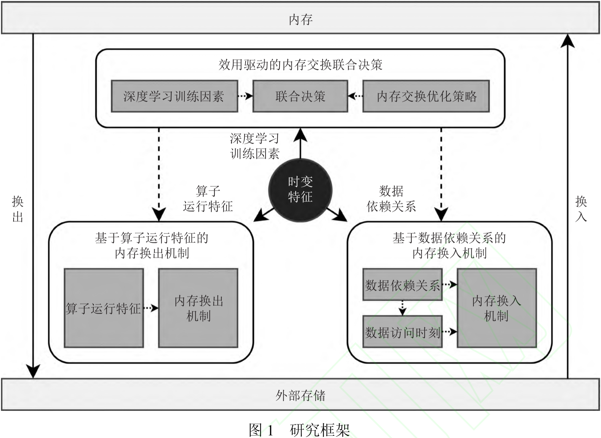

本文提出如图1所示的研究框架。为了兼顾可用性与性能目标，保障深度学习训练的运行，内存交换机制需要有效结合**内存需求时变特征**，解决换出机制、换入机制与联合决策中所面临的一系列挑战。

- **基于算子运行特征的内存换出机制**解决算子数据的换出选择挑战。内存换出机制在内存换出阶段结合体现为算子运行特征的时变特征，选择算子数据换出内存，以**满足可用性目标**。
- **基于数据依赖关系的内存换入机制**解决算子数据的换入时刻挑战。内存换入机制需要在内存换入阶段结合体现为换出数据间的依赖关系的时变特征，确定数据访问时刻，通过**反馈或前馈方式**及时将算子数据从外部存储换入内存，以**满足性能目标**。
- **效用驱动的内存交换联合决策**解决算子数据交换的联合决策挑战。内存交换机制结合换出与换入机制，考虑体现时变特征的深度学习训练因素与影响时变特征的内存交换策略因素，通过训练效能驱动的联合交换决策，**兼顾可用性与性能目标**，保障深度学习训练的运行。

    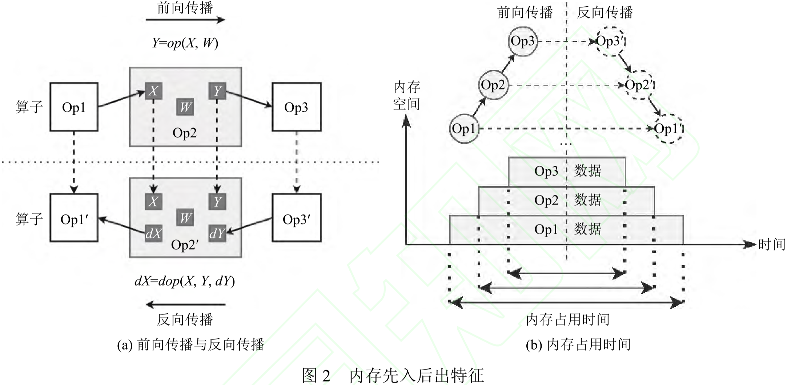

算子运行特征1：**内存先入后出**特征。深度学习训练中**最先计算的算子的数据最先进入内存，最后从内存中释放，具有最长的内存占用时间**。图2(a)展示了算子数据在前向传播与反向传播中的复用。在$Op2$的前向传播中，$X$、$Y$分别为算子的输入与输出数据，$W$为算子权重数据，其中，$Y$由$X$与$W$通过算子的前向传播操作$op$计算产生；在$Op2$反向传播$(Op2')$中，$dX$与$dY$分别为算子反向传播中的梯度数据，其中，$dX$由$X$、$Y$与$dY$通过算子的反向传播操作$dop$计算产生。可以发现，**算子在深度学习训练前向传播中的输出数据在由下一算子使用之外，还需要在反向传播中复用，需要保留在内存之中**。图2(b)展示了这一训练机制对于内存占用时间的影响。前向传播与反向传播按相反顺序进行，因此，**最先前向传播的算子最后进行反向传播，最先被分配，而最后被释放内存空间**，因此，深度学习框架可以将这些算子的内存数据换出内存，释放内存空间，降低深度学习训练的瞬时内存需求。

    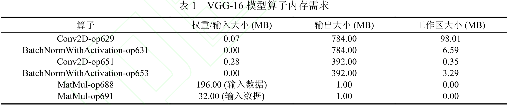

算子运行特征2：**算子内存占用差异**特征。由于在深度学习模型中位于不同位置，实现不同功能，算子之间存在较大的内存占用差异。表1展示了使用华为 MindSpore 深度学习框架训练 VGG-16 模型时部分算子权重、输出与工作区域的内存占用。不同类别的算子具有显著的内存占用差异，卷积算子与用于实现全连接层的矩阵乘法算子相比，占用了更多的内存空间。而且随着对于输入数据特征提取的不断深入，卷积算子的内存占用逐渐减少。

    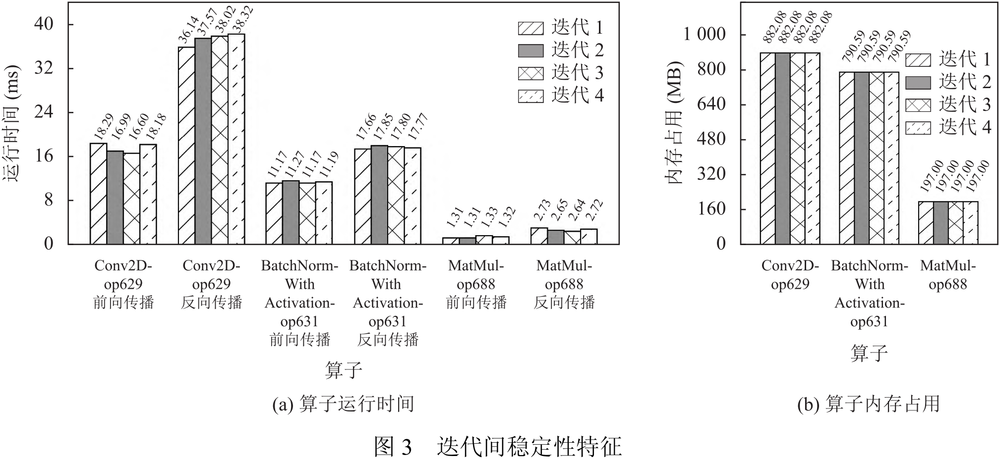

算子运行特征3：**迭代间稳定性**特征。图3展示了 MindSpore 框架中部分算子在迭代间的运行状况。可以发现每次迭代中，算子在前向传播与反向传播阶段具有稳定的运行时间与内存需求。其原因在于每次迭代中只有输入数据内容发生变化，而**影响输入数据规模的批处理尺寸、影响计算开销的内部实现等参数配置没有发生变化**。深度学习框架对这一特征的利用分为两方面。当深度学习训练的参数与资源配置不变时，深度学习框架使用这一特征**通过获取一次迭代中的算子运行状况，用于后续数十万次迭代中内存交换的决策**。而训练参数与资源配置改变时，深度学习框架可以**快速评估算子运行状况的变化，针对性调整内存换出机制**。

## 4) 2024_计算机工程_T2刊_GPGPU和CUDA统一内存研究现状综述

> 这篇论文最早是笔者在 HPC CHINA 2024 看到的，有助于了解 CUDA 统一内存相关的概念和工作。

摘抄：
- GPU 最初是一种专门用于加速图像渲染的处理器。与传统的中央处理器单元（CPU）相比，GPU 拥有数以千计的处理核心，**能够同时执行大量的计算任务**。这种**并行计算**的特性使得 GPU 在处理大规模数据集和**计算密集型任务**时表现出色。而深度学习等人工智能相关技术通常涉及**大量的矩阵运算和张量操作**，这些操作可**高度并行化**，因此 GPU 的用途被扩展到了更广泛的计算领域，发展也更加受到重视。
- **GPU 显存容量有限且不易拓展**：相比于 CPU，考虑到 GPU 功能的局限性，加之散热、功耗、整机物理空间等因素的影响，GPU 的体积有限。此外，独立 GPU 一般是厂商封装好的独立硬件，所以 GPU 的显存容量有限且不易拓展。
- 部分工作（DeepUM、OC-DNN）对内存交换的研究将统一内存作为研究重点。

## 5) 2024_arXiv:2407.20018_v1_Efficient Training of Large Language Models on Distributed Infrastructures: A Survey

> 这是一篇极好的综述，因为是围绕 MLSys - LLM训练 这个主题去写的，对笔者的参考价值很大。内容包含单卡、多卡，并行、通信、内存、计算、容错等。笔者重点关注单卡内存优化的内容。

摘抄：

- 在 LLM 训练过程中，内存消耗可以分为四个关键部分：模型状态（model states）、激活值（activations）、临时缓冲区（temporary buffers）和内存碎片（memory fragmentation）。  
  - **模型状态**：模型状态包括**优化器状态**、**梯度**和**模型参数**所占用的内存。
  - **激活值**：激活值是指在前向传播过程中生成的张量。这些张量在反向传播阶段对梯度计算至关重要。  
  - **临时缓冲区**：临时缓冲区用于存储中间结果。 
  - **内存碎片**：内存碎片可能导致尽管有大量可用内存，但内存请求仍然失败的情况。这是因为可用内存可能变得碎片化，无法满足连续内存请求。

图表：

    

混合并行通常结合多种手工设计的并行化策略，以划分 LLM 的不同可并行维度。这些策略包括**数据并行**（data parallelism）、**张量并行**（tensor parallelism）、**流水线并行**（pipeline parallelism）和**序列并行**（sequence parallelism），如图 8 所示。数据并行、张量并行和流水线并行的组合也被称为 **3D 并行**（3D parallelism）。

    

为了解决 LLM 训练中的内存限制，提出了多种内存高效技术。这些技术包括：  
- **激活重计算策略**：通过增加计算量来减少内存使用；  
- **冗余减少方法**：最小化训练过程中的数据重复；  
- **碎片整理技术**：优化内存分配和释放以减少碎片并提高内存利用率；  
- **交换和卸载方法**：利用 CPU 内存和 NVMe SSD 来补充 GPU 内存。  

图 12 概述了这些内存高效 LLM 训练优化的分类。

**6.1 激活重计算（Activation Recomputation）​**

在模型训练的反向传播阶段，激活值对于计算梯度至关重要。随着模型规模的增加，训练期间存储这些激活值所需的内存可能超过 GPU 内存容量，从而**限制了可训练模型的规模**。激活重计算提供了一种解决方案，即在前向传播过程中**有策略地**驱逐某些激活值，并在反向传播过程中根据需要重新计算它们。这种方法已成为减少 LLM 训练中内存消耗的事实标准。激活重计算的关键在于**平衡内存节省与额外计算开销之间的关系**。

我们将这些方法分为两种主要策略：静态驱逐（static evicting）和动态驱逐（dynamic evicting）。
- **静态驱逐**涉及在前向传播过程中制定一个**固定的计划**来驱逐激活值，并在反向传播过程中重新计算它们。静态驱逐方法通常涉及针对**特定模型架构或模块**制定驱逐策略。尽管静态方法需要**对新模型进行修改**，但大多数 LLM 的结构具有相似的架构，使得这些策略在 LLM 训练中具有**通用性**。（Checkmate）
- **动态驱逐**根据训练过程的当前状态，**实时决定**驱逐和重新计算哪些激活值。相比之下，动态驱逐方法在**没有模型先验知识**的情况下实时做出决策。尽管动态驱逐方法具有固有的**灵活性**，但它们在 LLM 训练中并未被广泛采用。（DTR、MegTaiChi）

**6.2 冗余减少（Redundancy Reduction）**  

传统的数据并行方法在所有 GPU 上复制整个模型状态，这导致了大量的冗余内存使用。冗余减少技术通过**消除或减少每个设备上的内存冗余**来优化内存使用。这些技术通常**寻求在内存效率和引入的通信开销之间取得平衡**，从而以可接受的成本促进**更大规模**或**更大批量**的训练。

零冗余优化器（ZeRO）通过三个阶段（ZeRO-1、ZeRO-2 和 ZeRO-3）在所有 GPU 上**完全分片**（Fully Sharding）模型状态来优化内存冗余。  
- **ZeRO-1**：在所有 GPU 上全局分布**优化器状态**。  
- **ZeRO-2**：在 ZeRO-1 的基础上，进一步在所有 GPU 上分片**梯度**。  
- **ZeRO-3**：除了优化器状态和梯度外，还对**参数**进行分片。 

ZeRO 被许多框架广泛采用，例如 DeepSpeed、PyTorch-FSDP 和 ColossalAI。  

**6.3 碎片整理/优化（Defragmentation）**

GPU 内存碎片化是指在相邻张量之间产生的**分散且不可用的 GPU 内存块**。由于**不同张量的生命周期不同**，以及通用深度学习框架（如 PyTorch 和 TensorFlow）的**内存分配和释放机制效率低下**，这一问题在 LLM 训练中尤为突出。此外，重计算和卸载等内存优化技术通过引入**更频繁且不规则的内存分配和释放请求**，进一步加剧了这一问题。内存碎片化可能导致高峰值内存和内存不足（OOM）错误，从而限制批量大小和整体训练效率。碎片整理技术通过内存管理方法来缓解这些问题。

**基于张量的碎片整理**：深度学习框架通常使用**带有内存池的缓存分配器**来实现快速的内存分配和释放，而无需设备同步。基于缓存分配器中的张量分配和释放机制，已经提出了几种减少内存碎片化的方法。（ROAM、Imanishi、MegTaiChi、Coop）

**基于虚拟内存管理（VMM）的碎片整理**：通过利用底层 CUDA 驱动程序 API 的**虚拟内存管理（VMM）**功能来缓解碎片化问题。该底层 API 为开发者提供了对 GPU 虚拟内存操作（如保留、映射和管理虚拟内存地址）的直接控制。（GMLake、PyTorch 可扩展段）

**6.4 卸载（Offloading）**

为了在更少的 GPU 上高效训练 LLMs，提出了多种利用交换和卸载方法的研究。这些技术将部分计算和数据从 GPU 内存转移到外部资源（如 CPU 内存或 NVMe 存储），这些资源虽然**速度较慢**但**容量巨大**且**成本较低**。

许多研究提出了高效利用 CPU 内存以增强分布式 LLM 训练的方法。这些技术可以大致分为两种主要方法：静态卸载和动态卸载。  
- **静态卸载**方法涉及在 GPU 和 CPU 内存之间**预先分配**模型组件。
  - ZeRO-Offload 将**模型参数**保留在 GPU 上，而将**优化器状态**和**梯度**存储在 CPU 内存中。此外，它将**优化器更新计算**卸载到 CPU。
- **动态卸载**方法基于内存利用率和数据传输的实时优化，自适应地在 GPU 和 CPU 内存之间分配模型或张量的分区。（STRONGHOLD）
  - 为了促进更好的内存管理，一些研究提出了将张量分解为**更细粒度单元**的系统。（TSPLIT）
- **SSD 卸载**。为了促进万亿级 LLM 的训练（仅依赖 CPU 卸载的方法不足以支持），一些研究提出了在训练期间将数据卸载到 CPU 内存和 NVMe SSD 的方法。
  - ZeRO-Infinity 将所有分区的**模型状态**卸载到 CPU 或 NVMe 内存，并将**激活值**仅卸载到 CPU 内存。
  - 与 ZeRO-Infinity 相比，LoHan 进一步将**激活值**卸载到 SSD，并将 SSD-CPU 通信作为额外的优化维度。

## 6) 2024_arXiv:2401.15347_v1_A Comprehensive Survey of Compression Algorithms for Language Models

> 这篇综述在讲预训练语言模型的压缩算法，笔者不是很懂这个领域，主要学习文章中对六种压缩算法的介绍。

摘抄：

- 预训练语言模型（PLM）压缩的目标是降低 PLMs 的成本；我们通过减少表示、计算权重和中间激活的成本来实现这一目标，这些成本占据了 PLMs 的大部分开销。我们根据如何减少权重和激活的成本对**预训练语言模型压缩算法**进行分类如下。
- **剪枝** (Pruning)。
  - 识别并移除 PLMs 中不必要的权重。
  - 剪枝算法识别并剪枝 PLMs 中的冗余组件，以生成紧凑且准确的语言模型。
- **量化** (Quantization)。
  - 减少表示权重的比特长度。
  - 量化算法通过减少参数的比特宽度来压缩大规模模型，同时保持准确性。
- **知识蒸馏** (Knowledge distillation)。
  - 通过转移 PLM 的有用知识来提高压缩模型的准确性。
  - 知识蒸馏是一种训练技术，它将知识从预训练的教师模型转移到较小的学生模型，使学生模型能够模仿教师模型。
- **低秩近似** (Low-rank approximation)。
  - 基于低秩假设，通过用低维矩阵的乘法替换权重来减少 PLMs 的成本。
  - 低秩近似是一种模型压缩技术，通过将高维矩阵或张量分解为低维矩阵或张量来减小模型的大小。
- **参数共享** (Parameter sharing)。
  - 在 PLMs 的不同模块中共享权重。
  - 参数共享通过在不同部分使用相同的权重来压缩预训练模型。
- **高效架构设计** (Efficient architecture design)。
  - 设计一种成本高效的架构，该架构需要较低的存储和计算成本。
  - 高效架构设计涉及设计具有高效结构的 Transformer 层或从预训练模型中自动搜索满足约束的模型架构的方法。

## 7) 2025_JCST_B刊/T1刊_AI Computing Systems for Large Language Models Training

> 这篇综述围绕 LLM 训练智能计算系统，从算法、硬件和软件三个方面进行总结，质量还是蛮高的，很多表述都可以学习。

摘抄：
- 与此同时，大型语言模型（LLMs）的发展已经超越了传统的语言和文本，逐渐扩展到整合图像和语音等**多模态数据**。例如，Monkey 等模型能够处理视觉信息，GPT4o 展示了令人印象深刻的语音能力，而 OpenAI 的 Sora 则具备从文本描述生成视频的能力。
- 大型语言模型（LLMs）的计算主要涉及两种不同类型：训练和推理。训练阶段进一步分为预训练和微调阶段。这两个阶段都广泛利用了大量的数据集和相当的计算资源。**预训练**涉及使用通用语料库数据从头开始训练模型，而**微调**则使用特定领域的数据来优化模型的权重。尽管数据来源不同，但底层的计算范式是相同的。
- 训练过程涉及前向传播、反向传播以及参数更新等步骤。在前向传播过程中，数据通过网络拓扑结构流动，而反向传播则需要梯度信息的反向流动，并通过各种优化算法调整参数。大多数模型的训练采用**同步方法**，这种方法在训练过程中具有保持稳定性和一致性的优势，但同时也带来了巨大的计算负担。例如，训练阶段需要额外的内存来存储**优化器状态**和**梯度**。同时，前向传播过程中生成的**激活值**必须保留，以便在反向传播期间后续使用。这些内存需求对进一步优化提出了重大挑战。
- 随着大型语言模型（LLMs）领域模型规模和数据量的持续扩展，传统的深度学习编程框架（如过时的静态图框架和早期版本的 PyTorch）已无法满足这些模型执行的特定需求。为了克服诸如张量并行化、内存管理和通信优化等独特挑战，一些针对 LLMs 的**高级编程框架**被引入。值得注意的是，这些框架包括微软的 DeepSpeed、英伟达的 Megatron-LM 和 Meta 的 FSDP，以及其他衍生框架。这些高级框架主要**基于 PyTorch 编程环境**，并在计算系统支持的硬件平台上运行。
- 深度学习编程框架大多基于**计算图**机制。如今，**动态图**模式（Define-by-Run 即“**定义即运行**”）框架，如 PyTorch 和 JAX，已成为主流。相反，**静态图**模式（Define-and-Run 即“**先定义后运行**”）框架，包括 Caffe、TensorFlow 1.x、MXNet 和 CNTK，**在 LLMs 时代已被淘汰**。
- 在大型语言模型（LLMs）的训练中，一个重大挑战是**如何在加速器有限的内存容量内满足高要求的内存需求**。在训练的前向传播过程中，激活张量被创建，并在反向传播过程中使用后被释放。这种**动态变化**导致内存使用量的上升和下降，可能引发内存不足（OOM）问题。LLMs 庞大的参数规模显著加剧了这一挑战。
- 为了**在不改变数据位宽的情况下减少峰值内存使用量**，一种方法是重计算，即利用额外的计算来换取内存。另一种方法是将张量交换到加速器外的内存中，以释放加速器内存。与仅限于加速器的重计算不同，卸载技术利用主机内存和 SSD 来满足 LLMs 训练对内存的广泛需求，使其成为一项值得关注的技术。
- **重计算**。在这种方法中，前向传播阶段**仅保存选定关键层的输出作为检查点**，而不保留所有层的激活值。这些检查点随后在反向传播阶段用于重新计算所需的激活值。……经过多年的发展，主流编程框架已内置了这一功能。……该技术的主要挑战在于在**内存消耗和计算成本之间找到合适的平衡**，这可以通过多种方法实现，例如预定义设置、整数规划、动态规划或贪心算法。这些方法有助于**确定应保留哪些中间激活值**。
- **卸载**（也称为内存交换）是一种在异构计算系统中将数据从加速器转移到主机内存的技术。该策略旨在减轻加速器的内存负载，并允许在需要时将数据重新加载到加速器中。……卸载的主要挑战包括确定最佳数据交换内容（即**交换什么**、**在哪里**、**何时**以及**如何**），以及**在不大幅减慢程序执行的情况下管理高效的数据传输**。卸载决策可以通过多种策略实现，从预定义设置到更复杂的算法，如贪心算法、遗传算法或整数规划。与仅涉及加速器计算的重新计算不同，卸载还涉及主机内存和数据传输的管理，增加了其**实现的复杂性**。……考虑到 LLMs 训练对内存的庞大需求，充分利用所有主机端资源至关重要。卸载不仅限于利用**大容量主机内存**，还包括使用**非易失性内存选项**，如 SSD。卸载的目标不仅限于激活值，还包括**任何可以从异构系统中受益的数据**。
- 将重新计算和卸载策略相结合，提供了一种显著减少内存需求同时保持神经网络训练效率的可行方法。主要挑战在于**准确估计与这些策略相关的计算和内存成本**，以及**就张量释放和重建的最佳时机做出明智的决策**。

图表：

    

如图1所示，从顶部开始，大型语言应用依赖于特定模型，而这些模型又依赖于各种编程框架来执行。具体而言，LLMs 的运行依赖于先进的深度学习框架 (advanced deep learning frameworks)，如 DeepSpeed、Megatron-LM 和 FSDP（完全分片数据并行），这些框架进一步调用较低级别的深度学习编程框架 (lower-level deep learning programming frameworks)，主要是 PyTorch。这些低级框架利用高性能计算库、通信库和运行时系统来执行复杂的计算任务并控制通信网络上的传输。

    

表1列举了一些著名的大型语言模型（LLMs）及其相关细节，包括它们的网络结构类型。LLMs 的发展在 2017 年取得了显著进展，谷歌引入了注意力机制和 Transformer 架构。这一创新涉及基于该结构训练一个包含 2.1 亿参数的编码器-解码器模型，这成为后续 LLMs 领域工作的里程碑。OpenAI 在 2019 年发布了 GPT-2，并在 2020 年发布了 GPT-3，两者均基于 Transformer 架构。GPT-2 拥有超过 10 亿参数，而 GPT-3 则拥有数千亿参数，并在约 3000 亿个 token 上进行了预训练。随着百度推出 Ernie、谷歌发布 PaLM 和 Gemini、阿里巴巴推出 QWen，以及 Meta 提出 Llama 模型，竞争愈发激烈。这些模型通过**处理更大的数据集并使用更小的模型**，在相同参数下实现了更好的效果。2024 年，Meta 发布了 Llama 3 模型，其中最大版本拥有 4050 亿参数。遗憾的是，近年来 LLM 技术细节的披露显著减少。然而，DeepSeek V3 的发布为开源 LLM 社区注入了新的活力。

    

如图7所示，近年来，大型语言模型（LLMs）的参数规模呈**指数级**增长，扩大了数个数量级。模型复杂性的快速提升与主流加速器（特别是晶体管数量和内存容量）相对较慢的技术进步形成了鲜明对比。因此，**LLMs 的发展与内存技术之间的“差距”正在不断扩大**，这对在当前加速器上容纳这些庞大模型提出了重大挑战。

## 8) 2025_软件导刊_T3刊_深度学习训练性能优化：原理、技术与工具

> 这篇综述的内容倒是挺全面，训练流程的优化技术样样有，但样样都不是很深入。

摘抄：
- 当相关模型的瓶颈在于**设备内存限制而导致计算吞吐不高**时，可考虑使用该类方法（内存优化）**增大批数据大小，以充分发挥计算加速设备的算力，从而减少训练时间**。

图表：

    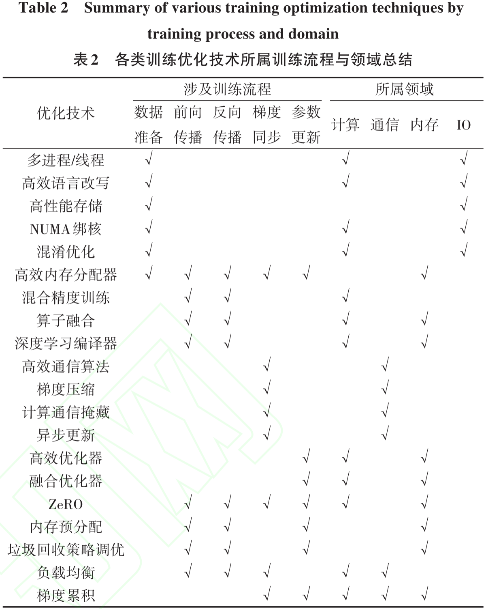

# MLSys 推理优化

## 1) 2024_中兴通讯技术_T3刊_大语言模型算法演进综述

> 这篇论文主要在讲 LLM 推理和 LLM 模型。对笔者的重要性弱一些。

图表：

    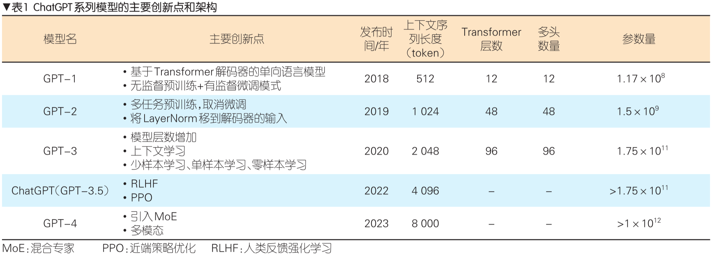

OpenAI 从 2018 年发布 GPT-1 到 2023 年发布 GPT-4，模型的能力产生了质的飞跃。

模型的规模也在**数量级**地增加，参数量从 $1.17×10^{8}$ 增加到 $1×10^{12}$ 以上。

大语言模型存在**计算量大、存储量大**的特点。以 GPT-3 为例，GPT-3 包含 96 层 Transformer，每层有 96 个注意力头，词向量深度为 12288。整个模型参数量达到 1750 亿个，按照 INT8 数据格式计算，总大小达到 175GB。

# MLSys 训推优化

## 1) 2023_IEEE ComST_SCI一区_Enabling Resource-Efficient AIoT System With Cross-Level Optimization: A Survey

> 这篇综述是关注 AIoT 训推的，写得也蛮不错，图文并茂。笔者虽然只关注和单卡显存优化相关的内容（第四章 A. On-Device DL Training），但也发现了不少亮点。文中有一些比较新颖的表述，对相关技术的总结也比较全面。

摘抄：
- 深度学习训练采用批处理内存块，将多个数据样本分组。**内存使用量与批量大小成比例增加**。具体而言，**如果未确保足够的批量大小，计算效率将会降低**。更大的批量大小可以为像 BatchNorm 这样的操作符带来更准确的分布统计，从而**加速训练收敛并提高准确性**。

图表：

    

我们首先从内存和计算需求的角度区分深度学习训练与推理的具体差异，如图 21 所示。

（i）**深度学习训练比推理需要更多的计算**。训练过程中更多的内存访问也带来了更多的内存访问延迟。例如，**GPU 设备的计算能力瓶颈通常在于内存访问带宽**，而历代 GPU 的升级都集中在内存带宽上，这一点也证明了这一点。

（ii）**深度学习训练比推理需要更多的内存空间**。根据反向传播的链式求导规则，计算第 $i$ 层权重的**梯度**和**导数**需要使用第 $i+1$ 层的**导数**以及**该层的输入**。因此，在前向传播过程中产生的**中间激活值** $A_1$、$A_2$ 需要保存到反向传播计算**梯度** $\Delta A$、$\Delta B$ 并更新**权重**时。相比之下，模型推理过程中的 $A_1$、$A_2$ 不需要保留，它们可以在使用后立即释放，这导致训练过程需要更大的内存需求。

（iii）**深度学习训练需要 $N$ 轮循环迭代，而推理只需要一轮**。在算法层面（例如模型参数/激活量化），如果没有精心设计，产生的微小不稳定性会在数千次迭代中被放大，甚至导致训练崩溃。**与模型推理过程的“一次性”特性相比，深度学习训练需要考虑跨多次迭代的优化**，这也对系统优化提出了挑战。

    

同时优化三个关键性能指标——延迟、内存和准确性——对于**设备端深度学习训练**来说并非易事。鉴于同时优化内存使用、延迟和准确性所面临的挑战，我们将设备端深度学习训练优化技术总结为不同的系统层级，即资源友好的算法层级、**模型自适应的系统调度层级**以及设备间控制器。图 20 展示了它们在系统循环中的关系。

**资源友好的算法层级**
- 压缩深度学习模型结构：Efficient model architecture
- 减少参数/激活值的位宽：参数/激活量化 (Parameter/activation quantization)
- 稀疏更新 (Sparse updating)

**模型自适应的系统调度层级**：它在算法层级技术优化能力的基础上，**进一步最大化系统性能和资源效率**，从而突破性能与资源权衡的极限。

a) **重计算** (Recomputation)：在深度学习训练中，前向传播过程中生成的中间激活值通常会被存储到反向传播计算梯度时，这会导致较大的内存占用。实验表明，模型的中间激活值比参数占用更多的内存。为此，重计算方法在前向计算后立即丢弃部分中间激活值以节省内存使用，并在反向传播时重新计算这些激活值以用于梯度计算。

b) **中间激活值编码** (Intermediate activation encoding)：与重计算类似但不同，中间激活值压缩并不直接丢弃中间激活值，而是**在前向传播后对激活值进行临时编码，然后在反向传播时解码以计算梯度**。因此，它在计算延迟和内存节省之间取得了有价值的平衡，而不是简单地用延迟换取内存资源。

c) **算子重排** (Operator reordering)：传统的深度学习训练过程在反向传播中保留每个梯度，并在计算所有梯度后统一更新权重。**在反向传播期间对计算图中的算子进行重排可以减少峰值内存使用**。

d) **算子融合** (Operator fusion)：深度学习训练中的算子融合专注于**将多个算子合并为一个，以提高计算和内存访问效率**。假设计算图中相邻的两层（第 $i$ 层和第 $i+1$ 层）被合并，第 $i$ 层生成的中间激活值可以直接应用于第 $i+1$ 层，而无需额外的内存读写操作。值得注意的是，算子融合技术所属的**计算图优化** (computation graph optimization) 是一个广泛的领域。现有研究和深度学习框架（如 TensorFlow、PyTorch、NCNN 和 MindSpore）已经深入探索了各种算子融合技术。

e) **内存分配** (Memory allocation)：内存分配方法通常在**编译器后端**实现，比上述优化计算图的技术**更接近硬件资源**。在深度学习训练中，**张量的创建到最后访问之间的时间被称为张量的“生命周期”**。现有深度学习框架在训练时为每个张量分配单独的内存空间，这远大于大多数张量的生命周期。实际上，在张量的生命周期之外保留内存空间是无用的。**通过为生命周期不重叠的两个张量分配相同的内存来回收内存可以节省内存使用**，如图 14 所示。

    

f) **内存交换**：在深度学习训练中，某一模型层的中间激活值在该层的前向和反向传播中暂时使用。将暂时未使用的中间激活值从珍贵的内存（如 GPU）交换到更大的内存（如 CPU），并在梯度更新需要时交换回来，可以加速计算并减少内存使用。⭐内存交换通常由操作系统支持，例如 **Windows 中的虚拟地址空间**和 **Linux 中的交换分区**。当设备的内存容量不足时，数据会暂时交换到外部内存（如磁盘）。然而，这会带来额外的传输延迟，并且随机程序的内存使用难以预测。值得注意的是，这一缺点在深度学习训练中可以得到很好的解决，因为**前向计算和反向传播的顺序是固定的（即前向计算从第一层到最后一层，反向传播则相反），这为内存交换带来了优化潜力**。

> ⭐这里关于内存交换的讨论很精彩，第一次见到把深度学习场景与传统操作系统进行对比的。

**设备内跨层级控制器**：深度学习训练任务的**资源需求各不相同**。这种**变化性**，结合 AIoT 设备的异构计算/内存资源，提供了众多**优化可能性**。例如，当设备内存紧张但计算资源丰富时，可能需要频繁采用重计算技术；而对于内存充足的设备，则可以避免此类策略以减少不必要的计算延迟。此外，**同一设备上的不同训练轮次可能产生多样化的性能结果**。因此，在资源高效的 AIoT 系统中，应采用**自适应控制器** (adaptive controller)，根据**资源可用性和性能需求**调整技术配置。**上下文感知控制器** (context-aware controller)可以防止内存单元闲置或过载，从而提升效率。

    

- BPTT
  - 上下文：内存预算
  - 控制器：动态规划
- DTR
  - 上下文：内存预算，张量滞后性
  - 控制器：贪心算法，启发式
- SwapAdvisor
  - 上下文：内存预算
  - 控制器：遗传算法
- CSWAP
  - 上下文：不同的 GPU 设备架构
  - 控制器：贝叶斯优化

> 初读“设备内跨层级控制器”容易被唬住，但根据作者分析的相关工作和表5可知，其实这就是根据设备的内存和计算资源决定具体的优化策略。

## 2) 2024_arXiv:2312.03863_v4_Efficient Large Language Models: A Survey

> 这篇综述的内容还是很丰富的，训推都有，涵盖模型、数据、框架三方面，图文并茂，思维导图画得不错。笔者主要关注模型压缩和 LLM 框架两部分内容。

摘抄：

- LLM 框架：大型语言模型（LLMs）的出现催生了专门框架的开发，以高效处理其训练、微调、推理和服务。尽管主流的 AI 框架（如 TensorFlow 和 PyTorch）提供了**基础支持**，但它们缺乏对 LLMs 至关重要的特定优化和功能的内置支持。

图表：

    

**模型压缩**通过减少 LLMs 的规模和算术运算量来提高效率。……如图4所示，LLMs 的模型压缩技术可分为四类：**量化** (Quantization)、**参数剪枝** (Parameter Pruning)、**低秩近似** (Low-Rank Approximation)和**知识蒸馏** (Knowledge Distillation)。这四类技术**相互正交**，从不同角度对 LLMs 进行压缩。

    

如表1所示，LLMs 的预训练成本极高。高效的预训练技术专注于在计算资源、训练时间、**内存**和能耗方面降低 LLM 预训练过程的成本。

    

如图6所总结，通过不同的互补技术可以提升预训练的效率，包括混合精度加速、模型扩展、初始化技术、训练优化器以及**系统级预训练效率优化**。

**系统级**预训练效率优化。由于对内存和计算资源的高需求，LLMs 通常以分布式方式在多个计算节点上进行预训练。因此，大多数系统级优化技术都是在**大规模分布式训练**环境中设计的。例如，
- 零冗余数据并行（ZeRO）提供了**三个优化阶段**，将各种训练状态分布到不同设备上。具体而言，ZeRO-1 仅分区**优化器状态**，而 ZeRO-2 分区**优化器状态和梯度**。与 ZeRO-1 和 ZeRO-2 相比，ZeRO-3 进一步将**模型参数**分区到设备上。尽管通过 ZeRO-3 进一步减少了运行时内存，但通信量增加了约 50%。因此，建议**在节点内使用 ZeRO-3 以最小化通信时间**，同时**在节点间使用 ZeRO-1 和 ZeRO-2**。
- 完全分片数据并行（FSDP）采用了类似的优化思路，并设计了一种混合分片策略，允许用户定义在哪些节点或进程之间分区**梯度**、**模型参数**和**优化器状态**。
- 在**权重内存超过所有计算节点可提供的聚合内存**的情况下，ZeRO-Offload 允许将 ZeRO 的任何阶段卸载到 CPU 内存，而 ZeRO-Infinity 则提供了将数据卸载到 NVMe 驱动器和 CPU 内存的机制。然而，使用这两种替代方案很难保持性能，因为 CPU 和 GPU 之间的数据传输速度较慢。

    

**高效微调**技术专注于降低 LLM 微调过程的成本。如图8所总结，高效微调技术可分为**参数**高效微调（PEFT）和**内存**高效微调（MEFT）。

    

LLM 框架通常可以根据其是否支持训练、微调和推理任务进行分类。具体而言，支持训练和/或微调的框架旨在提供可扩展、高效且灵活的基础设施，以提高计算效率、**减少内存占用**、优化通信效率并确保训练/微调过程的可靠性。……表2总结了现有的 LLM 框架及其关键特性。

## 3) 2024_arXiv:2303.18223_v15_A Survey of Large Language Models

> 这篇综述确实是涵盖了 LLM 的方方面面，而且是一直更新的状态，凡是研究内容与 LLM 相关的读者都能开卷有益。笔者还是更加关注文中与显存优化有关的内容。

摘抄：

- 由于研究人员发现**模型扩展**可以提高模型能力，他们通过将**参数规模**增加到更大的规模进一步研究了扩展效应。有趣的是，当参数规模超过某一水平时，这些扩展后的语言模型不仅实现了显著的性能提升，还展现出一些小规模语言模型（例如 BERT）所不具备的**特殊能力**（例如上下文学习）。
- **LLM 的快速发展正在彻底改变 AI 的研究领域**。……这一新技术浪潮可能会催生一个基于 LLM 的**现实应用生态系统**。例如，Microsoft 365 正在通过 LLM（即 Copilot）实现办公自动化，OpenAI 支持在 ChatGPT 中使用插件以实现特殊功能。
  - 在 **NLP** 领域，LLM 可以作为一种通用语言任务求解器（在某种程度上），研究范式正在向使用 LLM 的方向转变。
  - 在 **IR** 领域，传统搜索引擎正受到通过 AI 聊天机器人（即 ChatGPT）进行信息检索的新方式的挑战，New Bing 提供了一个基于 LLM 增强搜索结果的初步尝试。
  - 在 **CV** 领域，研究人员尝试开发类似 ChatGPT 的视觉-语言模型，以更好地服务于多模态对话，而 GPT-4 通过整合视觉信息已支持多模态输入。
- 通常，大语言模型（LLM）指的是包含数千亿（或更多）参数的 Transformer 语言模型，这些模型在大规模文本数据上进行训练，例如 GPT-3、PaLM、Galactica 和 LLaMA。LLM 展现出强大的**自然语言理解**和**解决复杂任务**的能力（通过文本生成）。
- **预训练**为 LLM 的能力奠定了基础。通过在大规模语料库上进行预训练，LLM 可以获得**基本的语言理解和生成能力**。
- 在预训练之后，需要进一步**微调** LLM 以增强模型能力，这通常涉及两个主要步骤，即指令微调（监督微调）和对齐微调。
- **批量训练**。对于语言模型预训练，现有工作通常将批量大小设置为较大的数值（例如 2,048 个样本或 4M 词元），以**提高训练稳定性和吞吐量**。对于 GPT-3 和 PaLM 等 LLM，它们引入了一种新策略，即**在训练过程中动态增加批量大小**，最终达到百万规模。具体来说，GPT-3 的批量大小从 32K 逐渐增加到 3.2M 词元。实证结果表明，**批量大小的动态调度可以有效稳定 LLM 的训练过程**。
- 用于开发 LLM 的可用库：
  - **Transformers** 是一个开源的 Python 库，用于使用 Transformer 架构构建模型，由 Hugging Face 开发和维护。它具有简单且用户友好的 API，便于使用和定制各种预训练模型。它是一个功能强大的库，拥有庞大且活跃的用户和开发者社区，定期更新和改进模型与算法。  
  - **DeepSpeed** 是微软开发的**深度学习优化库**（兼容 PyTorch），已被用于训练多个 LLM，例如 MTNLG 和 BLOOM。它提供了多种分布式训练优化技术的支持，例如内存优化（ZeRO 技术、梯度检查点）和流水线并行。  
  - **Megatron-LM** 是 NVIDIA 开发的深度学习库，用于训练大规模语言模型。它还提供了丰富的分布式训练优化技术，包括模型和数据并行、混合精度训练和 FlashAttention。这些优化技术可以显著提高训练效率和速度，支持跨 GPU 的高效分布式训练。  
  - **JAX** 是 Google 开发的用于高性能机器学习算法的 Python 库，允许用户轻松在硬件加速（例如 GPU 或 TPU）下执行数组计算。它支持在各种设备上高效计算，还提供了自动微分和即时编译等特色功能。  
  - **Colossal-AI** 是 HPC-AI Tech 开发的深度学习库，用于训练大规模 AI 模型。它基于 PyTorch 实现，支持丰富的并行训练策略。此外，它还可以通过 PatrickStar 提出的方法优化异构内存管理。最近，一个类似 ChatGPT 的模型 ColossalChat 公开发布了两个版本（7B 和 13B），它们基于 LLaMA 使用 Colossal-AI 开发。  
  - **BMTrain** 是 OpenBMB 开发的高效库，用于以分布式方式训练大规模参数模型，强调代码简洁性、低资源和高可用性。BMTrain 已将多个常见的 LLM（例如 Flan-T5 和 GLM）集成到其 ModelCenter 中，开发者可以直接使用这些模型。  
  - **FastMoE** 是专门用于 MoE（即专家混合）模型的训练库。它基于 PyTorch 开发，在设计上优先考虑效率和用户友好性。FastMoE 简化了将 Transformer 模型转换为 MoE 模型的过程，并支持训练期间的数据并行和模型并行。  
  - **vLLM** 是一个快速、内存高效且易于使用的库，用于 **LLM 推理和服务**。为了实现快速推理，它特别优化了高服务吞吐量、使用 PagedAttention 的有效注意力内存管理、连续批处理和优化的 CUDA 内核。此外，vLLM 还支持各种解码算法、张量并行和流式输出。为了便于与其他系统集成，vLLM 对 HuggingFace 模型的使用友好，还提供了 OpenAI 兼容的 API 服务器。  
  - **DeepSpeed-MII** 是 DeepSpeed 开发的内存高效 Python 库。它旨在通过优先考虑高吞吐量、低延迟和成本效益来普及 LLM 推理。DeepSpeed-MII 通过利用四项关键技术加速文本生成推理：分块 KV 缓存、连续批处理、动态 SplitFuse 和高性能 CUDA 内核。它目前支持超过 13,000 个模型，涵盖三种流行的模型架构，例如 LLaMA、Mistral 和 OPT。  
  - **DeepSpeed-Chat** 是一个快速、经济高效且易于使用的系统框架，支持在模型训练期间集成完整的 RLHF 过程。它具有三大功能特点：（1）简化了类似 ChatGPT 模型的训练和推理过程，允许使用简单脚本实现多个训练或推理步骤；（2）复制了 InstructGPT 的训练模式，并提供了完整的三个训练步骤（即 SFT、奖励模型微调和 RLHF）的流程；（3）将 Deepspeed 的训练引擎和推理引擎集成到统一的混合引擎（Deepspeed HE）中，用于 RLHF 训练，支持在训练和推理模式之间无缝切换，并利用 DeepSpeed Inference 的各种优化。  
  - 除了上述库资源外，现有的**深度学习框架**（例如 PyTorch、TensorFlow、MXNet、PaddlePaddle、MindSpore 和 OneFlow）也提供了对并行算法的支持，这些算法通常用于训练大规模模型。
- 随着**模型参数**和**数据规模**的不断扩大，在**有限的计算资源**下高效训练更大的模型已成为 LLM 开发中的关键技术挑战。特别是需要解决两个主要技术问题，即**提高训练吞吐量**以及**将更大的模型加载到 GPU 内存中**。
- **3D 并行**。3D 并行实际上是三种常用并行训练技术的组合，即数据并行、流水线并行和张量并行。接下来我们介绍这三种并行训练技术。
  - **数据并行**。数据并行 (Data parallelism) 是提高训练吞吐量的最基本方法之一。它在多个 GPU 上复制**模型参数**和**优化器状态**，然后将整个训练语料库分配到这些 GPU 中。这样，每个 GPU 只需处理分配给它的数据，并执行前向和反向传播以获取梯度。不同 GPU 上计算的梯度将进一步聚合，以获得整个批次的梯度，从而更新所有 GPU 中的模型。由于梯度计算在不同 GPU 上独立执行，数据并行机制具有高度可扩展性，能够**通过增加 GPU 数量来提高训练吞吐量**。此外，该技术**实现简单**，现有大多数流行的深度学习库（如 TensorFlow 和 PyTorch）都已实现了数据并行。
  - **流水线并行**。流水线并行 (Pipeline parallelism) 旨在将 **LLM 的不同层**分配到多个 GPU 上。特别是在 Transformer 模型中，流水线并行将连续的层加载到同一个 GPU 上，以减少在 GPU 之间传输计算隐藏状态或梯度的成本。然而，**流水线并行的简单实现可能会导致 GPU 利用率降低，因为每个 GPU 必须等待前一个 GPU 完成计算，从而导致不必要的泡沫开销**。为了减少流水线并行中的这些泡沫，GPipe 和 PipeDream 提出了填充多批数据和异步梯度更新的技术，以提高流水线效率。
  - **张量并行**。张量并行 (Tensor parallelism) 也是一种常用技术，旨在**分解 LLM** 以实现多 GPU 加载。与流水线并行不同，张量并行侧重于分解 LLM 的**张量（参数矩阵）**。对于 LLM 中的矩阵乘法操作 $Y = XA$，参数矩阵 $A$ 可以按列拆分为两个子矩阵 $A_1$ 和 $A_2$，可以表示为 $Y = [XA_1, XA_2]$。通过**将矩阵 $A_1$ 和 $A_2$ 放置在不同的 GPU 上**，矩阵乘法操作将在两个 GPU 上并行调用，最终结果可以通过跨 GPU 通信结合两个 GPU 的输出获得。目前，张量并行已在多个开源库（如 Megatron-LM）中得到支持，并且可以扩展到更高维度的张量。此外，Colossal-AI 已为高维张量实现了张量并行，并提出了专门用于序列数据的序列并行，可以进一步分解 Transformer 模型的注意力操作。
- **混合精度训练**。在之前的 PLM（如 BERT）中，**32 位浮点数（FP32）**主要用于预训练。近年来，为了预训练超大规模语言模型，一些研究开始使用 **16 位浮点数（FP16）**，这减少了内存使用和通信开销。此外，由于流行的 NVIDIA GPU（如 A100）的 FP16 计算单元数量是 FP32 的两倍，FP16 的计算效率可以进一步提高。然而，现有工作发现 **FP16 可能导致计算精度损失，影响最终模型性能**。为了缓解这一问题，一种称为 Brain Floating Point（BF16）的替代方案被用于训练，它分配了比 FP16 更多的指数位和更少的有效位。在预训练中，BF16 通常在表示精度上优于 FP16。
- **整体训练建议**。
  - 在实践中，上述训练技术，特别是 **3D 并行**，通常联合使用以提高训练吞吐量和大型模型加载能力。目前，DeepSpeed、Colossal-AI 和 Alpa 等开源库可以很好地支持这三种并行训练方法。
  - 为了减少内存冗余，ZeRO、FSDP 和**激活重计算**技术也可用于训练 LLM，这些技术已集成到 DeepSpeed、PyTorch 和 Megatron-LM 中。
  - 此外，**混合精度**训练技术（如 BF16）也可用于提高训练效率并减少 GPU 内存使用，但它**需要硬件**（如 A100 GPU）**的必要支持**。
  - 在实践中，可以进一步利用主流深度学习框架的支持训练技术。例如，PyTorch 支持数据并行训练算法 **FSDP**（即完全分片数据并行），如果需要，可以将部分训练计算**卸载**到 CPU。
- 由于 LLM 包含大量模型参数，执行**全参数微调**的成本会很高。……在现有文献中，**参数高效微调**一直是一个重要课题，旨在**减少可训练参数的数量，同时尽可能保持良好的性能**。
  - 四种针对 Transformer 语言模型的参数高效微调方法，包括适配器微调 (Adapter Tuning)、前缀微调 (Prefix Tuning)、提示微调 (Prompt Tuning) 和 **LoRA** (Low-Rank Adaptation)。
  - 随着 LLM 的兴起，高效微调在开发更轻量级的下游任务适应方法方面吸引了越来越多的研究关注。特别是，**LoRA** 已被广泛应用于开源 LLM（例如 LLaMA 和 BLOOM）中，以实现参数高效微调。
- 训练 LLM 的 GPU 内存消耗：  
  - **模型状态**成本。模型状态在训练期间通常占用大部分内存，主要包括**模型参数**、**梯度**和**优化器状态**。例如，训练 LLaMA-7B（模型参数 $P \approx 6.7 \times 10^9$）需要约 100GB 内存来存储模型状态。  
  - **激活值**成本。激活值是在前向传播期间需要存储的**中间状态**，用于反向传播期间的梯度计算。以 LLaMA-7B（$V = 32,000$，$L = 32$，$H = 4,096$，$H' = 11,008$，$N = 32$）为例，在 $B = 1$，$T = 2,048$ 的设置下，每个设备存储激活值需要 16GB 内存。（将批量大小记为 $B$，序列长度记为 $T$，词汇表大小记为 $V$，注意力模块中的头数记为 $N$，每个头的维度记为 $D$，隐藏层大小记为 $H$（$H = ND$），FFN 内部的中间层大小记为 $H'$，层数 $L$）
  - 其他内存成本：
    - **深度学习框架**。PyTorch 框架在加载其核心功能时需要约 1GB 的 GPU 内存。这是框架运行的基本开销。  
    - **分布式框架**。当使用分布式训练框架（例如 DeepSpeed）时，其 GPU 内存使用量可能在 1GB 到 4GB 之间波动。具体数量取决于优化水平和超参数设置。这部分内存主要用于优化训练过程中的内存管理和通信效率。  
    - **中间结果和内存碎片**。除了激活值外，还存在影响峰值内存消耗的**中间结果**。此外，在训练过程中，由于内存的非连续分配和释放，**内存碎片化**通常会导致额外的 0.5GB 到 1GB 内存消耗。
- 几种优化 LLM 训练内存使用的典型方法。  
  - **梯度检查点**。Gradient Checkpointing（也称为激活重计算 Activation Recomputation）是一种用于优化反向传播期间内存使用的技术。具体来说，在前向传播期间需要保留激活值。然而，存储每一层的所有激活值需要大量内存资源。为了减少内存成本，梯度检查点在前向传播期间仅保留一部分激活值，并在反向传播期间重新计算这些值以节省内存，尽管这会带来额外的计算开销。在实现中，梯度检查点通常涉及存储每个 Transformer 层的输入，并在反向传播期间重新计算相应的激活值。  
  - **零冗余优化器**（ZeRO）。Zero redundancy optimizer 技术由 DeepSpeed 库提出，旨在**缓解数据并行中的内存冗余问题**。数据并行要求每个 GPU 存储相同副本的模型状态，导致每个 GPU 的内存消耗为 16P 字节。数据并行的直接副作用是内存冗余问题，因为**并非所有上述数据都需要在每个 GPU 上保留**。为了解决这个问题，ZeRO 技术旨在**在每个 GPU 上仅保留一部分数据，而其余数据在需要时可以从其他 GPU 获取**。具体来说，ZeRO 提供了三种策略，取决于数据的三个部分如何存储，即**优化器状态**分区（ZeRO-1）、**梯度**分区（ZeRO-2）和**参数**分区（ZeRO-3）。实证结果表明，前两种策略不会增加通信开销，而第三种解决方案增加了约 50% 的通信开销，但节省了与 GPU 数量成比例的内存。PyTorch 已实现了一种类似于 ZeRO 的技术，称为**完全分片数据并行**（FSDP）。  
  - **卸载**。在 GPU 资源有限的环境中，DeepSpeed 提出了 Offload 技术，通过将部分模型状态和计算开销卸载到 CPU 内存中，可以显著减少训练所需的 GPU 内存。具体来说，**梯度**和**优化器状态**会被卸载到 CPU 内存中，而**模型参数**仍保留在 GPU 上。**计算密集的前向和反向传播仍需在 GPU 上执行以确保效率**，而**计算量相对较少的参数更新则在 CPU 上执行**以减少 GPU 内存开销。此外，Infinity 允许通过利用**高速磁盘存储**（例如 NVMe）来训练超出 GPU 内存限制的模型。
- 模型压缩方法
  - 量化方法。通常有两种主要的模型量化方法，即**量化感知训练（QAT）（需要额外的全模型重新训练）**和训练后量化（PTQ）（不需要模型重新训练）。与小型语言模型相比，在设计或选择 LLM 的量化方法时需要考虑两个主要差异。首先，LLM 包含大量参数，因此 PTQ 方法更受青睐，因为其计算成本远低于 QAT 方法。其次，LLM 表现出非常不同的激活模式（即大量异常特征），这使得量化 LLM 尤其是隐藏激活变得更加困难。  
  - 与模型量化不同，模型蒸馏和剪枝旨在**简化模型架构，从而减少参数总数**。  
  - LLM 的**蒸馏**。通常，模型蒸馏旨在将能力较强的模型（称为教师模型）的能力转移到能力较弱的模型（称为学生模型），从而**实现能力模型的压缩**。  
  - LLM 的**剪枝**。模型剪枝的目标是尽量**减少模型中的参数数量**，同时尽可能保留其性能。

> 关于量化、蒸馏和剪枝，因为笔者最初有点搞不清楚他们到底是属于训练还是推理的技术，所以问了下  DeepSeek，下面是 DeepSeek 给出的回答：
> - ​推理阶段：量化（主要）
> - 训练阶段：蒸馏（核心）、剪枝（核心，需微调）
> - 交叉阶段：量化感知训练（训练阶段）、剪枝后微调（训练阶段）

图表：

    

图 2：从**任务解决能力**的角度展示了四代语言模型（LM）的演进过程。需要注意的是，每个阶段的时间段可能并不十分准确，我们主要根据每个阶段最具代表性研究的发表日期来设定时间。对于神经语言模型，我们通过缩写两篇代表性研究的论文标题来命名这两种方法：NPLM（“一种神经概率语言模型”）和 NLPS（“几乎从零开始的自然语言处理”）。由于篇幅限制，我们未在图中列出所有代表性研究。

从技术上讲，语言建模（LM）是提升机器语言智能的主要方法之一。总体而言，**LM 旨在对词序列的生成似然进行建模，从而预测未来（或缺失）词元的概率**。LM 的研究在文献中受到了广泛关注，其发展可以分为四个主要阶段：

**统计语言模型**（SLM）。SLM 基于 20 世纪 90 年代兴起的**统计学习方法**开发。其基本思想是基于马尔可夫假设构建词预测模型，例如根据最近的上下文预测下一个词。

**神经语言模型**（NLM）。NLM 通过**神经网络**（例如多层感知机（MLP）和循环神经网络（RNN））来表征词序列的概率。这些研究开创了语言模型在表示学习（超越词序列建模）中的应用，对自然语言处理（NLP）领域产生了重要影响。

**预训练语言模型**（PLM）。作为早期尝试，ELMo 被提出用于捕捉上下文感知的词表示，其首先预训练一个双向 LSTM（biLSTM）网络（而不是学习固定的词表示），然后根据特定的下游任务对 biLSTM 网络进行微调。此外，基于具有**自注意力机制**的高度可并行化的 Transformer 架构，**BERT** 通过在大规模未标注语料上使用专门设计的预训练任务预训练双向语言模型而被提出。这些预训练的上下文感知词表示作为通用语义特征非常有效，极大地提高了 NLP 任务的性能基准。这项研究激发了大量后续工作，确立了“**预训练**和**微调**”的学习范式。遵循这一范式，大量关于 PLM 的研究被开发，引入了不同的架构（例如 **GPT-2** 和 BART）或改进的预训练策略。在这一范式中，通常**需要对 PLM 进行微调以适应不同的下游任务**。

**大语言模型**（LLM）。研究人员发现，扩展 PLM（例如扩展**模型规模**或**数据规模**）通常可以**提高模型在下游任务上的能力**（即遵循扩展定律 scaling law）。许多研究通过训练更大的 PLM（例如 175B 参数的 **GPT-3** 和 540B 参数的 PaLM）探索了性能极限。尽管扩展主要在模型规模上进行（使用相似的架构和预训练任务），这些大规模 PLM 显示出与较小 PLM（例如 330M 参数的 BERT 和 1.5B 参数的 GPT-2）不同的行为，并在解决一系列复杂任务时展现出令人惊讶的能力（称为**涌现能力**）。例如，GPT-3 可以通过上下文学习解决少样本任务，而 GPT-2 则表现不佳。因此，研究界将这些大规模 PLM 称为“大语言模型（LLM）”，它们吸引了越来越多的研究关注（见图 1）。LLM 的一个显著应用是 **ChatGPT**，它适配了 GPT 系列的 LLM 用于对话，展示了与人类惊人的对话能力。我们可以观察到，在图 1 中，ChatGPT 发布后与 LLM 相关的 arXiv 论文数量急剧增加。

    

图 1：分别展示了自 2018 年 6 月以来包含关键词“language model”和自 2019 年 10 月以来包含关键词“large language model”的 arXiv 论文累计数量的趋势。统计数据**通过按月查询标题或摘要中的关键词进行精确匹配计算得出**。我们为这两个关键词设置了不同的 x 轴范围，因为“language models”的研究更早开始。我们标注了与 LLM 研究进展中重要里程碑对应的点。在 ChatGPT 发布后，数量急剧增加：标题或摘要中包含“large language model”的 arXiv 论文的平均每日发表数量从 0.40 篇增加到 8.58 篇（图 1(b)）。

ChatGPT

- 2022 年 11 月，OpenAI 发布了基于 GPT 模型（GPT-3.5 和 GPT-4）的**对话模型** ChatGPT。
- ChatGPT 在与人交流方面展现了卓越的能力：拥有广泛的知识储备，擅长数学问题的推理，在多轮对话中准确追踪上下文，并与人类价值观良好对齐以确保安全使用。
- 迄今为止，它似乎是 AI 历史上最强大的聊天机器人。**ChatGPT 的发布对未来 AI 研究产生了重大影响，为探索类人 AI 系统指明了方向**。

    

图 3：近年来现有大语言模型（规模大于 10B）的时间线。该时间线主要根据模型技术论文的发布日期（例如提交到 arXiv 的日期）建立。如果没有相应的论文，我们将模型的日期设为其公开发布或宣布的最早时间。我们用黄色标记了具有公开可用模型检查点的 LLM。由于图表的篇幅限制，我们仅包含具有公开报道评估结果的 LLM。

    

图 5：基于 LLaMA 的研究工作的演化图。由于数量庞大，我们无法在图中包含所有 LLaMA 变体，即使许多优秀的工作未被列出。为了支持增量更新，我们共享了该图的源文件，并欢迎读者通过在我们的 GitHub 页面上提交拉取请求来添加所需的模型。

LLaMA 的发布极大地推动了 LLM 的研究进展。为了总结基于 LLaMA 的研究工作，我们在图 5 中展示了一个简短的演化图。

LLaMA 模型家族。Meta AI 于 2023 年 2 月推出了 LLaMA 模型系列，包含四种规模（7B、13B、30B 和 65B）。自发布以来，LLaMA 吸引了研究和工业界的广泛关注。LLaMA 模型在各种开放基准测试中取得了非常优异的性能，成为迄今为止最受欢迎的开源语言模型。大量研究人员通过指令微调或持续预训练对 LLaMA 模型进行了扩展。特别是，**由于计算成本相对较低，指令微调 LLaMA 已成为开发定制或专用模型的主要方法**。

    

LLM 的应用  
- LLM 在研究社区中的应用  
  - LLM 在经典 **NLP 任务**中的应用：词级任务、句子级任务、序列标注任务、关系抽取任务和文本生成任务；
  - LLM 在**信息检索 (IR)**中的应用：LLM 作为 IR 模型和 LLM 增强的 IR 模型；
  - LLM 在**推荐系统**中的应用：LLM 作为推荐模型、LLM 增强的推荐模型和 LLM 作为推荐模拟器；
  - **多模态模型**主要指能够处理和整合来自输入的各种模态信息（例如**文本、图像和音频**），并进一步在某些模态中生成相应输出的模型；
  - 知识图谱 (KG) 增强的 LLM：检索增强的 LLM 和协同增强的 LLM；
- LLM 在特定领域中的应用：医疗保健、教育、法律、金融、科学研究辅助、心理学和软件开发。

## 4) 2024_OJ-CS_普刊_Training and Serving System of Foundation Models: A Comprehensive Survey

> 这篇综述也是关于 LLM 训推的，通信、存储和计算，但整体缺少一些亮点。

摘抄：

- 微软开发了一种称为**零冗余优化（ZeRO）**的技术，作为 DeepSpeed 分布式训练框架的核心。
  - ZeRO 的核心思想是通过牺牲部分通信开销来减少 GPU 内存占用。ZeRO 将**模型参数**、**梯度**和**优化器状态**分成多个部分，每个 GPU 在训练期间仅维护其中一部分，并在需要时通过 All-Gather 操作获取其余部分。
  - 在 ZeRO 的基础上，ZeRO-Offload 利用异构深度学习训练的思想，通过有效利用 CPU 内存来缓解 GPU 内存的压力。它将**模型参数**分为两部分：一部分参数保留在 GPU 内存中，用于前向和反向传播中的高效计算；另一部分参数则卸载到 CPU 内存中，并在需要时访问。
  - 进一步推进这些概念，ZeRO-Infinity 与 ZeRO-Offload 类似，利用 GPU、CPU 和 NVMe 内存，在有限资源上训练基础模型，而无需代码重构。在 ZeRO-Infinity 中，模型参数和梯度仍在 GPU 上计算，而**优化器状态**和**激活值**则分别卸载到更适合的 NVMe 内存和 CPU 中。

## 5) 2025_大数据_T2刊_大模型时代下的存储系统挑战与技术发展

> 这篇综述讲了 LLM 训推存储系统，就是介绍的相关工作太少了，重点看看前两章和训练相关的内容吧~

摘抄：
- GPU 的存算资源具有**强耦合**的特点。在大模型训练过程中，模型数据（如模型参数等）需存储在**高读写带宽的 GPU 显存**中，以匹配**高吞吐的计算资源**。然而，GPU 的存储资源增长与大模型存储需求增长不匹配，这使得 GPU 的计算资源受存储资源限制，导致其计算资源难以被充分利用。

图表：

    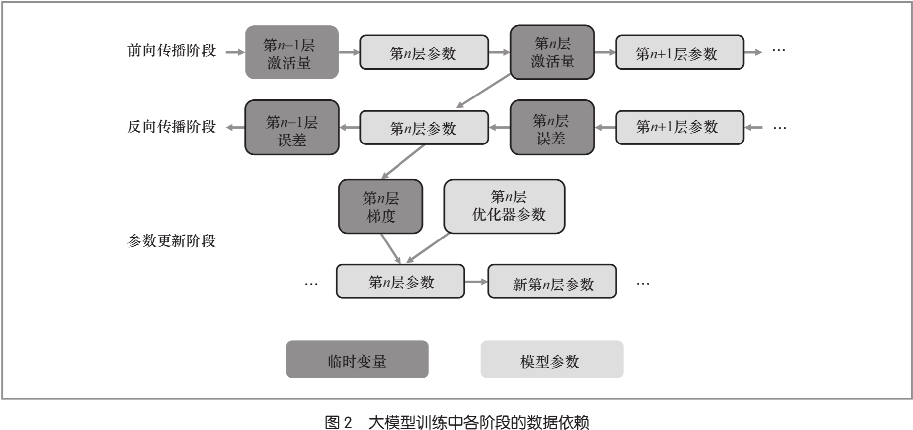

如图2所示，大模型训练主要包括前向传播、反向传播和参数更新 3 个阶段。
- 首先，在**前向传播**阶段，训练数据依次通过模型的各层进行计算，并产生**激活量**。激活量不仅作为下一层的输入，还会被保存以供反向传播使用。
- 其次，前向传播结束后，计算结果与训练数据的标签比对，生成损失（即误差）用于反向传播。在**反向传播**阶段，误差以与前向传播相反的方向，与各层参数以及前向传播中保存的该层激活量进行计算，并产生每一层参数对应的梯度。当某层的梯度计算完成后，其激活量可被释放，而梯度数据需要被保留用于参数更新。
- 最后，在**参数更新**阶段，优化器根据保存的梯度以及其自身的参数（如学习率、动量等）更新模型的参数。同时，优化器的内部参数也会根据当前的梯度信息进行更新。参数更新完成后，上一版本的模型参数、梯度数据以及优化器参数被释放。

训练模型会使用更新后的模型参数与新的训练数据**重复上述过程**，逐步提升模型的性能。  

大模型的训练模式导致**临时数据使用率低**，降低了 GPU 有限显存空间的利用率。例如，
- **梯度**数据需等待反向传播计算结束后才被用于参数更新；
- 前向传播时每一层计算得到的**激活量**需要在反向传播计算后才能被释放。

这些临时数据会**在产生较长时间后再次被使用**，导致 GPU 有限的存储资源长期被占用。

    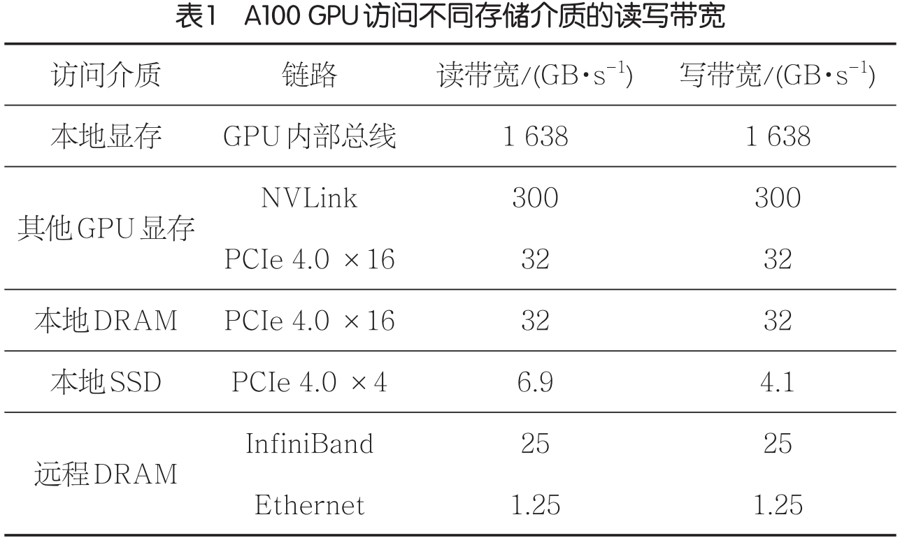

除显存外，GPU 服务器里还有 DRAM、SSD 等其他的存储介质，这些存储介质的**容量更大**且**价格更低**，并且其**扩展更加灵活**，可以与 GPU 计算资源**扩展解耦**。在大模型训练过程中使用 DRAM 或 SSD 可以支持更大规模的模型。  

受限于链路带宽或存储介质的读写带宽，GPU 读写 DRAM 与 SSD 的带宽远低于 GPU 读写显存的带宽。如表1所示，GPU 读写本地显存的带宽为 TB/s 级别，而 GPU 读写 DRAM 与 SSD 的带宽为 10 GB/s 级别。然而，**大模型训练对数据的读写带宽要求高**，直接使用异构存储介质会影响 GPU 的计算。  

直接使用异构存储介质会**导致数据传输开销远高于计算开销，使数据通信成为瓶颈，进而导致 GPU 计算资源无法被充分利用**。

## 6) 2025_计算机学报_T1刊_面向深度学习的数据存储技术综述

> 这篇综述主要在讲 Storage for AI 这个话题，内容很全面，涉及深度学习训练的多个环节。笔者重点关注“5.1 模型状态存储技术”一节关于内存交换和重计算相关的内容。

摘抄：
- 在过去的十几年中，数据集规模呈现**指数级**增长，新的数据集越来越大。……随着大模型的流行，模型的参数量越来越多，表达能力越来越强，需要的训练数据还在不断变大。  
- 以 LLM 为例，模型参数规模平均每年增长 14.1 倍，而 GPU 等加速器的存储容量平均每年仅增长 1.3 倍。
- 在模型训练阶段，预处理后的数据将被喂到模型中。该阶段涉及大量的**矩阵运算**，通常在 GPU 等加速器中完成。具体来说，模型训练可以划分为三个步骤：  
  1. ​**前向传播**：即使用模型$f$计算输入数据的预测值；  
  2. ​**反向传播**：即根据输入数据$x$的预测值$y'$、真实标签$y$和损失函数$L$，计算每层中可学习参数$w$的梯度值（Gradient）；  
  3. ​**参数更新**：即根据计算出的梯度值$\Delta w$，使用相应的优化器（Optimizer）来更新模型的参数值。  
- 在执行训练时，训练任务并不会一次处理完所有的数据，而是每次处理部分数据。这称为一个小批量或者小批次（**mini-batch**），通常包含 32-512 条数据。当一个小批量的所有数据均被处理完时，我们就称执行了**一次迭代（Iteration）**。而当训练集中的所有数据均被处理一次时，我们就称完成了**一轮训练（Epoch）**。一轮训练包含多次迭代，而一个训练任务通常会执行多轮训练，比如 100 次。在达到指定的训练轮数或者训练损失的变化小于指定阈值之后，模型已经**收敛**，训练过程结束。
- 随着数据集规模和模型参数规模的不断增长，使用单块 GPU 来执行训练，不仅耗时长、效率低，而且显存容量也难以满足模型参数的存储需求。为了解决该问题，常见的做法是执行**分布式训练**。
- 随着算力的不断提高，模型的**参数规模**也在不断变大，从百亿到千亿，再到万亿，甚至百万亿。……此外，**不同类型**的大模型也相继出现，例如，大语言模型、**大视觉模型**（Large Vision Models, LVMs）以及同时支持语言和视觉等的**多模态大语言模型**（Multi-Modal Large Language Models, MM-LLM）。
- 深度学习应用使用**张量（Tensor）**来表示数据。具体来说，  
   • 只包含一个数字的张量称为 0 阶张量，即**标量**；  
   • 由多个数字组成的数组是 1 阶张量，即**向量**，例如，[0, 1, 2, 3]；  
   • 由多个向量组成的数组是 2 阶张量，即**矩阵**；  
   • 由多个矩阵组成的数组称为 3 阶张量；  
   • 由多个 3 阶张量组成的数组就是 4 阶张量，其余**高阶张量**依次类推。

图表：

    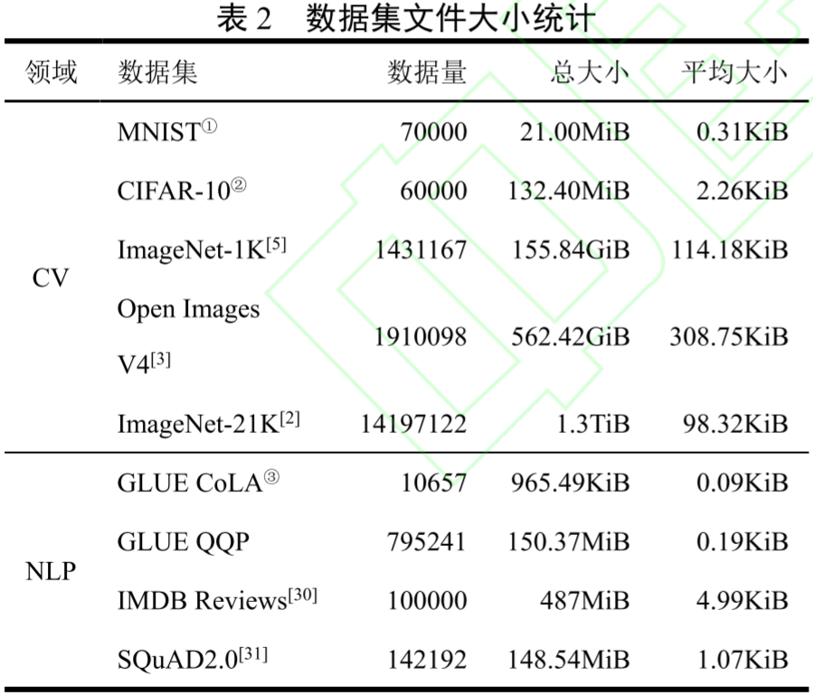

数据集规模呈现指数级增长，但未经处理前，数据集主要由小文件组成。

    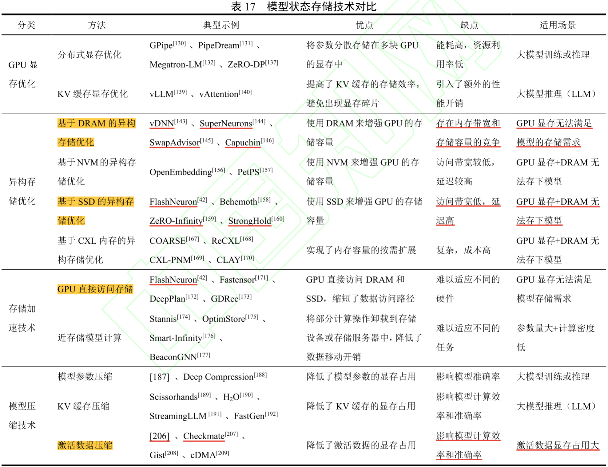

随着深度学习模型的参数量越来越多，**模型参数**、中间数据（包括**梯度**和**激活数据**等）以及**优化器状态**等模型状态的大小经常会超过 GPU 等加速器的存储容量，该问题称为**内存墙**。为了解决该问题，现有的研究提出了许多**模型状态存储技术**。

异构存储优化：当前，GPU 显存容量的增长速度远远低于模型参数规模的增长速度，**简单地聚合多块 GPU 的显存难以支持模型规模的持续增长**。为了解决该问题，一些研究提出使用 **DRAM**（vDNN、SuperNeurons、SwapAdvisor、Capuchin、ZeRO-Offload）、非易失性内存（Non-volatile Memory, **NVM**）以及固态硬盘（Solid State Drive, **SSD**）（FlashNeuron、ZeRO-Infinity、StrongHold）等异构存储来增强 GPU 的存储容量，将部分模型状态**卸载**到这些存储设备中。

## 7) 2025_TCASI_C刊_A Survey: Collaborative Hardware and Software Design in the Era of Large Language Models

> 这篇综述也比较全面，LLM 训练和推理的内容都有，从硬件到软件再到算法都有介绍，但训练相关的内容稍微少了一些，更多还是在讲推理，而且图表比较少，阅读的体验感稍差。

摘抄：

- LLM 训练可分为两类：1）预训练和 2）微调。**预训练**需要大规模数据集、大量步骤和大批量大小，因此成本非常高。根据文献报道，训练一个 6000 亿参数的模型可能需要超过 196,000 个 TPUv3 核心小时。更优化的模型则需要更高的训练成本。研究表明，在 NVIDIA 80GB A100 GPU、400W 功耗的条件下，预训练 Llama2-7B 需要超过 184,000 GPU 小时，而预训练 Llama2-70B 则需要超过 1,720,000 小时。仅训练 Llama2 所有四个变体的电力成本就约为 158,000 美元。相比之下，**微调**可以使用较小的数据集、较少的步骤和较小的批量大小来完成。
- 在 LLM 模型规模下，每步的计算时间和能耗都非常显著。**即使在这些领域取得微小的改进，也可能带来巨大的成本节约和环境影响减少**。
- 与性能和能耗挑战相伴的是，LLMs 对硬件有更严格的要求。首先，它需要**大容量内存**。与推理阶段仅存储参数不同，训练需要**存储参数**、**梯度**、**优化器状态**和**激活值**。
- 为了缓解大型模型训练中对 GPU 内存的高需求，提出了**零冗余优化器（ZeRO）**及其后续工作。
  - ZeRO 专注于减少 GPU 上数据的冗余副本，并提出了三个主要优化阶段，分别对**优化器状态**、**梯度**和**参数**进行分区。
  - ZeRO-Offload 通过将**优化器状态**和**优化器更新**卸载到 CPU，在可访问性和效率之间取得平衡，从而支持更大模型的训练。
  - ZeRO-Infinity 认识到模型规模的增长速度远快于 GPU 内存的增长速度，因此探索了更多以效率换取训练超大模型能力的方法。除了之前的工作外，它还利用 NVMe 内存进行卸载以获得更多存储空间，并卸载**参数**、**梯度**和**激活检查点**，因为随着模型规模的增大，这些数据的大小已无法在 GPU 上容纳。此外，它还管理算子以进一步减少**缓冲区大小**需求。
  - ZeRO++ 回归到 ZeRO 的设计，并更专注于大型 GPU 集群的**通信效率**。虽然卸载可以促进大模型的训练，但它显著增加了 GPU 和 CPU 之间的通信开销。这是因为这些组件之间的连接（例如大多数系统中的 PCIe）通常提供的带宽有限，与 GPU 的峰值性能和内存带宽相比，这一瓶颈可能导致训练过程中的**显著减速**。
- **重计算**是一种用于训练 LLMs 的技术，通过牺牲计算资源来更高效地管理内存使用。在前向传播过程中，仅存储一部分中间激活值，其选择基于一种策略，旨在最小化内存使用，同时保持可管理的计算开销。在反向传播过程中，未存储的必要中间激活值会从之前存储的激活值中动态重新计算。通过将重新计算的激活值与存储的激活值结合，可以实现更新模型参数所需的梯度计算。重计算显著减少了内存使用，使得**在不超出硬件内存限制的情况下训练更大模型或使用更大批量大小**成为可能。主要的代价是由于重新计算而增加的计算成本，但这通常是可接受的，因为能够训练更复杂的模型。
- LLM 训练和微调需要大量的计算资源。传统的 CPU 虽然功能多样，但往往无法满足 LLM **大规模并行处理**的需求。这促使人们采用并创新了专门设计的硬件加速器，以提高训练和微调过程的效率和速度。……GPU（图形处理单元）已成为现代深度学习基础设施的基石。最初设计用于图形渲染，其**高度并行的架构**使其非常适合神经网络训练中基础的**矩阵和张量运算**。与 CPU 相比，如 NVIDIA 的 A100 和 H100 等 GPU 在训练时间上提供了显著的加速，使其成为学术研究和工业应用的热门选择。

图表：

    

表1. 对于一个具有 N 参数和批量大小为 B 的模型，训练中涉及的每种数据类型的大小。x 是一个依赖于模型架构的变量。